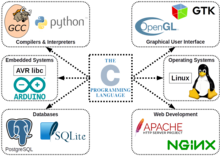

# C (Programmiersprache)


aus Wikipedia, der freien Enzyklopädie


<table class="float-right infobox toccolours toptextcells"><tbody><tr><th class="hintergrundfarbe6" colspan="2">C</th></tr><tr><td class="notheme" colspan="2"><span typeof="mw:File"> </span></td></tr><tr><th class="hintergrundfarbe5" colspan="2">Basisdaten</th></tr><tr><td><b>[Paradigmen](https://de.wikipedia.org/wiki/Programmierparadigma):</b></td><td>[imperativ](https://de.wikipedia.org/wiki/Imperative_Programmierung), [strukturiert](https://de.wikipedia.org/wiki/Strukturierte_Programmierung)</td></tr><tr><td><b>Erscheinungsjahr:</b></td><td>1972</td></tr><tr><td><b>Designer:</b></td><td><span class="wikidata-content">[Dennis Ritchie](https://de.wikipedia.org/wiki/Dennis_Ritchie)</span></td></tr><tr><td><b>Entwickler:</b></td><td>[Dennis Ritchie](https://de.wikipedia.org/wiki/Dennis_Ritchie) &amp; [Bell Labs](https://de.wikipedia.org/wiki/Bell_Laboratories)</td></tr><tr><td><b>Wichtige [Implementierungen](https://de.wikipedia.org/wiki/Implementierung):</b></td><td>[GCC](https://de.wikipedia.org/wiki/GNU_Compiler_Collection), [MSVC](https://de.wikipedia.org/wiki/Microsoft_Visual_C%2B%2B), [Borland C](https://de.wikipedia.org/wiki/Turbo_C), Portland Group, [Intel](https://de.wikipedia.org/wiki/Intel_C%2B%2B_Compiler), [Clang](https://de.wikipedia.org/wiki/Clang)</td></tr><tr><td><b>Beeinflusst von:</b></td><td>[B](https://de.wikipedia.org/wiki/B_(Programmiersprache)), [BCPL](https://de.wikipedia.org/wiki/BCPL), [Algol 68](https://de.wikipedia.org/wiki/Algol_68)<sup class="reference" id="cite_ref-dmr_quote_algol_1-0">[[1]](#cite_note-dmr_quote_algol-1)</sup></td></tr><tr><td><b>Beeinflusste:</b></td><td>[awk](https://de.wikipedia.org/wiki/Awk), [C++](https://de.wikipedia.org/wiki/C%2B%2B), [C−−](https://de.wikipedia.org/wiki/C%E2%88%92%E2%88%92), [C#](https://de.wikipedia.org/wiki/C-Sharp), [Objective-C](https://de.wikipedia.org/wiki/Objective-C), [D](https://de.wikipedia.org/wiki/D_(Programmiersprache)), [Go](https://de.wikipedia.org/wiki/Go_(Programmiersprache)), [Java](https://de.wikipedia.org/wiki/Java_(Programmiersprache)), [JavaScript](https://de.wikipedia.org/wiki/JavaScript), [PHP](https://de.wikipedia.org/wiki/PHP), [Perl](https://de.wikipedia.org/wiki/Perl_(Programmiersprache)), [Python](https://de.wikipedia.org/wiki/Python_(Programmiersprache)), [Vala](https://de.wikipedia.org/wiki/Vala_(Programmiersprache)), [Seed7](https://de.wikipedia.org/wiki/Seed7)</td></tr><tr><td><b>[Betriebssystem](https://de.wikipedia.org/wiki/Betriebssystem):</b></td><td><span class="wikidata-content">[Microsoft Windows](https://de.wikipedia.org/wiki/Microsoft_Windows), [Unix-ähnliches System](https://de.wikipedia.org/wiki/Unixoides_System)</span></td></tr><tr><td class="hintergrundfarbe5" colspan="2">[www.open-std.org/jtc1/sc22/wg14/](https://www.open-std.org/jtc1/sc22/wg14/)</td></tr></tbody></table>


C

 ist eine 
[imperative](https://de.wikipedia.org/wiki/Imperative_Programmierung)
 und 
[prozedurale](https://de.wikipedia.org/wiki/Prozedurale_Programmierung)
 
[Programmiersprache](https://de.wikipedia.org/wiki/Programmiersprache)
, die der Informatiker 
[Dennis Ritchie](https://de.wikipedia.org/wiki/Dennis_Ritchie)
 in den frühen 1970er Jahren an den 
[Bell Laboratories](https://de.wikipedia.org/wiki/Bell_Laboratories)
 entwickelte. Seitdem ist sie eine der am weitesten verbreiteten Programmiersprachen.


Die Anwendungsbereiche von C sind sehr verschieden. Sie wird zur 
[System-](https://de.wikipedia.org/wiki/Systemprogrammierung)
 und 
[Anwendungsprogrammierung](https://de.wikipedia.org/wiki/Softwaretechnik)
 eingesetzt. Die grundlegenden 
[Programme](https://de.wikipedia.org/wiki/Computerprogramm)
 aller 
[Unix](https://de.wikipedia.org/wiki/Unix)
-Systeme und die 
[Systemkernel](https://de.wikipedia.org/wiki/Kernel_(Betriebssystem))
 vieler 
[Betriebssysteme](https://de.wikipedia.org/wiki/Betriebssystem)
 sind in C programmiert. Zahlreiche Sprachen, wie 
[C++](https://de.wikipedia.org/wiki/C%2B%2B)
, 
[Objective-C](https://de.wikipedia.org/wiki/Objective-C)
, 
[C#](https://de.wikipedia.org/wiki/C-Sharp)
, 
[D](https://de.wikipedia.org/wiki/D_(Programmiersprache))
, 
[Java](https://de.wikipedia.org/wiki/Java_(Programmiersprache))
, 
[JavaScript](https://de.wikipedia.org/wiki/JavaScript)
, 
[LSL](https://de.wikipedia.org/wiki/Linden_Scripting_Language)
, 
[PHP](https://de.wikipedia.org/wiki/PHP)
, 
[Vala](https://de.wikipedia.org/wiki/Vala_(Programmiersprache))
 oder 
[Perl](https://de.wikipedia.org/wiki/Perl_(Programmiersprache))
, orientieren sich an der 
[Syntax](https://de.wikipedia.org/wiki/Syntax)
 und anderen Eigenschaften von C.


## Geschichte


 
[Ken Thompson](https://de.wikipedia.org/wiki/Ken_Thompson)
 (links) und 
[Dennis Ritchie](https://de.wikipedia.org/wiki/Dennis_Ritchie)
 (rechts)


### Entstehung


C wurde 1969–1973 von 
[Dennis Ritchie](https://de.wikipedia.org/wiki/Dennis_Ritchie)
[[2]](#cite_note-dmr-2)

 in den 
[Bell Laboratories](https://de.wikipedia.org/wiki/Bell_Laboratories)
 für die Programmierung des damals neuen 
[Unix](https://de.wikipedia.org/wiki/Unix)
-Betriebssystems entwickelt. Er stützte sich dabei auf die Programmiersprache 
[B](https://de.wikipedia.org/wiki/B_(Programmiersprache))
, die er und 
[Ken Thompson](https://de.wikipedia.org/wiki/Ken_Thompson)
 in den Jahren 1969/70 geschrieben hatten – der Name C entstand als Weiterentwicklung von B. B wiederum geht auf die von Martin Richards Mitte der 1960er-Jahre entwickelte Programmiersprache 
[BCPL](https://de.wikipedia.org/wiki/BCPL)
 zurück.
[[3]](#cite_note-3)

 Ursprünglich war der Name NB („New B“) vorgesehen, daraus wurde schließlich C.
[[4]](#cite_note-4)

 Ritchie schrieb auch den ersten 
[Compiler](https://de.wikipedia.org/wiki/Compiler)
 für C. 1973 war die Sprache so weit ausgereift, dass man nun den Unix-Kernel für die 
[PDP-11](https://de.wikipedia.org/wiki/PDP-11)
 neu in C schreiben konnte.


### Weitere Entwicklung


K&R C erweiterte die Sprache um neue Schlüsselwörter wie 
long

 oder 
unsigned

 und führte die von Mike Lesk entwickelte I/O-Standardbibliothek und auf Empfehlung von Alan Snyder den 
[Präprozessor](https://de.wikipedia.org/wiki/Pr%C3%A4prozessor)
 ein.


## Standards


→ 

Hauptartikel

: 
[Varianten der Programmiersprache C](https://de.wikipedia.org/wiki/Varianten_der_Programmiersprache_C)


C ist eine 
[Programmiersprache](https://de.wikipedia.org/wiki/Programmiersprache)
, die auf fast allen 
[Computersystemen](https://de.wikipedia.org/wiki/Computersystem)
 zur Verfügung steht. Um den Wildwuchs zahlreicher Dialekte einzudämmen, wurde C mehrfach standardisiert (
[C89/C90](https://de.wikipedia.org/wiki/Varianten_der_Programmiersprache_C#C89,_C90)
, 
[C99](https://de.wikipedia.org/wiki/Varianten_der_Programmiersprache_C#C99)
, 
[C11](https://de.wikipedia.org/wiki/Varianten_der_Programmiersprache_C#C11)
). Abgesehen vom 
[Mikrocontrollerbereich](https://de.wikipedia.org/wiki/Mikrocontroller)
, wo eigene Dialekte existieren, sind die meisten aktuellen PC-/Server-
[Implementierungen](https://de.wikipedia.org/wiki/Implementierung)
 eng an den Standard angelehnt; eine vollständige Implementierung aktueller Standards ist aber selten. In den meisten C-Systemen mit 
[Laufzeitumgebung](https://de.wikipedia.org/wiki/Laufzeitumgebung)
 steht auch die genormte 
[C-Standard-Bibliothek](https://de.wikipedia.org/wiki/C-Standard-Bibliothek)
 zur Verfügung. Dadurch können C-Programme, die keine sehr hardwarenahe Programmierung enthalten, in der Regel gut auf andere Zielsysteme portiert werden.


Das Normungsgremium von C ist die 
[ISO](https://de.wikipedia.org/wiki/ISO)
/
[IEC](https://de.wikipedia.org/wiki/International_Electrotechnical_Commission)
 – Arbeitsgruppe JTC1/SC22/WG14 – C, kurz als 
WG14

 bekannt.
Die nationalen Standardisierungsorganisationen übernehmen die Veröffentlichungen des internationalen Standards in an ihre Bedürfnisse angepasster Form.


 
Die 1978 erschienene erste Auflage von 
[The C Programming Language](https://de.wikipedia.org/wiki/The_C_Programming_Language)

 beinhaltet den ehemaligen inoffiziellen Standard K&R C


K&R C


Bis ins Jahr 1989 gab es keinen offiziellen Standard der Sprache. Seit 1978 galt hingegen das Buch 
[The C Programming Language](https://de.wikipedia.org/wiki/The_C_Programming_Language)

 als informeller De-facto-Standard, welches 
[Brian W. Kernighan](https://de.wikipedia.org/wiki/Brian_W._Kernighan)
 und Dennis Ritchie im selben Jahr veröffentlicht hatten.
[[5]](#cite_note-5)

 Bezeichnet wird diese Spezifikation als K&R C.


Da in den folgenden Jahren die Zahl an Erweiterungen der Sprache ständig wuchs, man sich nicht auf eine gemeinsame Standard-Bibliothek einigen konnte und nicht einmal die UNIX-Compiler K&R C vollständig implementierten, wurde beschlossen, einen offiziellen Standard festzulegen. Nachdem dieser schließlich im Jahr 1989 erschienen war, blieb K&R C zwar noch für einige Jahre De-facto-Standard vieler Programmierer, verlor dann aber rasch an Bedeutung.


### ANSI C


Im Jahr 1983 setzte das 
[American National Standards Institute](https://de.wikipedia.org/wiki/American_National_Standards_Institute)
 (ANSI) ein Komitee namens X3J11 ein, das 1989 seine Arbeit abschloss und die Norm 
ANSI X3.159-1989 Programming Language C

 verabschiedete. Diese Version der Sprache C wird auch kurz als ANSI C, Standard C oder C89 bezeichnet.


Ein Jahr später übernahm die 
[International Organization for Standardization](https://de.wikipedia.org/wiki/International_Organization_for_Standardization)
 (ISO) den bis dahin rein amerikanischen Standard auch als internationale Norm, die 
ISO/IEC 9899:1990

, kurz auch als C90 bezeichnet. Die Namen C89 und C90 beziehen sich also auf dieselbe Version von C.


Nach der ersten Entwicklung durch ANSI und ISO wurde der Sprachstandard für einige Jahre kaum geändert. Erst 1995 erschien das 
Normative Amendment 1

 zu C90. Es hieß 
ISO/IEC 9899/AMD1:1995

 und wird auch kurz als C95 bezeichnet. Neben der Korrektur einiger Details wurden mit C95 internationale Schriftsätze besser unterstützt.


### C99


Nach einigen kleineren Revisionen erschien im Jahr 1999 der neue Standard 
ISO/IEC 9899:1999

, kurz C99. Er war größtenteils mit C90 kompatibel und führte einige neue, teilweise von C++ übernommene Features ein, von denen einige bereits zuvor von verschiedenen Compilern implementiert worden waren. C99 wurde im Lauf der Jahre durch drei 
Technical Corrigendas

 ergänzt.


### C11


Im Jahr 2007 begann die Entwicklung eines neuen Standards mit dem inoffiziellen Arbeitstitel 
C1X

. Er wurde im Dezember 2011 veröffentlicht und ist in der Kurzform als C11 bekannt. Neben einer besseren Kompatibilität mit C++ wurden der Sprache wiederum neue Features hinzugefügt.
[[6]](#cite_note-isoC11-6)

[[7]](#cite_note-heiseC11-7)


### C18


Diese Norm entspricht der von C11 mit der Ausnahme von Fehlerkorrekturen und einem neuen Wert von __STDC_VERSION__ und wird daher im selben Umfang wie C11 unterstützt.
[[8]](#cite_note-8)


Der Standard wurde im Juni 2018 unter der Norm 
ISO/IEC 9899:2018

 freigegeben.
[[9]](#cite_note-9)


## Verwendung


 
The C Programming Language


Trotz des eher hohen Alters ist die Sprache C auch heute weit verbreitet und wird sowohl im Hochschulbereich als auch in der Industrie und im 
[Open-Source](https://de.wikipedia.org/wiki/Open_Source)
-Bereich verwendet.
[[10]](#cite_note-10)


### System- und Anwendungsprogrammierung


Das Haupteinsatzgebiet von C liegt in der 
[Systemprogrammierung](https://de.wikipedia.org/wiki/Systemprogrammierung)
, insbesondere von 
[eingebetteten Systemen](https://de.wikipedia.org/wiki/Eingebettetes_System)
, 
[Treibern](https://de.wikipedia.org/wiki/Ger%C3%A4tetreiber)
 und 
[Betriebssystemkernen](https://de.wikipedia.org/wiki/Kernel_(Betriebssystem))
. Der Grund liegt in der Kombination von erwünschten Charakteristiken wie Portabilität und Effizienz mit der Möglichkeit, Hardware direkt anzusprechen und dabei niedrige Anforderungen an eine Laufzeitumgebung zu haben.


Auch 
[Anwendungssoftware](https://de.wikipedia.org/wiki/Anwendungssoftware)
 wird oft in C erstellt, wobei die Relevanz der Sprache hier hinter andere zurückfiel, das ist besonders deutlich auf mobilen Plattformen. Viele Programmierschnittstellen für Anwendungsprogramme und Betriebssystem-
[APIs](https://de.wikipedia.org/wiki/Programmierschnittstelle)
 werden in Form von C-Schnittstellen implementiert, zum Beispiel 
[Win32](https://de.wikipedia.org/wiki/Win32)
.
[[11]](#cite_note-11)


### Implementierung anderer Sprachen


Wegen der hohen Ausführungsgeschwindigkeit und geringen Codegröße werden 
[Compiler](https://de.wikipedia.org/wiki/Compiler)
, 
[Programmbibliotheken](https://de.wikipedia.org/wiki/Programmbibliothek)
 und 
[Interpreter](https://de.wikipedia.org/wiki/Interpreter)
 anderer höherer Programmiersprachen (wie z. B. die 
[Java Virtual Machine](https://de.wikipedia.org/wiki/Java_Virtual_Machine)
) oft in C implementiert.


C wird als 
[Zwischencode](https://de.wikipedia.org/wiki/Zwischencode)
 einiger Implementierungen höherer Programmiersprachen verwendet. Dabei wird diese zuerst in C-Code übersetzt, der dann kompiliert wird. Dieser Ansatz wird verwendet, um ohne maschinenspezifische Entwicklung für den 
[Codegenerator](https://de.wikipedia.org/wiki/Codegenerator)
 die Portabilität zu erhöhen (C-Compiler existieren für nahezu jede Plattform).
Einige Compiler, die C auf diese Art benutzen, sind 
[Chicken](https://de.wikipedia.org/wiki/Chicken_(Scheme))
, 
[EiffelStudio](https://de.wikipedia.org/wiki/Eiffel_(Programmiersprache))
, 
[Esterel](https://de.wikipedia.org/wiki/Esterel_(Programmiersprache))
, 
[PyPy](https://de.wikipedia.org/wiki/PyPy)
, 
[Sather](https://de.wikipedia.org/wiki/Sather)
, 
[Squeak](https://de.wikipedia.org/wiki/Squeak)
 und 
[Vala](https://de.wikipedia.org/wiki/Vala_(Programmiersprache))
.


C wurde allerdings als Programmiersprache und nicht als Zielsprache für Compiler entworfen. Als Zwischensprache ist es daher eher schlecht geeignet. Das führte zu C-basierten Zwischensprachen wie 
[C−−](https://de.wikipedia.org/wiki/C%E2%88%92%E2%88%92)
.


C wird oft für die Erstellung von 
Anbindungen

 (englisch bindings) genutzt (zum Beispiel 
[Java Native Interface](https://de.wikipedia.org/wiki/Java_Native_Interface)
). Diese Anbindungen erlauben es Programmen, die in einer anderen 
[Hochsprache](https://de.wikipedia.org/wiki/H%C3%B6here_Programmiersprache)
 geschrieben sind, Funktionen aufzurufen, die in C implementiert wurden. Der umgekehrte Weg ist oft ebenfalls möglich und kann verwendet werden, um in C geschriebene Programme mit einer anderen Sprache zu erweitern (z. B. 
[mod perl](https://de.wikipedia.org/wiki/Mod_perl)
).


## Syntax


C ist 
[case-sensitiv](https://de.wikipedia.org/wiki/Case_sensitivity)
.


Außerdem besitzt C eine sehr kleine Menge an 
[Schlüsselwörtern](https://de.wikipedia.org/wiki/Schl%C3%BCsselwort_(Programmierung))
. Die Anzahl der Schlüsselwörter ist so gering, weil fast alle Aufgaben, welche in anderen Sprachen über eigene Schlüsselwörter realisiert werden, über Funktionen der 
[C-Standard-Bibliothek](https://de.wikipedia.org/wiki/C-Standard-Bibliothek)
 realisiert werden (zum Beispiel die Ein- und Ausgabe über Konsole oder Dateien, dynamische Speicherverwaltung usw.).


In C89 gibt es 32 Schlüsselwörter:


auto


break


case


char


const


continue


default


do


double


else


enum


extern


float


for


goto


if


int


long


register


return


short


signed


sizeof


static


struct


switch


typedef


union


unsigned


void


volatile


while


Mit C99 kamen fünf weitere dazu:


_Bool


_Complex


_Imaginary


inline


restrict


Mit C11 kamen sieben weitere hinzu:


_Alignas


_Alignof


_Atomic


_Generic


_Noreturn


_Static_assert


_Thread_local


### Hallo-Welt-Programm


Eine einfache Version des 
[Hallo-Welt-Programms](https://de.wikipedia.org/wiki/Hallo-Welt-Programm)
 in C ist diejenige, die Ritchie und Kernighan selbst in der zweiten Auflage ihres Buches 
[The C Programming Language](https://de.wikipedia.org/wiki/The_C_Programming_Language)

 verwendet haben.
[[12]](#cite_note-12)

 Zu beachten ist, dass im älteren ANSI C Standard kein Rückgabetyp angegeben werden muss, da der Compiler von einem impliziten int als Rückgabetyp ausgeht.


```c
#include <stdio.h>
main()
{
  printf("hello, world\n");
}
```


### Datentypen


→ 

Hauptartikel

: 
[Datentypen in C](https://de.wikipedia.org/wiki/Datentypen_in_C)


#### char


Zum Speichern eines Zeichens (sowie von kleinen Zahlen) verwendet man in C üblicherweise den Datentyp 
[Character](https://de.wikipedia.org/wiki/Char_(Datentyp))
, geschrieben als 
char

.


Vom Computer tatsächlich gespeichert wird nicht das Zeichen (wie zum Beispiel „A“), sondern eine gleichbedeutende mindestens acht 
[Bit](https://de.wikipedia.org/wiki/Bit)
 lange Binärzahl (z. B. 01000001). Diese Binärzahl steht im Speicher und kann anhand einer Tabelle jederzeit automatisch in den entsprechenden Buchstaben umgewandelt werden, wobei der aktuelle Zeichensatz bzw. die Codepage der Systemumgebung entscheidend ist. Zum Beispiel steht 01000001 gemäß der 
[ASCII-Tabelle](https://de.wikipedia.org/wiki/ASCII-Tabelle)
 für das Zeichen „A“.


Um auch Zeichen aus Zeichensätzen aufnehmen zu können, die mehr Zeichen umfassen als der relativ kleine ASCII-Zeichensatz, wurde mit 
wchar_t

 bald ein zweiter für Zeichen konzipierter Datentyp eingeführt.


```c
// gespeichert wird nicht das Zeichen „A“, sondern meist ein Byte ("01000001")
char zeichen = 'A';

// gibt das Zeichen mit der Ordnungszahl 65 aus (in ASCII ein „A“)
printf("%c", 65);
```


#### int


Zum Speichern einer 
[Ganzzahl](https://de.wikipedia.org/wiki/Ganze_Zahl)
 (wie zum Beispiel 3) verwendet man eine Variable vom Datentyp 
[Integer](https://de.wikipedia.org/wiki/Integer_(Datentyp))
, geschrieben als 
int

. Die Größe eines Integers beträgt heutzutage (je nach 
[Prozessorarchitektur](https://de.wikipedia.org/wiki/Prozessorarchitektur)
 und Betriebssystem) meist 32 Bit, manchmal noch 16 Bit und fast nie 64 Bit. In 16 Bit lassen sich 65536 verschiedene Werte speichern. Um die Verwendung von negativen Zahlen zu ermöglichen, reicht der Wertebereich bei 16 Bit gewöhnlich von -32768 bis 32767. Werden keine negativen Zahlen benötigt, kann der Programmierer mit 
unsigned int

 aber einen vorzeichenlosen Integer verwenden. Bei 16 Bit großen Integern ergibt das einen Wertebereich von 0 bis 65535.


Um den Wertebereich eines Integers zu verkleinern oder zu vergrößern, stellt man ihm einen der Qualifizierer 
short

, 
long

 oder 
long long

 voran. Das Schlüsselwort 
int

 kann dann auch weggelassen werden, so ist 
long

 gleichbedeutend mit 
long int

. Um zwischen vorzeichenbehafteten und vorzeichenlosen Ganzzahlen zu wechseln, gibt es die beiden Qualifizierer 
signed

 und 
unsigned

. Für einen vorzeichenbehafteten Integer kann der Qualifizierer aber auch weggelassen werden, so ist 
signed int

 gleichbedeutend mit 
int

. Die 
[C-Standard-Bibliothek](https://de.wikipedia.org/wiki/C-Standard-Bibliothek)
 ergänzt diese Datentypen über die plattformunabhängige Header-Datei 
```<stdint.h>```

, in der ein Set von Ganzzahltypen mit fester Länge definiert ist. Obwohl der Datentyp 
char

 für Textzeichen vorgesehen ist, können dessen Werte auch als ganze Zahlen mit einem Wertebereich von 0 bis 255 (unsigned) oder von -128 bis +127 (signed) verwendet werden. 


```c
char ganzzahl = 1;      // mindestens 8 Bit, also 256 mögliche Werte
short ganzzahl = 2;     // mindestens 16 Bit, also 65536 mögliche Werte
int ganzzahl = 3;       // mindestens 16 Bit, also 65536 mögliche Werte
long ganzzahl = 4;      // mindestens 32 Bit, also 4294967296 mögliche Werte
long long ganzzahl = 5; // mindestens 64 Bit, also 18446744073709551616 mögliche Werte
```


#### float und double


Zahlen mit 
[Nachkommastellen](https://de.wikipedia.org/wiki/Nachkommastellen)
 werden in einem der drei Datentypen 
float

, 
double

 und 
long double

 gespeichert. In den meisten C-Implementierungen entsprechen die Datentypen float und double dem international gültigen Standard für binäre Gleitpunktarithmetiken (IEC 559, im Jahr 1989 aus dem älteren amerikanischen Standard 
[IEEE 754](https://de.wikipedia.org/wiki/IEEE_754)
 hervorgegangen). Ein float implementiert das „
[einfach lange Format](https://de.wikipedia.org/wiki/Einfache_Genauigkeit)
“, ein double das „
[doppelt lange Format](https://de.wikipedia.org/wiki/Doppelte_Genauigkeit)
“. Dabei umfasst ein float 32 Bit, ein double 64 Bit. doubles sind also genauer. Floats werden aufgrund dieses Umstands nur noch in speziellen Fällen verwendet. Die Größe von long doubles ist je nach Implementierung unterschiedlich, ein long double darf aber auf keinen Fall kleiner sein als ein double. Die genauen Eigenschaften und Wertebereiche auf der benutzten Architektur können über die Header-Datei 
```<float.h>```

 ermittelt werden.


```c
// Genauigkeit ist jeweils implementierungsabhängig

float kommazahl = 0.000001f;
double kommazahl = 0.000000000000002;
long double kommazahl = 0.3l;
```


#### void


→ 

Hauptartikel

: 
[void (Schlüsselwort)](https://de.wikipedia.org/wiki/Void_(Schl%C3%BCsselwort))


Der Datentyp 
void

 wird im C-Standard als „unvollständiger Typ“ bezeichnet. Man kann keine Variablen von diesem Typ erzeugen. Verwendet wird 
void

 erstens, wenn eine Funktion keinen Wert zurückgeben soll, zweitens wenn explizit eine leere Parameterliste für eine Funktion verlangt wird und drittens, wenn ein Zeiger auf „Objekte beliebigen Typs“ zeigen soll.


```c
// Deklaration einer Funktion, die keinen Wert zurückgibt
void funktionsname();

// Deklaration einer Funktion, die int zurückgibt und keine Parameter akzeptiert
int funktionsname(void);

// Zeiger auf ein Objekt von beliebigem Typ
void* zeigername;
```


#### Zeiger


→ 

Hauptartikel

: 
[Zeiger (C)](https://de.wikipedia.org/wiki/Zeiger_(C))


Wie in anderen Programmiersprachen sind 
[Zeiger](https://de.wikipedia.org/wiki/Zeiger_(Informatik))
 in C Variablen, die statt eines direkt verwendbaren Wertes (wie das Zeichen „A“ oder die Zahl 5) eine Speicheradresse (wie etwa die Adresse 170234) speichern. Die Adressen im Speicher sind durchnummeriert. An der Speicheradresse 170234 könnte zum Beispiel der Wert 00000001 gespeichert sein (Binärwert der Dezimalzahl 1). Zeiger ermöglichen es, auf den Wert zuzugreifen, der an einer Speicheradresse liegt. Dieser Wert kann wiederum eine Adresse sein, die auf eine weitere Speicheradresse zeigt. Bei der Deklaration eines Zeigers wird zuerst der Datentyp des Objekts angegeben, auf das gezeigt wird, danach ein 
[Asterisk](https://de.wikipedia.org/wiki/Sternchen_(Schriftzeichen))
, danach der gewünschte Name des Zeigers.


```
char* zeiger;   // kann die Adresse eines Characters speichern
double* zeiger; // kann die Adresse eines Doubles speichern
```


#### Felder


→ 

Hauptartikel

: 
[Felder in C](https://de.wikipedia.org/wiki/Felder_in_C)


Wie in anderen Programmiersprachen verwendet man in C 
[Arrays](https://de.wikipedia.org/wiki/Array_(Datentyp))
, um mehrere Werte desselben Datentyps zu speichern. Die Werte eines Arrays haben aufeinanderfolgende Speicheradressen. Die Anzahl der verschiedenen Werte eines Arrays ist als Index des Feldes festgelegt. Da es in C keinen eigenen Datentyp für 
[Strings](https://de.wikipedia.org/wiki/Zeichenkette)
 gibt, werden Arrays auch verwendet, um Zeichenfolgen zu speichern.


```
// Definition eines Arrays mit 3 ganzzahligen Werten
int zahlen[] = { 17, 0, 3 };

// Array, das zur Speicherung eines Strings verwendet wird
char string[] = "Hallo, Welt!\n";
```


#### struct


→ 

Hauptartikel

: 
[Verbund (Datentyp)](https://de.wikipedia.org/wiki/Verbund_(Datentyp))


Um verschiedenartige Daten in einer Variable zu speichern, verwendet man Structures, geschrieben als 
struct

. Auf diese Weise können Variablen verschiedenen Datentyps zusammengefasst werden.


```c
struct person {
    char* vorname;
    char nachname[20];
    int alter;
    double groesse;
};
```


#### enum


Wie in anderen Programmiersprachen dient ein 
[Enum](https://de.wikipedia.org/wiki/Aufz%C3%A4hlungstyp)
 in C dazu, mehrere konstante Werte zu einem Typ zu kombinieren.


```
enum Temperatur { WARM, KALT, MITTEL };

enum Temperatur heutige_temperatur = WARM;

if (heutige_temperatur == KALT)
    printf("Warm anziehen!"); // wird nicht ausgegeben, da es heute „WARM“ ist
```


#### typedef


Das 
[Schlüsselwort](https://de.wikipedia.org/wiki/Schl%C3%BCsselwort_(Programmierung))
 
[typedef](https://de.wikipedia.org/wiki/Typedef)
 wird zur Erstellung eines 
[Alias](https://de.wikipedia.org/wiki/Pseudonym)
 für einen 
[Datentyp](https://de.wikipedia.org/wiki/Typisierung_(Informatik))
 verwendet.


```
// legt den Alias "Ganzzahl" für den Datentyp "int" an
typedef int Ganzzahl;

// ist jetzt gleichbedeutend zu: int a, b;
Ganzzahl a, b;
```


#### _Bool


Bis zum C99-Standard gab es keinen Datentyp zum Speichern eines 
[Wahrheitswerts](https://de.wikipedia.org/wiki/Wahrheitswert)
. Erst seit 1999 können Variablen als 
_Bool

 deklariert werden und einen der beiden Werte 0 (falsch) oder 1 (wahr) aufnehmen.


```c
_Bool a = 1; // seit C99
```


Durch explizite Verwendung der Header-Datei 
stdbool.h

 ist die verbreitete Verwendung des logischen Datentyps 
bool

 mit den zwei möglichen Ausprägungen 
true

 bzw. 
false

 möglich:


```c
#include <stdbool.h>

bool a = true; // seit C99
```


#### _Complex und _Imaginary


Seit C99 gibt es drei Gleitkomma-Datentypen für 
[komplexe Zahlen](https://de.wikipedia.org/wiki/Komplexe_Zahl)
, welche aus den drei Gleitkommatypen abgeleitet sind: 
float _Complex

, 
double _Complex

 und 
long double _Complex

. Ebenfalls in C99 eingeführt wurden Gleitkomma-Datentypen für rein imaginäre Zahlen: 
float _Imaginary

, 
double _Imaginary

 und 
long double _Imaginary

.


### Funktionen


Ein C-Programm besteht aus der 
main

-Funktion und optional aus weiteren Funktionen. Weitere Funktionen können entweder selbst definiert werden oder vorgefertigt aus der C-Standard-Bibliothek übernommen werden.


#### main


Jedes C-Programm muss eine 
[Funktion](https://de.wikipedia.org/wiki/Funktion_(Programmierung))
 mit dem Namen 
main

 haben, anderenfalls wird das Programm nicht kompiliert. Die 
main

-Funktion ist der 
[Einsprungpunkt](https://de.wikipedia.org/wiki/Einsprungpunkt)
 eines C-Programms, das heißt die Programmausführung beginnt immer mit dieser Funktion.


```
// das kürzeste mögliche standardkonforme C89-Programm
main(){return 0;}
```

```
// das kürzeste mögliche standardkonforme C99-Programm
int main(){}
```


Außer der 
main

-Funktion müssen in einem C-Programm keine weiteren Funktionen enthalten sein. Sollen andere Funktionen ausgeführt werden, müssen sie in der 
main

-Funktion aufgerufen werden. Die 
main

-Funktion wird deshalb auch als Hauptprogramm bezeichnet, alle weiteren Funktionen als 
[Unterprogramme](https://de.wikipedia.org/wiki/Unterprogramm)
.


#### Selbstdefinierte Funktionen


In C lassen sich beliebig viele Funktionen selbst definieren. Eine Funktionsdefinition besteht erstens aus dem Datentyp des 
[Rückgabewerts](https://de.wikipedia.org/wiki/Return_Code)
, zweitens dem Namen der Funktion, drittens einer eingeklammerten Liste von 
[Parametern](https://de.wikipedia.org/wiki/Parameter_(Informatik))
 und viertens einem eingeklammerten Funktionsrumpf, in welchem ausprogrammiert wird, was die Funktion tun soll.


```
// Datentyp des Rückgabewerts, Funktionsname und zwei Parameter
int summe(int x, int y) {
    // Funktionsrumpf, hier wird die Summe berechnet und zurückgegeben
    return x + y;
}

int main() {
    // die Funktion wird mit den Werten 2 und 3 aufgerufen, der Rückgabewert
    // wird in der Variable „ergebnis“ gespeichert
    int ergebnis = summe(2, 3);

    // main gibt den Wert von „ergebnis“ zurück
    return ergebnis;
}
```


Für die Definition einer Funktion, die nichts zurückgeben soll, verwendet man das Schlüsselwort 
void

. Ebenso falls der Funktion keine Parameter übergeben werden sollen.


```
#include <stdio.h>

void begruessung() {
    puts("Hi!");

    return;
}
```


#### Funktionen der C-Standard-Bibliothek


Die Funktionen der Standard-Bibliothek sind nicht Teil der Programmiersprache C. Sie werden bei jedem standardkonformen Compiler im hosted environment mitgeliefert und können verwendet werden, sobald man die jeweils entsprechende Header-Datei eingebunden hat. Beispielsweise dient die Funktion 
printf

 zur Ausgabe von Text. Sie kann verwendet werden, nachdem man die Header-Datei 
stdio.h

 eingebunden hat.


```clang
#include <stdio.h>

int main() {
    printf("hello world!\n");

    return 0;
}
```


### Anweisungen


Eine Funktion besteht aus 
[Anweisungen](https://de.wikipedia.org/wiki/Anweisung_(Programmierung))
. Wie in den meisten Programmiersprachen sind die wichtigsten Anweisungen: 
[Deklarationen](https://de.wikipedia.org/wiki/Deklaration_(Programmierung))
 und Definitionen, 
[Zuweisungen](https://de.wikipedia.org/wiki/Zuweisung)
, 
[bedingte Anweisungen](https://de.wikipedia.org/wiki/Bedingte_Anweisung_und_Verzweigung)
, Anweisungen die 
[Schleifen](https://de.wikipedia.org/wiki/Schleife_(Programmierung))
 umsetzen sowie Funktionsaufrufe. Im folgenden, eher sinnlosen Programm finden sich Beispiele.


```clang
// Unterprogramme
void funktion_die_nichts_tut() { // Definition
    return;                      // Return-Anweisung
}

int plus_eins_funktion(int argument) { // Definition
    return argument + 1;               // Return-Anweisung
}

// Hauptprogramm
int main() {                         // Definition
    int zahl;                        // Definition
    funktion_die_nichts_tut();       // Funktionsaufruf
    zahl = 5;                        // Zuweisung
    zahl = plus_eins_funktion(zahl); // Funktionsaufruf und Zuweisung

    if (zahl > 5)  // bedingte Anweisung
        zahl -= 1; // Zuweisung: der Wert von „zahl“ ist wieder „5“

    return 0; // Return-Anweisung
}
```


### Namensgebung


Beim Benennen von eigenen Variablen, Konstanten, Funktionen und Datentypen muss man sich an einige Regeln zur Namensgebung halten. Erstens muss das erste Zeichen eines Bezeichners ein Buchstabe oder Unterstrich sein. Zweitens dürfen die folgenden Zeichen nur die Buchstaben A bis Z und a bis z, Ziffern und der Unterstrich sein. Und drittens darf der Name keines der Schlüsselwörter sein.


Seit C95 sind auch Zeichen aus dem 
[Universal Coded Character Set](https://de.wikipedia.org/wiki/Universal_Coded_Character_Set)
 in Bezeichnern erlaubt, sofern die Implementierung es unterstützt. Die erlaubten Zeichen sind in Anhang D des ISO-C-Standards aufgelistet. Vereinfacht gesagt, sind es all jene Zeichen, die in irgendeiner Sprache als 
Buchstabe

 oder buchstabenähnliches Zeichen Verwendung finden.


Ab C99 lassen sich diese Zeichen plattformunabhängig über eine 
[Escape-Sequenz](https://de.wikipedia.org/wiki/Escape-Sequenz)
 wie folgt ersetzen:


* \uXXXX(wobei X für eine Hexadezimalziffer steht) für Zeichen mit einem Code von 00A0hexbis FFFFhex.
* \UXXXXXXXXfür alle Zeichen mit einem Code ≥00A0hex.


Bestimmte Bezeichner sind außerdem 
für die Implementierung

 reserviert:


* Bezeichner, die mit zwei aufeinanderfolgenden Unterstrichen beginnen
* Bezeichner, die mit Unterstrich gefolgt von einem Großbuchstaben anfangen.


Erweiterungen am Sprachkern, die neue Schlüsselwörter erfordern, verwenden dafür ebenfalls Namen aus diesem reservierten Bereich, um zu vermeiden, dass sie mit Bezeichnern in existierenden C-Programmen kollidieren, z. B. 
_Complex

, 
_Generic

, 
_Thread_local

.


## Standardbibliothek


→ 

Hauptartikel

: 
[C-Standard-Bibliothek](https://de.wikipedia.org/wiki/C-Standard-Bibliothek)


Die 
[C-Standard-Bibliothek](https://de.wikipedia.org/wiki/C-Standard-Bibliothek)
 ist integraler Bestandteil einer 
gehosteten

 (
[engl.](https://de.wikipedia.org/wiki/Englische_Sprache)
 
hosted


) C-Implementierung. Sie enthält unter anderem 
[Makros](https://de.wikipedia.org/wiki/Makro)
 und 
[Funktionen](https://de.wikipedia.org/wiki/Funktion_(Programmierung))
, die mittels der 
[Standard-Header-Datei](https://de.wikipedia.org/wiki/Header-Datei)
 verfügbar gemacht werden. Auf 
freistehenden

 (englisch 
freestanding


) Implementationen dagegen kann der Umfang der Standardbibliothek eingeschränkt sein.


Die Standardbibliothek ist aufgeteilt in mehrere Standard-Header-Dateien, die 
[hinzugelinkte](https://de.wikipedia.org/wiki/Linker_(Computerprogramm))
 Bibliothek ist jedoch oft eine einzige große Datei.


* „Gehostet“: C-Compiler und Programm befinden sich in einer[Betriebssystem](https://de.wikipedia.org/wiki/Betriebssystem)-Umgebung, welche übliche Dienste bietet (z. B. ein Dateisystem, textuelle Ein- und Ausgabekanäle, Speichermanagement).
* „Freistehend“: Das C-Programm läuft nicht unter einem Betriebssystem, sondern muss alle Gerätefunktionen selbst implementieren. Häufig stehen dennoch zumindest einige Bibliotheken vorab zur Verfügung. Hier finden häufig[Cross-Compiler](https://de.wikipedia.org/wiki/Cross-Compiler)(auch „Target-Compiler“) Verwendung.


## Module


Eine 
[Modularisierung](https://de.wikipedia.org/wiki/Modul_(Software))
 in C erfolgt auf Dateiebene. Eine Datei bildet eine Übersetzungseinheit; intern benötigte Funktionen und Variablen können so vor anderen Dateien verborgen werden. Die Bekanntgabe der öffentlichen Funktionsschnittstellen erfolgt mit sogenannten 
[Header-Dateien](https://de.wikipedia.org/wiki/Header-Datei)
. Damit verfügt C über ein schwach ausgeprägtes Modulkonzept.
[[13]](#cite_note-13)

[[14]](#cite_note-BMEYER-14)


Das globale Sprachdesign sieht vor, dass ein Programm aus mehreren Modulen bestehen kann.
Für jedes Modul existiert eine Quellcode-Datei (mit der Endung .c) und eine Header-Datei (mit der Endung .h). Die Quellcode-Datei enthält im Wesentlichen die Implementierung, die Header-Datei das Interface nach außen. Beide Dateien konsistent zu halten, ist bei C (wie auch bei 
[C++](https://de.wikipedia.org/wiki/C%2B%2B)
, aber nicht mehr in 
[C#](https://de.wikipedia.org/wiki/C-Sharp)
) Aufgabe des Programmierers.


Module, die Funktionen aus anderen Modulen benutzen, inkludieren deren Header-Dateien und geben dem Compiler damit die notwendigen Informationen über die vorhandenen Funktionen, Aufrufkonventionen, Typen und Konstanten.


Jedes Modul kann für sich übersetzt werden und erzeugt eine 
[Object-Datei](https://de.wikipedia.org/wiki/Objektcode)
.
Mehrere Object-Dateien können zu einer 
[Bibliothek](https://de.wikipedia.org/wiki/Programmbibliothek)
 zusammengefasst oder einzeln verwendet werden.


Mehrere Object-Dateien sowie Bibliotheken (die auch nur eine Sammlung von Objekt-Dateien sind) können mittels 
[Linker](https://de.wikipedia.org/wiki/Linker_(Computerprogramm))

 (deutsch: 
Binder

) zu einem ausführbaren Programm gebunden werden.


## Undefiniertes Verhalten


→ 

Hauptartikel

: 
[Undefiniertes Verhalten](https://de.wikipedia.org/wiki/Undefiniertes_Verhalten)


Undefiniertes Verhalten (undefined behavior) ist nach der Definition des C-Standards „Verhalten bei Verwendung eines nicht portablen oder fehlerhaften Programmkonstrukts oder von fehlerhaften Daten, an die diese internationale Norm keine Anforderungen stellt“. Dies kann beispielsweise die Dereferenzierung eines 
[Nullzeigers](https://de.wikipedia.org/wiki/Nullwert#Nullwert_als_grundverschiedener_Wert)
, die Division durch Null, der Zugriff auf Variablen durch Zeiger eines falschen Typs oder ein Überlauf bei vorzeichenbehafteten Ganzzahlen sein.
[[15]](#cite_note-15)


Unter der Annahme, dass undefiniertes Verhalten in einem korrekten Programm nicht vorkommt, optimieren bestimmte Compiler solche Konstrukte
[[16]](#cite_note-16)

 in einer Weise, die das beobachtbare Verhalten verändern kann, etwa durch Entfernen von Code, der als nicht erreichbar eingestuft wird.


Allgemein kann diese Art der Optimierung dazu führen, dass getestete Programme mit anderen Optimierungsstufen oder neueren Compilerversionen fehlerhaftes Verhalten zeigen. Dieses Compilerverhalten wird teilweise kontrovers diskutiert. Auch kann in der hardwarenahen Programmierung mit C die Verwendung von z. B. Überläufen oder uninitialisierten Variablen zur Laufzeitoptimierung des Codes genutzt werden.
[[17]](#cite_note-17)


Geht der Compiler z. B. bei einer Schleife


  ```
    for (int i=n; i<n+10; i++)
  ```


davon aus, dass kein Überlauf auftritt und sie daher höchstens zehnmal durchlaufen wird, kann dies ihn dazu veranlassen, eine vorherige Überprüfung auf Überlauf


  ```
    if (n < n + 10)
  ```


als unnötigen Code entfernen. Solche Optimierungen können ihrerseits zu unerwünschtem Verhalten einschließlich registrierter Sicherheitslücken führen (siehe z. B.: 
[CVE](https://de.wikipedia.org/wiki/Common_Vulnerabilities_and_Exposures)
) führen.
[[18]](#cite_note-18)


## Compiler


Am weitesten verbreitet ist der seit 1987 bestehende 
[freie](https://de.wikipedia.org/wiki/Freie_Software)
 C-Compiler der 
[GNU Compiler Collection](https://de.wikipedia.org/wiki/GNU_Compiler_Collection)
. Unter 
[Windows](https://de.wikipedia.org/wiki/Microsoft_Windows)
 ist auch der seit 1993 entwickelte Compiler 
[Visual C++](https://de.wikipedia.org/wiki/Visual_C%2B%2B)
 weit verbreitet. Neben diesen beiden stehen zahlreiche weitere Compiler zur Verfügung.


Da es in C vergleichsweise wenige Schlüsselwörter gibt, ergibt sich der Vorteil eines sehr einfachen, kleinen Compilers. Auf neuen Computersystemen ist C deshalb oft die erste verfügbare Programmiersprache (nach 
[Maschinencode](https://de.wikipedia.org/wiki/Maschinensprache)
 und 
[Assembler](https://de.wikipedia.org/wiki/Assemblersprache)
).


Beziehung zu Assembler, Portierbarkeit


Die Programmiersprache C wurde mit dem Ziel entwickelt, eine echte Sprachabstraktion zur 
[Assemblersprache](https://de.wikipedia.org/wiki/Assemblersprache)
 zu implementieren. Es sollte eine direkte Zuordnung zu wenigen Maschineninstruktionen geben, um die Abhängigkeit von einer Laufzeitumgebung zu minimieren. Als Resultat dieses Designs ist es möglich, C-Code auf einer sehr hardwarenahen Ebene zu schreiben, analog zu Assemblerbefehlen. Die 
[Portierung](https://de.wikipedia.org/wiki/Portierung_(Software))
 eines C-Compilers auf eine neue Prozessorplattform ist, verglichen mit anderen Sprachen, wenig aufwendig. Beispielsweise ist der freie 
[GNU-C-Compiler (gcc)](https://de.wikipedia.org/wiki/GNU_Compiler_Collection)
 für eine Vielzahl unterschiedlicher Prozessoren und Betriebssysteme verfügbar. Für den Entwickler bedeutet das, dass unabhängig von der Zielplattform fast immer auch ein C-Compiler existiert. C unterstützt damit wesentlich die 
[Portierbarkeit](https://de.wikipedia.org/wiki/Plattformunabh%C3%A4ngigkeit)
 von Programmen, sofern der Programmierer auf 
[Assemblerteile im Quelltext](https://de.wikipedia.org/wiki/Integrierter_Assembler)
 und/oder hardwarespezifische C-Konstrukte verzichten kann. In der 
[Mikrocontroller](https://de.wikipedia.org/wiki/Mikrocontroller)
-Programmierung ist C die mit Abstand am häufigsten verwendete Hochsprache.


## Sicherheit


Konzeptionell ist C auf eine einfache Kompilierbarkeit der Quelltexte und für den schnellen Ablauf des Programmcodes ausgelegt. Die 
[Compiler](https://de.wikipedia.org/wiki/Compiler)
 erzeugen in der Regel aber nur wenig Code zur Gewährleistung der 
[Datensicherheit](https://de.wikipedia.org/wiki/Sicherheitsl%C3%BCcke)
 und 
[Betriebssicherheit](https://de.wikipedia.org/wiki/Betriebssicherheit)
 während der 
[Laufzeit](https://de.wikipedia.org/wiki/Laufzeit_(Informatik))
 der Programme. Daher wird zunehmend versucht, diese Mängel durch formale 
[Verifikation](https://de.wikipedia.org/wiki/Verifizierung)
 aufzudecken und zu korrigieren beziehungsweise durch zusätzliche vom Programmierer zu erstellende Quelltexte zu beheben.
[[19]](#cite_note-19)

[[20]](#cite_note-20)

[[21]](#cite_note-21)


C schränkt direkte Speicherzugriffe kaum ein. Dadurch kann der Compiler (anders als zum Beispiel in 
[Pascal](https://de.wikipedia.org/wiki/Pascal_(Programmiersprache))
) nur sehr eingeschränkt bei der Fehlersuche helfen. Aus diesem Grund ist C für sicherheitskritische Anwendungen (Medizintechnik, Verkehrsleittechnik, Raumfahrt) weniger geeignet. Wenn in diesen Bereichen dennoch C eingesetzt wird, so wird in der Regel versucht, die Qualität der erstellten Programme durch zusätzliche Prüfungen wie 
[Softwaretests](https://de.wikipedia.org/wiki/Softwaretest)
 mit hoher 
[Testabdeckung](https://de.wikipedia.org/wiki/Testabdeckung)
 zu erhöhen.


C enthält einige sicherheitskritische Funktionen; so überschreibt zum Beispiel 
gets()

, in alten Standards eine Funktion der Standardbibliothek, fremde Speicherbereiche (
[Pufferüberlauf](https://de.wikipedia.org/wiki/Puffer%C3%BCberlauf#Prozessoren_und_Programmierstil)
), wenn es auf eine unpassende (zu lange) Eingabe stößt. Der Fehler ist innerhalb von C weder bemerk- noch abfangbar. Um den großen Vorteil von C – die Existenz zahlreicher älterer Quellcodes – nicht zu verlieren, unterstützen auch aktuelle Implementierungen weiterhin diese und ähnliche Funktionen, warnen jedoch in der Regel, wenn sie beim Übersetzen im Quelltext benutzt werden. 
gets()

 wurde mit 
[C11](#C11)
 endgültig aus der Sprachspezifikation entfernt.
[[22]](#cite_note-22)


C ist nicht 
[typsicher](https://de.wikipedia.org/wiki/Typsicherheit)
,
[[23]](#cite_note-23)

 da verschiedene 
[Datentypen](https://de.wikipedia.org/wiki/Datentyp)
 
[zuweisungskompatibel](https://de.wikipedia.org/wiki/Zuweisungskompatibilit%C3%A4t)
 gehandhabt werden können.
[[24]](#cite_note-24)


## Literatur


Einführungen


* Helmut Erlenkötter:C. Programmieren von Anfang an. 22. Auflage. Rowohlt, Reinbek bei Hamburg 2015,[ISBN 978-3-499-60074-6](https://de.wikipedia.org/wiki/Spezial:ISBN-Suche/9783499600746).
* Joachim Goll:C als erste Programmiersprache. Mit den Konzepten von C11. 8., überarbeitete und erweiterte Auflage. Springer Vieweg, Wiesbaden 2014,[ISBN 978-3-8348-1858-4](https://de.wikipedia.org/wiki/Spezial:ISBN-Suche/9783834818584).
* Robert Klima,[Siegfried Selberherr](https://de.wikipedia.org/wiki/Siegfried_Selberherr):Programmieren in C. 3. Auflage. Springer, Wien 2010,[ISBN 978-3-7091-0392-0](https://de.wikipedia.org/wiki/Spezial:ISBN-Suche/9783709103920).
* Peter Prinz, Ulla Kirch:C. Lernen und professionell anwenden. 3. Auflage. mitp, Heidelberg 2013,[ISBN 978-3-8266-9504-9](https://de.wikipedia.org/wiki/Spezial:ISBN-Suche/9783826695049).
* [Thomas Theis](https://de.wikipedia.org/wiki/Thomas_Theis):Einstieg in C. Für Programmiereinsteiger geeignet. 3. Auflage. Rheinwerk, Bonn 2020,[ISBN 978-3-8362-7569-9](https://de.wikipedia.org/wiki/Spezial:ISBN-Suche/9783836275699).
* Jürgen Wolf, René Krooß:Grundkurs C. 4., aktualisierte und überarbeitete Auflage. Rheinwerk, Bonn 2024,[ISBN 978-3-3671-0440-6](https://de.wikipedia.org/wiki/Spezial:ISBN-Suche/9783367104406).


Fortgeschritten


* Andrew Koenig:Der C-Experte: Programmieren ohne Pannen.Addison-Wesley, 1989,[ISBN 3-89319-233-6](https://de.wikipedia.org/wiki/Spezial:ISBN-Suche/3893192336)(deutsche Übersetzung von:C Traps and Pitfalls.Addison-Wesley, 1989.)
* Peter van der Linden:Expert-C-Programmierung.Verlag Heinz Heise, 1995,[ISBN 3-88229-047-1](https://de.wikipedia.org/wiki/Spezial:ISBN-Suche/3882290471)(deutsche Übersetzung von:Expert C Programming.Prentice Hall, 1994.)


Handbücher


* Rolf Isernhagen, Hartmut Helmke:Softwaretechnik in C und C++. Das Kompendium. Modulare, objektorientierte und generische Programmierung. ISO-C90, ISO-C99, ISO-C++98, MS-C++.NET. 4., vollständig überarbeitete Auflage, Hanser, München/Wien 2004,[ISBN 3-446-22715-6](https://de.wikipedia.org/wiki/Spezial:ISBN-Suche/3446227156).
* Jürgen Wolf, René Krooß:C von A bis Z. Das umfassende Handbuch. 5. aktualisierte und erweiterte Auflage, Rheinwerk, Bonn 2023,[ISBN 978-3-8362-9504-8](https://de.wikipedia.org/wiki/Spezial:ISBN-Suche/9783836295048).


K&R C


* Brian Kernighan, Dennis Ritchie:The C Programming Language. Prentice Hall, Englewood Cliffs NJ 1978,[ISBN 0-13-110163-3](https://de.wikipedia.org/wiki/Spezial:ISBN-Suche/0131101633). (Deutsche Übersetzung: Brian Kernighan, Dennis Ritchie:Programmieren in C. Mit dem reference manual in deutscher Sprache. Hanser, München/Wien 1983)


K&R2


* Brian Kernighan, Dennis Ritchie:The C Programming Language. 2. Auflage, Prentice Hall, Englewood Cliffs NJ 1988,[ISBN 0-13-110362-8](https://de.wikipedia.org/wiki/Spezial:ISBN-Suche/0131103628). (Deutsche Übersetzung: Brian Kernighan, Dennis Ritchie:Programmieren in C. Mit dem C-Reference Manual in deutscher Sprache. 2. Auflage. Hanser, München/Wien 1990,[ISBN 3-446-15497-3](https://de.wikipedia.org/wiki/Spezial:ISBN-Suche/3446154973))


## Weblinks


 


[Commons: C](https://commons.wikimedia.org/wiki/Category:C_(programming_language)?uselang=de)


 – Sammlung von Bildern, Videos und Audiodateien


 


[Wikibooks: C-Programmierung](https://de.wikibooks.org/wiki/C-Programmierung)

 – Lern- und Lehrmaterialien


 


[Wikibooks: Programmieren in C/C++](https://de.wikibooks.org/wiki/Programmieren_in_C/C%2B%2B)

 – Lern- und Lehrmaterialien


* [C-Sprachübersicht (sowie Vergleich mit BASIC).](http://eriedel.info/info/c-prog/cpl1.html)
* [Coding Programmer Page / C Library Reference and Examples.](http://code-reference.com/c)(englisch).
* [C Library Reference and Examples (more formal)](https://en.cppreference.com/w/c)(englisch).
* David Straker:[C Style: Standards and Guidelines.](http://syque.com/cstyle/index.htm)1991 erschienenes Buch (englisch).
* Mike Banahan, Declan Brady, Mark Doran:[The C Book.](https://publications.gbdirect.co.uk/c_book/)1991 (englisch).
* [Einfaches C-Tutorial](http://clc-wiki.net/wiki/C_tutorial)für Einsteiger (englisch).


## Einzelnachweise


1. [↑](#cite_ref-dmr_quote_algol_1-0)Dennis M. Ritchie:[The Development of the C Language.](http://csapp.cs.cmu.edu/3e/docs/chistory.html)Lucent Technologies, Januar 1993,abgerufen am 10. September 2015: „The scheme of type composition adopted by C owes considerable debt to Algol 68, although it did not, perhaps, emerge in a form that Algol’s adherents would approve of.“
2. [↑](#cite_ref-dmr_2-0)Dennis M. Ritchie:[The Development of the C Language.](http://csapp.cs.cmu.edu/3e/docs/chistory.html)Lucent Technologies, Januar 1993,abgerufen am 10. September 2015.
3. [↑](#cite_ref-3)Ken Thompson:[Users’ Reference to B.](https://www.talisman.org/b-manual.html)Abgerufen am 30. Mai 2015.
4. [↑](#cite_ref-4)Die Unix-Story.Geschichtliches Sachbuch über das Computerbetriebssystem[Unix](https://de.wikipedia.org/wiki/Unix)von Autor[Brian W. Kernighan](https://de.wikipedia.org/wiki/Brian_W._Kernighan), 254 Seiten, Oktober 2020,[dpunkt.verlag](https://de.wikipedia.org/wiki/Dpunkt.verlag)GmbH, Heidelberg, S. 97
5. [↑](#cite_ref-5)Brian W. Kernighan, Dennis M. Ritchie:The C Programming Language, Prentice Hall, Englewood Cliffs (NJ) 1978,[ISBN 0-13-110163-3](https://de.wikipedia.org/wiki/Spezial:ISBN-Suche/0131101633).
6. [↑](#cite_ref-isoC11_6-0)[Sprachdefinition von C11 als ISO-Standard ISO/IEC 9899:2011](http://www.iso.org/iso/iso_catalogue/catalogue_tc/catalogue_detail.htm?csnumber=57853), veröffentlicht am 8. Dezember 2011.
7. [↑](#cite_ref-heiseC11_7-0)[ISO aktualisiert C-Standard](http://heise.de/-1400349), Artikel auf heise online, vom 22. Dezember 2011.
8. [↑](#cite_ref-8)[Options Controlling C Dialect.](https://gcc.gnu.org/onlinedocs/gcc/C-Dialect-Options.html)Abgerufen am 8. September 2018.
9. [↑](#cite_ref-9)[ISO/IEC 9899:2018 Programming languages C.](https://www.iso.org/standard/74528.html)Abgerufen am 8. September 2018.
10. [↑](#cite_ref-10)Rolf Isernhagen, Hartmut Helmke:Softwaretechnik in C und C++. Das Kompendium. Modulare, objektorientierte und generische Programmierung. ISO-C90, ISO-C99, ISO-C++98, MS-C++.NET. 4., vollständig überarbeitete Auflage, Hanser, München/Wien 2004,[ISBN 3-446-22715-6](https://de.wikipedia.org/wiki/Spezial:ISBN-Suche/3446227156), Seite 4.
11. [↑](#cite_ref-11)[Walkthrough: Creating Windows Desktop Applications (C++)](https://docs.microsoft.com/en-us/previous-versions/bb384843(v=vs.140))Microsoft Docs, abgerufen am 5. Dezember 2019.
12. [↑](#cite_ref-12)Brian Kernighan, Dennis Ritchie:The C Programming Language. 2. Auflage, Prentice Hall, Englewood Cliffs (NJ) 1988,[ISBN 0-13-110362-8](https://de.wikipedia.org/wiki/Spezial:ISBN-Suche/0131103628), Seite 6.
13. [↑](#cite_ref-13)Scheler, Stilkerich, Schröder-Preikschat:[Komponenten/Module.](http://www4.informatik.uni-erlangen.de/Lehre/SS07/V_EZS2/Skript/05_Komponenten.pdf)(PDF; 1,1 MB) informatik.uni-erlangen.de
14. [↑](#cite_ref-BMEYER_14-0)Bertrand Meyer:Objektorientierte Softwareentwicklung. Hanser, Wien / München; Prentice Hall Internat. 1990,[ISBN 3-446-15773-5](https://de.wikipedia.org/wiki/Spezial:ISBN-Suche/3446157735), S. 406.
15. [↑](#cite_ref-15)[C language: Undefined behavior.](https://web.archive.org/web/20210523114433/https://riptutorial.com/c/topic/364/undefined-behavior)Archiviert vom[Original](https://redirecter.toolforge.org/?url=https%3A%2F%2Friptutorial.com%2Fc%2Ftopic%2F364%2Fundefined-behavior)am23. Mai 2021;abgerufen am 25. August 2021(englisch).
16. [↑](#cite_ref-16)[The LLVM Project Blog: What Every C Programmer Should Know About Undefined Behavior.](https://web.archive.org/web/20110515011136/http://blog.llvm.org/2011/05/what-every-c-programmer-should-know.html)Archiviert vom[Original](https://redirecter.toolforge.org/?url=http%3A%2F%2Fblog.llvm.org%2F2011%2F05%2Fwhat-every-c-programmer-should-know.html)am15. Mai 2011;abgerufen am 25. Mai 2021(englisch).
17. [↑](#cite_ref-17)Anton Ertl:[What every compiler writer should know about programmers or “Optimization” based on undefined behaviour hurts performance.](https://web.archive.org/web/20160304132435/https://www.complang.tuwien.ac.at/kps2015/proceedings/KPS_2015_submission_29.pdf)(PDF) TU Wien, archiviert vom[Original](https://redirecter.toolforge.org/?url=https%3A%2F%2Fwww.complang.tuwien.ac.at%2Fkps2015%2Fproceedings%2FKPS_2015_submission_29.pdf)am4. März 2016;abgerufen im 1. Januar 1(englisch).
18. [↑](#cite_ref-18)[CWE-190: Integer Overflow or Wraparound.](https://web.archive.org/web/20210722145832/https://cwe.mitre.org/data/definitions/190.html)Archiviert vom[Original](https://redirecter.toolforge.org/?url=https%3A%2F%2Fcwe.mitre.org%2Fdata%2Fdefinitions%2F190.html)am21. Juli 2021;abgerufen am 26. August 2021(englisch).
19. [↑](#cite_ref-19)Junan Qian, Baowen Xu:[Formal Verification for C Program](https://web.archive.org/web/20160705102040/http://www.mii.lt/informatica/pdf/INFO672.pdf)([Memento](https://de.wikipedia.org/wiki/Web-Archivierung#Begrifflichkeiten)vom 5. Juli 2016 im[Internet Archive](https://de.wikipedia.org/wiki/Internet_Archive)) (PDF) In:Informatica, 2007, Volume 18, Number 2, S. 289–304; abgerufen am 5. Juli 2016.
20. [↑](#cite_ref-20)Harvey Tuch:[Formal verification of C systems code.](http://www.nicta.com.au/pub-download/full/2324/)Sydney Research Lab., National ICT Australia, 2009; abgerufen am 5. Juli 2016
21. [↑](#cite_ref-21)Jay Abraham:[Improving Software Quality with Static Code Analysis.](http://de.mathworks.com/company/newsletters/articles/improving-software-quality-with-static-code-analysis.html)MathWorks, 2012; abgerufen am 5. Juli 2016
22. [↑](#cite_ref-22)[gets – C++ Reference.](https://www.cplusplus.com/reference/cstdio/gets/)Abgerufen am 12. März 2020.
23. [↑](#cite_ref-23)Markus Bautsch:Cycles of Software Crises – How to avoid insecure and uneconomic software. In:[ENISA](https://de.wikipedia.org/wiki/ENISA)Quartely, Vol. 3, No. 4, Oct–Dec 2007, S. 3–5
24. [↑](#cite_ref-24)Lambert Kenneth Louden:Programming Languages: Principles and Practices, Ch. 8.6.1Type Compatibility/ 8.7Type Conversion. Cengage Learning, 2011,[ISBN 978-1-133-38749-7](https://de.wikipedia.org/wiki/Spezial:ISBN-Suche/9781133387497).


Normdaten (Sachbegriff): 
[GND](https://de.wikipedia.org/wiki/Gemeinsame_Normdatei)
: 
[4113195-2](https://d-nb.info/gnd/4113195-2)

 
(
[lobid](https://lobid.org/gnd/4113195-2)
, 
[OGND](https://swb.bsz-bw.de/DB=2.104/SET=1/TTL=1/CMD?retrace=0&trm_old=&ACT=SRCHA&IKT=2999&SRT=RLV&TRM=4113195-2)
, 
[AKS](https://prometheus.lmu.de/gnd/4113195-2)

)

  | 
[LCCN](https://de.wikipedia.org/wiki/Library_of_Congress_Control_Number)
: 
[sh85018532](https://id.loc.gov/authorities/names/sh85018532.html)

 


esi <esi:include src="/esitest-fa8a495983347898/content" /> 


Abgerufen von „
[https://de.wikipedia.org/w/index.php?title=C_(Programmiersprache)&oldid=254029431](https://de.wikipedia.org/w/index.php?title=C_(Programmiersprache)&oldid=254029431)
“


[Kategorien](https://de.wikipedia.org/wiki/Wikipedia:Kategorien)
: 
* [C (Programmiersprache)](https://de.wikipedia.org/wiki/Kategorie:C_(Programmiersprache))
* [Imperative Programmiersprache](https://de.wikipedia.org/wiki/Kategorie:Imperative_Programmiersprache)
* [Programmiersprache mit einem ISO-Standard](https://de.wikipedia.org/wiki/Kategorie:Programmiersprache_mit_einem_ISO-Standard)
* [Unix](https://de.wikipedia.org/wiki/Kategorie:Unix)


