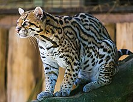
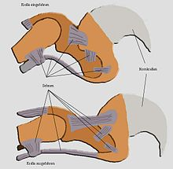
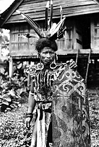
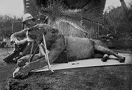
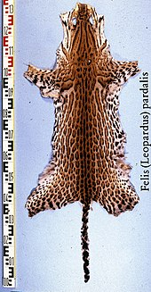

# Katzen

aus Wikipedia, der freien Enzyklopädie

[Zur Navigation springen](#mw-head)

[Zur Suche springen](#searchInput)

 

Dieser Artikel behandelt das zoologische Taxon der Katzen; das Heimtier „Katze“ wird im Artikel 
[Hauskatze](https://de.wikipedia.org/wiki/Hauskatze)
 beschrieben.

Die 
Katzen

 (Felidae) sind eine 
[Familie](https://de.wikipedia.org/wiki/Familie_(Biologie))
 aus der 
[Ordnung](https://de.wikipedia.org/wiki/Ordnung_(Biologie))
 der 
[Raubtiere](https://de.wikipedia.org/wiki/Raubtiere)
 (Carnivora) innerhalb der Überfamilie der 
[Katzenartigen](https://de.wikipedia.org/wiki/Katzenartige)
 (Feloidea). Sie sind auf allen Kontinenten außer in den Polarregionen und 
[Australasien](https://de.wikipedia.org/wiki/Australasien)
 und 
[Ozeanien](https://de.wikipedia.org/wiki/Ozeanien)
 verbreitet, wobei die domestizierte 
[Hauskatze](https://de.wikipedia.org/wiki/Hauskatze)
 durch den Menschen auch in diese Regionen vorgedrungen ist. Eingeteilt werden sie in 
[Großkatzen](https://de.wikipedia.org/wiki/Gro%C3%9Fkatzen)
 wie beispielsweise 
[Löwe](https://de.wikipedia.org/wiki/L%C3%B6we)
, 
[Tiger](https://de.wikipedia.org/wiki/Tiger)
 und 
[Leopard](https://de.wikipedia.org/wiki/Leopard)
 und 
[Kleinkatzen](https://de.wikipedia.org/wiki/Kleinkatzen)
 wie 
[Wildkatze](https://de.wikipedia.org/wiki/Wildkatze)
, 
[Luchs](https://de.wikipedia.org/wiki/Luchse)
 und 
[Ozelot](https://de.wikipedia.org/wiki/Ozelot)
, wobei zu den Kleinkatzen auch große Vertreter wie der 
[Puma](https://de.wikipedia.org/wiki/Puma)
 und der 
[Gepard](https://de.wikipedia.org/wiki/Gepard)
 gehören. Fossil sind die Katzen vor allem durch die zu ihnen gehörenden 
[Säbelzahnkatzen](https://de.wikipedia.org/wiki/S%C3%A4belzahnkatzen)
 bekannt, die ältesten Katzenfunde sind etwa 30 Millionen Jahre alt.

Mit der von der afrikanischen 
[Falbkatze](https://de.wikipedia.org/wiki/Falbkatze)
 abstammenden 
[Hauskatze](https://de.wikipedia.org/wiki/Hauskatze)
 wurde ein Vertreter der Familie durch 
[Domestizierung](https://de.wikipedia.org/wiki/Domestizierung)
 zu einem weltweit gehaltenen 
[Haustier](https://de.wikipedia.org/wiki/Haustier)
. Katzen sind nahezu ausschließlich Fleischfresser und aktive Jäger. Im 
[Erscheinungsbild](https://de.wikipedia.org/wiki/Habitus_(Biologie))
 und im 
[Verhalten](https://de.wikipedia.org/wiki/Verhalten_(Biologie))
 sind sich die meisten der heute lebenden Katzenarten sehr ähnlich.

### Inhaltsverzeichnis

* [1Merkmale](#Merkmale)
  * [1.1Körperbau und äußere Merkmale](#Körperbau_und_äußere_Merkmale)
  * [1.2Sinnesorgane](#Sinnesorgane)
  * [1.3Bewegungsapparat](#Bewegungsapparat)
  * [1.4Schädel und Gebiss](#Schädel_und_Gebiss)

* [2Verbreitung und Lebensräume](#Verbreitung_und_Lebensräume)
* [3Lebensweise](#Lebensweise)
  * [3.1Kommunikation](#Kommunikation)
  * [3.2Ernährung](#Ernährung)
  * [3.3Fortpflanzung und Entwicklung](#Fortpflanzung_und_Entwicklung)

* [4Stammesgeschichte](#Stammesgeschichte)
* [5Systematik](#Systematik)
  * [5.1Traditionelle Systematik](#Traditionelle_Systematik)
  * [5.2Moderne Systematiken](#Moderne_Systematiken)
  * [5.3Gattungen und Arten](#Gattungen_und_Arten)

* [6Katzen und Menschen](#Katzen_und_Menschen)
  * [6.1Kulturelle Bedeutung wildlebender Katzen](#Kulturelle_Bedeutung_wildlebender_Katzen)
  * [6.2Menschen als Beute](#Menschen_als_Beute)
  * [6.3Katzen als Haus- und Nutztiere](#Katzen_als_Haus-_und_Nutztiere)

* [7Bedrohung und Schutz](#Bedrohung_und_Schutz)
  * [7.1Pelztierjagd und -handel](#Pelztierjagd_und_-handel)
  * [7.2Großwildjagd](#Großwildjagd)
  * [7.3Hybridisierung mit der Hauskatze](#Hybridisierung_mit_der_Hauskatze)
  * [7.4Konflikte mit der Nutztierhaltung](#Konflikte_mit_der_Nutztierhaltung)

* [8Literatur](#Literatur)
* [9Weblinks](#Weblinks)
* [10Einzelnachweise](#Einzelnachweise)

### Merkmale

Körperbau und äußere Merkmale

 
Ozelot

Rennender Gepard

In ihrem 
[Habitus](https://de.wikipedia.org/wiki/Habitus_(Biologie))
 ähneln sich die meisten heute lebenden Katzenarten recht stark und zeigen trotz teilweise großer Unterschiede in ihrer Größe weitgehend den gleichen Körperbau. Sie haben in der Regel einen schlanken Körper, ein weiches Fell, kurze Gesichter und relativ kleine Schädel. Am stärksten vom Grundtypus weichen hiervon etwa der 
[Gepard](https://de.wikipedia.org/wiki/Gepard)
 (
Acinonyx jubatus

) mit seinem eher hundeähnlichen Körper oder die 
[Luchse](https://de.wikipedia.org/wiki/Luchse)
 (
Lynx

) mit einem eher gedrungenen Körperbau ab. Die Körpermaße und das Gewicht reichen von etwa ein bis drei Kilogramm schweren Arten wie der 
[Schwarzfußkatze](https://de.wikipedia.org/wiki/Schwarzfu%C3%9Fkatze)
 (
Felis nigripes

) und der 
[Rostkatze](https://de.wikipedia.org/wiki/Rostkatze)
 (
Prionailurus rubiginosus

) bis hin über 300 Kilogramm schweren und mehr als zwei Meter langen männlichen 
[Sibirischen Tiger](https://de.wikipedia.org/wiki/Sibirischer_Tiger)
 (
Panthera tigris altaica

).
[[1]](#cite_note-Macdonald_et_al._2010_3-1)

 
[Sexualdimorphismus](https://de.wikipedia.org/wiki/Sexualdimorphismus)
 ist bei den meisten Arten nur wenig ausgeprägt, in der Regel werden Männchen etwa fünf bis zehn Prozent größer als Weibchen. Eine Ausnahme stellt der 
[Löwe](https://de.wikipedia.org/wiki/L%C3%B6we)
 (
Panthera leo

) dar, bei dem die Männchen sich neben der Größe vor allem durch eine ausgeprägte 
[Mähne](https://de.wikipedia.org/wiki/Langhaar)
 von den Weibchen unterscheiden. Bei Arten mit großen Verbreitungsgebieten über mehrere Breitengrade kann die Größe zudem regional unterschiedlich sein; sie folgt dabei der 
[Bergmannschen Regel](https://de.wikipedia.org/wiki/%C3%96kogeographische_Regel#Bergmann)
, wonach die durchschnittliche Körpergröße zu den Polen hin ansteigt. Dies ist beispielsweise beim 
[Puma](https://de.wikipedia.org/wiki/Puma)
 (
Puma concolor

) zu beobachten, dessen Verbreitung sich vom südlichen Südamerika über die 
[Äquatorgebiete](https://de.wikipedia.org/wiki/%C3%84quator)
 im nördlichen Südamerika bis in den Norden von 
[Kanada](https://de.wikipedia.org/wiki/Kanada)
 erstreckt und bei dem die Unterschiede in den Körpergrößen etwa hinsichtlich der Schädellänge von Tieren aus unterschiedlichen Regionen bis zu 25 Prozent ausmachen können.
[[2]](#cite_note-HMW_Morphology-2)

Die Färbungen und vor allem die Fellzeichnungen sind bei den Katzen sowohl zwischen den Arten wie auch innerhalb einzelner Arten sehr variabel. Dabei reicht das Spektrum von weitgehend einfarbigen Tieren wie dem meist rotbraun gefärbten Puma oder dem gelbbraun gefärbten Löwen bis hin zu auffällig gefleckten und gestreiften Arten, die die Mehrzahl der Katzen darstellen. Die einfachste Form der Fellzeichnung ist eine mehr oder weniger ausgeprägte dunkle Fleckung auf hellem Grund, wie sie etwa beim Gepard ausgebildet ist. Beim Leoparden und beim Jaguar haben sich aus den Flecken ringförmige Rosetten aus Einzelflecken um ein helles Zentrum gebildet, beim Jaguar mit einem zusätzlichen dunklen Fleck im Zentrum. Bei anderen Arten wie etwa dem 
[Ozelot](https://de.wikipedia.org/wiki/Ozelot)
 oder dem 
[Nebelparder](https://de.wikipedia.org/wiki/Nebelparder)
 kam es zu Modifizierungen der Flecken in Richtung langovaler Streifen, indem einzelne Flecken zu längeren Ketten verschmelzen. Beim Tiger und auch mehreren „getigerten“ Kleinkatzen (und Hauskatzen) besteht die Fellzeichnung dagegen vollständig aus vertikalen Streifen. Die unterschiedlichen Fellzeichnungen dienen in erster Linie der 
[Tarnung](https://de.wikipedia.org/wiki/Tarnung)
 und sind entsprechend in der Regel direkt gekoppelt mit den Lebensräumen der Tiere. So kommen die eher einfarbigen Arten in der Regel in offenen Lebensräumen vor, während reich gezeichnete Tiere vor allem in dichteren Vegetationsbereichen leben.
[[2]](#cite_note-HMW_Morphology-2)

 Zudem kommen bei mehreren Arten auch 
[melanistische](https://de.wikipedia.org/wiki/Melanismus)
, schwarze, und seltener auch 
[leuzistische](https://de.wikipedia.org/wiki/Leuzismus)
, weiße, Formen vor. Besonders bekannt sind die als 
[Schwarzer Panther](https://de.wikipedia.org/wiki/Schwarzer_Panther)
 bezeichneten melanistischen Formen des Leoparden und des Jaguars, Leuzismus liegt beispielsweise bei weißen Tigern vor.
[[2]](#cite_note-HMW_Morphology-2)

*  Schwarzer Jaguar, gefleckte Fellzeichnung erkennbar
*  Schwarzer Leopard in Indien
*  Weißer Tiger in Indien
*  Weiße, leuzistische, Hauskatze

Alle Katzen besitzen einen Schwanz, der ihnen beim Halten des Gleichgewichts behilflich ist und auch zur innerartlichen 
[Kommunikation](https://de.wikipedia.org/wiki/Kommunikation)
 benötigt wird. Bei einigen Arten wie dem 
[Leoparden](https://de.wikipedia.org/wiki/Leopard)
 (
Panthera pardus

) und den Geparden ist der Schwanz vergleichsweise lang und dient der Balance der relativ schweren Körper beim Klettern oder beim Rennen. Bei den Luchsen und dem 
[Karakal](https://de.wikipedia.org/wiki/Karakal)
 (
Caracal caracal

) ist der Schwanz dagegen aus bislang unbekannten Gründen stark verkürzt.
[[2]](#cite_note-HMW_Morphology-2)

#### Sinnesorgane

 
Auge einer Hauskatze mit schlitzförmiger Pupille

 
Die runden Pupillen eines Löwen

Die Augen der Katzen sind im Verhältnis zum Schädel relativ groß. Die 
[Pupillen](https://de.wikipedia.org/wiki/Pupille)
 der Katzenaugen sind in ihrer Öffnungsgröße stark veränderbar: Bei hellem Umgebungslicht sind die Pupillen bei Kleinkatzen senkrecht schlitzförmig, bei anderen Katzenarten klein und rund, bei Dunkelheit sind die Pupillen extrem weit geöffnet.
[[2]](#cite_note-HMW_Morphology-2)

 Einige Katzen besitzen 
[multifokale Linsen](https://de.wikipedia.org/wiki/Linse_(Auge)#Monofokale_und_multifokale_Linsen)
, die eine höhere Sehschärfe ermöglichen. 
[Hauskatzen](https://de.wikipedia.org/wiki/Hauskatze)
 besitzen solche Linsen (und die entsprechenden schlitzförmigen Pupillen). Andere Katzen, beispielsweise 
[Sibirische Tiger](https://de.wikipedia.org/wiki/Sibirischer_Tiger)
, haben „gewöhnliche“ monofokale Linsen.
[[3]](#cite_note-Malmström_&_Kröger_2005-3)

Katzen verfügen über die reflektierende Schicht 
[Tapetum lucidum](https://de.wikipedia.org/wiki/Tapetum_lucidum)

 hinter der 
[Netzhaut](https://de.wikipedia.org/wiki/Netzhaut)
 im Auge, die jene Lichtanteile, die die Netzhaut durchdrungen haben, zurückspiegelt, so dass diese noch ein zweites Mal auf die Netzhaut treffen.
[[2]](#cite_note-HMW_Morphology-2)

 Diese Schicht bewirkt neben einer verbesserten Dämmerungssicht auch eine Reflexion des auffallenden Lichts auf die Augen in der Dunkelheit (vergleiche auch 
[Katzenauge](https://de.wikipedia.org/wiki/Katzenauge)
 als umgangssprachliche Bezeichnung für Reflektoren). Das 
[Stäbchen](https://de.wikipedia.org/wiki/St%C3%A4bchen_(Auge))
-
[Zapfen](https://de.wikipedia.org/wiki/Zapfen_(Auge))
-Verhältnis der Netzhautrezeptoren liegt bei etwa 63 zu 1 (beim Menschen liegt das Verhältnis bei 20 zu 1), variiert jedoch sehr stark zwischen dem Zentrum der Netzhaut (10 zu 1) und der Peripherie (200 zu 1). Katzen sehen daher auch bei wenig vorhandenem Umgebungslicht (Dämmerung, Nacht) noch sehr gut, Farben werden von Katzen allerdings nur eingeschränkt wahrgenommen.
[[2]](#cite_note-HMW_Morphology-2)

 Da die Katze ihre Augen kaum nach links oder rechts bewegen kann, muss sie, um in eine andere Richtung sehen zu können, ihren Kopf bewegen. Durch die nach vorne gerichteten Augen ergibt sich eine starke Überschneidung der Sehachsen, was ein besseres räumliches Sehvermögen bedeutet. Der Sichtwinkel der Katze beträgt 200° bis 220°.

Die Ohren der Katzen stehen aufrecht, sind spitz bis rundlich und können in verschiedene Richtungen gedreht werden. Im Vergleich zu Hunden sind die Ohren klein, einige Arten wie der 
[Serval](https://de.wikipedia.org/wiki/Serval)
 oder die 
[Sandkatze](https://de.wikipedia.org/wiki/Sandkatze)
 haben allerdings vergleichsweise große Ohrmuscheln. Sie verfügen über ein ausgezeichnetes 
[Gehör](https://de.wikipedia.org/wiki/Auditive_Wahrnehmung)
. Der Frequenzbereich geht hierbei von etwa 200 
[Hz](https://de.wikipedia.org/wiki/Hertz_(Einheit))
 bis etwa 65.000 Hz,
[[2]](#cite_note-HMW_Morphology-2)

 was den des Menschen um mehr als das Dreifache übersteigt. Die Ohren einer Katze lassen sich unabhängig voneinander über einen großen Winkelbereich drehen, wodurch es ihr möglich ist, Beutetiere akustisch zu lokalisieren und selbst bei Dunkelheit durch einen gezielten Sprung zu fangen. Die Ohrmuscheln sind mit Ohrhaaren besetzt, um das Eindringen von Fremdkörpern zu verhindern. Das Innenohr ist ebenfalls stark ausgeprägt in einer vergleichsweise großen 
[Paukenblase](https://de.wikipedia.org/wiki/Paukenh%C3%B6hle#Paukenblase)
 (Bulla tympanica).
[[2]](#cite_note-HMW_Morphology-2)

Die Geschmackserkennung ist nötig, um verdorbene oder ungenießbare Nahrung zu erkennen, und muss bei Katzen präzise und schnell erfolgen, da diese ihre Nahrung nicht kauen. Die Zunge ist rau, da sie mit 
[Papillen](https://de.wikipedia.org/wiki/Geschmacksknospe)
 besetzt ist. Die zentralen Papillen sind mit Dornen besetzt, die zum Körper hin zeigen. Diese Dornen dienen zum Kämmen des Felles oder zum Abschaben des Fleisches von Knochen. Die vorderen Papillen dienen der eigentlichen Geschmackswahrnehmung. Dies betrifft vor allem sauer, salzig, bitter und 
[umami](https://de.wikipedia.org/wiki/Umami)
. Katzen können süß nicht schmecken, denn den Tieren fehlen Teile des Gens, welches die Informationen für eine Hälfte des Erkennungsproteins für „süß“ trägt.
[[4]](#cite_note-4)

 Die Folge ist ein funktionsunfähiger Rezeptor in den Geschmacksknospen der Katzenzunge.

Der Geruchssinn der Katzen ist weniger ausgeprägt als beispielsweise bei 
[Hunden](https://de.wikipedia.org/wiki/Hunde)
 oder 
[Bären](https://de.wikipedia.org/wiki/B%C3%A4ren)
 und spielt vor allem in der innerartlichen Kommunikation eine Rolle. Die Nase und die gesamte Schnauze der Katzen ist kürzer als die anderer Raubtiere und auch das Riechepithel in der inneren Nase ist weniger stark ausgeprägt.
[[2]](#cite_note-HMW_Morphology-2)

 
[Manul](https://de.wikipedia.org/wiki/Manul)
 mit deutlich erkennbaren Vibrissen an der Schnauze, der Wange und über den Augen

Die Tasthaare (zool. 
[Vibrissen](https://de.wikipedia.org/wiki/Vibrisse)
) kennzeichnen die meisten Katzen als vorwiegend nachtaktive Tiere. Sie befinden sich insbesondere an der Schnauze und im Wangenbereich, jedoch auch über den Augen und an den unteren Vorderläufen; Kinnvibrissen, wie sie bei anderen Raubtieren ausgebildet sind, fehlen.
[[2]](#cite_note-HMW_Morphology-2)

 Die Vibrissen werden durch Luftbewegungen in Vibrationen versetzt, die über Sinneszellen an den Tasthaarwurzeln in ein räumliches Bild der Umgebung umgesetzt werden – Katzen „sehen“ dadurch zumindest grobe räumliche Strukturen ihrer direkten Umgebung auch in völliger Dunkelheit. Die Vibrissen sind bereits bei Neugeborenen vollständig ausgebildet, was die Wichtigkeit des Tastsinnes deutlich macht.

#### Bewegungsapparat

Die 
[Wirbelsäule](https://de.wikipedia.org/wiki/Wirbels%C3%A4ule)
 der Katzen ist sehr beweglich und flexibel. Die 
[Bandscheiben](https://de.wikipedia.org/wiki/Bandscheibe)
 zwischen den einzelnen 
[Wirbeln](https://de.wikipedia.org/wiki/Wirbel_(Anatomie))
 sind weich und dehnbar und erlauben es den Tieren, den Rücken zu beugen und zu verdrehen. Diese Verdrehung ermöglicht es den Tieren, ihren Körper im Fallen so zu drehen, dass sie in der Regel immer mit den Füßen am Boden landen 
(siehe 
[Stellreflex der Katze](https://de.wikipedia.org/wiki/Stellreflex_der_Katze)
)

, sowie beim Rennen den Körper sehr weit zu strecken und damit vor allem den Geparden, sehr schnell zu rennen.
[[2]](#cite_note-HMW_Morphology-2)

Katzen sind vor allem am Boden lebende Tiere, die jedoch auch in hohe Vegetation klettern können und teilweise weitestgehend baumlebend sind. Die Beine sind entsprechend vor allem für das Laufen und Springen auf dem Boden sowie zum Klettern gestaltet, die Vorderbeine dienen zudem dem Ergreifen und Festhalten von Beutetieren. Um Letzteres zu ermöglichen, müssen die Vorderbeine beweglich sein und eine Drehung der einzelnen Elemente gegenüber dem Körper ermöglichen. Anders als etwa bei Hunden, bei denen die Beine vergleichsweise starr und unbeweglich sind, können Katzen sowohl das Schultergelenk als auch den Ellbogen und die Vorderfüße verdrehen und so Beute ergreifen. Um eine optimale Drehung der Schulter im Lauf und beim Klettern zu ermöglichen, ist bei Katzen zudem das 
[Schlüsselbein](https://de.wikipedia.org/wiki/Schl%C3%BCsselbein)
 (Clavicula) verkümmert oder vollständig reduziert.
[[2]](#cite_note-HMW_Morphology-2)

 Die Hinterbeine sind kräftig und weniger beweglich als die Vorderbeine, können jedoch bei einigen Arten ebenfalls zum Greifen und Klettern genutzt werden. Die Länge der Hinterbeine im Verhältnis zum Körper und vor allem zu den Vorderbeinen ist variabel und abhängig von der konkreten Lebensweise.
[[2]](#cite_note-HMW_Morphology-2)

 
Krallen der Katze

Katzen sind 
[Zehen-](https://de.wikipedia.org/wiki/Zeheng%C3%A4nger)
 sowie 
[Kreuzgänger](https://de.wikipedia.org/wiki/Kreuzgang_(Biologie))
 und haben an den Vorderpfoten fünf und an den Hinterpfoten vier Zehen. Der erste Zeh der Vorderpfoten besitzt ein Gelenk weniger und ist häufig kräftiger ausgebildet als die restlichen Zehen; er kann vor allem bei größeren Katzen genutzt werden, um sich am Beutetier festzuhaken.
[[2]](#cite_note-HMW_Morphology-2)

 Die seitlich abgeflachten und gekrümmten 
[Krallen](https://de.wikipedia.org/wiki/Kralle)
 der Vorderpfoten sind kräftiger als die der Hinterpfoten. Mit Ausnahme des 
[Gepards](https://de.wikipedia.org/wiki/Gepard)
, der 
[Flachkopfkatze](https://de.wikipedia.org/wiki/Flachkopfkatze)
 und der 
[Fischkatze](https://de.wikipedia.org/wiki/Fischkatze)
 – diese können ihre Krallen nur zum Teil einziehen – besitzen alle Katzen „ausfahrbare“ sichelförmige Krallen aus 
[Horn](https://de.wikipedia.org/wiki/Hornsubstanz)
. Sie werden nur bei Gebrauch (Kampf, Beutefang, Klettern) durch Anspannen bestimmter Muskeln ausgefahren. Damit sie sich beim Laufen nicht abnutzen, sondern scharf bleiben, verbleiben sie bei Nichtgebrauch in den Hautscheiden. Das unwillkürliche Ausfahren der Krallen wird durch Sehnen im Zeheninneren verhindert.
[[2]](#cite_note-HMW_Morphology-2)

 Mit ihren Krallen können viele Katzen sehr gut auf Bäume klettern, aber zum Abstieg muss die Katze gelernt haben, ihre nach vorne gekrümmten Krallen als „Steighaken“ zu benutzen. Unerfahrene Katzen versuchen, mit dem Kopf voraus nach unten zu klettern, wobei sie schnell in Schwierigkeiten kommen können, in Panik geraten und in eine Schockstarre verfallen.

Die 
[Ballen](https://de.wikipedia.org/wiki/Ballen)
 der Katzen sind, wieder mit Ausnahme der des Gepards, weich und gepolstert, sodass sie sich an ihre Beute anschleichen können.
[[2]](#cite_note-HMW_Morphology-2)

 Die vor allem in den kalten nordischen Wäldern lebenden Luchse zeichnen sich durch große und stark behaarte Füße aus, die ihnen auch ein Laufen und Rennen im Schnee ermöglichen.
[[5]](#cite_note-HMW_Habitat-5)

 Der Tastsinn an den Pfoten ist sehr stark ausgeprägt, ein Grund, weswegen Katzen Gegenstände auch mit den Pfoten untersuchen.

Schädel und Gebiss

Der Schädel der Katzen ist im Vergleich etwa zu den 
[Hunden](https://de.wikipedia.org/wiki/Hunde)
 kompakt mit einer stark verkürzten Schnauzenregion des Oberkiefers und einem vergleichsweise kurzen Unterkiefer. Der kompakte Aufbau geht vor allem zurück auf die Reduktion der Zähne und ermöglicht eine kompaktere und im Vergleich zu anderen Raubtieren kräftigere Gebissmuskulatur. Kleinere Katzen haben einen mehr oder weniger rundlichen Schädel mit einer sehr kurzen Schnauze und einem weitgehend nach vorn gerichteten Gesichtsschädel. Bei den Großkatzen ist die Schnauze stärker ausgeprägt, wobei die Gesichtsachse mehr horizontal ausgerichtet ist.
[[2]](#cite_note-HMW_Morphology-2)

 Im Vergleich zu Hunden und Hyänen besitzen sie einen weniger stark ausgeprägten Sagittalkamm und weiter ausladende 
[Jochbögen](https://de.wikipedia.org/wiki/Jochbogen)
.
[[1]](#cite_note-Macdonald_et_al._2010_3-1)

 
Schädelrekonstruktion von 
[Smilodon](https://de.wikipedia.org/wiki/Smilodon)

, einer Säbelzahnkatze

<table class="Zahnformel"><tbody><tr><td>3</td><td>·</td><td>1</td><td>·</td><td class="skin-invert">3</td><td>·</td><td class="skin-invert">1</td><td rowspan="2"> = 30</td></tr><tr><td>3</td><td>·</td><td>1</td><td>·</td><td class="skin-invert">2</td><td>·</td><td class="skin-invert">1</td></tr></tbody></table>

Ursprüngliche Zahnformel der Katzen

[Ober-](https://de.wikipedia.org/wiki/Oberkiefer)
 und 
[Unterkiefer](https://de.wikipedia.org/wiki/Unterkiefer)
 sind mit einem 
[Scharniergelenk](https://de.wikipedia.org/wiki/Scharniergelenk)
 verbunden.
Das Gebiss der rezenten Katzen enthält in der ursprünglichen Form pro Oberkieferhälfte drei 
[Schneidezähne](https://de.wikipedia.org/wiki/Schneidezahn)
 (Incisivi), einen 
[Eckzahn](https://de.wikipedia.org/wiki/Eckzahn)
 (Caninus), drei 
[Vorbackenzähne](https://de.wikipedia.org/wiki/Pr%C3%A4molar)
 (Praemolares) sowie einen 
[Backenzahn](https://de.wikipedia.org/wiki/Backenzahn)
 (Molares) und pro Unterkieferhälfte drei Schneidezähne, einen Eckzahn, zwei Vorbackenzähne und einen Backenzahn. Insgesamt besitzen die Tiere somit 30 Zähne.
[[2]](#cite_note-HMW_Morphology-2)

 Von dieser allgemeinen Zahnformel gibt es Abweichungen, die Luchse etwa haben im Oberkiefer nur zwei Vorbackenzähne und damit 28 Zähne (einzelne Luchse können allerdings im Unterkiefer ein- oder beidseitig zusätzlich einen weiteren Backenzahn aufweisen).
[[6]](#cite_note-Russel_et_al._1995-6)

[[7]](#cite_note-Kvam_1985-7)

 Fossilien von 
[Proailurus](https://de.wikipedia.org/wiki/Proailurus)

, der teilweise als ältester bekannter Vertreter der Katzen angesehen wird, weisen je Kieferhälfte vier Prämolaren und zwei Molaren auf.
[[2]](#cite_note-HMW_Morphology-2)

*  Schädel eines Indochinesischen Leoparden (Sammlung[Museum Wiesbaden](https://de.wikipedia.org/wiki/Museum_Wiesbaden))
*  Gebiss einer Großkatze
*  Gebiss eines[Gepards](https://de.wikipedia.org/wiki/Gepard)

Die Schneidezähne der Katzen sind klein und spatelförmig, sie dienen vor allem dazu, Fleisch von der Beute oder Kadavern abzubeißen. Die einzelnen Schneidezähne unterscheiden sich in der Größe und reichen vom kleinsten ersten Zahn in der Gebißmitte bis zum größten dritten vor den Eckzähnen. Bei einigen Arten ist der dritte Schneidezahn besonders groß und eckzahn-ähnlich ausgebildet. Zwischen dem dritten Schneidezahn und dem Eckzahn befindet sich ein 
[Diastema](https://de.wikipedia.org/wiki/Diastema_(Zoologie))
 (eine Lücke in der Zahnreihe), das die Eckzähne beim Schließen des Maules aneinander vorbeigleiten lässt. Die Eckzähne, auch Fangzähne, selbst sind dolchartig vergrößert und dienen zum Packen, Festhalten und Töten der Beute. Sie besitzen bei den Katzen eine spezifische Furche an der Außenseite.
[[2]](#cite_note-HMW_Morphology-2)

 Besonders stark vergrößert waren die Eckzähne bei den 
[Säbelzahnkatzen](https://de.wikipedia.org/wiki/S%C3%A4belzahnkatzen)
. Vor den Prämolaren folgt ein weiteres Diastema, der erste Prämolar ist häufig stumpfartig verkleinert. Die weiteren Prämolaren sind gleichartig aufgebaut mit jeweils einer hohen mittleren Spitze und flankierenden kleineren Spitzen. Sie dienen zum Festhalten und zum Zerbrechen kleinerer Knochen. Der letzte Prämolar und der erste Molar bilden die Reißzähne zum Abbeißen von Fleischstücken, die ohne weitere Zerkleinerung geschluckt werden. Sie besitzen hohe zackige Kronen, die beim Beißen scherenartig aneinander vorbeigleiten und so Fleischstücke zerteilen können. Die Größe der Zähne im Verhältnis zueinander variiert zwischen den Arten und hängt mit der Art der Beutetiere zusammen.
[[2]](#cite_note-HMW_Morphology-2)

Verbreitung und Lebensräume

 
Eurasischer Luchs im Schnee

Katzen sind heute auf allen Kontinenten mit Ausnahme der Antarktis verbreitet. Die natürliche Verbreitung umfasst 
[Eurasien](https://de.wikipedia.org/wiki/Eurasien)
 einschließlich der Inseln 
[Südostasiens](https://de.wikipedia.org/wiki/S%C3%BCdostasien)
, 
[Afrika](https://de.wikipedia.org/wiki/Afrika)
 sowie 
[Nord-](https://de.wikipedia.org/wiki/Nordamerika)
 und 
[Südamerika](https://de.wikipedia.org/wiki/S%C3%BCdamerika)
.
[[5]](#cite_note-HMW_Habitat-5)

 Von den 45 Katzenarten kommen vier in Europa vor, neben der weit verbreiteten 
[Europäischen Wildkatze](https://de.wikipedia.org/wiki/Europ%C3%A4ische_Wildkatze)
 und dem 
[Eurasischen Luchs](https://de.wikipedia.org/wiki/Eurasischer_Luchs)
, der 
[Pardelluchs](https://de.wikipedia.org/wiki/Pardelluchs)
 in Spanien und Portugal und die 
[Falbkatze](https://de.wikipedia.org/wiki/Falbkatze)
 auf Sizilien und Sardinien. Der Pardelluchs ist dabei die einzige Katze, die ausschließlich in Europa vorkommt. 22 und damit etwa die Hälfte aller heute lebenden Katzenarten kommen in Asien vor, bei 14 von ihnen sind die Verbreitungsgebiete auf Asien begrenzt. In Afrika kommen 10 Katzenarten vor, davon allerdings nur drei ausschließlich auf diesem Kontinent. Auf den amerikanischen Kontinenten leben 18 oder 19 Arten der Katzen, davon lebt nur der Kanadische Luchs ausschließlich in der 
[Nearktis](https://de.wikipedia.org/wiki/Nearktis)
 im Norden von Nordamerika und der Rotluchs ist auf Nordamerika bis in den Norden von Mexiko begrenzt. Die meisten Arten sind in den 
[neotropischen](https://de.wikipedia.org/wiki/Neotropis)
 Regionen zu finden, davon zehn nur in Südamerika und drei weitere mit nur marginalen Verbreitungsgebieten nördlich von Mexiko.

Katzen kommen zudem in fast allen Lebensräumen vor, wobei viele Arten eine sehr enge Bindung an einen spezifischen Lebensraum haben. Sie sind in allen Höhenlagen vom Flachland bis in die Gebirge zu finden, die Höhenverbreitung reicht dabei bis etwa 6000 Meter im 
[Himalaya](https://de.wikipedia.org/wiki/Himalaya)
. In 
[Australasien](https://de.wikipedia.org/wiki/Australasien)
 und 
[Ozeanien](https://de.wikipedia.org/wiki/Ozeanien)
 sind Katzen in Form der Hauskatze durch Siedler und Reisende eingeführt worden. In den Polarregionen nördlich des 70. 
[Breitengrades](https://de.wikipedia.org/wiki/Geographische_Breite)
 kommen keine Katzen vor.
[[5]](#cite_note-HMW_Habitat-5)

Die ursprünglichen Lebensräume der Katzen sind Wälder und bis heute leben die meisten der Arten in Waldgebieten, vor allem in tropischen Regenwäldern. 89 % aller Katzenarten kommen in Wäldern und offeneren Waldgebieten vor.
[[5]](#cite_note-HMW_Habitat-5)

 Die 
[borealen Nadelwälder](https://de.wikipedia.org/wiki/Borealer_Nadelwald)
 Kanadas und des nördlichen Eurasiens sind dabei die artenärmsten Gebiete. An diese Regionen haben sich vor allem die Luchse angepasst, die bis in die russische Taiga und die 
[Tundragebiete](https://de.wikipedia.org/wiki/Tundra)
 vordringen und entsprechend angepasst sind.
[[5]](#cite_note-HMW_Habitat-5)

 In Wäldern der gemäßigten Zone Eurasiens lebt die 
[Europäische Wildkatze](https://de.wikipedia.org/wiki/Europ%C3%A4ische_Wildkatze)
, in Nordamerika ist der 
[Rotluchs](https://de.wikipedia.org/wiki/Rotluchs)
 in diesen Lebensräumen zu finden und in den gemäßigten Waldzonen Südamerikas ist die 
[Chilenische Waldkatze](https://de.wikipedia.org/wiki/Chilenische_Waldkatze)
 zu finden. Die größte Artenvielfalt haben tropische Waldgebiete, in denen etwa 20 Katzenarten anzutreffen sind. Sieben von diesen sind strikt auf die tropischen Regenwälder begrenzt, darunter etwa der 
[Nebelparder](https://de.wikipedia.org/wiki/Nebelparder)
, die 
[Marmorkatze](https://de.wikipedia.org/wiki/Marmorkatze)
, die 
[Borneo-Goldkatze](https://de.wikipedia.org/wiki/Borneo-Goldkatze)
, die 
[Flachkopfkatze](https://de.wikipedia.org/wiki/Flachkopfkatze)
 und die 
[Langschwanzkatze](https://de.wikipedia.org/wiki/Langschwanzkatze)
. Diese häufig in der Vegetation lebenden Arten sind aufgrund ihrer versteckten Lebensweise in der Regel wenig erforscht und die meisten Kenntnisse über sie stammen aus Kamerafallen und von Beobachtungen bei in Gefangenschaft gehaltenen Tieren.
[[5]](#cite_note-HMW_Habitat-5)

*  Serval in Sambia
*  Gepard im[Ngorongoro](https://de.wikipedia.org/wiki/Ngorongoro)-Krater, Tansania
*  Wildkatze im[Wildpark Bad Mergentheim](https://de.wikipedia.org/wiki/Wildpark_Bad_Mergentheim)
*  [Schneeleopard](https://de.wikipedia.org/wiki/Schneeleopard)im Schnee

Auch in Hochgebirgen kommen einige sehr spezialisierte Katzenarten vor. Die 
[Bergkatze](https://de.wikipedia.org/wiki/Bergkatze)
 etwa lebt in den südamerikanischen 
[Anden](https://de.wikipedia.org/wiki/Anden)
 in Höhen von 3000 bis mehr als 5000 Metern. In den asiatischen Hochgebirgen sind der 
[Schneeleopard](https://de.wikipedia.org/wiki/Schneeleopard)
 und der 
[Manul](https://de.wikipedia.org/wiki/Manul)
 zu finden.
[[5]](#cite_note-HMW_Habitat-5)

 Wüstenbewohner sind die 
[Sandkatze](https://de.wikipedia.org/wiki/Sandkatze)
, die in den Trockengebieten des Mittleren Ostens vorkommt, und die 
[Schwarzfußkatze](https://de.wikipedia.org/wiki/Schwarzfu%C3%9Fkatze)
 aus den Wüsten- und Halbwüstengebieten Südafrikas. Sowohl die Wüstenarten wie auch der Manul sind an sehr trockene Regionen angepasst und können lange Zeit ohne Wasseraufnahme überleben.
[[5]](#cite_note-HMW_Habitat-5)

 Der Leopard kommt ebenfalls in Halbwüsten und in den Steppengebieten vor, in den afrikanischen Savannen leben zudem Geparde und Löwen sowie der 
[Serval](https://de.wikipedia.org/wiki/Serval)
 und der 
[Karakal](https://de.wikipedia.org/wiki/Karakal)
.
[[5]](#cite_note-HMW_Habitat-5)

Einige Arten sind anpassungsfähige Generalisten und kommen über große Gebiete in verschiedensten Lebensräumen vor. Sie leben in der Regel dort, wo ausreichend Beutetiere zu finden sind. Zu diesen gehören etwa der Puma in weiten Teilen Nord- und Südamerikas sowie der Leopard, der vom südlichen Afrika über weite Teile Nordafrikas, den mittleren Osten und Südasien bis in den Nordosten Russlands anzutreffen ist. Auch die Europäische Wildkatze ist sowohl in Europa wie auch in Asien und in Afrika über große Regionen verbreitet.
[[8]](#cite_note-Macdonald_et_al._2010_4-8)

 Generalisten mit einem nicht ganz so großen Verbreitungsgebiet sind auch der 
[Colocolo](https://de.wikipedia.org/wiki/Colocolo)
 in Südamerika sowie die 
[Bengalkatze](https://de.wikipedia.org/wiki/Bengalkatze)
 in Asien.
[[5]](#cite_note-HMW_Habitat-5)

 Kommen mehrere Arten gemeinsam in einem Lebensraum, 
[sympatrisch](https://de.wikipedia.org/wiki/Sympatrie)
, vor, unterscheiden sie sich in der Regel durch die Größe der Beutetiere. So erbeuten Leoparden in Indien in der Regel eher kleine bis mittelgroße Beutetiere während die ebenfalls dort lebenden Tiger große Tiere erbeuten. In Afrika jagen Leoparden und Löwen die gleichen Beutetiere, die Leoparden bringen ihre Beute jedoch in die Bäume und sind dort vor den Löwen geschützt. In den tropischen Regionen Südamerikas jagen Jaguare eher in den dichteren Vegetationsbeständen, Pumas bevorzugen offenere Gebiete.
[[5]](#cite_note-HMW_Habitat-5)

### Lebensweise

Die meisten Katzenarten sind Einzelgänger. Männliche und weibliche Tiere kommen lediglich zur 
[Paarung](https://de.wikipedia.org/wiki/Begattung)
 zusammen und trennen sich anschließend wieder. Ausnahmen bilden hier insbesondere die 
[Löwen](https://de.wikipedia.org/wiki/L%C3%B6we)
, die in größeren Rudeln leben, sowie kleinere Gruppen zusammenlebender Männchen bei den 
[Geparden](https://de.wikipedia.org/wiki/Gepard)
.
[[9]](#cite_note-HMW_Movements-9)

#### Kommunikation

Katzen weisen, verglichen mit anderen Säugetieren, ein relativ großes Spektrum an Kommunikationsformen auf. Da insbesondere Hauskatzen seit Jahrhunderten in der Umgebung von Menschen leben, gibt es für 
[ihre Lautäußerungen](https://de.wikipedia.org/wiki/Kommunikation_der_Hauskatze)
 auch mehrere Benennungen, darunter etwa „miauen“, „fauchen“ oder „
[schnurren](https://de.wikipedia.org/wiki/Schnurren)
“. Bei anderen Katzenlauten spricht man etwa von „brüllen“, „zischen“, „brummen“ oder „knurren“. Bei wild lebenden Katzenarten sind die meisten dieser Laute allerdings nur selten zu hören, da die meisten Arten als Einzelgänger leben und entsprechend selten akustische Kommunikation mit Artgenossen vorkommt. Die Forschung an der Kommunikation findet entsprechend vor allem an in Gefangenschaft gehaltenen Tieren statt und entsprechend ist das Wissen über die Kommunikation bei vielen Arten sehr begrenzt oder nicht vorhanden.
[[10]](#cite_note-HMW_Communication-10)

 
Fauchende 
[Hauskatze](https://de.wikipedia.org/wiki/Hauskatze)

Wie andere Säugetiere kommunizieren Katzen mit akustischen Signalen über kurze, mittellange und lange Distanzen. Auf kurze Distanz ist die akustische Kommunikation meist verbunden mit optischen Signalen wie spezifischer Ohrstellung, Schwanzbewegungen, Zähne zeigen oder die Körperhaltung, da die kommunizierenden Tiere einander sehen können. Besonders ausgeprägt ist dies bei Drohungen und Rivalitäten. Bei der Kommunikation zwischen Muttertieren und Jungtieren oder auch bei der Paarung spielen Berührungen eine große Rolle. Chemische Reize wie Geruchsstoffe im Urin, Faeces oder Analdrüsensekreten spielen dagegen vor allem bei der Kommunikation über Reviergrenzen eine Rolle.
[[10]](#cite_note-HMW_Communication-10)

Lautere Rufe kommen sowohl bei Weibchen wie Männchen vor und dienen vor allem der Abgrenzung der Reviere oder dem Anlocken von Fortpflanzungspartnern. Bei den meisten Katzen sind diese Laute mit denen der Hauskatze identisch oder vergleichbar und bauen auf dem typischen miauen auf. Bei vielen Arten wie dem Serval, dem Karakal, der Afrikanischen Goldkatze oder der Marmorkatze entsprechen sie denen der Hauskatze, bei anderen wie dem Jaguarundi, der Sandkatze oder der Fischkatze sind sie dagegen stark abgeleitet und sehr unterschiedlich ausgeprägt. So stößt der Jaguarundi schrille, hochfrequente Pfiffe aus, die Sandkatze und die Fischkatze dagegen Sequenzen kurzer bellender Laute. Bei mittelgroßen Arten wie dem Nebelparder, dem Puma oder auch dem Gepard sind die Rufe dagegen weniger strukturiert und zeigen keine klaren Sequenzen. Großkatzen wie Tiger, Jaguare, Leoparden und auch Löwen haben meist artspezifische Rufmuster.
[[10]](#cite_note-HMW_Communication-10)

 Als einzige soziale, in Gruppen lebende Art, produzieren die Löwen zahlreiche verschiedene Laute für die innerartliche Kommunikation und kommunizieren auch gemeinsam als „Chöre“ über längere Distanzen, wobei das Muster der Rufe mit einzelnen leisen Rufen startet und über die Dauer schneller und lauter wird. Das typische Brüllen der Löwen dauert dabei etwa 40 Sekunden und besteht aus 25 bis 30 Einzelrufen.
[[10]](#cite_note-HMW_Communication-10)

Ernährung

 
Tiger erbeutet einen 
[Sambarhirsch](https://de.wikipedia.org/wiki/Sambar)

 
Löwen mit einem erbeuteten 
[Zebra](https://de.wikipedia.org/wiki/Zebras)

Anders als viele andere 
[Raubtiere](https://de.wikipedia.org/wiki/Raubtiere)
, die mehr oder weniger 
[Allesfresser](https://de.wikipedia.org/wiki/Allesfresser)
 sind, ernähren sich alle Katzen fast ausschließlich von Fleisch und haben einen vergleichsweise hohen Proteinbedarf. Die meisten Daten über die Nahrungszusammensetzung bei Katzen stammen dabei aus Untersuchungen der 
[Faeces](https://de.wikipedia.org/wiki/Kot)
 oder von Mageninhalten toter Tiere, nur bei wenigen großen Arten können die Jagd und das Fressverhalten direkt beobachtet werden.
[[11]](#cite_note-HMW_Food-11)

 Umweltfaktoren der Lebensräume wie Niederschläge, Jahreszeiten und die Verfügbarkeit von Nährstoffen in der Umwelt bestimmen die Primärproduktion und damit die Biomasse der Beutetierarten. Diese und die ihre Verteilung in der Umwelt bestimmen wiederum die Größe und Dichte der Raubtierpopulation, die Populationsstruktur und das Sozialverhalten der Katzen. Sie bestimmen auch die Größe des Verbreitungsgebiets und die Überlappung der Verbreitungsgebiete der einzelnen Raubtierarten, wobei die Größe des Verbreitungsgebiets und die Überlappung der Verbreitungsgebiete der einzelnen Arten häufig umgekehrt mit der Biomasse der Beutetiere 
[korreliert](https://de.wikipedia.org/wiki/Korrelation)
 sind.
[[12]](#cite_note-Macdonald_et_al._2010_6-12)

Die Tiere sind spezialisierte Raubtiere, wobei der Fleischbedarf, die Art der Beute und das Jagdverhalten dabei abhängig von der Körpergröße der Tiere ist. Fleischfresser ernähren sich optimal, wenn sie in der Lage sind, die größte geeignete Beutetierart zu fressen, die sie gefahrlos töten können. Dadurch gibt es für jede Raubtierart eine unterschiedliche Menge und Verteilung an Beutetieren, die gefressen werden. Zudem variiert die Ernährung je nach individuellen und arteigenen Beutepräferenzen, lokalen Beutetierarten, zeitlicher Verfügbarkeit der Beute und dem Vorhandensein von Konkurrenten.
[[12]](#cite_note-Macdonald_et_al._2010_6-12)

 Großkatzen wie Tiger, Löwen oder Jaguare jagen vor allem große Beutetiere und dabei vor allem große Huftiere mit Körpergrößen, die die eigene deutlich übertreffen können. Sie benötigen große Mengen an Fleisch und können in der Regel nicht überleben, wenn es in ihren Revieren keine entsprechend großen Beutetiere gibt. Dabei sind sie häufig abhängig von wenig Beutearten. Sie erbeuten in der Regel etwa ein Beutetier pro Woche, von dem sie sich einige Tage ernähren und dann für ein paar Tage keine Nahrung brauchen. Ein mit einem Sender ausgestattete Tigerweibchen tötete etwa alle sieben bis neun Tage ein Wildschwein oder einen Hirsch und kam im Jahr auf etwa 40 bis 46 Tötungen während sie mit zwei Jungtieren etwa 60 bis 72 Tötungen im Jahr durchführte, um sich und die Jungen zu versorgen.
[[11]](#cite_note-HMW_Food-11)

 
Leopard mit erlegtem 
[Buschbock](https://de.wikipedia.org/wiki/Buschbock)
 im 
[Kruger-Nationalpark](https://de.wikipedia.org/wiki/Kruger-Nationalpark)

Pumas, Leoparden, Schneeleoparden oder Geparde jagen kleine bis mittelgroße Beutetiere, wobei das Beutespektrum in der Regel sehr weit ist; für Pumas werden entsprechend mehr als 60 verschiedene Beutetierarten angegeben, von kleinen Hörnchen bis zu ausgewachsenen 
[Elchen](https://de.wikipedia.org/wiki/Elch)
, und für den Leoparden sind mehr als 90 Arten als potenzielle Beutetiere dokumentiert.
[[11]](#cite_note-HMW_Food-11)

 Bei ihnen variieren die Beutetiere je nach Verfügbarkeit von Hasen bis hin zu großen Antilopen wie den 
[Kudus](https://de.wikipedia.org/wiki/Strepsiceros)
. Untersuchungen in Gabun ergaben ein Beutespektrum mit Tieren zwischen 2 und über 100 Kilogramm Körpergewicht, wobei Huftiere mit einem Gewicht von 5 bis 50 Kilogramm den weitaus größten Anteil darstellten. Bei einem Vergleich zwischen den Beutetieren von asiatischen und afrikanischen Leoparden zeigte sich, dass die in Asien beobachteten Tiere kaum Beutetiere mit einem Gewicht unter 5 Kilogramm erbeuteten und hier die durchschnittliche Beutetiergröße insgesamt eher größer ist.
[[12]](#cite_note-Macdonald_et_al._2010_6-12)

 
Rotluchs mit erbeutetem Kaninchen

Die meisten Kleinkatzen sind Generalisten und erbeuten meistens kleine Beutetiere wie Nagetiere oder Hasenartige, können aber auch Reptilien, Amphibien oder auch Insekten jagen. Arten wie der Ozelot, die Leopardkatze, der Serval, der Manul, die Europäische Wildkatze oder die Schwarzfußkatze erbeuten vor allem kleine Nagetiere, Luchse jagen fast ausschließlich Hasen und Kaninchen. Nur wenige Arten wie die Fischkatze und die Flachkopfkatze jagen Fische und Frösche aus Gewässern und sind darauf spezialisiert.
[[11]](#cite_note-HMW_Food-11)

 In freier Natur bevorzugen die meisten Katzen zudem lebend gefangene Beute und fressen nur gelegentlich 
[Aas](https://de.wikipedia.org/wiki/Aas)
. Einige Arten jagen allerdings anderen auch Beute ab, wenn sie die Gelegenheit dazu haben. So übernehmen Löwen regelmäßig die Beute von Geparden oder Leoparden und Pumas die Beute von Rotluchsen. Vor allem Leoparden fressen zudem an Aas und überbrücken damit Zeiten, in denen nur wenig Beute zur Verfügung steht. Für Rotluchse ist es vor allem im Winter wichtig, Aas von verstorbenen Hirschen zu finden und damit die Nahrungsgrundlage zu sichern.
[[11]](#cite_note-HMW_Food-11)

In der Jagdweise ähneln sich die meisten Katzen. Sie lauern ihrer Beute als 
[Ansitzjäger](https://de.wikipedia.org/wiki/Lauerj%C3%A4ger)
 auf oder schleichen sich nahe an sie heran, um sie nach wenigen Sätzen oder einem kurzen Sprint zu überwältigen. Während des Anschleichens halten sich die Tiere möglichst nah am Boden mit angelegten Ohren und visieren die Beute mit ihren nach vor gerichteten Augen an. Dabei bewegen sie sich langsam und vorsichtig, Geräusche vermeidend, auf die potenzielle Beute zu. Dies kann teilweise mehr als eine halbe Stunde dauern und immer, wenn die anvisierte Beute den Kopf hebt oder in die Richtung der Katze blickt, bleibt diese stehen und verharrt bewegungslos. Wenn die Katze nah genug an der Beute ist, um sie im schnellen Sprint zu erreichen und zu überwältigen, rennt sie los und verfolgt die Beute, bis sie diese erwischt.
[[11]](#cite_note-HMW_Food-11)

 Vor allem der Sprint ist in ganz besonderem Maße bei Geparden entwickelt, die auf das Erreichen sehr hoher Geschwindigkeiten (über 100 km/h) eingerichtet sind. Damit können sie ihre anvisierte Beute über eine Distanz von einigen hundert Metern verfolgen. Unzutreffend ist dagegen der Vergleich dieser Jagdmethode mit der 
[Hetzjagd](https://de.wikipedia.org/wiki/Hetzjagd)
 rudeljagender 
[Caniden](https://de.wikipedia.org/wiki/Hunde)
 und 
[Tüpfelhyänen](https://de.wikipedia.org/wiki/T%C3%BCpfelhy%C3%A4ne)
: Im Gegensatz zu Hetzjägern können Geparde ihre Beute gerade nicht durch Ausdauer erschöpfen (worin das Prinzip der Hetzjagd besteht), sondern müssen sie binnen kurzer Zeit (kaum mehr als eine Minute) durch ihre höhere Geschwindigkeit einholen. Hat die Katze ihre Beute erreicht, greift sie sie mit den Krallen und setzt zum Tötungsbiss an. Kleine Beutetiere werden dabei in der Regel in den Nacken gebissen, bei großen Beutetieren erfolgt der Biss meist in den Hals, um die Luftröhre zu zerstören.
[[11]](#cite_note-HMW_Food-11)

 Daneben haben verschiedene Arten artspezifische Methoden zum Beutefang und zur Tötung der Beute entwickelt.

#### Fortpflanzung und Entwicklung

 
Ein Löwenpärchen bei der 
[Kopulation](https://de.wikipedia.org/wiki/Begattung)

 
Hauskatzenmutter mit Jungen

Da die meisten Katzenarten Einzelgänger sind und direkte Begegnungen mit Artgenossen vermieden werden, reduzieren sich diese vor allem auf die Zeit der Fortpflanzung. Die Geschlechter kommunizieren über ihre Paarungsbereitschaft dabei vor allem über Düfte und vor allem die Weibchen hinterlassen Duftmarken mit ihrem 
[Urin](https://de.wikipedia.org/wiki/Urin)
 im Umfeld ihrer Reviere, die von den Männchen aufgespürt werden. Zudem kommunizieren die Weibchen verschiedener Arten während ihrer fruchtbaren Phasen über Rufe, die paarungswillige Männchen anlocken. In der Regel nähern sich die Männchen den Weibchen und verfolgen sie, teilweise mehrere Tage, um sich nach einer gewissen Gewöhnung mit ihnen zu verpaaren, wenn die Weibchen dazu bereit sind. Zu rasche Annäherungen können dagegen zu aggressivem und ablehnendem Verhalten durch die Weibchen führen, bei denen im Extremfall auch einer der Partner getötet werden kann.
[[13]](#cite_note-HMW_Breeding-13)

 Die Paare bleiben in der Regel einige Tage beisammen und bei den meisten Arten locken die Weibchen mehr als ein Männchen an, das sich mit ihnen paaren möchte. Vor allem bei Tigern, Jaguaren, Pumas und Luchsen wurden mehrfach mehrere Männchen beobachtet, die einem einzelnen Weibchen folgen. Sobald das Weibchen paarungsbereit ist, kann es bei den Männchen zu Rivalenkämpfen kommen. Bei der 
[Paarung](https://de.wikipedia.org/wiki/Begattung)
 selbst besteigt das Männchen das Weibchen und greift es mit den Zähnen im Nacken. Zum Ende der Paarung windet sich das Weibchen unter dem Männchen hervor und wirft dieses ab. Die Paarung selbst ist nur sehr kurz und dauert in der Regel etwa 3 bis 20 Sekunden, allerdings kommt es bei den meisten Katzen zu zahlreichen Paarungen über mehrere Tage. Bei Löwen liegen Beobachtungen vor, bei denen ein Paar 157 mal innerhalb von mehr als 55 Stunden kopulierte. Ähnlich häufig sind auch die Verpaarungen bei Tigern, Leoparden und Jaguaren, während sie bei kleineren Katzen deutlich weniger häufig stattfinden.
[[13]](#cite_note-HMW_Breeding-13)

Bei den meisten vor allem in tropischen Regionen lebenden Katzen geht man davon aus, dass sie mehrfach im Jahr paarungsfähig (polyöstrisch) sind, während einzelne Arten vor allem in gemäßigten und polaren Regionen mit harschen Kältezeiten nur eine feste Fortpflanzungsphase haben (monoöstrisch).
[[13]](#cite_note-HMW_Breeding-13)

 Der 
[Eisprung](https://de.wikipedia.org/wiki/Follikelsprung)
 wird bei den meisten Katzen wahrscheinlich erst durch die Paarung induziert, um die Wahrscheinlichkeit einer 
[Befruchtung](https://de.wikipedia.org/wiki/Befruchtung)
 der 
[Eizelle](https://de.wikipedia.org/wiki/Eizelle)
 zu erhöhen, und findet entsprechend erst mit oder kurz nach der Paarung statt. Die Stimulation erfolgt durch Haken und Stacheln am 
[Penis](https://de.wikipedia.org/wiki/Penis_der_S%C3%A4ugetiere)
 des Männchens. Die Erfolgsrate der Befruchtung wird trotz des induzierten Eisprungs bei Katzen als vergleichsweise gering eingeschätzt. Bei Löwen und Tigern finden demnach nur 20 bis 40 % der Paarungen zu befruchteten Eizellen, bei Leoparden, Pumas Schneeleoparden und Ozelots liegen Schätzungen von 50 bis 67 % Erfolgsraten vor.
[[13]](#cite_note-HMW_Breeding-13)

 Spontane, nicht induzierte, Eisprünge sind vor allem für Hauskatzen, Rotluchsen und Kanadischen Luchsen sowie von in Gefangenschaft gehaltenen Großkatzen dokumentiert.
[[13]](#cite_note-HMW_Breeding-13)

Bei den meisten Arten trennen sich die Paare und die Männchen verlassen die Reviere der Weibchen, die sich allein um den Nachwuchs kümmern. Ausnahmen bilden dabei die in Familiengruppen lebenden Arten wie Löwen und Geparde. Die 
[Tragzeit](https://de.wikipedia.org/wiki/Tragzeit)
 reicht von etwa 60 Tagen bei einigen Kleinkatzen bis über 100 Tage bei Tigern. In der Regel korreliert die Länge der Tragzeit mit der Körpergröße, wobei die Verwandtschaftsgruppe um den Ozelot allerdings eine deutlich längere Tragzeit hat als andere Kleinkatzen gleicher Größe. Diese Arten haben auch deutlich kleinere Würfe und gebären in der Regel nur ein oder zwei Jungtiere gegenüber drei oder vier Jungtieren bei den Arten in der Verwandtschaft der Hauskatze und afrikanischer und asiatischer Wildkatzen. Geparde haben mit fünf bis sechs Jungtieren vergleichsweise große Würfe. Die Weibchen wählen ihren Bau für die Geburt in der Regel erst kurz vor dem Wurf aus. In der Regel handelt es sich dabei um einen versteckte Platz etwa in einer Vertiefung in der Vegetation, einer Höhle im Gebüsch oder unter einem Baumstamm. Die Jungtiere sind bei der Geburt vergleichsweise klein, unbehaart und blind und können nur kriechen, um zur Mutter zu gelangen. In der Regel verbringt die Mutter die ersten 24 bis 48 Stunden bei den Jungtieren. Über die ersten Wochen nach der Geburt jagt die Mutter vor allem in der Nähe des Unterschlupfs und auch nur so lang wie notwendig. Während der Hauptstillzeit, meist etwa einen bis zwei Monate lang, hat die Katze einen um etwa 2,5 bis drei Mal so hohen Energiebedarf wie normal und muss entsprechend mehr Beute machen. Sie kann die Jungtiere maximal für 24 bis 36 Stunden allein lassen und kehrt so häufig wie möglich mit Beute zurück. Dabei füttern vor allem Kleinkatzen die Jungtiere ab etwa einem Monat zusätzlich zum Stillen mit Beute, bei größeren Katzen beginnen die Jungtiere mit der Aufnahme von Fleisch nach dem Verlassen des Baus nach etwa zwei Monaten. Dabei bekommen die Jungtiere allerdings zusätzlich meist noch für einige Monate Milch von der Mutter. Nach etwa drei bis vier Monaten begleiten die Jungtiere die Mutter bei der Jagd und machen ihre ersten eigenen Erfahrungen und verbessern nach und nach ihre Jagdmethoden.
[[13]](#cite_note-HMW_Breeding-13)

Die 
[Mortalität](https://de.wikipedia.org/wiki/Mortalit%C3%A4t)
 bei den Jungtieren ist vergleichsweise hoch, da die ungeschützten Jungtiere für alle Prädatoren eine leichte Beute darstellen. Nach Untersuchungen bei Geparden in der Serengeti überleben nur etwa 4 bis 8 % der Jungtiere die ersten 18 Monate bis zur Selbstständigkeit, bereits 70 % starben bereits im Bau. Dabei wurden mit fast 75 % die meisten der Jungtiere von Löwen und Hyänen getötet, nur ein geringer Prozentsatz starb an Krankheiten, Hunger oder in Savannenfeuern.
[[13]](#cite_note-HMW_Breeding-13)

 Bei Tigern wird die Sterberate der Jungtiere auf 60 % geschätzt, bei Löwen auf 14 bis 80 %.
[[13]](#cite_note-HMW_Breeding-13)

 Gegenüber männlichen Artgenossen verhalten sich die Muttertiere während der Jungenaufzucht sehr aggressiv, da auch 
[Infantizid](https://de.wikipedia.org/wiki/Infantizid_(Zoologie))
 unter Raubkatzen, vor allem Löwen und anderen Großkatzen, aber auch bei Hauskatzen, häufig vorkommt.
[[13]](#cite_note-HMW_Breeding-13)

Sobald die Jungtiere ausgewachsen sind und allein jagen können, verlassen sie nach und nach die Mutter und ihr Revier. Dabei verteilen sich Kleinkatzen meist nach etwa einem Jahr, bei Großkatzen kann es bis zu zwei oder sogar drei Jahre dauern. In der Regel verlassen Männchen schneller die Reviere der Mutter und siedeln sich weiter entfernt an, Weibchen bleiben etwas länger und in der Regel befinden sich ihre Reviere in der Nähe der Mutter. Bei vielen Katzenarten kommt es dagegen vor allem bei den Weibchen nicht zu einer Verteilung, sondern die Jungtiere übernehmen Teile des Reviers der Mutter, die sie so weiterhin beschützen kann, und leben 
[philopatrisch](https://de.wikipedia.org/wiki/Philopatrie)
 in direkter Nachbarschaft. Dadurch bilden sich häufig Cluster von benachbarten Revieren weiblicher Tiere mit enger familiärer Bindung.
[[13]](#cite_note-HMW_Breeding-13)

### Stammesgeschichte

 
Schädel von 
Proailurus lemanensis

 
Skelett und Rekonstruktion der Säbelzahnkatze 
[Homotherium serum](https://de.wikipedia.org/wiki/Homotherium)

 aus Kanada sowie ein 
[Smilodon fatalis](https://de.wikipedia.org/wiki/Smilodon)

 Schädel aus Kalifornien mit sehr ausgeprägten Reißzähnen

 
Unterkiefer von 
Pseudaelurus

Die Katzen stammen nach heute gängiger Meinung von den Vorfahren der 
[Schleichkatzen](https://de.wikipedia.org/wiki/Schleichkatzen)
 oder verwandten Formen aus der Gruppe der 
[katzenartigen](https://de.wikipedia.org/wiki/Katzenartige)
 Raubtiere ab. Noch vor dem Auftreten der eigentlichen Katzen entwickelten sich innerhalb der Kartezenartigen die 
[Nimraviden](https://de.wikipedia.org/wiki/Nimravidae)
 oder Scheinsäbelzahnkatzen (Nimravidae) und die 
[Barbourofelidae](https://de.wikipedia.org/wiki/Barbourofelidae)
, die beide sehr an Katzen erinnern, heute aber in eigene Familien gestellt werden.
[[14]](#cite_note-Werdelin_et_al._2010-14)

Die ältesten den Katzen zugeordneten 
[Fossilfunde](https://de.wikipedia.org/wiki/Fossil)
 sind etwa 30 Millionen Jahre alt und stammen aus dem 
[Oligozän](https://de.wikipedia.org/wiki/Oligoz%C3%A4n)
, als mit 
[Proailurus](https://de.wikipedia.org/wiki/Proailurus)

 der erste bekannte Vertreter der Felidae erschien.
[[14]](#cite_note-Werdelin_et_al._2010-14)

 Er war etwas größer als eine Hauskatze und jagte in den 
[tropischen](https://de.wikipedia.org/wiki/Tropen)
 Wäldern Europas. Aus ihm entwickelten sich vor etwa 20 Millionen Jahren zwei Äste, die früher gemeinsam in der paraphyletischen Gattung 
[Pseudaelurus](https://de.wikipedia.org/wiki/Pseudaelurus)

 zusammengefasst wurden und heute getrennt betrachtet werden. Aus den in der Gattung 
Pseudaelurus

 verbliebenen Arten entwickelten sich die 
[Säbelzahnkatzen](https://de.wikipedia.org/wiki/S%C3%A4belzahnkatzen)
 (Machairodontinae), deren letzte Vertreter mit den Gattungen 
[Homotherium](https://de.wikipedia.org/wiki/Homotherium)

 und 
[Smilodon](https://de.wikipedia.org/wiki/Smilodon)

 vor etwa 10.000 Jahren ausgestorben sind.
[[15]](#cite_note-Piras_et_al._2013-15)

[[14]](#cite_note-Werdelin_et_al._2010-14)

Parallel zu den Säbelzahnkatzen entwickelten sich mehrere weitere Gattungen wie die in Nordamerika verbreiteten Arten der Gattung 
[Hyperailurictis](/w/index.php?title=Hyperailurictis&action=edit&redlink=1)

 und die in Europa und Asien verbreiteten Gattungen 
[Styriofelis](/w/index.php?title=Styriofelis&action=edit&redlink=1)

 und 
[Sivaelurus](/w/index.php?title=Sivaelurus&action=edit&redlink=1)

.
[[15]](#cite_note-Piras_et_al._2013-15)

 Während alle Nachfahren von 
Hyperailurictis

 und 
Sivaelurus

 ausgestorben sind, entwickelten sich alle heutigen Katzen mit den Klein- und Großkatzen als Schwestergruppe von 
Styriofelis

.
[[15]](#cite_note-Piras_et_al._2013-15)

 Alle heutigen Katzenarten gehen entsprechend auf einen gemeinsamen Vorfahren zurück, der vor etwa 13 bis 15 Millionen Jahren lebte.
[[1]](#cite_note-Macdonald_et_al._2010_3-1)

[[16]](#cite_note-Johnson_et_al._1997-16)

[[15]](#cite_note-Piras_et_al._2013-15)

Das folgende Kladogramm stellt die stammesgeschichtlichen Verwandtschaftsverhältnisse der Katzen dar. Es folgt dabei Piras et al. 2013:
[[15]](#cite_note-Piras_et_al._2013-15)

### Systematik

 
[Löwin](https://de.wikipedia.org/wiki/L%C3%B6we)
, eine Großkatze

Man unterscheidet etwa 46 Katzenarten, die im Körperbau alle relativ ähnlich sind und äußerlich vor allem in Färbung und Größe variieren. Lediglich der Gepard weicht diesbezüglich deutlich von anderen Katzen ab. Der weitgehend einheitliche Körperbau der Katzen erschwerte eine Unterteilung der Familie anhand von morphologischen Kriterien. Die Anzahl der Gattungen variiert über die Zeit und in verschiedenen Darstellungen, bis in die Mitte des 20. Jahrhunderts wurden die Katzen in sehr wenige, im Extrem zwei oder drei, Gattungen aufgeteilt, derzeit werden nach zahlreichen Überarbeitungen und unter Berücksichtigung morphologischer und genetischer Merkmale 13 bis 14 Gattungen anerkannt.
[[17]](#cite_note-HMW_Systematics-17)

 Vor allem in den letzten Jahren wurden neue Arten beschrieben, deren Artstatus vor allem durch molekularbiologische Analysen identifiziert und bestätigt wurde.

#### Traditionelle Systematik

Traditionell wurden drei lebende Unterfamilien, die 
[Großkatzen](https://de.wikipedia.org/wiki/Gro%C3%9Fkatzen)
, die 
[Kleinkatzen](https://de.wikipedia.org/wiki/Kleinkatzen)
 und die 
[Geparde](https://de.wikipedia.org/wiki/Gepard)
 unterschieden. Der Gepard stand als eigene Unterfamilie Geparde (Acinonychinae) abseits; die Gattungen 
Panthera

 (Löwe, Jaguar, Leopard, Tiger und Schneeleopard) und die Nebelparder bildeten die Großkatzen (Pantherinae), während die übrigen Arten als Kleinkatzen (Felinae) zusammengefasst wurden.
[[17]](#cite_note-HMW_Systematics-17)

 Eine weitere Unterfamilie, die heute ausgestorben ist, stellen die 
[Säbelzahnkatzen](https://de.wikipedia.org/wiki/S%C3%A4belzahnkatzen)
 dar. Diese Systematik beruhte auf Collier und O’Brien (
A molecular phylogeny of the Felidae: immunological distance

, 1985) und war lange Zeit die allgemeine Lehrmeinung. Als wichtiges Unterscheidungskriterium dieser Unterteilung diente einerseits die Morphologie der Krallen, die bei Geparden nicht einziehbar sind, und andererseits der Aufbau des Zungenbeins, das bei den Großkatzen elastisch, bei Kleinkatzen verknöchert ist. Auf diesen Unterschied führte man die Fähigkeit zu brüllen beziehungsweise zu schnurren zurück. Einige Großkatzen (Löwe, Tiger, Leopard, Jaguar) können im Gegensatz zu den Kleinkatzen brüllen. 
[Schnurren](https://de.wikipedia.org/wiki/Schnurren)
 können alle Katzen, die Großkatzen jedoch nur beim Ausatmen, die Kleinkatzen sowohl beim Ein- wie beim Ausatmen. Mittlerweile hat sich herausgestellt, dass die Fähigkeit zu brüllen nicht vom Zungenbein abhängt, sondern mit dem Aufbau des Kehlkopfes zusammenhängt.
[[17]](#cite_note-HMW_Systematics-17)

#### Moderne Systematiken

Durch die Entwicklung von molekulargenetischen und computergestützten Methoden, mit deren Hilfe DNA- und Proteinsequenzen verglichen werden können, wurde erkannt, dass die herkömmliche Dreiteilung der Katzen nicht die tatsächlichen Verwandtschaftsverhältnisse widerspiegelt.
[[17]](#cite_note-HMW_Systematics-17)

 An der 
[Monophylie](https://de.wikipedia.org/wiki/Kladistik)
 (alle Untergruppen entstammen einer Stammform) der Katzen gibt es keine Zweifel.
[[17]](#cite_note-HMW_Systematics-17)

 Es stellte sich etwa heraus, dass die Geparde keine eigene Unterfamilie bilden, sondern eng mit den Pumas verwandt sind und damit zu den Kleinkatzen zählen. Auch die auf Basis von morphologischen Ähnlichkeiten angenommene nahe Verwandtschaft des 
[Karakal](https://de.wikipedia.org/wiki/Karakal)
 mit den 
[Luchsen](https://de.wikipedia.org/wiki/Luchse)
 wurde revidiert. Die Zugehörigkeit der fossilen Säbelzahnkatzen zu den Katzen konnte molekularbiologisch bestätigt werden.
[[18]](#cite_note-Paijmans_et_al._2017-18)

[[17]](#cite_note-HMW_Systematics-17)

[[19]](#cite_note-Werdelin_et_al.-19)

#### Gattungen und Arten

Den Analysen zufolge unterteilen sich die 
[rezenten](https://de.wikipedia.org/wiki/Rezent#Biologie)
 Katzenarten in acht Hauptlinien, die sich vermutlich in der hier aufgelisteten Reihenfolge vom Hauptzweig abspalteten. Die erste Abspaltung, die der Großkatzen, erfolgte wahrscheinlich vor etwa 10,8 Millionen Jahren, während die jüngste, die Aufspaltung in Hauskatzen-Linie und Bengalkatzen-Linie, wohl vor etwa 6,2 Millionen Jahren stattfand.
[[20]](#cite_note-O’Brien_&_Johnson-20)

Gattungen und Arten der Katzen

Verwandtschaftsverhältnisse der Katzen nach O’Brien & Johnson (2008)
[[20]](#cite_note-O’Brien_&_Johnson-20)

, der Großkatzen nach Johnson et al. (2006)
[[21]](#cite_note-Johnson_et_al._2006-21)

, Nyakatura und Bininda-Emonds (2012)
[[22]](#cite_note-Nyakatura_&_Bininda-Emonds_2012-22)

 und Tseng et al. (2013)
[[23]](#cite_note-Tseng_et_al._2013-23)

* [Großkatzen](https://de.wikipedia.org/wiki/Gro%C3%9Fkatzen)(Pantherinae) (10,8 Mio. Jahre)
  * Gattung[Neofelis](https://de.wikipedia.org/wiki/Neofelis)
    * [Nebelparder](https://de.wikipedia.org/wiki/Nebelparder)(Neofelis nebulosa)
    * [Sunda-Nebelparder](https://de.wikipedia.org/wiki/Sunda-Nebelparder)(Neofelis diardi)

  * Gattung[Eigentliche Großkatzen](https://de.wikipedia.org/wiki/Eigentliche_Gro%C3%9Fkatzen)(Panthera)
    * [Löwe](https://de.wikipedia.org/wiki/L%C3%B6we)(Panthera leo)
    * [Jaguar](https://de.wikipedia.org/wiki/Jaguar)(Panthera onca)
    * [Leopard](https://de.wikipedia.org/wiki/Leopard)(Panthera pardus)
    * [Tiger](https://de.wikipedia.org/wiki/Tiger)(Panthera tigris)
    * [Schneeleopard](https://de.wikipedia.org/wiki/Schneeleopard)(Panthera uncia)

* Asiatische Goldkatzen und Marmorkatze (9,4 Mio. Jahre)
  * Gattung[Asiatische Goldkatzen](https://de.wikipedia.org/wiki/Asiatische_Goldkatzen)(Catopuma)
    * [Borneo-Goldkatze](https://de.wikipedia.org/wiki/Borneo-Goldkatze)(Catopuma badia)
    * [Asiatische Goldkatze](https://de.wikipedia.org/wiki/Asiatische_Goldkatze)(Catopuma temmincki)

  * GattungPardofelis
    * [Marmorkatze](https://de.wikipedia.org/wiki/Marmorkatze)(Pardofelis marmorata)

* Karakal-Gruppe (8,5 Mio. Jahre)
  * Gattung[Caracal](https://de.wikipedia.org/wiki/Caracal_(Gattung))
    * [Karakal](https://de.wikipedia.org/wiki/Karakal)(Caracal caracal)
    * [Afrikanische Goldkatze](https://de.wikipedia.org/wiki/Afrikanische_Goldkatze)(Caracal aurata)

  * GattungLeptailurus
    * [Serval](https://de.wikipedia.org/wiki/Serval)(Leptailurus serval)

* Ozelot-Linie (8 Mio. Jahre)
  * Gattung[Pardelkatzen](https://de.wikipedia.org/wiki/Pardelkatzen)(Leopardus)
    * [Pantanal-Pampaskatze](https://de.wikipedia.org/wiki/Pantanal-Pampaskatze)(Leopardus braccatus)
    * [Colocolo](https://de.wikipedia.org/wiki/Colocolo)(Leopardus colocolo)
    * [Östliche Ozelotkatze](https://de.wikipedia.org/wiki/%C3%96stliche_Ozelotkatze)(Leopardus emiliae)
    * [Garlepp-Pampaskatze](https://de.wikipedia.org/wiki/Garlepp-Pampaskatze)(Leopardus garleppi)
    * [Kleinfleckkatze](https://de.wikipedia.org/wiki/Kleinfleckkatze)(Leopardus geoffroyi)
    * [Chilenische Waldkatze](https://de.wikipedia.org/wiki/Chilenische_Waldkatze)(Leopardus guigna)
    * [Südliche Tigerkatze](https://de.wikipedia.org/wiki/S%C3%BCdliche_Tigerkatze)(Leopardus guttulus)
    * [Andenkatze](https://de.wikipedia.org/wiki/Bergkatze)(Leopardus jacobitus)
    * [Muñoa-Pampaskatze](https://de.wikipedia.org/wiki/Mu%C3%B1oa-Pampaskatze)(Leopardus munoai)
    * [Südliche Pampaskatze](https://de.wikipedia.org/wiki/S%C3%BCdliche_Pampaskatze)(Leopardus pajeros)
    * [Ozelot](https://de.wikipedia.org/wiki/Ozelot)(Leopardus pardalis)
    * [Anden-Ozelotkatze](https://de.wikipedia.org/wiki/Anden-Ozelotkatze)(Leopardus pardinoides)
    * [Nördliche Tigerkatze](https://de.wikipedia.org/wiki/N%C3%B6rdliche_Tigerkatze)(Leopardus tigrinus)
    * [Langschwanzkatze](https://de.wikipedia.org/wiki/Langschwanzkatze)(Leopardus wiedii)

* Luchs-Gruppe (7,2 Mio. Jahre)
  * Gattung[Luchse](https://de.wikipedia.org/wiki/Luchse)(Lynx)
    * [Kanadischer Luchs](https://de.wikipedia.org/wiki/Kanadischer_Luchs)(Lynx canadensis)
    * [Eurasischer Luchs](https://de.wikipedia.org/wiki/Eurasischer_Luchs)(Lynx lynx)
    * [Pardelluchs](https://de.wikipedia.org/wiki/Pardelluchs)(Lynx pardinus)
    * [Rotluchs](https://de.wikipedia.org/wiki/Rotluchs)(Lynx rufus)

* Puma-Gruppe (6,7 Mio. Jahre)
  * GattungAcinonyx
    * [Gepard](https://de.wikipedia.org/wiki/Gepard)(Acinonyx jubatus)

  * GattungPuma
    * [Puma](https://de.wikipedia.org/wiki/Puma)(Puma concolor)

  * GattungHerpailurus
    * [Jaguarundi](https://de.wikipedia.org/wiki/Jaguarundi)(Herpailurus yaguarondi)

* Bengalkatzen-Gruppe (6,2 Mio. Jahre)
  * GattungOtocolobus
    * [Manul](https://de.wikipedia.org/wiki/Manul)(Otocolobus manul)

  * Gattung[Altkatzen](https://de.wikipedia.org/wiki/Altkatzen)(Prionailurus)
    * [Bengalkatze](https://de.wikipedia.org/wiki/Bengalkatze)(Prionailurus bengalensis)
    * [Sundakatze](https://de.wikipedia.org/wiki/Sundakatze)(Prionailurus javanensis)
    * [Flachkopfkatze](https://de.wikipedia.org/wiki/Flachkopfkatze)(Prionailurus planiceps)
    * [Rostkatze](https://de.wikipedia.org/wiki/Rostkatze)(Prionailurus rubiginosus)
    * [Fischkatze](https://de.wikipedia.org/wiki/Fischkatze)(Prionailurus viverrinus)

* Hauskatzen-Linie
  * Gattung[Echte Katzen](https://de.wikipedia.org/wiki/Echte_Katzen)(Felis)
    * [Graukatze](https://de.wikipedia.org/wiki/Graukatze)(Felis bieti)
    * [Rohrkatze](https://de.wikipedia.org/wiki/Rohrkatze)(Felis chaus)
    * [Felis lybica](https://de.wikipedia.org/wiki/Felis_lybica), incl. der[Hauskatze](https://de.wikipedia.org/wiki/Hauskatze)
    * [Sandkatze](https://de.wikipedia.org/wiki/Sandkatze)(Felis margarita)
    * [Schwarzfußkatze](https://de.wikipedia.org/wiki/Schwarzfu%C3%9Fkatze)(Felis nigripes)
    * [Europäische Wildkatze](https://de.wikipedia.org/wiki/Europ%C3%A4ische_Wildkatze)(Felis silvestris)

Relativ unsicher ist die Zugehörigkeit der 
[Bergkatze](https://de.wikipedia.org/wiki/Bergkatze)
 zur Ozelot-Linie. Es gibt jedoch auch weitere Linien, deren Zuordnung schwierig ist und bei unterschiedlichen Untersuchungen variiert. Dazu gehört vor allem der Manul, dessen Zuordnung in einigen Publikationen in der Verwandtschaft oder innerhalb der Echten Katzen liegt, oder die Marmorkatze, die teilweise in die Großkatzen eingeordnet wird.
[[17]](#cite_note-HMW_Systematics-17)

 Zudem werden auch innerhalb der gut erforschten Gruppe der Katzen immer einmal wieder neue Arten beschrieben, die von bekannten Arten abgespalten werden, zuletzt etwa innerhalb der 
[Pardelkatzen](https://de.wikipedia.org/wiki/Pardelkatzen)
 oder durch Aufsplittung des Nebelparders in zwei Arten.
[[17]](#cite_note-HMW_Systematics-17)

### Katzen und Menschen

#### Kulturelle Bedeutung wildlebender Katzen

Die Beziehungen von wild lebenden Katzen und Menschen sind vielfältig und die Tiere spielen entsprechend eine wichtige Rolle in der Kultur des Menschen. Vor allem die Großkatzen werden als Symbol von Kraft und Ausdauer angesehen.
[[24]](#cite_note-HMW_Humans-24)

 Die Felle der Tiere wurden und werden noch heute als Kleidung und als Symbol von Macht und Reichtum getragen und Teile ihres Körpers spielen eine Rolle in der traditionellen Medizin in vielen Kulturen weltweit. Zudem wurden und werden einzelne Arten immer wieder von Menschen in ihren Haushalten oder in Käfigen gehalten und eine Art auch in Form der Hauskatze 
[domestiziert](https://de.wikipedia.org/wiki/Domestizierung)
. Die ältesten nachgewiesenen kulturellen Bezüge reichen dabei zurück bis zu Felszeichnungen in Frankreich und Spanien, auf denen 
[Höhlenlöwen](https://de.wikipedia.org/wiki/H%C3%B6hlenl%C3%B6we)
, Luchse oder auch die letzten Vertreter der Säbelzahnkatzen, 
[Homotherium](https://de.wikipedia.org/wiki/Homotherium)
, abgebildet sind.
[[24]](#cite_note-HMW_Humans-24)

 
Ein 
[Dajak](https://de.wikipedia.org/wiki/Dayak)
 auf Borneo in Kriegerkleidung mit dem Fell eines Nebelparders

In Afrika und Asien werden Löwen und Tiger seit dem Ende der Eiszeit bis heute als besondere Symboltiere für Kraft und Stärke betrachtet, ähnliches gilt für den Jaguar und den Puma in amerikanischen Kulturen. Dort wurden Jaguare und Pumas als Gottheiten verehrt und der Jaguar galt in der Kultur der 
[Maya](https://de.wikipedia.org/wiki/Maya-Zivilisation)
 als „Nachtsonne der Unterwelt“, die Angst, Schrecken und auch den Tod verbreitete. Beide Arten finden sich in Süd- und Mittelamerika in Form von Bildern, Statuen und Keramiken und die Stadt 
[Cusco](https://de.wikipedia.org/wiki/Cusco)
 in 
[Peru](https://de.wikipedia.org/wiki/Peru)
 wurde sogar in der Form eines Pumas angelegt.
[[24]](#cite_note-HMW_Humans-24)

 Die Kraft und der Mut sollte in vielen Kulturen durch das Tragen von Katzenfellen, -zähnen und -klauen auf die jeweiligen Träger übertragen werden, so beispielsweise in Südostasien, wo Krieger und Schamanen auf 
[Borneo](https://de.wikipedia.org/wiki/Borneo)
 und 
[Sumatra](https://de.wikipedia.org/wiki/Sumatra)
 das Fell des Nebelparders und von Tigern trugen und mit Vogelfeder dekorierten. Gleiches gilt für afrikanische und asiatische Völker, bei denen Häuptlinge und Krieger Felle und andere Körperteile der dort lebenden Großkatzen nutzten und teilweise bis heute als 
[Statussymbole](https://de.wikipedia.org/wiki/Statussymbol)
 nutzen, um ihren Status und ihre Kraft zu demonstrieren. Schamanen sollten sich dem Volksglauben nach in Trance in Großkatzen verwandeln, Häuptlinge als Löwen wiedergeboren werden. Bei den afrikanischen 
[Massai](https://de.wikipedia.org/wiki/Massai)
 wurde von jungen Kriegern verlangt, allein mit dem Speer einen Löwen zu jagen und so ihre Männlichkeit zu beweisen. In 
[Indochina](https://de.wikipedia.org/wiki/Indochina)
 galten Ketten mit Tigerknochen als Schutz gegen Angriffe durch diese Tiere.
[[24]](#cite_note-HMW_Humans-24)

Vor allem in den Staaten Europas und Nordamerikas wurden Katzenfelle seit dem späten Mittelalter bis in das 20. Jahrhundert als 
[Pelze](https://de.wikipedia.org/wiki/Pelz)
 in der Bekleidung und als Dekorationsobjekte populär. Vor allem in Kanada begann die kommerzielle Pelztierjagd auf den Kanadischen Luchs bereits im 17. Jahrhundert, seit dem 19. Jahrhundert betraf dies vor allem die Felle von gefleckten und gestreiften Tieren, die in der Folge stark dezimiert und teilweise in Zuchtfarmen gehalten wurden. Hierbei trat der dekorative Charakter der Pelze in den Vordergrund, gleichzeitig galten und gelten diese Pelze in besonderer Weise als Statussymbol für die Macht und den Reichtum ihrer Träger. So waren es im Mittelalter und in der frühen Neuzeit vor allem Adelige, die Pelze auf besonderen Empfängen und Veranstaltungen trugen, später auch reiche Kaufleute, Schauspieler und andere Personen, die über ausreichende finanzielle Mittel verfügten.
[[24]](#cite_note-HMW_Humans-24)

#### Menschen als Beute

 
[Auguste Delacroix](https://de.wikipedia.org/wiki/Auguste_Delacroix)
: 
Inderin, von einem Tiger zerrissen

, Gemälde von 1856

 
[John Henry Patterson](https://de.wikipedia.org/wiki/John_Henry_Patterson)
 mit einem der beiden erlegten „Menschenfresser von Tsavo“

Es ist davon auszugehen, dass Menschen seit dem Beginn ihrer Entstehung im östlichen und südlichen Afrika wie andere 
[Primaten](https://de.wikipedia.org/wiki/Primaten)
 auch potenzielle Beutetiere für Großkatzen waren. Auf Angriffe von Raubkatzen auf Menschen deuten archäologische Funde hin, darunter etwa der Fund eines etwa 2,5 bis drei Millionen Jahre alten Schädels eines 
[Australopithecus africanus](https://de.wikipedia.org/wiki/Australopithecus_africanus)

 in einer Höhle der 
[Swartkrans](https://de.wikipedia.org/wiki/Swartkrans)
-Fundstelle in Südafrika.
[[24]](#cite_note-HMW_Humans-24)

 In historischen und auch modernen Erzählungen, Geschichten und auch Nachrichten wurden zudem vielfach Löwen, Tiger und Leoparden als „Menschenjäger“ und „Menschenfresser“ dargestellt, die gezielt Jagd auf Menschen als vergleichsweise einfache Beute machen. Ursprünglich ging man davon aus, dass dieses Verhalten nur bei alten und kranken Tieren auftritt, die nicht mehr in der Lage sind, schnellere Beutetiere zu jagen. Vor allem in den letzten Jahrzehnten wurde jedoch mehr und mehr festgestellt, dass Großkatzen auf Menschen als Beute ausweichen, wenn ihre natürlichen Lebensräume so weit eingeengt und zerstört sind, dass sie dort nur noch unzureichend Wildtiere als Nahrung erbeuten können. In diesen Fällen können sie sich menschlichen Ansiedlungen nähern und dort neben Haus- und Nutztieren auch Menschen attackieren und töten.
[[24]](#cite_note-HMW_Humans-24)

Historisch sind zahlreiche Angriffe von Großkatzen auf Menschen dokumentiert, der Afrikaforscher 
[David Livingstone](https://de.wikipedia.org/wiki/David_Livingstone)
 etwa wurde bei einem Angriff durch einen Löwen stark verletzt. Allerdings kommen und kamen Angriffe auf Menschen vor allem in den eng besiedelten Regionen Asiens vor. Aus dem Jahr 1822 wurde etwa dokumentiert, dass im 
[Khandesh](https://de.wikipedia.org/wiki/Khandesh_(Distrikt))
-Distrikt in Indien 500 Menschen und 20.000 Rinder durch Raubtiere, vor allem Tiger, getötet wurden. Eine 
[Tigerin in Champawat](https://de.wikipedia.org/wiki/Champawat-Tiger)
 soll 436 Menschen und ein Leopard in Panar 400 Menschen getötet haben. Beide Großkatzen wurden, ebenso wie weitere „menschenfressende“ Tiger, von 
[Jim Corbett](https://de.wikipedia.org/wiki/Jim_Corbett)
 im frühen 20. Jahrhundert erlegt, wodurch er als Jäger berühmt wurde. Insgesamt wurden bis zum Zweiten Weltkrieg jährlich etwa 1500 Menschen in Indien durch Tiger und Leoparden getötet.
[[24]](#cite_note-HMW_Humans-24)

 Aus Afrika wurden vor allem die 
[Tsavo-Löwen](https://de.wikipedia.org/wiki/Tsavo-Menschenfresser)
 bekannt, die 1898 nachweislich mindestens 28 Menschen getötet haben und von 
[John Henry Patterson](https://de.wikipedia.org/wiki/John_Henry_Patterson)
 erlegt wurden; Pattersons Buch über die Vorfälle wurde mehrfach verfilmt.
[[24]](#cite_note-HMW_Humans-24)

Angriffe auf Menschen kommen allerdings auch bis in die heutige Zeit vor. In den Vororten der Städte in 
[Bangladesch](https://de.wikipedia.org/wiki/Bangladesch)
 wurden zwischen 1975 und 1985 612 Todesfälle durch Tigerangriffe gemeldet; obwohl es hier genug Beute gibt, führte wahrscheinlich die vergleichsweise hohe Dichte an Tigern von etwa 500 bis 600 Tieren zu vermehrten Begegnungen und Gelegenheitsangriffen. Insgesamt ging die Anzahl von Angriffen in den letzten Jahrzehnten jedoch stark zurück, unter anderem aufgrund der Zunahme von 
[Wildschweinen](https://de.wikipedia.org/wiki/Wildschwein)
 als Nahrungsquelle, der Ausweisung von Tigerschutzgebieten mit begrenztem Besucherzugang und auch durch spezielle Gesichtsmasken, die Menschen in den Gebieten mit hoher Tigerdichte zur Abschreckung auf dem Hinterkopf oder dem Rücken tragen.
[[24]](#cite_note-HMW_Humans-24)

#### Katzen als Haus- und Nutztiere

→ 

Hauptartikel

: 
[Hauskatze](https://de.wikipedia.org/wiki/Hauskatze)

 
Bastet-Statuette in Form einer sitzenden Hauskatze

Die 
[Hauskatze](https://de.wikipedia.org/wiki/Hauskatze)
 lebt seit mehreren tausend Jahren in der Gesellschaft des Menschen.
[[24]](#cite_note-HMW_Humans-24)

 Die Domestizierung der Hauskatze geht dabei vor allem auf die Haltung der Falbkatze in Ägypten vor mehr als 4.000 Jahren zurück, allerdings gilt es heute als nachgewiesen, dass auch in anderen Kulturen und Regionen Wildkatzen domestiziert wurden und ihre Gene teilweise im Genpool der heutigen Hauskatzen enthalten sind. Vor allem im asiatischen Raum kam es offensichtlich auch zur Domestizierung der 
[Asiatischen Wildkatze](https://de.wikipedia.org/wiki/Asiatische_Wildkatze)
 (
Felis lybica ornata

) und Einzelfunde deuten auf weitere Ursprünge hin, etwa der Fund eines etwa 8.700 Jahre alten Zahnes aus 
[Jericho](https://de.wikipedia.org/wiki/Jericho)
 oder ein etwa 8.000 Jahre alter Unterkieferknochen aus 
[Südzypern](https://de.wikipedia.org/wiki/Zypern)
, obwohl Wildkatzen auf dieser Insel nicht natürlich vorkommen.
[[24]](#cite_note-HMW_Humans-24)

Die Domestizierung fand vermutlich dadurch statt, dass sich Wildkatzen in der Nähe oder in menschlichen Behausungen aufhielten, etwa um in Getreidespeichern nach Beutetieren zu jagen oder in den Siedlungsabfällen nach Aas zu suchen. In Folge wurden einzelne Katzen wahrscheinlich gezähmt und in den Haushalten aufgezogen. Vor etwa 3.500 Jahren waren Hauskatzen dann im Alten Ägypten typische Haustiere. Der Wechsel von der Wildkatze zur Hauskatze lässt sich dabei auch in der künstlerischen Darstellung der Tiere erkennen: Vor der Domestizierung wurden sie ausschließlich als jagende Wildtiere dargestellt, danach nahmen Darstellungen von gezähmten Katzen als Heimtiere zu und sie wurden in dieser Form auch den ägyptischen Gottheiten zugeschrieben, vor allem dem Sonnengott 
[Re](https://de.wikipedia.org/wiki/Re_(%C3%A4gyptische_Mythologie))
 im Kampf gegen den Schlangengott 
[Apep](https://de.wikipedia.org/wiki/Apophis)
 und der Fruchtbarkeitsgöttin 
[Bastet](https://de.wikipedia.org/wiki/Bastet)
, deren Darstellung sich von der ursprünglichen Löwengestalt zu der einer Hauskatze veränderte.
[[24]](#cite_note-HMW_Humans-24)

Vor mehr als 2.000 Jahren verbreitete sich die Hauskatze von Nordafrika und den arabischen Raum aus über Europa und Asien und vor allem die Römer verbreiteten die Tiere über das gesamte 
[Römische Reich](https://de.wikipedia.org/wiki/R%C3%B6misches_Reich)
 sowie darüber hinaus. Seitdem spielen Hauskatzen eine sehr wichtige Rolle in der Kultur der Menschen und ihr Einfluss lässt sich weltweit feststellen, vor allem in Ägypten, in großen Teilen Europas und Nordamerikas wie auch in Asien, wo die Tiere in Indien, China und Japan in der Mythologie und Kultur aufgegriffen wurden.
[[24]](#cite_note-HMW_Humans-24)

 
Der Großmogul 
[Akbar](https://de.wikipedia.org/wiki/Akbar)
 auf der Jagd mit Geparden, Darstellung auf einem Gemälde um 1602

Im 
[Alten Ägypten](https://de.wikipedia.org/wiki/Altes_%C3%84gypten)
 und in anderen Regionen wurden neben der Hauskatze auch andere Katzen wie der Gepard, der Serval und der Karakal als Haus- und Nutztiere gehalten; diese wurden später als Haustiere jedoch weitgehend durch die Hauskatze verdrängt.
[[25]](#cite_note-Faure_&_Kitchener_2009-25)

[[26]](#cite_note-Sunquist_38-26)

 Außer in Ägypten spielten vor allem in Indien Geparden historisch eine Rolle als Helfer zum Einsatz bei der Jagd auf Hirsche, Gazellen und 
[Hirschziegenantilopen](https://de.wikipedia.org/wiki/Hirschziegenantilope)
. Die Tiere wurde in der Wildnis eingefangen und danach für die Jagd trainiert, wobei ihnen für die Jagd eine Kappe aufgesetzt wurde, die erst bei der Jagd selbst entfernt wurde. Diese Praxis wurde vor allem im 
[Mogulreich](https://de.wikipedia.org/wiki/Mogulreich)
 und vor allem unter dem Großmogul 
[Akbar](https://de.wikipedia.org/wiki/Akbar)
 im 16. Jahrhundert perfektioniert; allein er soll zu seinen Lebzeiten mehr als 9000 für die Jagd dressierte Geparden besessen haben. Seinem Nachfolger 
[Jahangir](https://de.wikipedia.org/wiki/Jahangir)
 gelang zufällig mit einem Wurf von drei Jungtieren die erste dokumentierte Zucht von in Gefangenschaft gehaltenen Geparden; erst 1956 konnte dies im 
[Philadelphia Zoo](https://de.wikipedia.org/wiki/Philadelphia_Zoo)
 wiederholt werden. Als Geparden um 1900 in Indien sehr selten wurden, wurden Tiere aus Afrika importiert. Der Jagdsport mit Geparden starb nach der Unabhängigkeit Indiens 1947 aus, indische Geparden wurden in der Wildnis zuletzt in den 1960ern beobachtet und sind dort heute ausgestorben.
[[24]](#cite_note-HMW_Humans-24)

Der Karakal wurde in Ägypten ähnlich zur Jagd eingesetzt wie der Gepard, wobei sie vor allem bei der Jagd auf kleinere Beute wie Hasen oder Geflügel aber auch kleine Gazellen genutzt wurden. Diese Katzen konnten aufgrund ihrer enormen Sprungkraft auch darauf dressiert werden, auffliegende oder auch jagende Vögel wie Falken aus der Luft zu jagen. Für letztere warf man Beutebrocken für die Vögel in die Luft, sodass sie in die Reichweite der Katzen kamen und von diesen gepackt werden konnten.
[[24]](#cite_note-HMW_Humans-24)

 Einzelne Wildkatzenarten wurden zudem ungewollt oder gewollt mit Hauskatzen hybridisiert und führten so zu verschiedenen Zuchtlinien innerhalb der Hauskatzen, darunter etwa die 
[Bengal](https://de.wikipedia.org/wiki/Bengal_(Katzenrasse))
 durch Verpaarung mit der asiatischen Bengalkatze oder die 
[Savannah-Katze](https://de.wikipedia.org/wiki/Savannah-Katze)
 durch Einzüchtung des Servals.
[[24]](#cite_note-HMW_Humans-24)

### Bedrohung und Schutz

 
Brasilianisches Ozelotfell, ca. 1978

Fast alle Katzenarten sind in ihrem Bestand gefährdet. Neben dem Verlust an Lebensraum leiden die Populationen an der Bejagung für den Pelzhandel oder für die 
[Traditionelle chinesische Medizin](https://de.wikipedia.org/wiki/Traditionelle_chinesische_Medizin)
 oder wegen Konflikten mit der 
[Nutztierhaltung](https://de.wikipedia.org/wiki/Nutztier)
.
[[27]](#cite_note-HMW_Status-27)

[[24]](#cite_note-HMW_Humans-24)

#### Pelztierjagd und -handel

Die kommerzielle Bejagung von Katzen aufgrund ihrer Pelze begann im 17. Jahrhundert mit der organisierten Jagd auf Kanadische Luchse in Nordamerika und verstärkte sich im 19. Jahrhundert, als vor allem gefleckte und gestreifte Katzenfelle aus den tropischen Regionen als Pelze für die Bekleidungsindustrie und als Dekoration populär wurden.
[[24]](#cite_note-HMW_Humans-24)

 Vor allem in der Mitte des 20. Jahrhunderts führte dies zu einem massiven Rückgang der Populationen bei den meisten betroffenen Katzenarten. In den späten 1960er Jahren wurden jährlich um 10.000 Leoparden, 15.000 Jaguar-, 5.000 Geparden- und 200.000 Ozelotfelle mit einem Marktwert von mehr als 30 Millionen US-Dollar in die Vereinigten Staaten importiert. In den späten 1970ern wurden global mehr als eine halbe Million Katzenfelle gehandelt, 1979 stieg die Anzahl auf etwa 700.000 Felle, wobei die nationalen Handelsmengen in diesen Zahlen nicht mit erfasst wurden.
[[24]](#cite_note-HMW_Humans-24)

Mit dem Rückgang der Großkatzen und den ersten Handels- und Fangverboten für die Pelzwirtschaft in diesen Jahrzehnten konzentrierten sich die Jäger mehr und mehr auf die kleineren Katzenarten wie etwa die 
[Kleinfleckkatze](https://de.wikipedia.org/wiki/Kleinfleckkatze)
, von der allein 145.000 Pelze im Jahr 1980 gehandelt wurden. Bei der 
[Bengalkatze](https://de.wikipedia.org/wiki/Bengalkatze)
 steigerten sich die Handelsmengen bis 1987 auf mehr als 200.000 Pelze und sie wird bis heute vor allem in China in großen Anzahlen von etwa 100.000 Tieren pro Jahr gejagt und gehandelt.
[[24]](#cite_note-HMW_Humans-24)

 In den 1970er und 1980er Jahren wurden national und international vermehrt Artenschutzprogramme aufgelegt und Handlsvereinbahrungen getroffen. 1975 trat mit dem 
[Washingtoner Artenschutzübereinkommen](https://de.wikipedia.org/wiki/Washingtoner_Artenschutz%C3%BCbereinkommen)
 das größte dieser Programme in Kraft, das bis heute den internationalen Handel mit gefährdeten Arten freilebender Tiere und Pflanzen regelt. Seitdem wurden die Jagd, der Handel und die Nutzung von Produkten gefährdeter Tierarten international weitgehend verboten und die meisten Katzenarten dürfen nur noch kontrolliert oder gar nicht mehr legal gejagt werden; alle Katzenarten mit Ausnahme der Hauskatze sind in den Listen der geschützten Arten verzeichnet. So ist die Jagd auf den Kanadischen Luchs und den Rotluchs in Nordamerika zwar noch erlaubt, jedoch streng reguliert. Trotzdem gibt es Regionen, in denen sich die Populationen nicht stabilisieren konnten und in denen auch heute noch mehr Tiere getötet werden als dies ökologisch vertretbar ist.
[[24]](#cite_note-HMW_Humans-24)

 In den 1990ern gingen die Handelszahlen auf etwa ein Viertel gegenüber den 1980ern zurück und der Katzenpelzmarkt in den 2000ern ist dominiert von Fellen der Bengalkatze aus China, den beiden nordamerikanischen Luchsarten sowie dem Eurasischen Luchs aus Russland (Stand 2009).
[[24]](#cite_note-HMW_Humans-24)

 Mit dem gesteigerten Bewusstsein für ökologisches Handeln in der Bevölkerung vor allem der Industrieländer geht der Bedarf weiter zurück, da das Tragen von Pelz für den größten Teil der Bevölkerung vor allem in Nordamerika und Europa nicht mehr vertretbar ist und verurteilt wird.
[[24]](#cite_note-HMW_Humans-24)

Großwildjagd

 
Der Schriftsteller 
[Ernest Hemingway](https://de.wikipedia.org/wiki/Ernest_Hemingway)
 mit einem erlegten Löwen, 1934

Neben der Jagd auf Katzen als Pelztiere spielte seit dem 19. Jahrhundert bis in das 20. Jahrhundert auch die Jagd nach Großkatzen als 
[Trophäen](https://de.wikipedia.org/wiki/Jagdtroph%C3%A4e)
 im Kontext der Großwildjagd eine zentrale Rolle. Wie bei anderen Jagdtrophäen wurden präparierte Tiere, deren Köpfe, Schädel und vor allem Felle als Jagdbeute und, wie bereits bei den Pelzen, Statussymbol präsentiert. In Afrika galten vor allem Löwen und Leoparden als Teil der 
[Big Five](https://de.wikipedia.org/wiki/Big_Five_(Safari))
, in Asien war der Tiger eine beliebte Jagdbeute und in Amerika ging man neben der Bärenjagd auf Puma- oder Jaguarjagd. Die Philosophie hinter der Großwildjagd lag darin, möglichst große und gefährliche Tiere zu erlegen und damit die eigene Macht als Jäger zu demonstrieren.
[[24]](#cite_note-HMW_Humans-24)

Diese Art der Jagd existiert bis heute und ist dabei in der Regel streng reguliert. Dabei werden Jäger gegen Bezahlung gezielt von Führern zu entsprechenden Beutetieren geleitet und man erlaubt ihnen, einzelne besonders auffällige und damit attraktive Tiere zu töten. Die dadurch erwirtschafteten Einnahmen kommen im Idealfall Arten- und Naturschutzprojekten zugute, sodass die Entnahme von Einzeltieren darüber gerechtfertigt wird. Diese Praxis hat sich etabliert, wird jedoch auch kontrovers diskutiert und erfordert ein strenges Monitoring und entsprechende Regulierungen.
[[24]](#cite_note-HMW_Humans-24)

#### Hybridisierung mit der Hauskatze

Vor allem bei der Europäischen Wildkatze, jedoch auch bei anderen Arten, stellt die Hybridisierung mit Hauskatzen ein zentrales Problem des Schutzes dar. Obwohl es wahrscheinlich seit der Einführung der Hauskatze in Europa regelmäßig zu Kreuzungen zwischen Haus- und Wildkatzen kam, stellt dies durch den starken Rückgang der Wildkatzenpopulationen und den immer weiter steigenden Anzahlen von verwilderten Hauskatzen in ihren Verbreitungsgebieten in den letzten 200 Jahren ein zunehmendes Problem dar. In Teilen ihres Verbreitungsgebietes wurden die Bestände der Europäischen Wildkatze seit dem 19. Jahrhundert durch die Jagd und den Rückgang von Waldgebieten stark dezimiert und teilweise regional auch ausgerottet. Durch Naturschutzmaßnahmen und die Regulierung der Jagd kam es lokal zu Wiederansiedlungen der Wildkatze, in anderen Gebieten konnten sich Wildkatzen wieder weiter verbreiten. Gut dokumentiert ist dies in 
[Schottland](https://de.wikipedia.org/wiki/Schottland)
, wo die Wildkatzenpopulationen durch die organisierte Jagd bis zum Ersten Weltkrieg nahezu vollständig ausgerottet war, zugleich ging der Waldbestand auf etwa 4 % der Landfläche zurück. Nach dem Ersten Weltkrieg wurde die Jagd stärker reguliert und die Wildkatze breitete sich wieder stärker aus, dabei besiedelte sie den größten Teil Zentral- und Nordschottlands. Da sich die männlichen Tiere stärker ausbreiteten, kamen diese auch in Regionen, in denen es keine weiblichen Wildkatzen gab, und verpaarten sich vermehrt mit Hauskatzen. Hauskatzenhybriden nahmen im gesamten Verbreitungsgebiet zu und ihre genetischen Merkmale verbreiteten sich zunehmend über die gesamte Wildkatzenpopullation Schottlands; es ist kaum noch feststellbar, ob wildlebende Katzen noch Wildkatzen sind.
[[24]](#cite_note-HMW_Humans-24)

 In anderen Regionen, in denen die Wildkatzenpopulation weitgehend stabil geblieben ist, treten diese Effekte trotz gelegentlicher Hybridisierung nicht auf, unter anderem etwa in den italienischen Wildkatzenpopulationen.
[[24]](#cite_note-HMW_Humans-24)

#### Konflikte mit der Nutztierhaltung

Viele Katzenarten, die in der Nähe von menschlichen Ansiedlungen leben, erbeuten regelmäßig Haus- und Nutztiere. So dringen kleine Katzenarten in Ställe oder Freilandgehege ein, um Hühner und anderes Geflügel zu erbeuten, und größere Katzen jagen unter anderem Schafe, Ziegen, Rinder und Pferde, wenn sie die Gelegenheit dazu haben. Die Menschen betrachten die Raubtiere entsprechend als Schädlinge und stellen ihnen mit Giftködern, Fallen oder aktiv jagend nach. Häufig handelt es sich um dabei um Katzen, die verletzt oder aus anderen Gründen nicht in der Lage sind, Wildtiere zu erbeuten und entsprechend die leichte Beute vorziehen. Alternativ sind es Tiere in Regionen, in denen der natürliche Bestand an Beutetieren stark reduziert ist und diese entsprechend keine Alternativen haben, an ausreichend Nahrung zu kommen. Nachgewiesen ist dies etwa bei Jaguaren, die ebenso wie ihre Beutetiere aufgrund von Abholzungen in ihrem Lebensraum mehr und mehr in landwirtschaftlich genutzte Gebiete abwandern, in denen sie einfacher zu jagen sind. In der Folge werden die Beutetiere stärker bejagt und die in der Regel freilaufenden Nutztiere werden zur einfacher und häufiger verfügbaren Beute für die Katzen. Übertragbar sind diese Studien auch auf andere Regionen etwa in Asien und Afrika, wo Schneeleoparden, Leoparden und Tiger Nutztiere erbeuten.
[[11]](#cite_note-HMW_Food-11)

Im 
[Wildtiermanagement](https://de.wikipedia.org/wiki/Wildtiermanagement)
 wird mit verschiedenen Methoden versucht, diese Konflikte zu reduzieren und vor allem Großkatzen davon abzuhalten, Nutztiere zu reißen. Vor allem durch die Verbesserung des 
[Herden-](https://de.wikipedia.org/wiki/Herdenschutz)
 und Nutztierschutzes werden Raubkatzen effektiv abgehalten, Nutztiere zu erbeuten und die Anzahl der erbeuteten Nutztiere geht mit einer Verbesserung der Schutzmaßnahmen deutlich zurück. Zugleich bewirkt die Reduzierung der Jagd und der Schutz von Beutetieren, dass die Raubkatzen genug natürliche Beutetiere zur Verfügung haben und nicht auf Nutztiere ausweichen.
[[11]](#cite_note-HMW_Food-11)

### Literatur

* M.E. Sunquist, F.C. Sunquist:Family Felidae (Cats)In: Don E. Wilson, Russell A. Mittermeier (Hrsg.):Handbook of the Mammals of the World. Volume 1: Carnivores.Lynx Edicions, Barcelona 2009,[ISBN 978-84-96553-49-1](https://de.wikipedia.org/wiki/Spezial:ISBN-Suche/9788496553491),  S. 54–168.
* D. Macdonald, A. Loveridge (Hrsg.):The Biology and Conservation of Wild Felids.Oxford University Press, Oxford, 2010,[ISBN 978-0-19-923444-8](https://de.wikipedia.org/wiki/Spezial:ISBN-Suche/9780199234448).
* David Macdonald:Die große Enzyklopädie der Säugetiere.Deutsche Ausgabe: Könemann in der Tandem Verlag GmbH, 2004,[ISBN 3-8331-1006-6](https://de.wikipedia.org/wiki/Spezial:ISBN-Suche/3833110066).

### Weblinks

 

[Commons: Katzen (Felidae)](https://commons.wikimedia.org/wiki/Category:Felidae?uselang=de)

 – Sammlung von Bildern, Videos und Audiodateien

 

[Wiktionary: Katze](https://de.wiktionary.org/wiki/Katze)

 – Bedeutungserklärungen, Wortherkunft, Synonyme, Übersetzungen

* [Literatur von und über Katzen](https://portal.dnb.de/opac.htm?method=simpleSearch&query=4163488-3)im Katalog der[Deutschen Nationalbibliothek](https://de.wikipedia.org/wiki/Deutsche_Nationalbibliothek)

### Einzelnachweise

1. ↑[a](#cite_ref-Macdonald_et_al._2010_3_1-0)[b](#cite_ref-Macdonald_et_al._2010_3_1-1)[c](#cite_ref-Macdonald_et_al._2010_3_1-2)„What is a felid?“ In: David W. Macdonald, Andrew J. Loveridge, Kristin Nowell:Dramatis personae: an introduction to the wild felids.In: D. Macdonald, A. Loveridge (Hrsg.):The Biology and Conservation of Wild Felids.Oxford University Press, Oxford, 2010; S. 3–4.
2. ↑[a](#cite_ref-HMW_Morphology_2-0)[b](#cite_ref-HMW_Morphology_2-1)[c](#cite_ref-HMW_Morphology_2-2)[d](#cite_ref-HMW_Morphology_2-3)[e](#cite_ref-HMW_Morphology_2-4)[f](#cite_ref-HMW_Morphology_2-5)[g](#cite_ref-HMW_Morphology_2-6)[h](#cite_ref-HMW_Morphology_2-7)[i](#cite_ref-HMW_Morphology_2-8)[j](#cite_ref-HMW_Morphology_2-9)[k](#cite_ref-HMW_Morphology_2-10)[l](#cite_ref-HMW_Morphology_2-11)[m](#cite_ref-HMW_Morphology_2-12)[n](#cite_ref-HMW_Morphology_2-13)[o](#cite_ref-HMW_Morphology_2-14)[p](#cite_ref-HMW_Morphology_2-15)[q](#cite_ref-HMW_Morphology_2-16)[r](#cite_ref-HMW_Morphology_2-17)[s](#cite_ref-HMW_Morphology_2-18)[t](#cite_ref-HMW_Morphology_2-19)[u](#cite_ref-HMW_Morphology_2-20)[v](#cite_ref-HMW_Morphology_2-21)„Morphological Aspects“. In: M.E. Sunquist, F.C. Sunquist:Family Felidae (Cats)In: Don E. Wilson, Russell A. Mittermeier (Hrsg.):Handbook of the Mammals of the World. Volume 1: Carnivores.Lynx Edicions, Barcelona 2009,[ISBN 978-84-96553-49-1](https://de.wikipedia.org/wiki/Spezial:ISBN-Suche/9788496553491),  S. 58–67.
3. [↑](#cite_ref-Malmström_&_Kröger_2005_3-0)Tim Malmström, Ronald H. H. Kröger:Pupil shapes and lens optics in the eyes of terrestrial vertebrates. In:The Journal of Experimental Biology209, S. 18–25, 2005.[doi](https://de.wikipedia.org/wiki/Digital_Object_Identifier):[10.1242/jeb.01959](https://doi.org/10.1242/jeb.01959)
4. [↑](#cite_ref-4)Claudia Liebram:[Katzen können Bitteres schmecken – nur warum?](https://www.welt.de/wissenschaft/umwelt/article147898429/Katzen-koennen-Bitteres-schmecken-nur-warum.html)In:welt.de.21. Oktober 2015,abgerufen am 11. Mai 2018.
5. ↑[a](#cite_ref-HMW_Habitat_5-0)[b](#cite_ref-HMW_Habitat_5-1)[c](#cite_ref-HMW_Habitat_5-2)[d](#cite_ref-HMW_Habitat_5-3)[e](#cite_ref-HMW_Habitat_5-4)[f](#cite_ref-HMW_Habitat_5-5)[g](#cite_ref-HMW_Habitat_5-6)[h](#cite_ref-HMW_Habitat_5-7)[i](#cite_ref-HMW_Habitat_5-8)[j](#cite_ref-HMW_Habitat_5-9)[k](#cite_ref-HMW_Habitat_5-10)„Habitat“. In: M.E. Sunquist, F.C. Sunquist:Family Felidae (Cats)In: Don E. Wilson, Russell A. Mittermeier (Hrsg.):Handbook of the Mammals of the World. Volume 1: Carnivores.Lynx Edicions, Barcelona 2009,[ISBN 978-84-96553-49-1](https://de.wikipedia.org/wiki/Spezial:ISBN-Suche/9788496553491),  S. 67–71.
6. [↑](#cite_ref-Russel_et_al._1995_6-0)A. P. Russel et al.:Scaling relationships within the maxillary tooth row of the Felidae, and the absence of the second upper premolar in Lynx.In:[Journal of Zoology](https://de.wikipedia.org/wiki/Journal_of_Zoology).Bd. 236, Nr. 1, 1995, S. 161–182,[doi:10.1111/j.1469-7998.1995.tb01791.x](//doi.org/10.1111/j.1469-7998.1995.tb01791.x).
7. [↑](#cite_ref-Kvam_1985_7-0)Tor Kvam:Supernumerary teeth in the European lynx, Lynx lynx lynx, and their evolutionary significance.In:[Journal of Zoology](https://de.wikipedia.org/wiki/Journal_of_Zoology).Bd. 206, Nr. 1, 1985, S. 17–22,[doi:10.1111/j.1469-7998.1985.tb05632.x](//doi.org/10.1111/j.1469-7998.1985.tb05632.x).
8. [↑](#cite_ref-Macdonald_et_al._2010_4_8-0)„Biogeography of felids“ In: David W. Macdonald, Andrew J. Loveridge, Kristin Nowell:Dramatis personae: an introduction to the wild felids.In: D. Macdonald, A. Loveridge (Hrsg.):The Biology and Conservation of Wild Felids.Oxford University Press, Oxford, 2010; S. 4–6.
9. [↑](#cite_ref-HMW_Movements_9-0)„Movements, Home range and Social Organization“. In: M.E. Sunquist, F.C. Sunquist:Family Felidae (Cats)In: Don E. Wilson, Russell A. Mittermeier (Hrsg.):Handbook of the Mammals of the World. Volume 1: Carnivores.Lynx Edicions, Barcelona 2009,[ISBN 978-84-96553-49-1](https://de.wikipedia.org/wiki/Spezial:ISBN-Suche/9788496553491),  S. 98–103.
10. ↑[a](#cite_ref-HMW_Communication_10-0)[b](#cite_ref-HMW_Communication_10-1)[c](#cite_ref-HMW_Communication_10-2)[d](#cite_ref-HMW_Communication_10-3)„ Communication“. In: M.E. Sunquist, F.C. Sunquist:Family Felidae (Cats)In: Don E. Wilson, Russell A. Mittermeier (Hrsg.):Handbook of the Mammals of the World. Volume 1: Carnivores.Lynx Edicions, Barcelona 2009,[ISBN 978-84-96553-49-1](https://de.wikipedia.org/wiki/Spezial:ISBN-Suche/9788496553491),  S. 71–83.
11. ↑[a](#cite_ref-HMW_Food_11-0)[b](#cite_ref-HMW_Food_11-1)[c](#cite_ref-HMW_Food_11-2)[d](#cite_ref-HMW_Food_11-3)[e](#cite_ref-HMW_Food_11-4)[f](#cite_ref-HMW_Food_11-5)[g](#cite_ref-HMW_Food_11-6)[h](#cite_ref-HMW_Food_11-7)[i](#cite_ref-HMW_Food_11-8)„Food and Feeding“. In: M.E. Sunquist, F.C. Sunquist:Family Felidae (Cats)In: Don E. Wilson, Russell A. Mittermeier (Hrsg.):Handbook of the Mammals of the World. Volume 1: Carnivores.Lynx Edicions, Barcelona 2009,[ISBN 978-84-96553-49-1](https://de.wikipedia.org/wiki/Spezial:ISBN-Suche/9788496553491),  S. 83–91.
12. ↑[a](#cite_ref-Macdonald_et_al._2010_6_12-0)[b](#cite_ref-Macdonald_et_al._2010_6_12-1)[c](#cite_ref-Macdonald_et_al._2010_6_12-2)„Felid ecology and diet“ In: David W. Macdonald, Andrew J. Loveridge, Kristin Nowell:Dramatis personae: an introduction to the wild felids.In: D. Macdonald, A. Loveridge (Hrsg.):The Biology and Conservation of Wild Felids.Oxford University Press, Oxford, 2010; S. 6–7.
13. ↑[a](#cite_ref-HMW_Breeding_13-0)[b](#cite_ref-HMW_Breeding_13-1)[c](#cite_ref-HMW_Breeding_13-2)[d](#cite_ref-HMW_Breeding_13-3)[e](#cite_ref-HMW_Breeding_13-4)[f](#cite_ref-HMW_Breeding_13-5)[g](#cite_ref-HMW_Breeding_13-6)[h](#cite_ref-HMW_Breeding_13-7)[i](#cite_ref-HMW_Breeding_13-8)[j](#cite_ref-HMW_Breeding_13-9)„Breeding“. In: M.E. Sunquist, F.C. Sunquist:Family Felidae (Cats)In: Don E. Wilson, Russell A. Mittermeier (Hrsg.):Handbook of the Mammals of the World. Volume 1: Carnivores.Lynx Edicions, Barcelona 2009,[ISBN 978-84-96553-49-1](https://de.wikipedia.org/wiki/Spezial:ISBN-Suche/9788496553491),  S. 91–98.
14. ↑[a](#cite_ref-Werdelin_et_al._2010_14-0)[b](#cite_ref-Werdelin_et_al._2010_14-1)[c](#cite_ref-Werdelin_et_al._2010_14-2)L. Werdelin, N. Yamaguchi, W.E. Johnson, S.J. O’Brien:Phylogeny and evolution of cats (Felidae).In: D. Macdonald, A. Loveridge (Hrsg.):The Biology and Conservation of Wild Felids.Oxford University Press, Oxford, 2010; S. 59–82.
15. ↑[a](#cite_ref-Piras_et_al._2013_15-0)[b](#cite_ref-Piras_et_al._2013_15-1)[c](#cite_ref-Piras_et_al._2013_15-2)[d](#cite_ref-Piras_et_al._2013_15-3)[e](#cite_ref-Piras_et_al._2013_15-4)Paolo Piras, Leonardo Maiorino,  Luciano Teresi,  Carlo Meloro,  Federico Lucci, Tassos Kotsakis,  Pasquale Raia:Bite of the Cats: Relationships between Functional Integration and Mechanical Performance as Revealed by Mandible Geometry.In:Systematic Biology62 (6), November 2013; S. 878–900.[doi](https://de.wikipedia.org/wiki/Digital_Object_Identifier):[10.1093/sysbio/syt053](https://doi.org/10.1093/sysbio%2Fsyt053).
16. [↑](#cite_ref-Johnson_et_al._1997_16-0)Warren E. Johnson et al.:Phylogenetic Reconstruction of the Felidae Using 16S rRNA and NADH-5 Mitochondrial Genes.Journal of Molecular Evolution44 (Suppl 1), 1997: S. 98–116
17. ↑[a](#cite_ref-HMW_Systematics_17-0)[b](#cite_ref-HMW_Systematics_17-1)[c](#cite_ref-HMW_Systematics_17-2)[d](#cite_ref-HMW_Systematics_17-3)[e](#cite_ref-HMW_Systematics_17-4)[f](#cite_ref-HMW_Systematics_17-5)[g](#cite_ref-HMW_Systematics_17-6)[h](#cite_ref-HMW_Systematics_17-7)„Systematics“. In: M.E. Sunquist, F.C. Sunquist:Family Felidae (Cats)In: Don E. Wilson, Russell A. Mittermeier (Hrsg.):Handbook of the Mammals of the World. Volume 1: Carnivores.Lynx Edicions, Barcelona 2009,[ISBN 978-84-96553-49-1](https://de.wikipedia.org/wiki/Spezial:ISBN-Suche/9788496553491),  S. 54–58.
18. [↑](#cite_ref-Paijmans_et_al._2017_18-0)Johanna L. A. Paijmans, Ross Barnett, M. Thomas P. Gilbert, M. Lisandra Zepeta-Mendoza, Jelle W. F. Reumer, John de Voss, Grant Zazula, Doris Nagel, Gennady F. Baryshnikov, Jennifer A. Leonard, Nadine Rohland, Michael V. Westbury, Axel Barlow, Michael Hofreiter:Evolutionary history of sabre-toothed cats based on ancient mitogenomics.In:Current Biology.27, 2017, S. 3330–3336,[doi:10.1016/j.cub.2017.09.033](//doi.org/10.1016/j.cub.2017.09.033).
19. [↑](#cite_ref-Werdelin_et_al._19-0)Lars Werdelin, Noboyuki Yamaguchi, Warren E. Johnson, Stephen J. O’Brien:Phylogeny and evolution of cats (Felidae).In: D. W. Macdonald, A. J. Loveridge (Hrsg.):Biology and Conservation of Wild Felids.Oxford University Press, 2010, S. 59–82.[ISBN 978-0-19-923445-5](https://de.wikipedia.org/wiki/Spezial:ISBN-Suche/9780199234455).
20. ↑[a](#cite_ref-O’Brien_&_Johnson_20-0)[b](#cite_ref-O’Brien_&_Johnson_20-1)Stephen J. O’Brien, Warren E. Johnson:Der neue Stammbaum der Katzen, in[Spektrum der Wissenschaft](https://de.wikipedia.org/wiki/Spektrum_der_Wissenschaft), Ausgabe 6/08, Spektrum der Wissenschaft Verlagsgesellschaft mbH, Heidelberg, S. 54–61.
21. [↑](#cite_ref-Johnson_et_al._2006_21-0)W. E. Johnson, E. Eizirik, J. Pecon-Slattery, W. J. Murphy, A. Antunes, E. Teeling, S.J. O’Brien:The Late Miocene radiation of modern Felidae: a genetic assessment.Science. 311 (5757), 2006: S. 73–77.[doi](https://de.wikipedia.org/wiki/Digital_Object_Identifier):[10.1126/science.1122277](https://doi.org/10.1126/science.1122277)
22. [↑](#cite_ref-Nyakatura_&_Bininda-Emonds_2012_22-0)Katrin Nyakatura, Olaf R. P. Bininda-Emonds:Updating the evolutionary history of Carnivora (Mammalia): a new species-level supertree complete with divergence time estimates.In: BMC Biology. Band 10, Nr. 12, 2012, S. 1–31.
23. [↑](#cite_ref-Tseng_et_al._2013_23-0)Z. Jack Tseng, Xiaoming Wang, Graham J. Slater, Gary T. Takeuchi, Qiang Li, Juan Liu, Guangpu Xie:Himalayan fossils of the oldest known pantherine establish ancient origin of big cats.Proceedings of the Royal Society B - Biological Sciencesvol. 281 no. 1774 20132686, November 2013.[DOI:10.1098/rspb.2013.2686](//doi.org/10.1098/rspb.2013.2686)
24. ↑[a](#cite_ref-HMW_Humans_24-0)[b](#cite_ref-HMW_Humans_24-1)[c](#cite_ref-HMW_Humans_24-2)[d](#cite_ref-HMW_Humans_24-3)[e](#cite_ref-HMW_Humans_24-4)[f](#cite_ref-HMW_Humans_24-5)[g](#cite_ref-HMW_Humans_24-6)[h](#cite_ref-HMW_Humans_24-7)[i](#cite_ref-HMW_Humans_24-8)[j](#cite_ref-HMW_Humans_24-9)[k](#cite_ref-HMW_Humans_24-10)[l](#cite_ref-HMW_Humans_24-11)[m](#cite_ref-HMW_Humans_24-12)[n](#cite_ref-HMW_Humans_24-13)[o](#cite_ref-HMW_Humans_24-14)[p](#cite_ref-HMW_Humans_24-15)[q](#cite_ref-HMW_Humans_24-16)[r](#cite_ref-HMW_Humans_24-17)[s](#cite_ref-HMW_Humans_24-18)[t](#cite_ref-HMW_Humans_24-19)[u](#cite_ref-HMW_Humans_24-20)[v](#cite_ref-HMW_Humans_24-21)[w](#cite_ref-HMW_Humans_24-22)[x](#cite_ref-HMW_Humans_24-23)[y](#cite_ref-HMW_Humans_24-24)[z](#cite_ref-HMW_Humans_24-25)[aa](#cite_ref-HMW_Humans_24-26)[ab](#cite_ref-HMW_Humans_24-27)„Relationship with Humans“. In: M.E. Sunquist, F.C. Sunquist:Family Felidae (Cats)In: Don E. Wilson, Russell A. Mittermeier (Hrsg.):Handbook of the Mammals of the World. Volume 1: Carnivores.Lynx Edicions, Barcelona 2009,[ISBN 978-84-96553-49-1](https://de.wikipedia.org/wiki/Spezial:ISBN-Suche/9788496553491),  S. 103–115.
25. [↑](#cite_ref-Faure_&_Kitchener_2009_25-0)Eric Faure, Andrew C. Kitchener:An Archaeological and Historical Review of the Relationships between Felids and People.Anthrozoös 22 (3), 2009, S. 221–238.[doi](https://de.wikipedia.org/wiki/Digital_Object_Identifier):[10.2752/175303709X457577](https://doi.org/10.2752/175303709X457577).
26. [↑](#cite_ref-Sunquist_38_26-0)Mel Sunquist und Fiona Sunquist:Wild Cats of the World. The University of Chicago Press, Chicago 2002,[ISBN 0-226-77999-8](https://de.wikipedia.org/wiki/Spezial:ISBN-Suche/0226779998); S. 38
27. [↑](#cite_ref-HMW_Status_27-0)„Status and Conservation“. In: M.E. Sunquist, F.C. Sunquist:Family Felidae (Cats)In: Don E. Wilson, Russell A. Mittermeier (Hrsg.):Handbook of the Mammals of the World. Volume 1: Carnivores.Lynx Edicions, Barcelona 2009,[ISBN 978-84-96553-49-1](https://de.wikipedia.org/wiki/Spezial:ISBN-Suche/9788496553491),  S. 115–125.

Normdaten (Sachbegriff): 
[GND](https://de.wikipedia.org/wiki/Gemeinsame_Normdatei)
: 
[4163488-3](https://d-nb.info/gnd/4163488-3)

 
(
[lobid](https://lobid.org/gnd/4163488-3)
, 
[OGND](https://swb.bsz-bw.de/DB=2.104/SET=1/TTL=1/CMD?retrace=0&trm_old=&ACT=SRCHA&IKT=2999&SRT=RLV&TRM=4163488-3)
, 
[AKS](https://prometheus.lmu.de/gnd/4163488-3)

)

  | 
[LCCN](https://de.wikipedia.org/wiki/Library_of_Congress_Control_Number)
: 
[sh85047696](https://id.loc.gov/authorities/names/sh85047696.html)

 | 
[NDL](https://de.wikipedia.org/wiki/Web_NDL_Authorities)
: 
[00568071](https://id.ndl.go.jp/auth/ndlsh/00568071)

 

esi <esi:include src="/esitest-fa8a495983347898/content" /> 

Abgerufen von „
[https://de.wikipedia.org/w/index.php?title=Katzen&oldid=253725222](https://de.wikipedia.org/w/index.php?title=Katzen&oldid=253725222)
“

[Kategorie](https://de.wikipedia.org/wiki/Wikipedia:Kategorien)
: 
* [Katzen](https://de.wikipedia.org/wiki/Kategorie:Katzen)

Versteckte Kategorie: 
* [Wikipedia:Artikel mit Video](https://de.wikipedia.org/wiki/Kategorie:Wikipedia:Artikel_mit_Video)

