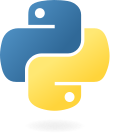
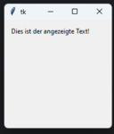
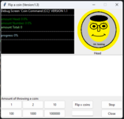

# Python (Programmiersprache)


aus Wikipedia, der freien Enzyklopädie


<table class="float-right infobox toccolours toptextcells"><tbody><tr><th class="hintergrundfarbe6" colspan="2">Python</th></tr><tr><td class="notheme" colspan="2"><span typeof="mw:File"> </span></td></tr><tr><th class="hintergrundfarbe5" colspan="2">Basisdaten</th></tr><tr><td><b>[Paradigmen](https://de.wikipedia.org/wiki/Programmierparadigma):</b></td><td>multiparadigmatisch: [objektorientiert](https://de.wikipedia.org/wiki/Objektorientierte_Programmierung), [prozedural](https://de.wikipedia.org/wiki/Prozedurale_Programmierung) ([imperativ](https://de.wikipedia.org/wiki/Imperative_Programmierung)), [funktional](https://de.wikipedia.org/wiki/Funktionale_Programmierung), [strukturiert](https://de.wikipedia.org/wiki/Strukturierte_Programmierung), [reflektiert](https://de.wikipedia.org/wiki/Reflexion_(Programmierung))</td></tr><tr><td><b>Erscheinungsjahr:</b></td><td><span class="wikidata-content">20. Februar 1991<sup class="reference" id="cite_ref-_83139be75f1555ed_1-0">[[1]](#cite_note-_83139be75f1555ed-1)</sup></span></td></tr><tr><td><b>Designer:</b></td><td><span class="wikidata-content">[Guido van Rossum](https://de.wikipedia.org/wiki/Guido_van_Rossum)<sup class="reference" id="cite_ref-_6a6ea5617189f372_2-0">[[2]](#cite_note-_6a6ea5617189f372-2)</sup></span></td></tr><tr><td><b>Entwickler:</b></td><td><span class="wikidata-content">[Python Software Foundation](https://de.wikipedia.org/wiki/Python_Software_Foundation), [Guido van Rossum](https://de.wikipedia.org/wiki/Guido_van_Rossum)<sup class="reference" id="cite_ref-_83139be75f1555ed_1-1">[[1]](#cite_note-_83139be75f1555ed-1)</sup></span></td></tr><tr><td><b>Aktuelle [Version](https://de.wikipedia.org/wiki/Version_(Software))</b></td><td class="wikidata-content">3.13.2<sup class="reference" id="cite_ref-_5a19109b58bfc509_3-0">[[3]](#cite_note-_5a19109b58bfc509-3)</sup> <small>(4. Februar 2025)</small></td></tr><tr><td><b>[Typisierung](https://de.wikipedia.org/wiki/Typisierung_(Informatik)):</b></td><td>[stark](https://de.wikipedia.org/wiki/Starke_Typisierung), [dynamisch](https://de.wikipedia.org/wiki/Dynamische_Typisierung) („[Duck-Typing](https://de.wikipedia.org/wiki/Duck-Typing)“)</td></tr><tr><td><b>Wichtige [Implementierungen](https://de.wikipedia.org/wiki/Implementierung):</b></td><td>CPython, [Jython](https://de.wikipedia.org/wiki/Jython), [IronPython](https://de.wikipedia.org/wiki/IronPython), [PyPy](https://de.wikipedia.org/wiki/PyPy)</td></tr><tr><td><b>Beeinflusst von:</b></td><td><span class="wikidata-content">[ABC](https://de.wikipedia.org/wiki/ABC_(Programmiersprache))<sup class="reference" id="cite_ref-_f6a2446c4eafdb42_4-0">[[4]](#cite_note-_f6a2446c4eafdb42-4)</sup>, [Algol 68](https://de.wikipedia.org/wiki/Algol_68)<sup class="reference" id="cite_ref-_d78ce4f194f4bab5_5-0">[[5]](#cite_note-_d78ce4f194f4bab5-5)</sup>, [Modula-3](https://de.wikipedia.org/wiki/Modula-3)<sup class="reference" id="cite_ref-_5db25f37ce6820c1_6-0">[[6]](#cite_note-_5db25f37ce6820c1-6)</sup>, [C](https://de.wikipedia.org/wiki/C_(Programmiersprache))<sup class="reference" id="cite_ref-_6da19e7d2132b8e1_7-0">[[7]](#cite_note-_6da19e7d2132b8e1-7)</sup>, [C++](https://de.wikipedia.org/wiki/C%2B%2B)<sup class="reference" id="cite_ref-_5db25f37ce6820c1_6-1">[[6]](#cite_note-_5db25f37ce6820c1-6)</sup>, [Perl](https://de.wikipedia.org/wiki/Perl_(Programmiersprache)), [Java](https://de.wikipedia.org/wiki/Java_(Programmiersprache))<sup class="reference" id="cite_ref-_520bea055a144736_8-0">[[8]](#cite_note-_520bea055a144736-8)</sup>, [Lisp](https://de.wikipedia.org/wiki/Lisp)<sup class="reference" id="cite_ref-_79611fc4be4fe702_9-0">[[9]](#cite_note-_79611fc4be4fe702-9)</sup>, [Haskell](https://de.wikipedia.org/wiki/Haskell_(Programmiersprache))<sup class="reference" id="cite_ref-_edc84ae2b0444b77_10-0">[[10]](#cite_note-_edc84ae2b0444b77-10)</sup>, [APL](https://de.wikipedia.org/wiki/APL_(Programmiersprache))<sup class="reference" id="cite_ref-_c93eab06d10d0117_11-0">[[11]](#cite_note-_c93eab06d10d0117-11)</sup>, [CLU](https://de.wikipedia.org/wiki/CLU_(Programmiersprache)), [Dylan](https://de.wikipedia.org/wiki/Dylan_(Programmiersprache)), ICON, [Standard ML](https://de.wikipedia.org/wiki/Standard_ML)<sup class="reference" id="cite_ref-_c93eab06d10d0117_11-1">[[11]](#cite_note-_c93eab06d10d0117-11)</sup></span></td></tr><tr><td><b>Beeinflusste:</b></td><td>[Ruby](https://de.wikipedia.org/wiki/Ruby_(Programmiersprache)), [Cython](https://de.wikipedia.org/wiki/Cython)</td></tr><tr><td><b>[Betriebssystem](https://de.wikipedia.org/wiki/Betriebssystem):</b></td><td><span class="wikidata-content">[Plattformunabhängig](https://de.wikipedia.org/wiki/Plattformunabh%C3%A4ngigkeit)<sup class="reference" id="cite_ref-_a8542958924b9e3d_12-0">[[12]](#cite_note-_a8542958924b9e3d-12)</sup></span></td></tr><tr><td><b>[Lizenz](https://de.wikipedia.org/wiki/Lizenz):</b></td><td><span class="wikidata-content">Python Software Foundation License<sup class="reference" id="cite_ref-_a0742d213c1fe180_13-0">[[13]](#cite_note-_a0742d213c1fe180-13)</sup></span></td></tr><tr><td class="hintergrundfarbe5" colspan="2">[www.python.org](https://www.python.org/)</td></tr></tbody></table>


Python

 ([
[ˈpʰaɪθn̩](https://de.wikipedia.org/wiki/Liste_der_IPA-Zeichen)


], [
[ˈpʰaɪθɑn](https://de.wikipedia.org/wiki/Liste_der_IPA-Zeichen)


], auf Deutsch auch [
[ˈpʰyːtɔn](https://de.wikipedia.org/wiki/Liste_der_IPA-Zeichen)


]) ist eine 
[universell nutzbare](https://de.wikipedia.org/wiki/Allzweck-Programmiersprache)
, üblicherweise 
[interpretierte](https://de.wikipedia.org/wiki/Interpreter)
, 
[höhere Programmiersprache](https://de.wikipedia.org/wiki/H%C3%B6here_Programmiersprache)
.
[[14]](#cite_note-14)

 Sie hat den Anspruch, einen gut lesbaren, knappen Programmierstil zu fördern.
[[15]](#cite_note-15)

 So werden beispielsweise 
[Blöcke](https://de.wikipedia.org/wiki/Blockstruktur)
 nicht durch geschweifte Klammern, sondern durch Einrückungen strukturiert.


Python unterstützt mehrere 
[Programmierparadigmen](https://de.wikipedia.org/wiki/Programmierparadigma)
, z. B. die 
[objektorientierte](https://de.wikipedia.org/wiki/Objektorientierte_Programmierung)
, die 
[aspektorientierte](https://de.wikipedia.org/wiki/Aspektorientierte_Programmierung)
 und die 
[funktionale](https://de.wikipedia.org/wiki/Funktionale_Programmierung)
 Programmierung. Ferner bietet es eine 
[dynamische Typisierung](https://de.wikipedia.org/wiki/Dynamische_Typisierung)
. Wie viele 
[dynamische Sprachen](https://de.wikipedia.org/wiki/Dynamische_Programmiersprache)
 wird Python oft als 
[Skriptsprache](https://de.wikipedia.org/wiki/Skriptsprache)
 genutzt. Die Sprache weist ein offenes, gemeinschaftsbasiertes Entwicklungsmodell auf, das durch die gemeinnützige 
[Python Software Foundation](https://de.wikipedia.org/wiki/Python_Software_Foundation)
 gestützt wird, die die Definition der Sprache in der Referenzumsetzung 
CPython

 pflegt. 


## Entwicklungsgeschichte


 
[Guido van Rossum](https://de.wikipedia.org/wiki/Guido_van_Rossum)
, der Entwickler von Python


Die Sprache wurde Anfang der 1990er Jahre von 
[Guido van Rossum](https://de.wikipedia.org/wiki/Guido_van_Rossum)
 am 
[Centrum Wiskunde & Informatica](https://de.wikipedia.org/wiki/Centrum_Wiskunde_%26_Informatica)
 in 
[Amsterdam](https://de.wikipedia.org/wiki/Amsterdam)
 als Nachfolger für die Programmier-Lehrsprache 
[ABC](https://de.wikipedia.org/wiki/ABC_(Programmiersprache))

 entwickelt und war ursprünglich für das verteilte 
[Betriebssystem](https://de.wikipedia.org/wiki/Betriebssystem)
 
[Amoeba](https://de.wikipedia.org/wiki/Amoeba_(Betriebssystem))
 gedacht.


Der Name geht nicht, wie das Logo vermuten lässt, auf die gleichnamige Schlangengattung 
[Python](https://de.wikipedia.org/wiki/Pythons)
 zurück, sondern bezog sich ursprünglich auf die englische Komikergruppe 
[Monty Python](https://de.wikipedia.org/wiki/Monty_Python)
. In der Dokumentation finden sich daher auch einige Anspielungen auf Sketche aus dem 
[Flying Circus](https://de.wikipedia.org/wiki/Monty_Python%E2%80%99s_Flying_Circus)
.
[[16]](#cite_note-16)

 Trotzdem etablierte sich die 
[Assoziation](https://de.wikipedia.org/wiki/Assoziation_(Psychologie))
 zur Schlange, was sich unter anderem in der Programmiersprache 
[Cobra](https://de.wikipedia.org/wiki/Cobra_(Programmiersprache))
[[17]](#cite_note-17)

 sowie dem Python-Toolkit „Boa“
[[18]](#cite_note-18)

 äußert.
Die erste Vollversion erschien im Januar 1994 unter der Bezeichnung Python 1.0. Gegenüber früheren Versionen wurden einige Konzepte der funktionalen Programmierung implementiert, die allerdings später wieder aufgegeben wurden.
[[19]](#cite_note-19)

 Von 1995 bis 2000 erschienen neue Versionen, die fortlaufend als Python 1.1, 1.2 etc. bezeichnet wurden.


Python 2.0 erschien am 16. Oktober 2000. Neue Funktionen umfassten eine voll funktionsfähige 
[Garbage Collection](https://de.wikipedia.org/wiki/Garbage_Collection)
 (automatische Speicherbereinigung) und die Unterstützung für den 
[Unicode](https://de.wikipedia.org/wiki/Unicode)
-Zeichensatz.
[[20]](#cite_note-20)


Python 3.0 (auch Python 3000) erschien am 3. Dezember 2008 nach längerer Entwicklungszeit. Es beinhaltete einige tiefgreifende Änderungen an der Sprache, etwa das Entfernen von Redundanzen bei Befehlssätzen und veralteten Konstrukten. Da Python 3.0 hierdurch teilweise inkompatibel zu früheren Versionen wurde,
[[21]](#cite_note-21)

 beschloss die 
Python Software Foundation

, Python 2.7 parallel zu Python 3 bis Ende 2019 weiter mit neuen Versionen zu unterstützen (für Hinweise zur letzten 2er-Version, zum Support-Ende und zur Migration siehe Abschnitt 
[Ende von Python 2](#Ende_von_Python_2)

).


## Versionen


<table class="wikitable sortable"><tbody><tr><th>Version</th><th>Patchversion</th><th>Veröffentlichung</th><th>Ende des vollen Supports</th><th>Ende der Sicherheitskorrekturen</th></tr><tr><td class="vorlageVersion" data-sort-value="0.9" title="Eine ältere und nicht mehr unterstützte Version"><span>Ältere Version; nicht mehr unterstützt:</span> 0.9</td><td>0.9.9<sup class="reference" id="cite_ref-timeline-of-python_22-0">[[22]](#cite_note-timeline-of-python-22)</sup></td><td data-sort-value="20.2.1991">20. Feb. 1991</td><td data-sort-value="29.7.1993">29. Juli 1993</td><td></td></tr><tr><td class="vorlageVersion" data-sort-value="1.0" title="Eine ältere und nicht mehr unterstützte Version"><span>Ältere Version; nicht mehr unterstützt:</span> 1.0</td><td>1.0.4<sup class="reference" id="cite_ref-timeline-of-python_22-1">[[22]](#cite_note-timeline-of-python-22)</sup></td><td data-sort-value="26.1.1994">26. Jan. 1994</td><td data-sort-value="15.2.1994">15. Feb. 1994</td><td></td></tr><tr><td class="vorlageVersion" data-sort-value="1.1" title="Eine ältere und nicht mehr unterstützte Version"><span>Ältere Version; nicht mehr unterstützt:</span> 1.1</td><td>1.1.1<sup class="reference" id="cite_ref-timeline-of-python_22-2">[[22]](#cite_note-timeline-of-python-22)</sup></td><td data-sort-value="11.10.1994">11. Okt. 1994</td><td data-sort-value="10.11.1994">10. Nov. 1994</td><td></td></tr><tr><td class="vorlageVersion" data-sort-value="1.2" title="Eine ältere und nicht mehr unterstützte Version"><span>Ältere Version; nicht mehr unterstützt:</span> 1.2</td><td></td><td data-sort-value="13.4.1995">13. Apr. 1995<sup class="reference" id="cite_ref-timeline-of-python_22-3">[[22]](#cite_note-timeline-of-python-22)</sup></td><td>Unsupported</td><td></td></tr><tr><td class="vorlageVersion" data-sort-value="1.3" title="Eine ältere und nicht mehr unterstützte Version"><span>Ältere Version; nicht mehr unterstützt:</span> 1.3</td><td></td><td data-sort-value="13.10.1995">13. Okt. 1995<sup class="reference" id="cite_ref-timeline-of-python_22-4">[[22]](#cite_note-timeline-of-python-22)</sup></td><td>Unsupported</td><td></td></tr><tr><td class="vorlageVersion" data-sort-value="1.4" title="Eine ältere und nicht mehr unterstützte Version"><span>Ältere Version; nicht mehr unterstützt:</span> 1.4</td><td></td><td data-sort-value="25.10.1996">25. Okt. 1996<sup class="reference" id="cite_ref-timeline-of-python_22-5">[[22]](#cite_note-timeline-of-python-22)</sup></td><td>Unsupported</td><td></td></tr><tr><td class="vorlageVersion" data-sort-value="1.5" title="Eine ältere und nicht mehr unterstützte Version"><span>Ältere Version; nicht mehr unterstützt:</span> 1.5</td><td>1.5.2<sup class="reference" id="cite_ref-releases_23-0">[[23]](#cite_note-releases-23)</sup></td><td data-sort-value="3.1.1998">3. Jan. 1998</td><td data-sort-value="13.4.1999">13. Apr. 1999</td><td></td></tr><tr><td class="vorlageVersion" data-sort-value="1.6" title="Eine ältere und nicht mehr unterstützte Version"><span>Ältere Version; nicht mehr unterstützt:</span> 1.6</td><td>1.6.1<sup class="reference" id="cite_ref-releases_23-1">[[23]](#cite_note-releases-23)</sup></td><td data-sort-value="5.9.2000">5. Sep. 2000<sup class="reference" id="cite_ref-pep-0160_24-0">[[24]](#cite_note-pep-0160-24)</sup></td><td data-sort-value="15.9.2000">Sep. 2000</td><td></td></tr><tr><td class="vorlageVersion" data-sort-value="2.0" title="Eine ältere und nicht mehr unterstützte Version"><span>Ältere Version; nicht mehr unterstützt:</span> 2.0</td><td>2.0.1<sup class="reference" id="cite_ref-downloads_25-0">[[25]](#cite_note-downloads-25)</sup></td><td data-sort-value="16.10.2000">16. Okt. 2000<sup class="reference" id="cite_ref-pep-0200_26-0">[[26]](#cite_note-pep-0200-26)</sup></td><td data-sort-value="22.6.2001">22. Juni 2001</td><td></td></tr><tr><td class="vorlageVersion" data-sort-value="2.1" title="Eine ältere und nicht mehr unterstützte Version"><span>Ältere Version; nicht mehr unterstützt:</span> 2.1</td><td>2.1.3<sup class="reference" id="cite_ref-downloads_25-1">[[25]](#cite_note-downloads-25)</sup></td><td data-sort-value="15.4.2001">15. Apr. 2001<sup class="reference" id="cite_ref-pep-0226_27-0">[[27]](#cite_note-pep-0226-27)</sup></td><td data-sort-value="9.4.2002">9. Apr. 2002</td><td></td></tr><tr><td class="vorlageVersion" data-sort-value="2.2" title="Eine ältere und nicht mehr unterstützte Version"><span>Ältere Version; nicht mehr unterstützt:</span> 2.2</td><td>2.2.3<sup class="reference" id="cite_ref-downloads_25-2">[[25]](#cite_note-downloads-25)</sup></td><td data-sort-value="21.12.2001">21. Dez. 2001<sup class="reference" id="cite_ref-pep-0251_28-0">[[28]](#cite_note-pep-0251-28)</sup></td><td data-sort-value="30.5.2003">30. Mai 2003</td><td></td></tr><tr><td class="vorlageVersion" data-sort-value="2.3" title="Eine ältere und nicht mehr unterstützte Version"><span>Ältere Version; nicht mehr unterstützt:</span> 2.3</td><td>2.3.7<sup class="reference" id="cite_ref-downloads_25-3">[[25]](#cite_note-downloads-25)</sup></td><td data-sort-value="29.6.2003">29. Juni 2003<sup class="reference" id="cite_ref-pep-0283_29-0">[[29]](#cite_note-pep-0283-29)</sup></td><td data-sort-value="11.3.2008">11. März 2008</td><td></td></tr><tr><td class="vorlageVersion" data-sort-value="2.4" title="Eine ältere und nicht mehr unterstützte Version"><span>Ältere Version; nicht mehr unterstützt:</span> 2.4</td><td>2.4.6<sup class="reference" id="cite_ref-downloads_25-4">[[25]](#cite_note-downloads-25)</sup></td><td data-sort-value="30.11.2004">30. Nov. 2004<sup class="reference" id="cite_ref-pep-0320_30-0">[[30]](#cite_note-pep-0320-30)</sup></td><td data-sort-value="19.12.2008">19. Dez. 2008</td><td></td></tr><tr><td class="vorlageVersion" data-sort-value="2.5" title="Eine ältere und nicht mehr unterstützte Version"><span>Ältere Version; nicht mehr unterstützt:</span> 2.5</td><td>2.5.6<sup class="reference" id="cite_ref-downloads_25-5">[[25]](#cite_note-downloads-25)</sup></td><td data-sort-value="19.9.2006">19. Sep. 2006<sup class="reference" id="cite_ref-pep-0356_31-0">[[31]](#cite_note-pep-0356-31)</sup></td><td data-sort-value="26.5.2011">26. Mai 2011</td><td></td></tr><tr><td class="vorlageVersion" data-sort-value="2.6" title="Eine ältere und nicht mehr unterstützte Version"><span>Ältere Version; nicht mehr unterstützt:</span> 2.6</td><td>2.6.9<sup class="reference" id="cite_ref-pep-0361_32-0">[[32]](#cite_note-pep-0361-32)</sup></td><td data-sort-value="1.10.2008">1. Okt. 2008</td><td data-sort-value="24.8.2010">24. Aug. 2010</td><td data-sort-value="29.10.2013">29. Okt. 2013</td></tr><tr><td class="vorlageVersion" data-sort-value="2.7" title="Eine ältere und nicht mehr unterstützte Version"><span>Ältere Version; nicht mehr unterstützt:</span> 2.7</td><td>2.7.18<sup class="reference" id="cite_ref-pep-0373_33-0">[[33]](#cite_note-pep-0373-33)</sup></td><td data-sort-value="3.7.2010">3. Juli 2010</td><td data-sort-value="1.1.2020">1. Jan. 2020</td><td data-sort-value="1.1.2020">1. Jan. 2020</td></tr><tr><td class="vorlageVersion" data-sort-value="3.0" title="Eine ältere und nicht mehr unterstützte Version"><span>Ältere Version; nicht mehr unterstützt:</span> 3.0</td><td>3.0.1<sup class="reference" id="cite_ref-downloads_25-6">[[25]](#cite_note-downloads-25)</sup><sup class="reference" id="cite_ref-pep-0361_32-1">[[32]](#cite_note-pep-0361-32)</sup><sup class="reference" id="cite_ref-devcycle_34-0">[[34]](#cite_note-devcycle-34)</sup></td><td data-sort-value="3.12.2008">3. Dez. 2008</td><td data-sort-value="27.6.2009">27. Juni 2009</td><td data-sort-value="27.6.2009">27. Juni 2009</td></tr><tr><td class="vorlageVersion" data-sort-value="3.1" title="Eine ältere und nicht mehr unterstützte Version"><span>Ältere Version; nicht mehr unterstützt:</span> 3.1</td><td>3.1.5<sup class="reference" id="cite_ref-pep-0375_35-0">[[35]](#cite_note-pep-0375-35)</sup></td><td data-sort-value="27.6.2009">27. Juni 2009</td><td data-sort-value="12.6.2011">12. Juni 2011</td><td data-sort-value="6.4.2012">6. Apr. 2012</td></tr><tr><td class="vorlageVersion" data-sort-value="3.2" title="Eine ältere und nicht mehr unterstützte Version"><span>Ältere Version; nicht mehr unterstützt:</span> 3.2</td><td>3.2.6<sup class="reference" id="cite_ref-pep-0392_36-0">[[36]](#cite_note-pep-0392-36)</sup></td><td data-sort-value="20.2.2011">20. Feb. 2011</td><td data-sort-value="13.5.2013">13. Mai 2013</td><td data-sort-value="20.2.2016">20. Feb. 2016</td></tr><tr><td class="vorlageVersion" data-sort-value="3.3" title="Eine ältere und nicht mehr unterstützte Version"><span>Ältere Version; nicht mehr unterstützt:</span> 3.3</td><td>3.3.7<sup class="reference" id="cite_ref-pep-0398_37-0">[[37]](#cite_note-pep-0398-37)</sup></td><td data-sort-value="29.9.2012">29. Sep. 2012</td><td data-sort-value="8.3.2014">8. März 2014</td><td data-sort-value="29.9.2017">29. Sep. 2017</td></tr><tr><td class="vorlageVersion" data-sort-value="3.4" title="Eine ältere und nicht mehr unterstützte Version"><span>Ältere Version; nicht mehr unterstützt:</span> 3.4</td><td>3.4.10<sup class="reference" id="cite_ref-pep-0429_38-0">[[38]](#cite_note-pep-0429-38)</sup></td><td data-sort-value="16.3.2014">16. März 2014</td><td data-sort-value="9.8.2017">9. Aug. 2017</td><td data-sort-value="18.3.2019">18. März 2019</td></tr><tr><td class="vorlageVersion" data-sort-value="3.5" title="Eine ältere und nicht mehr unterstützte Version"><span>Ältere Version; nicht mehr unterstützt:</span> 3.5</td><td>3.5.10<sup class="reference" id="cite_ref-pep-0478_39-0">[[39]](#cite_note-pep-0478-39)</sup></td><td data-sort-value="13.9.2015">13. Sep. 2015</td><td data-sort-value="8.8.2017">8. Aug. 2017</td><td data-sort-value="30.9.2020">30. Sep. 2020</td></tr><tr><td class="vorlageVersion" data-sort-value="3.6" title="Eine ältere und nicht mehr unterstützte Version"><span>Ältere Version; nicht mehr unterstützt:</span> 3.6</td><td>3.6.15<sup class="reference" id="cite_ref-pep-0494_40-0">[[40]](#cite_note-pep-0494-40)</sup></td><td data-sort-value="23.12.2016">23. Dez. 2016</td><td data-sort-value="24.12.2018">24. Dez. 2018</td><td data-sort-value="23.12.2021">23. Dez. 2021</td></tr><tr><td class="vorlageVersion" data-sort-value="3.7" title="Eine ältere und nicht mehr unterstützte Version"><span>Ältere Version; nicht mehr unterstützt:</span> 3.7</td><td>3.7.17<sup class="reference" id="cite_ref-pep-0537_41-0">[[41]](#cite_note-pep-0537-41)</sup></td><td data-sort-value="27.6.2018">27. Juni 2018</td><td data-sort-value="27.6.2020">27. Juni 2020</td><td data-sort-value="27.6.2023">27. Juni 2023</td></tr><tr><td class="vorlageVersion" data-sort-value="3.8" title="Eine ältere und nicht mehr unterstützte Version"><span>Ältere Version; nicht mehr unterstützt:</span> 3.8</td><td>3.8.20<sup class="reference" id="cite_ref-pep-0569_42-0">[[42]](#cite_note-pep-0569-42)</sup></td><td data-sort-value="14.10.2019">14. Okt. 2019</td><td data-sort-value="3.5.2021">3. Mai 2021</td><td data-sort-value="15.10.2024">Okt. 2024</td></tr><tr><td class="vorlageVersion" data-sort-value="3.9" title="Eine ältere aber noch unterstützte Version"><span>Ältere Version; noch unterstützt:</span> 3.9</td><td>3.9.21<sup class="reference" id="cite_ref-pep-0596_43-0">[[43]](#cite_note-pep-0596-43)</sup></td><td data-sort-value="5.10.2020">5. Okt. 2020</td><td data-sort-value="17.5.2022">17. Mai 2022</td><td data-sort-value="15.10.2025">Okt. 2025</td></tr><tr><td class="vorlageVersion" data-sort-value="3.10" title="Eine ältere aber noch unterstützte Version"><span>Ältere Version; noch unterstützt:</span> 3.10</td><td>3.10.16<sup class="reference" id="cite_ref-pep-0619_44-0">[[44]](#cite_note-pep-0619-44)</sup></td><td data-sort-value="4.10.2021">4. Okt. 2021</td><td data-sort-value="15.5.2023">Mai 2023</td><td data-sort-value="15.10.2026">Okt. 2026</td></tr><tr><td class="vorlageVersion" data-sort-value="3.11" title="Eine ältere aber noch unterstützte Version"><span>Ältere Version; noch unterstützt:</span> 3.11</td><td>3.11.11<sup class="reference" id="cite_ref-pep-0664_45-0">[[45]](#cite_note-pep-0664-45)</sup></td><td data-sort-value="24.10.2022">24. Okt. 2022</td><td data-sort-value="15.5.2024">Mai 2024</td><td data-sort-value="15.10.2027">Okt. 2027</td></tr><tr><td class="vorlageVersion" data-sort-value="3.12" title="Die aktuell stabile Version"><span>Aktuelle Version:</span> <b>3.12</b></td><td>3.12.10<sup class="reference" id="cite_ref-46">[[46]](#cite_note-46)</sup></td><td data-sort-value="2.10.2023">2. Okt. 2023</td><td data-sort-value="15.5.2025">Mai 2025</td><td data-sort-value="15.10.2028">Okt. 2028</td></tr><tr><td class="vorlageVersion" data-sort-value="3.13" title="Die aktuell stabile Version"><span>Aktuelle Version:</span> <b>3.13</b></td><td>3.13.1<sup class="reference" id="cite_ref-47">[[47]](#cite_note-47)</sup></td><td data-sort-value="1.10.2024">1. Okt. 2024</td><td data-sort-value="15.10.2026">Okt. 2026</td><td data-sort-value="15.10.2029">Okt. 2029</td></tr><tr><td class="vorlageVersion" data-sort-value="3.14" title="Eine zukünftige Version"><span>Zukünftige Version:</span> 3.14</td><td><sup class="reference" id="cite_ref-48">[[48]](#cite_note-48)</sup></td><td data-sort-value="15.10.2025">Okt. 2025</td><td data-sort-value="15.10.2027">Okt. 2027</td><td data-sort-value="15.10.2030">Okt. 2030</td></tr></tbody></table>


<table class="vorlageVersion wikitable"><tbody><tr><th class="hintergrundfarbe5">Legende:</th><td title="Eine ältere und nicht mehr unterstützte Version">Ältere Version; nicht mehr unterstützt</td><td title="Eine ältere aber noch unterstützte Version">Ältere Version; noch unterstützt</td><td title="Die aktuell stabile Version"><b>Aktuelle Version</b></td><td title="Die aktuelle Vorabversion einer zukünftigen Version">Aktuelle Vorabversion</td><td title="Eine zukünftige Version">Zukünftige Version</td></tr></tbody></table>


## Ziele


Python wurde mit dem Ziel größter Einfachheit und Übersichtlichkeit entworfen. Dies wird vor allem durch zwei Maßnahmen erreicht. Zum einen kommt die Sprache mit relativ wenigen 
[Schlüsselwörtern](https://de.wikipedia.org/wiki/Schl%C3%BCsselwort_(Programmierung))
 aus.
[[49]](#cite_note-49)

 Zum anderen ist die Syntax reduziert und auf Übersichtlichkeit optimiert. Dadurch lassen sich Python-basierte Skripte deutlich knapper formulieren als in anderen Sprachen.
[[50]](#cite_note-50)


Van Rossum legte bei der Entwicklung großen Wert auf eine Standardbibliothek, die überschaubar und leicht erweiterbar ist. Dies war Ergebnis seiner schlechten Erfahrung mit der Sprache 
[ABC](https://de.wikipedia.org/wiki/ABC_(Programmiersprache))
, in der das Gegenteil der Fall ist.
[[51]](#cite_note-51)

 Dieses Konzept ermöglicht, in Python Module aufzurufen, die in anderen Programmiersprachen geschrieben wurden, etwa um Schwächen von Python auszugleichen. Beispielsweise können für zeitkritische Teile in maschinennäheren Sprachen wie 
[C](https://de.wikipedia.org/wiki/C_(Programmiersprache))
 implementierte Routinen aufgerufen werden.
[[52]](#cite_note-52)

 Umgekehrt lassen sich mit Python Module und 
[Plug-ins](https://de.wikipedia.org/wiki/Plug-in)
 für andere Programme schreiben, die die entsprechende Unterstützung bieten. Dies ist unter anderem bei 
[Blender](https://de.wikipedia.org/wiki/Blender_(Software))
, 
[Cinema 4D](https://de.wikipedia.org/wiki/Cinema_4D)
, 
[GIMP](https://de.wikipedia.org/wiki/GIMP)
, 
[Maya](https://de.wikipedia.org/wiki/Maya_(Software))
, 
[Nuke](https://de.wikipedia.org/wiki/Nuke_(Software))
, 
[OpenOffice](https://de.wikipedia.org/wiki/Apache_OpenOffice)
 bzw. 
[LibreOffice](https://de.wikipedia.org/wiki/LibreOffice)
, 
[PyMOL](https://de.wikipedia.org/wiki/PyMOL)
, 
[SPSS](https://de.wikipedia.org/wiki/SPSS)
, 
[QGIS](https://de.wikipedia.org/wiki/QGIS)
 oder 
[KiCad](https://de.wikipedia.org/wiki/KiCad)
 der Fall.


Python ist eine Multi
[paradigmen](https://de.wikipedia.org/wiki/Programmierparadigma)
sprache. Das bedeutet, Python zwingt den Programmierer nicht zu einem einzigen Programmierstil, sondern erlaubt, das für die jeweilige Aufgabe am besten geeignete Paradigma zu wählen. Objektorientierte und 
[strukturierte](https://de.wikipedia.org/wiki/Strukturierte_Programmierung)
 Programmierung werden vollständig unterstützt, funktionale und aspektorientierte Programmierung werden durch einzelne Elemente der Sprache unterstützt.
Die Freigabe nicht mehr benutzter Speicherbereiche erfolgt durch 
[Referenzzählung](https://de.wikipedia.org/wiki/Referenzz%C3%A4hlung)
.

[Datentypen](https://de.wikipedia.org/wiki/Datentyp)
 werden dynamisch verwaltet, eine automatische statische 
[Typprüfung](https://de.wikipedia.org/wiki/Typsicherheit)
 wie z. B. bei 
[C++](https://de.wikipedia.org/wiki/C%2B%2B)
 gibt es nicht. Jedoch unterstützt Python ab Version 3.5 optionale Typ-Annotationen, um eine statische Typprüfung mithilfe externer Software, wie zum Beispiel Mypy, zu vereinfachen.
[[53]](#cite_note-53)

[[54]](#cite_note-54)


## Datentypen und Strukturen


 
Datentypen und Strukturen


Python besitzt eine größere Anzahl von grundlegenden Datentypen. Neben der herkömmlichen 
[Arithmetik](https://de.wikipedia.org/wiki/Arithmetik)
 unterstützt es transparent auch beliebig große Ganzzahlen und 
[komplexe Zahlen](https://de.wikipedia.org/wiki/Komplexe_Zahl)
.


Die üblichen Zeichenkettenoperationen werden unterstützt. 
[Zeichenketten](https://de.wikipedia.org/wiki/Zeichenkette)
 sind in Python allerdings unveränderliche Objekte (wie auch in 
[Java](https://de.wikipedia.org/wiki/Java_(Programmiersprache))
). Daher geben Operationen, die eine Zeichenkette verändern sollen – wie z. B. durch Ersetzen von Zeichen – immer eine neue Zeichenkette zurück.


In Python ist alles ein Objekt: Klassen, Typen, Methoden, Module etc. Der Datentyp ist jeweils an das Objekt (den 
Wert

) gebunden und nicht an eine Variable, d. h. Datentypen werden dynamisch vergeben, so wie bei 
[Smalltalk](https://de.wikipedia.org/wiki/Smalltalk_(Programmiersprache))
 oder 
[Lisp](https://de.wikipedia.org/wiki/Lisp)
 – und nicht wie bei Java.


Trotz der dynamischen Typverwaltung enthält Python eine gewisse Typprüfung. Diese ist strenger als bei 
[Perl](https://de.wikipedia.org/wiki/Perl_(Programmiersprache))
, aber weniger strikt als etwa bei 
[Objective CAML](https://de.wikipedia.org/wiki/Objective_CAML)
.
Implizite Umwandlungen nach dem 
[Duck-Typing](https://de.wikipedia.org/wiki/Duck-Typing)
-Prinzip sind unter anderem für numerische Typen definiert, sodass man beispielsweise eine komplexe Zahl mit einer langen Ganzzahl ohne explizite Typumwandlung multiplizieren kann.


Mit dem Format-Operator 
%

 gibt es eine implizite Umwandlung eines Objekts in eine Zeichenkette. Der Operator 
==

 überprüft zwei Objekte auf (Wert-)Gleichheit. Der Operator 
is

 überprüft die tatsächliche 
[Identität](https://de.wikipedia.org/wiki/Identit%C3%A4t_(Logik))
 zweier Objekte.
[[55]](#cite_note-55)


### Sammeltypen


Python besitzt mehrere 
Sammeltypen

, darunter Listen, 
[Tupel](https://de.wikipedia.org/wiki/Tupel_(Informatik))
, 
[Mengen](https://de.wikipedia.org/wiki/Menge_(Datenstruktur))
 (Sets) und 
[assoziative Arrays](https://de.wikipedia.org/wiki/Assoziatives_Datenfeld)
 (Dictionaries). Listen, Tupel und Zeichenketten sind 
Folgen

 (Sequenzen, 
[Felder](https://de.wikipedia.org/wiki/Feld_(Datentyp))
) und kennen fast alle die gleichen Methoden: Über die Zeichen einer Kette kann man ebenso 
[iterieren](https://de.wikipedia.org/wiki/Iteration)
 wie über die Elemente einer Liste. Außerdem gibt es die unveränderlichen Objekte, die nach ihrer Erzeugung nicht mehr geändert werden können. Listen sind z. B. erweiterbare Felder, wohingegen Tupel und Zeichenketten eine feste Länge haben und unveränderlich sind.


Der Zweck solcher Unveränderlichkeit hängt z. B. mit den 
Dictionaries

 zusammen, einem Datentyp, der auch als 
assoziatives Array

 bezeichnet wird. Um die Datenkonsistenz zu sichern, müssen die 
Schlüssel

 eines 
Dictionary

 vom Typ „unveränderlich“ sein. Die ins 
Dictionary

 eingetragenen 
Werte

 können dagegen von beliebigem Typ sein.


Sets

 sind Mengen von Objekten und in CPython ab Version 2.4 im Standardsprachumfang enthalten. Diese Datenstruktur kann beliebige (paarweise unterschiedliche) Objekte aufnehmen und stellt Mengenoperationen wie beispielsweise 
[Durchschnitt](https://de.wikipedia.org/wiki/Menge_(Mathematik)#Durchschnitt_(Schnittmenge,_Schnitt))
, 
[Differenz](https://de.wikipedia.org/wiki/Mengenlehre#Differenz_und_Komplement)
 und 
[Vereinigung](https://de.wikipedia.org/wiki/Menge_(Mathematik)#Vereinigung_(Vereinigungsmenge))
 zur Verfügung.


### Objektsystem


Das 
[Typsystem](https://de.wikipedia.org/wiki/Typsystem)
 von Python ist auf das Klassensystem abgestimmt. Obwohl die eingebauten Datentypen genau genommen keine 
[Klassen](https://de.wikipedia.org/wiki/Klasse_(Objektorientierung))
 sind, können Klassen von einem Typ 
[erben](https://de.wikipedia.org/wiki/Vererbung_(Programmierung))
. So kann man die Eigenschaften von Zeichenketten oder Wörterbüchern erweitern – auch von Ganzzahlen. Python unterstützt 
[Mehrfachvererbung](https://de.wikipedia.org/wiki/Mehrfachvererbung)
.


Die Sprache unterstützt direkt den Umgang mit Typen und Klassen. Typen können ausgelesen (ermittelt) und verglichen werden und verhalten sich wie Objekte – tatsächlich sind die Typen (wie in Smalltalk) selbst ein Objekt. Die Attribute eines Objektes können als Wörterbuch extrahiert werden.


## Syntax


Eines der Entwurfsziele für Python war die gute Lesbarkeit des Quellcodes. Die Anweisungen benutzen häufig englische Schlüsselwörter, wo andere Sprachen Symbole einsetzen (z. B. 
or

 statt 
||

). Für 
[strukturierte Programmierung](https://de.wikipedia.org/wiki/Strukturierte_Programmierung)
 besitzt Python die folgenden Elemente:


* Schleifen (wiederholte Ausführung):
  * for…elsezur Iteration über die Elemente einer Sequenz
  * while…elsezur Wiederholung, solange ein Ausdruck den Boolean-WertTruehat

* Verzweigungen (bedingte Ausführung):
  * if…elif…elsefür bedingte Verzweigungen
  * match…case…iffür strukturiertes[Pattern Matching](https://de.wikipedia.org/wiki/Pattern_Matching#Programmierung)

* Exceptions (Ausführung im Fehlerfall):
  * try…except…else…finallyfür Ausnahmebehandlungen
  * withzum Ausführen eines Blocks mit einem Kontext-Manager


Im Gegensatz zu vielen anderen Sprachen können 
for

- und 
while

-Schleifen einen 
else

-Zweig haben. Dieser wird nur ausgeführt, wenn die Schleife vollständig durchlaufen und nicht mittels 
break

, 
return

 oder einer Ausnahme abgebrochen wurde.


Strukturierung durch Einrücken


Python benutzt wie 
[Miranda](https://de.wikipedia.org/wiki/Miranda_(Programmiersprache))
 und 
[Haskell](https://de.wikipedia.org/wiki/Haskell_(Programmiersprache))
 
[Einrückungen](https://de.wikipedia.org/wiki/Einr%C3%BCckungsstil)
 als Strukturierungselement. Diese Idee wurde erstmals von 
[Peter J. Landin](https://de.wikipedia.org/wiki/Peter_J._Landin)
 vorgeschlagen und von ihm 
off-side rule

 („Abseitsregel“) genannt. In den meisten anderen Programmiersprachen werden Blöcke durch Klammern oder Schlüsselwörter markiert, während unterschiedlich große 
[Leerräume](https://de.wikipedia.org/wiki/Leerraum)
 außerhalb von Zeichenketten keine spezielle Semantik tragen. Laut van Rossum verhindert Einrückung als Teil der Sprachsyntax Missverständnisse des Programmierers, spart Raum im Vergleich zu Einrückungskonventionen, die Klammern in eine eigene Zeile setzen und setzt 
[Stil](https://de.wikipedia.org/wiki/Einr%C3%BCckungsstil)
-Diskussionen ein Ende.
[[56]](#cite_note-56)


Hierzu als Beispiel die Berechnung der 
[Fakultät](https://de.wikipedia.org/wiki/Fakult%C3%A4t_(Mathematik))
 einer Ganzzahl, einmal in 
[C](https://de.wikipedia.org/wiki/C_(Programmiersprache))
 und einmal in Python:


Fakultätsfunktion in C:


```c
int factorial(int x) {
    if (x <= 1) {
        return 1;
    }

    return x * factorial(x - 1);
}
```


Die gleiche Funktion in Python:


```python
def factorial(x):
    if x <= 1:
        return 1

    return x * factorial(x - 1)
```


Es ist jedoch darauf zu achten, die Einrückungen im gesamten Programmtext gleich zu gestalten. Die gemischte Verwendung von Leerzeichen und 
[Tabulatorzeichen](https://de.wikipedia.org/wiki/Tabulatorzeichen)
 kann zu Problemen führen, da der Python-Interpreter Tabulatoren im Abstand von acht Leerzeichen annimmt. Je nach Konfiguration des Editors können Tabulatoren optisch mit weniger als acht Leerzeichen dargestellt werden, was zu Syntaxfehlern oder ungewollter Programmstrukturierung führen kann. Als vorbeugende Maßnahme kann man den Editor Tabulatorzeichen durch eine feste Anzahl von Leerzeichen ersetzen lassen. Die Python-Distribution enthält in der Standardbibliothek das Modul 
tabnanny

, welches die Vermischung von Tabulator- und Leerzeichen zu erkennen und beheben hilft.


Man kann die Fakultätsfunktion aber auch wie in C einzeilig mit 
[ternärem Operator](https://de.wikipedia.org/wiki/Tern%C3%A4rer_Operator)
 formulieren:


Die Fakultätsfunktion in C:

```c
int factorial(int x) {
    return x <= 1 ? 1 : x * factorial(x - 1);
}
```


Die Fakultätsfunktion in Python:

````python
def factorial(x):
    return 1 if x <= 1 else x * factorial(x - 1)
````


### Funktionales Programmieren


Coconut
[[57]](#cite_note-57)

 und andere Erweiterungen erleichtern das funktionale Programmieren in Python. Darüber hinaus lässt sich dies auch mit dem herkömmlichen Python realisieren:


Ausdrucksstarke syntaktische Elemente zur funktionalen Programmierung vereinfachen das Arbeiten mit Listen und anderen Sammeltypen. Eine solche Vereinfachung ist die Listennotation, die aus der funktionalen Programmiersprache Haskell stammt; hier bei der Berechnung der ersten fünf Zweierpotenzen:


```python
zahlen = [1, 2, 3, 4, 5]
zweierpotenzen = [2 ** n for n in zahlen]
```


Weil in Python Funktionen als Argumente auftreten dürfen, kann man auch ausgeklügeltere Konstruktionen ausdrücken, wie den 
[Continuation-Passing Style](https://de.wikipedia.org/wiki/Continuation-Passing_Style)
.


Pythons Schlüsselwort 
lambda

 könnte manche Anhänger der funktionalen Programmierung fehlleiten. Solche 
lambda

-Blöcke in Python können nur Ausdrücke enthalten, aber keine Anweisungen. Damit werden solche Anweisungen generell nicht verwendet, um eine Funktion zurückzugeben. Die übliche Vorgehensweise ist stattdessen, den Namen einer lokalen Funktion zurückzugeben. Das folgende Beispiel zeigt dies anhand einer einfachen Funktion nach den Ideen von 
[Haskell Brooks Curry](https://de.wikipedia.org/wiki/Haskell_Brooks_Curry)
:


```python
def add_and_print_maker(x):
    def temp(y):
        print(f'{x} + {y} = {x + y}')

    return temp
```


Damit ist auch 
[Currying](https://de.wikipedia.org/wiki/Currying)
 auf einfache Art möglich, um generische Funktionsobjekte auf problemspezifische herunterzubrechen. Hier ein einfaches Beispiel:


```python
def curry(func, known_argument):
    return lambda unknown_argument: func(unknown_argument, known_argument)
```


Wird die 
curry

-Funktion aufgerufen, erwartet diese eine Funktion mit zwei notwendigen Parametern sowie die Parameterbelegung für den zweiten Parameter dieser Funktion. Der Rückgabewert von 
curry

 ist eine Funktion, die das Gleiche tut wie 
func

, aber nur noch einen Parameter benötigt.


[Closures](https://de.wikipedia.org/wiki/Closure_(Funktion))
 sind mit den o. g. Mechanismen in Python ebenfalls einfach möglich. Ein simples Beispiel für einen 
[Stack](https://de.wikipedia.org/wiki/Stapelspeicher)
, intern durch eine Liste repräsentiert:


```python
def stack():
    l = []

    def pop():
        if not is_empty():
            return l.pop()

    def push(element):
        l.append(element)

    def is_empty():
        return len(l) == 0

    return pop, push, is_empty

pop, push, is_empty = stack()
```


Auf diese Weise erhält man die drei Funktionsobjekte 
pop

, 
push

, 
is_empty

, um den Stack zu modifizieren bzw. auf enthaltene Elemente zu prüfen, ohne dabei auf 
l

 direkt zuzugreifen.


### Ausnahmebehandlung


Python nutzt ausgiebig die 
[Ausnahmebehandlung](https://de.wikipedia.org/wiki/Ausnahmebehandlung)
 (englisch 
exception handling

) als ein Mittel, um Fehlerbedingungen zu testen. Dies ist so weit in Python integriert, dass es teilweise sogar möglich ist, 
[Syntaxfehler](https://de.wikipedia.org/wiki/Syntaxfehler)
 abzufangen und zur Laufzeit zu behandeln.


Ausnahmen haben einige Vorteile gegenüber anderen beim Programmieren üblichen Verfahren der Fehlerbehandlung (wie z. B. Fehler-Rückgabewerte und globale Statusvariablen). Sie sind 
[Thread](https://de.wikipedia.org/wiki/Thread_(Informatik))
-sicher und können leicht bis in die höchste Programmebene weitergegeben oder an einer beliebigen anderen Ebene der Funktionsaufruffolge behandelt werden. Der korrekte Einsatz von Ausnahmebehandlungen beim Zugriff auf dynamische Ressourcen erleichtert es zudem, bestimmte auf 
[Race Conditions](https://de.wikipedia.org/wiki/Race_Condition)
 basierende Sicherheitslücken zu vermeiden, die entstehen können, wenn Zugriffe auf bereits veralteten Statusabfragen basieren.


Der Python-Ansatz legt den Einsatz von Ausnahmen nahe, wann immer eine Fehlerbedingung entstehen könnte. Nützlich ist dieses Prinzip beispielsweise bei der Konstruktion robuster Eingabeaufforderungen:


```python
while True:
    num = input("Eine ganze Zahl eingeben: ")

    try:
        num = int(num)
    except ValueError:
        print("Eine _Zahl_, bitte!")
    else:
        break
```


Dieses Programmstück fragt den Benutzer so lange nach einer Zahl, bis dieser eine Zeichenfolge eingibt, die sich per 
int()

 in eine Ganzzahl konvertieren lässt. Durch die Ausnahmebehandlung wird hier vermieden, dass eine Fehleingabe zu einem 
[Laufzeitfehler](https://de.wikipedia.org/wiki/Laufzeitfehler)
 führt, der das Programm zum Abbruch zwingt.


Ebenso kann auch das hier nicht berücksichtigte 
[Interrupt](https://de.wikipedia.org/wiki/Interrupt)
-Signal (
SIGINT

, häufig Strg+C) mittels Ausnahmebehandlung in Python abgefangen und behandelt werden (
except KeyboardInterrupt: …

).


## Standardbibliothek


Die mächtige 
[Standardbibliothek](https://de.wikipedia.org/wiki/Standardbibliothek)
 ist eine der größten Stärken von Python, wodurch es sich für viele Anwendungen eignet. Der überwiegende Teil davon ist plattformunabhängig, so dass auch größere Python-Programme oft auf 
[Unix](https://de.wikipedia.org/wiki/Unix)
, 
[Windows](https://de.wikipedia.org/wiki/Microsoft_Windows)
, 
[macOS](https://de.wikipedia.org/wiki/MacOS)
 und anderen Plattformen ohne Änderung laufen. Die Module der Standardbibliothek können mit in C oder Python selbst geschriebenen Modulen ergänzt werden.


Die Standardbibliothek ist besonders auf Internetanwendungen zugeschnitten, mit der Unterstützung einer großen Anzahl von Standardformaten und -protokollen (wie 
[MIME](https://de.wikipedia.org/wiki/Multipurpose_Internet_Mail_Extensions)
 und 
[HTTP](https://de.wikipedia.org/wiki/Hypertext_Transfer_Protocol)
). Module zur Schaffung grafischer Benutzeroberflächen, zur Verbindung mit 
[relationalen Datenbanken](https://de.wikipedia.org/wiki/Relationale_Datenbank)
 und zur Manipulation 
[regulärer Ausdrücke](https://de.wikipedia.org/wiki/Regul%C3%A4rer_Ausdruck)
 sind ebenfalls enthalten.


Grafische Benutzeroberflächen (GUI)


Mit Hilfe des mitgelieferten Moduls 
[Tkinter](https://de.wikipedia.org/wiki/Tkinter)
 kann in Python (wie in Perl und 
[Tcl](https://de.wikipedia.org/wiki/Tcl)
) schnell eine 
[grafische Benutzeroberfläche](https://de.wikipedia.org/wiki/Grafische_Benutzeroberfl%C3%A4che)
 (GUI) mit 
[Tk](https://de.wikipedia.org/wiki/Tk_(Toolkit))
 erzeugt werden. Es gibt darüber hinaus eine Vielzahl von weiteren 
[Wrappern](https://de.wikipedia.org/wiki/Wrapper_(Software))
 von anderen Anbietern. Sie stellen Anbindungen (
[englisch](https://de.wikipedia.org/wiki/Englische_Sprache)

 
language bindings

) zu 
[GUI-Toolkits](https://de.wikipedia.org/wiki/GUI-Toolkit)
 wie z. B. 
[PyGTK](https://de.wikipedia.org/wiki/PyGTK)
, 
[PyQt](https://de.wikipedia.org/wiki/PyQt)
, 
[wxPython](https://de.wikipedia.org/wiki/WxPython)
, 
[PyObjC](https://de.wikipedia.org/wiki/PyObjC)
 und Py
[FLTK](https://de.wikipedia.org/wiki/Fast_Light_Toolkit)
 zur Verfügung.


Neben Tkinter wird auch ein Modul zum Zeichnen von 
[Turtle-Grafiken](https://de.wikipedia.org/wiki/Turtle-Grafik)
 mitgeliefert.


### Beispiel zum Tkinter-Modul


→ 

Hauptartikel

: 
[Tkinter](https://de.wikipedia.org/wiki/Tkinter)


 
Beispiel für ein einfaches Tkinter-Fenster

```python
from tkinter import *

fenster = Tk()
fenster.geometry("200x100")
label = Label(fenster, text="Hallo Welt!")
label.pack()

def befehl():
    fenster.destroy()

button = Button(fenster, text="OK", command=befehl)
button.pack()
fenster.mainloop()
```


#### Weitere Beispiele


*  Text-Widget
*  Label-Widget
*  Der Cäsar-Verschlüsseler (v1.1)
*  Flip a coin (v1.3)


### Beispiel zum Turtle-Grafik-Modul


 
Ergebnis des angegebenen Quellcodes


```python
import turtle
from turtle import speed, reset, goto

reset()
speed(0)
turtle.x = -200
turtle.y = 200

while turtle.y != -200:
    goto(turtle.x, turtle.y)
    turtle.x = - turtle.x
    turtle.y = - turtle.y
    goto(turtle.x, turtle.y)
    goto(0, 0)
    turtle.y = - turtle.y
    turtle.x = - turtle.x
    turtle.y -= 5
```


#### Weitere Grafiken


*  Bunter Kreis
*  Stern
*  Die Turtle zeichnet ein Quadrat


## Beispiel


Als nicht triviales Beispiel sei hier der kompakte Sortieralgorithmus 
[Quicksort](https://de.wikipedia.org/wiki/Quicksort)
 angegeben:


```python
def quicksort(liste):
    if len(liste) <= 1:
        return liste

    pivotelement = liste.pop()
    links  = [element for element in liste if element < pivotelement]
    rechts = [element for element in liste if element >= pivotelement]

    return quicksort(links) + [pivotelement] + quicksort(rechts)
```


Hier ermöglicht insbesondere die Listennotation für die Variablen 
links

 und 
rechts

 eine kompakte Darstellung. Zum Vergleich eine iterative Formulierung dieser zwei Zeilen:


```python
...
    links, rechts = [], []          # leere Listen für links und rechts anlegen
    pivotelement = liste.pop()      # das letzte Element aus der Liste nehmen als Referenz

    for element in liste:           # die restlichen Elemente der Liste durchlaufen ...
        if element < pivotelement:  # ... und mit dem Pivot-Element vergleichen
            links.append(element)   # wenn kleiner, dann an linke Liste anhängen
        else:
            rechts.append(element)  # ansonsten, wenn nicht kleiner, dann an rechte Liste anhängen
...
```


Dies ist nur ein Beispiel für die gesparte Schreibarbeit durch die Listennotation. Tatsächlich ist in diesem Fall die iterative Formulierung die schnellere, da pro Durchgang nur einmal über das Feld „liste“ iteriert wird und nicht zweimal wie in der Listennotation.


## Interaktive Benutzung


So wie 
[Lisp](https://de.wikipedia.org/wiki/Lisp)
, 
[Ruby](https://de.wikipedia.org/wiki/Ruby_(Programmiersprache))
, 
[Groovy](https://de.wikipedia.org/wiki/Groovy)
 und 
[Perl](https://de.wikipedia.org/wiki/Perl_(Programmiersprache))
 unterstützt der Python-Interpreter auch einen 
interaktiven Modus

, in dem Ausdrücke am Terminal eingegeben und die Ergebnisse sofort betrachtet werden können. Das ist nicht nur für Neulinge angenehm, die die Sprache lernen, sondern auch für erfahrene Programmierer: Code-Stückchen können interaktiv ausgiebig getestet werden, bevor man sie in ein geeignetes Programm aufnimmt.


Darüber hinaus steht mit Python Shell ein 
[Kommandozeileninterpreter](https://de.wikipedia.org/wiki/Kommandozeileninterpreter)
 für verschiedene 
[unixoide](https://de.wikipedia.org/wiki/Unixoid)
 
[Computer-Betriebssysteme](https://de.wikipedia.org/wiki/Betriebssystem)
 zur Verfügung, der neben klassischen Unix-
[Shellkommandos](https://de.wikipedia.org/wiki/Kommandozeile)
 auch direkte Eingaben in Python-Form verarbeiten kann. 
[IPython](https://de.wikipedia.org/wiki/IPython)
 ist eine populäre interaktive Python-Shell mit stark erweiterter Funktionalität.


Implementierungen


Interpreter


CPython ist die 
offizielle

 oder 
Referenzimplementierung

 der Programmiersprache Python und deren 
[Interpreter](https://de.wikipedia.org/wiki/Interpreter)
.


Daneben gibt es einen in 
[Java](https://de.wikipedia.org/wiki/Java_(Programmiersprache))
 implementierten Python-Interpreter namens 
[Jython](https://de.wikipedia.org/wiki/Jython)
, mit dem die Bibliothek der 
[Java-Laufzeitumgebung](https://de.wikipedia.org/wiki/Java-Laufzeitumgebung)
 für Python verfügbar gemacht wird.


Compiler


Außer den oben genannten Interpretern existieren 
[Compiler](https://de.wikipedia.org/wiki/Compiler)
, die Python-Code in eine andere Programmiersprache übersetzen.


Mit 
[Cython](https://de.wikipedia.org/wiki/Cython)
 kann Python-Code in effiziente C-Erweiterungen übersetzt oder externer C++- oder C-Code angebunden werden.


Ebenso existiert der Compiler 
[IronPython](https://de.wikipedia.org/wiki/IronPython)
 für die 
[.Net-Framework](https://de.wikipedia.org/wiki/.Net-Framework)
- bzw. 
[Mono](https://de.wikipedia.org/wiki/Mono_(Software))
-Plattform.


Um Python als Skriptsprache für Programme in 
[C++](https://de.wikipedia.org/wiki/C%2B%2B)
 zu nutzen, werden zumeist die 
[Boost](https://de.wikipedia.org/wiki/Boost_(C%2B%2B-Bibliothek))
-Python-Bibliothek oder (in neueren Projekten) Cython verwendet.


Ein Python-
[Parser](https://de.wikipedia.org/wiki/Parser)
 für 
[Parrot](https://de.wikipedia.org/wiki/Parrot)
 und ein in Python geschriebener 
[Just-in-time-Compiler](https://de.wikipedia.org/wiki/Just-in-time-Kompilierung)
 für Python, 
[PyPy](https://de.wikipedia.org/wiki/PyPy)
, welcher von der EU gefördert wurde, sind ebenfalls in Entwicklung.


Auch die Python-Variante 
Pyston

 verwendet Just-in-time-Compilierung und beschleunigt so die Ausführung von Python-Programmen.
[[58]](#cite_note-58)


Außerdem existiert ein Python-Interpreter für 
[Mikrocontroller](https://de.wikipedia.org/wiki/Mikrocontroller)
 namens 
[MicroPython](https://de.wikipedia.org/wiki/MicroPython)
.
[[59]](#cite_note-59)


## Entwicklungsumgebung


Neben 
[IDLE](https://de.wikipedia.org/wiki/IDLE)
, das oft mit Python installiert wird und hauptsächlich aus einer Textumgebung und einer 
[Shell](https://de.wikipedia.org/wiki/Shell_(Betriebssystem))
 besteht, wurden auch einige vollwertige 
[Entwicklungsumgebungen](https://de.wikipedia.org/wiki/Integrierte_Entwicklungsumgebung)
 (IDEs) für Python entwickelt, beispielsweise 
[Eric Python IDE](https://de.wikipedia.org/wiki/Eric_Python_IDE)
, 
[Spyder](https://de.wikipedia.org/wiki/Spyder_(Software))
 oder 
[PyCharm](https://de.wikipedia.org/wiki/PyCharm)
. Weiterhin gibt es 
[Plug-ins](https://de.wikipedia.org/wiki/Plug-in)
 für größere IDEs wie 
[Eclipse](https://de.wikipedia.org/wiki/Eclipse_(IDE))
, 
[Visual Studio](https://de.wikipedia.org/wiki/Visual_Studio)
, 
[IntelliJ IDEA](https://de.wikipedia.org/wiki/IntelliJ_IDEA)
[[60]](#cite_note-60)

 und 
[NetBeans](https://de.wikipedia.org/wiki/NetBeans_IDE)
. Texteditoren für Programmierer wie 
[Vim](https://de.wikipedia.org/wiki/Vim)
 und 
[Emacs](https://de.wikipedia.org/wiki/Emacs)
 lassen sich auch für Python anpassen: Ein einfacher Python-Mode ist bereits integriert, und komfortablere Erweiterungen können hinzugefügt werden.


Für die verschiedenen 
[GUI-Toolkits](https://de.wikipedia.org/wiki/GUI-Toolkit)
, wie z. B. 
[Tkinter](https://de.wikipedia.org/wiki/Tkinter)
 (
[GUI-Builder](https://de.wikipedia.org/wiki/GUI-Builder)
), 
[WxPython](https://de.wikipedia.org/wiki/WxPython)
 (wxGlade), 
[PyQt](https://de.wikipedia.org/wiki/PyQt)
 (
[Qt Designer](https://de.wikipedia.org/wiki/Qt_Designer)
), PySide, 
[PyGTK](https://de.wikipedia.org/wiki/PyGTK)
 (
[Glade](https://de.wikipedia.org/wiki/Glade_(Programmierwerkzeug))
), 
[Kivy](https://de.wikipedia.org/wiki/Kivy)
 oder 
[PyFLTK](https://de.wikipedia.org/wiki/PyFLTK)
 gibt es teils eigene Editoren, mit denen sich grafische Benutzeroberflächen auf vergleichsweise einfache Art aufbauen lassen.


## Paketverwaltung


Python unterstützt die Erstellung von Paketen; dabei helfen 
distutils

 und 
setuptools

. Die Pakete werden auf PyPI, dem Python Package Index, gespeichert und von dort zur Installation abgerufen. Als Paketmanager wird üblicherweise 
[pip](https://de.wikipedia.org/wiki/Pip_(Python))
 oder auf alten Systemen auch 
easy_install

 eingesetzt. Paketversionen der 
[Anaconda (Python-Distribution)](https://de.wikipedia.org/wiki/Anaconda_(Python-Distribution))
 werden von der 
[Paketverwaltung](https://de.wikipedia.org/wiki/Paketverwaltung)
 
[conda](https://de.wikipedia.org/wiki/Conda_(Paketverwaltung))

 verwaltet.
[[61]](#cite_note-61)


## Verbreitung und Einsatz


Python ist für die meisten gängigen Betriebssysteme frei erhältlich und bei den meisten Linux-Distributionen im Standardumfang enthalten. Um Python in Webserver einzubinden, wird Webserver-umgreifend 
[WSGI](https://de.wikipedia.org/wiki/Web_Server_Gateway_Interface)
 verwendet, welches die Nachteile von 
[CGI](https://de.wikipedia.org/wiki/Common_Gateway_Interface)
 umgeht. WSGI stellt eine universelle Schnittstelle zwischen Webserver und Python(-Framework) zur Verfügung.


Eine Reihe von Web-Application-
[Frameworks](https://de.wikipedia.org/wiki/Framework)
 nutzt Python, darunter 
[Django](https://de.wikipedia.org/wiki/Django_(Framework))
, Pylons, 
[SQLAlchemy](https://de.wikipedia.org/wiki/SQLAlchemy)
, TurboGears, 
[web2py](https://de.wikipedia.org/wiki/Web2py)
, 
[Flask](https://de.wikipedia.org/wiki/Flask)
 und 
[Zope](https://de.wikipedia.org/wiki/Zope_(Webanwendungsserver))
. Ferner gibt es einen Python-Interpreter für das 
[Symbian](https://de.wikipedia.org/wiki/Symbian-Plattform)
-Betriebssystem, so dass Python auf verschiedenen 
[Mobiltelefonen](https://de.wikipedia.org/wiki/Mobiltelefon)
 verfügbar ist. In der Version 2.5.1 ist Python ein Bestandteil von 
[AmigaOS](https://de.wikipedia.org/wiki/AmigaOS)
 4.0.


### Kommerzieller Einsatz


Bekannte kommerzielle Projekte, etwa 
[Google Suche](https://de.wikipedia.org/wiki/Google_Suche)
 und 
[YouTube](https://de.wikipedia.org/wiki/YouTube)
, basieren in Teilen auf Python.
[[62]](#cite_note-62)

 Auch in der Spieleindustrie findet die Sprache bisweilen Einsatz, etwa in 
[EVE Online](https://de.wikipedia.org/wiki/EVE_Online)

, 
[World in Conflict](https://de.wikipedia.org/wiki/World_in_Conflict)

 und 
[Civilization IV](https://de.wikipedia.org/wiki/Civilization_IV)

.


### In der Lehre


Python wird gern in der Lehre eingesetzt, da Python auf der einen Seite einsteigerfreundlich ist, auf der anderen Seite aber auch leistungsfähig und mächtig genug, um theoretische Grundlagen der Programmierung zu vermitteln und um moderne Anwendungen bis hin zu komplexen Datenanalysen, grafischer Programmierung oder Datenbankanwendungen zu entwickeln.
[[63]](#cite_note-63)

[[64]](#cite_note-64)

[[65]](#cite_note-65)

[[66]](#cite_note-66)

[[67]](#cite_note-67)

[[68]](#cite_note-68)

 Lehrbücher, die sich explizit an junge Menschen ohne Programmiererfahrung wenden, unterstützen und unterstreichen diese Entwicklung.
[[69]](#cite_note-69)


Im Rahmen des Projektes 
[100-Dollar-Laptop](https://de.wikipedia.org/wiki/100-Dollar-Laptop)
 wird Python als Standardsprache der Benutzeroberfläche verwendet. Da der 100-Dollar-Rechner für die Schulausbildung von Kindern konzipiert ist, soll bei Benutzung der dafür gestalteten 
[grafischen Benutzeroberfläche](https://de.wikipedia.org/wiki/Grafische_Benutzeroberfl%C3%A4che)
 „Sugar“ auf Knopfdruck der gerade laufende Python-
[Quellcode](https://de.wikipedia.org/wiki/Quellcode)
 angezeigt werden.
[[70]](#cite_note-70)

 Damit soll Kindern die Möglichkeit gegeben werden, die dahinter liegende Informationstechnik real zu erleben und nach Belieben „hinter die Kulissen“ zu schauen.


Der Einplatinen-Computer 
[Raspberry Pi](https://de.wikipedia.org/wiki/Raspberry_Pi)
 
(Python Interpreter)

 sollte ursprünglich mit einem im 
[ROM](https://de.wikipedia.org/wiki/ROM)
 integrierten Python-Interpreter ausgeliefert werden.
[[71]](#cite_note-71)

 Auch heute ist Python eine der bevorzugtesten Sprachen für den Raspberry Pi. Sein Standard-Betriebssystem 
[Raspberry Pi OS](https://de.wikipedia.org/wiki/Raspberry_Pi#Raspberry_Pi_OS)
 kommt mit einer großen Python-Bibliothek zur Ansteuerung der Hardware.


Python wird weltweit in der Informatikausbildung an Schulen und Universitäten eingesetzt. So steht inzwischen eine Reihe von (kostenlosen) didaktisch konzipierten Online-Lernplattformen zu Python für Schule und Selbststudium ab dem 6. Schuljahr zur Verfügung – meist in mehreren Sprachen. Der Online-Kurs 
Computer Science Circles

 z. B. wird von der Universität Waterloo in Kanada bereitgestellt. Die deutsche Version wird betrieben von den deutschen Bundesweiten Informatikwettbewerben.
[[72]](#cite_note-72)

 TigerJython, gehostet von der Pädagogischen Hochschule Bern, wird vor allem in der Schweiz im Informatikunterricht eingesetzt.
[[73]](#cite_note-73)


### In der Wissenschaft


In der 
[Wissenschaftsgemeinde](https://de.wikipedia.org/wiki/Wissenschaftsgemeinde)
 genießt Python große Verbreitung, hauptsächlich wegen des einfachen Einstiegs in die Programmierung und der großen Auswahl wissenschaftlicher Bibliotheken. Oft wird Python hier innerhalb eines 
[Jupyter Notebooks](https://de.wikipedia.org/wiki/Project_Jupyter#Jupyter_Notebook)
 genutzt.
[[74]](#cite_note-74)

 Numerische Rechnungen und die visuelle Aufbereitung der Ergebnisse in Graphen werden meist mit 
[NumPy](https://de.wikipedia.org/wiki/NumPy)
 und der 
[Matplotlib](https://de.wikipedia.org/wiki/Matplotlib)
 erledigt. 
[Anaconda](https://de.wikipedia.org/wiki/Anaconda_(Python-Distribution))
 und 
[SciPy](https://de.wikipedia.org/wiki/SciPy)
 bündeln viele wissenschaftliche Python-Bibliotheken und machen sie somit einfacher zugänglich. Mit 
[TensorFlow](https://de.wikipedia.org/wiki/TensorFlow)
, 
[Keras](https://de.wikipedia.org/wiki/Keras)
, 
[Scikit-learn](https://de.wikipedia.org/wiki/Scikit-learn)
, 
[PyTorch](https://de.wikipedia.org/wiki/PyTorch)
 u. a. gibt es große Bibliotheken zur Forschung und Nutzung von 
[maschinellem Lernen](https://de.wikipedia.org/wiki/Maschinelles_Lernen)
 und 
[Deep Learning](https://de.wikipedia.org/wiki/Deep_Learning)
 (
[Künstliche Intelligenz](https://de.wikipedia.org/wiki/K%C3%BCnstliche_Intelligenz)

).


## Ende von Python 2


Die Unterstützung für Python 2 ist beendet. Die letzte 2er-Version war die 2.7.18 vom 20. April 2020;
[[75]](#cite_note-75)

[[76]](#cite_note-76)

 seit diesem Datum wird Python 2 nicht mehr unterstützt.
[[77]](#cite_note-77)

[[78]](#cite_note-78)

 Es gibt aber vielfältige und umfangreiche Dokumentationen zum Umstieg
[[79]](#cite_note-79)

[[80]](#cite_note-80)

[[81]](#cite_note-81)

 und auch Tools, die bei der Migration helfen
[[82]](#cite_note-82)

 oder es ermöglichen, Code zu schreiben, der mit Python 2 und 3 funktioniert.
[[83]](#cite_note-83)

[[84]](#cite_note-84)

[[85]](#cite_note-85)

[[86]](#cite_note-86)

[[87]](#cite_note-87)


## Kritik


Bei der Definition von Methoden muss der Parameter 
self

, der der Instanz entspricht, deren Methode aufgerufen wird, explizit als Parameter angegeben werden. Dies wird von Andrew Kuchling, Autor und langjähriger Python-Entwickler
[[88]](#cite_note-88)

, als unelegant und nicht objektorientiert empfunden.
[[89]](#cite_note-KuchlingWarts-89)

 Python-Schöpfer van Rossum verweist hingegen darauf, dass es nötig sei, um bestimmte wichtige Konstrukte zu ermöglichen.
[[90]](#cite_note-90)

 Einer der Python-Grundsätze lautet zudem „Explicit is better than implicit“.
[[91]](#cite_note-Zen-91)


Bis zur Version 3.0 wurde kritisiert, dass in einer Methodendefinition der Aufruf der Basisklassenversion derselben Methode die explizite Angabe der Klasse und Instanz erfordert. Dies wurde als Verletzung des DRY-Prinzips („
[Don’t repeat yourself](https://de.wikipedia.org/wiki/Don%E2%80%99t_repeat_yourself)
“) gesehen; außerdem behinderte es Umbenennungen. In Python 3.0 wurde dieser Kritikpunkt behoben.
[[92]](#cite_note-92)


Auf 
[Multiprozessor](https://de.wikipedia.org/wiki/Multiprozessor)
-Systemen behindert der sogenannte 
Global Interpreter Lock (GIL)

 von CPython die Effizienz von Python-Anwendungen, die 
[softwareseitiges Multithreading](https://de.wikipedia.org/wiki/Softwareseitiges_Multithreading)
 benutzen. Diese Beschränkung existiert unter 
[Jython](https://de.wikipedia.org/wiki/Jython)
 oder 
[IronPython](https://de.wikipedia.org/wiki/IronPython)
 nicht. Bislang war von offizieller Seite nicht geplant, den GIL zu ersetzen, beginnend mit Version 3.13 kann dieser nun aber mithilfe eines Flags deaktiviert werden.
[[93]](#cite_note-93)

 Alternativ wird empfohlen, mehrere miteinander kommunizierende Prozesse anstelle von Threads zu verwenden.
[[94]](#cite_note-94)

[[95]](#cite_note-95)


In den vorherrschenden Implementationen ist die Ausführungsgeschwindigkeit niedriger als bei vielen kompilierbaren Sprachen,
[[96]](#cite_note-shootout-c-96)

 aber ähnlich wie bei 
[Perl](https://de.wikipedia.org/wiki/Perl_(Programmiersprache))
,
[[97]](#cite_note-shootout-perl-97)

 
[PHP](https://de.wikipedia.org/wiki/PHP)
,
[[98]](#cite_note-shootout-php-1-98)

 
[Dart](https://de.wikipedia.org/wiki/Dart_(Programmiersprache))
[[99]](#cite_note-shootout-php-2-99)

 und 
[Ruby](https://de.wikipedia.org/wiki/Ruby_(Programmiersprache))
.
[[100]](#cite_note-shootout-ruby-100)

 Das liegt zum Teil daran, dass bei der Entwicklung von CPython der Klarheit des Codes gegenüber der Geschwindigkeit Vorrang eingeräumt wird.
[[101]](#cite_note-101)

 Man beruft sich dabei auf Autoritäten wie 
[Donald Knuth](https://de.wikipedia.org/wiki/Donald_Knuth)
 und 
[Tony Hoare](https://de.wikipedia.org/wiki/Tony_Hoare)
, die von verfrühter Optimierung abraten. Wenn Geschwindigkeitsprobleme auftreten, die nicht durch Optimierung des Python-Codes gelöst werden können,
[[102]](#cite_note-102)

 werden stattdessen 
[JIT](https://de.wikipedia.org/wiki/Just-in-time-Kompilierung)
-Compiler wie 
[PyPy](https://de.wikipedia.org/wiki/PyPy)
 verwendet oder zeitkritische Funktionen in maschinennähere Sprachen wie 
[C](https://de.wikipedia.org/wiki/C_(Programmiersprache))
 oder 
[Cython](https://de.wikipedia.org/wiki/Cython)
 ausgelagert.


## Literatur


Für den Einstieg


* Allen B. Downey:Programmieren lernen mit Python. 2. Auflage. O’Reilly, Köln (u. a.) 2014,[ISBN 978-3-95561-806-3](https://de.wikipedia.org/wiki/Spezial:ISBN-Suche/9783955618063),S.297.
* Bernd Klein:Einführung in Python 3. Für Ein- und Umsteiger. 4., vollst. überarb. Auflage. Hanser, München 2021,[ISBN 978-3-446-46379-0](https://de.wikipedia.org/wiki/Spezial:ISBN-Suche/9783446463790),S.600([Inhaltsverzeichnis](https://d-nb.info/1233374958/04)).
* Thomas Theis:Einstieg in Python. Ideal für Programmieranfänger geeignet. 8. Auflage. Rheinwerk Computing, Bonn 2024,[ISBN 978-3-367-10123-8](https://de.wikipedia.org/wiki/Spezial:ISBN-Suche/9783367101238),S.484([Inhaltsverzeichnis](https://d-nb.info/1312661534/04)).
* Mark Lutz:Learning Python. 6. Auflage. O’Reilly, Sebastopol (u. a.) 2025,[ISBN 978-1-09-817130-8](https://de.wikipedia.org/wiki/Spezial:ISBN-Suche/9781098171308),S.1128.
* Hans Petter Langtangen:[A Primer on Scientific Programming with Python.](http://www.springer.com/978-3-662-49886-6/)5. Auflage. Springer, 2016,[ISBN 978-3-662-49886-6](https://de.wikipedia.org/wiki/Spezial:ISBN-Suche/9783662498866)
* Mark Pilgrim, Florian Wollenschein:Python 3 – Intensivkurs. 1. Auflage. Springer, 2010,[ISBN 978-3-642-04376-5](https://de.wikipedia.org/wiki/Spezial:ISBN-Suche/9783642043765)(Deutsche Übersetzung vonDive Into Python 3[google-books](http://books.google.de/books?id=Va-HxHRndAUC&printsec=frontcover&dq=Python+3++Intensivkurs++Projekte+erfolgreich+realisieren&hl=de&ei=jEwfTeO2OMKDOuzP_f0I&sa=X&oi=book_result&ct=result&resnum=1&ved=0CCsQ6AEwAA#v=onepage&q&f=false))
* Mark Pilgrim:Dive Into Python 3. 2. Auflage. Springer, 2009,[ISBN 1-4302-2415-0](https://de.wikipedia.org/wiki/Spezial:ISBN-Suche/1430224150)([Download verfügbar](http://www.diveintopython3.net/))
* John Paul Mueller:Python programmieren lernen für Dummies. 2. Auflage. Wiley, Weinheim 2018,[ISBN 978-3-527-71490-2](https://de.wikipedia.org/wiki/Spezial:ISBN-Suche/9783527714902),S.407([bei der Deutschen Nationalbibliothek](https://d-nb.info/1156799929/04)).
* Martina Glöde (Hrsg.):Programmieren supereasy. Einfacher Einstieg in Scratch und Python. Dorling Kindersley, München 2020,[ISBN 978-3-8310-3961-6](https://de.wikipedia.org/wiki/Spezial:ISBN-Suche/9783831039616),S.224.
* Warren D. Sande; Carter Sande:Hello World! Programmieren für Kids und andere Anfänger. 2., akt. u. erw. Auflage. Hanser, München 2014,[ISBN 978-3-446-43806-4](https://de.wikipedia.org/wiki/Spezial:ISBN-Suche/9783446438064),S.475.
* Michael Bonacina:Python 3 Programmieren für Einsteiger: Der leichte Weg zum Python-Experten, 2. Auflage. BMU Verlag, Landshut 2019,[ISBN 978-3-96645-007-2](https://de.wikipedia.org/wiki/Spezial:ISBN-Suche/9783966450072).


Referenzen


* Michael Weigend:Python ge-packt. 8. Auflage. mitp, Frechen 2020,[ISBN 978-3-7475-0194-8](https://de.wikipedia.org/wiki/Spezial:ISBN-Suche/9783747501948),S.656.
* Johannes Ernesti; Peter Kaiser:Python 3. Das umfassende Handbuch. 7., aktualisierte  Auflage. Rheinwerk, Bonn 2023,[ISBN 978-3-8362-9129-3](https://de.wikipedia.org/wiki/Spezial:ISBN-Suche/9783836291293)([rheinwerk-verlag.de](http://openbook.rheinwerk-verlag.de/python/index.html)– OpenBook beim Verlag (5. Auflage)).
* Mark Lutz:Python. Kurz & gut. 5. Auflage. O’Reilly, Köln u. a. 2014,[ISBN 978-3-95561-770-7](https://de.wikipedia.org/wiki/Spezial:ISBN-Suche/9783955617707),S.270.


Weiterführendes


* Luciano Ramalho:Fluent Python. Clear, concise, and effective programming. 2. Auflage. O’Reilly, Sebastopol CA u. a. 2022,[ISBN 978-1-4920-5635-5](https://de.wikipedia.org/wiki/Spezial:ISBN-Suche/9781492056355),S.983.
* Gregor Lingl:Python für Kids. 4. Auflage. bhv, 2010,[ISBN 3-8266-8673-X](https://de.wikipedia.org/wiki/Spezial:ISBN-Suche/382668673X).
* Farid Hajji:Das Python-Praxisbuch. 1. Auflage. Addison-Wesley, 2008,[ISBN 978-3-8273-2543-3](https://de.wikipedia.org/wiki/Spezial:ISBN-Suche/9783827325433).
* Hans P. Langtangen:Python Scripting for Computational Science. 3. Auflage. Springer, 2008,[ISBN 3-540-43508-5](https://de.wikipedia.org/wiki/Spezial:ISBN-Suche/3540435085).
* Michael Weigend:Objektorientierte Programmierung mit Python. mitp-Verlag, 1. Auflage 2006,[ISBN 3-8266-0966-2](https://de.wikipedia.org/wiki/Spezial:ISBN-Suche/3826609662).
* Felix Bittmann:Praxishandbuch Python 3. Konzepte der Programmierung verstehen und anwenden. 1. Auflage.[Books on Demand](https://de.wikipedia.org/wiki/Books_on_Demand), Norderstedt 2020,[ISBN 978-3-7519-0058-4](https://de.wikipedia.org/wiki/Spezial:ISBN-Suche/9783751900584),S.240([Inhaltsverzeichnis](https://www.bod.de/booksample?json=http%3A%2F%2Fwww.bod.de%2Fgetjson.php%3Fobjk_id%3D3088612%26hash%3Dc7f93fc149a3fb3c3f93e527763ece0c)).


## Weblinks


 


[Commons: Python](https://commons.wikimedia.org/wiki/Category:Python_(programming_language)?uselang=de)


 – Sammlung von Bildern, Videos und Audiodateien


 


[Wikibooks: Python 2 unter Linux](https://de.wikibooks.org/wiki/Python_unter_Linux)

 – Lern- und Lehrmaterialien


* [Offizielle Website](https://www.python.org/)(englisch)


### Tutorials


Für Anfänger


* [Python Examples](https://pythonexamples.org/)(englisch)
* [Online-Kurse und Tutorials für Python 2 und 3.](https://www.python-kurs.eu/index.php)Python-Kurs.eu
* [Online-Kurs.](https://cscircles.cemc.uwaterloo.ca/using-website-de/)[University of Waterloo](https://de.wikipedia.org/wiki/University_of_Waterloo)(deutsch, englisch, französisch)
* [Practical programming for total beginners.](https://automatetheboringstuff.com/)Automate the Boring Stuff with Python (englisch)
* [Einstieg in Python](https://www.informatik-aktuell.de/entwicklung/programmiersprachen/einstieg-in-python.html), Michael Weigend (deutsch)
* [Python: Grafische Benutzeroberflächen für Python-Skripte erstellen](https://www.informatik-aktuell.de/entwicklung/programmiersprachen/python-eine-schicke-oberflaeche-fuer-intelligente-skripte.html), Veikko Krypczyk (deutsch)


Für Fortgeschrittene


* PythonProgramming.net:[Python-Tutorials für Data analysis, Machine learning & GUIs](https://pythonprogramming.net/)(englisch)
* PyData:[Python-Vorträge und -Tutorials für Data analysis, Machine learning etc.](https://www.youtube.com/user/PyDataTV/)(englisch)
* Awesome Python:[Liste von Frameworks, Bibliotheken und Ressourcen, nach Themen gegliedert](https://awesome-python.com/)(englisch)
* Python 3 – Das umfassende Handbuch:[Rheinwerk openbook zu Python 3](https://openbook.rheinwerk-verlag.de/python/)(deutsch)


Für Kinder


* [Snake Wrangling for Kids – Learning to Program with Python](https://theswissbay.ch/pdf/Gentoomen%20Library/Programming/Python/Snake%20Wrangling%20for%20Kids%20-%20Learning%20to%20Program%20with%20Python%203%2C%20win-v0.7.7%20(2007).pdf)von Jason R. Briggs, für Kinder ab acht Jahren (englisch)
* [Schlangengerangel für Kinder – Programmieren Lernen für Kinder](https://biologie-lernprogramme.de/daten/media/swfk-de-win-2012-02.pdf)(PDF; 2,1 MB) für Kinder ab acht Jahren (deutsch)


## Einzelnachweise


1. ↑[a](#cite_ref-_83139be75f1555ed_1-0)[b](#cite_ref-_83139be75f1555ed_1-1)[History and License - Python documentation.](https://docs.python.org/3/license.html)(abgerufen am 19. August 2016).
2. [↑](#cite_ref-_6a6ea5617189f372_2-0)[History and License - Python documentation.](https://docs.python.org/3/license.html)(abgerufen am 3. Juli 2019).
3. [↑](#cite_ref-_5a19109b58bfc509_3-0)[Python 3.13.2 and 3.12.9 now available!](https://pythoninsider.blogspot.com/2025/02/python-3132-and-3129-now-available.html)4. Februar 2025 (englisch, abgerufen am 5. Februar 2025).
4. [↑](#cite_ref-_f6a2446c4eafdb42_4-0)[Why was Python created in the first place?](https://docs.python.org/faq/general.html#why-was-python-created-in-the-first-place)Python Software Foundation (abgerufen am 22. März 2017).
5. [↑](#cite_ref-_d78ce4f194f4bab5_5-0)[impythonist.wordpress.com.](https://impythonist.wordpress.com/2014/02/16/open-heart-with-guido-van-rosuuma-lost-interview-of-python-creator-part2/)(abgerufen am 19. August 2016).
6. ↑[a](#cite_ref-_5db25f37ce6820c1_6-0)[b](#cite_ref-_5db25f37ce6820c1_6-1)[Classes The Python Tutorial.](https://docs.python.org/tutorial/classes.html)Python Software Foundation.
7. [↑](#cite_ref-_6da19e7d2132b8e1_7-0)[An Introduction to Python for UNIX/C Programmers.](https://citeseerx.ist.psu.edu/viewdoc/summary?doi=10.1.1.38.2023)
8. [↑](#cite_ref-_520bea055a144736_8-0)[peps.python.org.](https://peps.python.org/pep-0318/)
9. [↑](#cite_ref-_79611fc4be4fe702_9-0)[docs.python.org.](https://docs.python.org/3.2/tutorial/controlflow.html)
10. [↑](#cite_ref-_edc84ae2b0444b77_10-0)[Functional Programming HOWTO.](https://docs.python.org/howto/functional.html)
11. ↑[a](#cite_ref-_c93eab06d10d0117_11-0)[b](#cite_ref-_c93eab06d10d0117_11-1)[docs.python.org.](https://docs.python.org/3/library/itertools.html)
12. [↑](#cite_ref-_a8542958924b9e3d_12-0)[Download Python.](https://www.python.org/downloads/)
13. [↑](#cite_ref-_a0742d213c1fe180_13-0)[History and License - Python documentation.](https://docs.python.org/3/license.html)
14. [↑](#cite_ref-14)[What is Python Good For?](https://www.python.org/doc/faq/general/#what-is-python-good-for)In:General Python FAQ.Python Foundation,abgerufen am 5. September 2008(englisch).
15. [↑](#cite_ref-15)[What is Python? Executive Summary.](https://www.python.org/doc/essays/blurb/)In:Python documentation.Python Foundation,abgerufen am 21. März 2007(englisch).
16. [↑](#cite_ref-16)[Offizielle Python FAQ](https://www.python.org/doc/faq/general/#why-is-it-called-python), sowie[Python Tutorial, Kapitel 1](https://docs.python.org/3/tutorial/appetite.html)
17. [↑](#cite_ref-17)[The Cobra Programming Language.](http://cobra-language.com/)In:cobra-language.com.Abgerufen im 1. Januar 1(englisch).
18. [↑](#cite_ref-18)[Boa Constructor home.](http://boa-constructor.sourceforge.net/)In:boa-constructor.sourceforge.net.Abgerufen im 1. Januar 1(englisch).
19. [↑](#cite_ref-19)Guido van Rossum:[Kommentar zur Entfernung einiger funktionaler Konzepte.](http://www.artima.com/weblogs/viewpost.jsp?thread=98196)Abgerufen am 11. August 2014(englisch).
20. [↑](#cite_ref-20)A. Kuchling, Moshe Zadka:[Dokumentation Python 2.0.](https://docs.python.org/2/whatsnew/2.0.html)Python Software Foundation,abgerufen am 11. August 2014(englisch).
21. [↑](#cite_ref-21)Guido van Rossum:[Dokumentation Python 3.0.](https://docs.python.org/3.0/whatsnew/3.0.html)Python Software Foundation, 14. Februar 2009,abgerufen am 11. August 2014(englisch).
22. ↑[a](#cite_ref-timeline-of-python_22-0)[b](#cite_ref-timeline-of-python_22-1)[c](#cite_ref-timeline-of-python_22-2)[d](#cite_ref-timeline-of-python_22-3)[e](#cite_ref-timeline-of-python_22-4)[f](#cite_ref-timeline-of-python_22-5)[Guido van Rossum](https://de.wikipedia.org/wiki/Guido_van_Rossum):[A Brief Timeline of Python.](http://python-history.blogspot.com/2009/01/brief-timeline-of-python.html)20. Januar 2009,abgerufen am 29. November 2019(englisch).
23. ↑[a](#cite_ref-releases_23-0)[b](#cite_ref-releases_23-1)[Releases | Python.org.](https://www.python.org/download/releases)Abgerufen am 29. November 2019(englisch).
24. [↑](#cite_ref-pep-0160_24-0)Fred L. Jr. Drake:[PEP 160 – Python 1.6 Release Schedule.](https://peps.python.org/pep-0160/)25. Juli 2000,abgerufen am 29. November 2019(englisch).
25. ↑[a](#cite_ref-downloads_25-0)[b](#cite_ref-downloads_25-1)[c](#cite_ref-downloads_25-2)[d](#cite_ref-downloads_25-3)[e](#cite_ref-downloads_25-4)[f](#cite_ref-downloads_25-5)[g](#cite_ref-downloads_25-6)[Download Python | Python.org.](https://www.python.org/downloads/)Abgerufen am 29. November 2019(englisch).
26. [↑](#cite_ref-pep-0200_26-0)Jeremy Hylton:[PEP 200 – Python 2.0 Release Schedule.](https://peps.python.org/pep-0200/)Abgerufen am 29. November 2019(englisch).
27. [↑](#cite_ref-pep-0226_27-0)Jeremy Hylton:[PEP 226 – Python 2.1 Release Schedule.](https://peps.python.org/pep-0226/)16. Oktober 2000,abgerufen am 29. November 2019(englisch).
28. [↑](#cite_ref-pep-0251_28-0)Barry Warsaw, Guido van Rossum:[PEP 251 – Python 2.2 Release Schedule.](https://peps.python.org/pep-0251/)17. April 2001,abgerufen am 29. November 2019(englisch).
29. [↑](#cite_ref-pep-0283_29-0)Guido van Rossum:[PEP 283 – Python 2.3 Release Schedule.](https://peps.python.org/pep-0283/)27. Februar 2002,abgerufen am 29. November 2019(englisch).
30. [↑](#cite_ref-pep-0320_30-0)Barry Warsaw, Raymond Hettinger, Anthony Baxter:[PEP 320 – Python 2.4 Release Schedule.](https://peps.python.org/pep-0320/)29. Juli 2003,abgerufen am 29. November 2019(englisch).
31. [↑](#cite_ref-pep-0356_31-0)Neal Norwitz, Guido van Rossum, Anthony Baxter:[PEP 356 – Python 2.5 Release Schedule.](https://peps.python.org/pep-0356/)7. Februar 2006,abgerufen am 29. November 2019(englisch).
32. ↑[a](#cite_ref-pep-0361_32-0)[b](#cite_ref-pep-0361_32-1)Neal Norwitz, Barry Warsaw:[PEP 361 – Python 2.6 and 3.0 Release Schedule.](https://peps.python.org/pep-0361/)29. Juni 2006,abgerufen am 29. November 2019(englisch).
33. [↑](#cite_ref-pep-0373_33-0)Benjamin Peterson:[PEP 373 – Python 2.7 Release Schedule.](https://peps.python.org/pep-0373/)3. November 2008,abgerufen am 20. April 2020(englisch).
34. [↑](#cite_ref-devcycle_34-0)[17. Development Cycle — Python Developer's Guide.](https://devguide.python.org/devcycle/)Abgerufen am 29. November 2019(englisch).
35. [↑](#cite_ref-pep-0375_35-0)Benjamin Peterson:[PEP 375 – Python 3.1 Release Schedule.](https://peps.python.org/pep-0375/)8. Februar 2009,abgerufen am 29. November 2019(englisch).
36. [↑](#cite_ref-pep-0392_36-0)Georg Brandl:[PEP 392 – Python 3.2 Release Schedule.](https://peps.python.org/pep-0392/)30. Dezember 2009,abgerufen am 29. November 2019(englisch).
37. [↑](#cite_ref-pep-0398_37-0)Georg Brandl:[PEP 398 – Python 3.3 Release Schedule.](https://peps.python.org/pep-0398/)23. März 2011,abgerufen am 29. November 2019(englisch).
38. [↑](#cite_ref-pep-0429_38-0)Larry Hastings:[PEP 429 – Python 3.4 Release Schedule.](https://peps.python.org/pep-0429/)17. Oktober 2012,abgerufen am 29. November 2019(englisch).
39. [↑](#cite_ref-pep-0478_39-0)Larry Hastings:[PEP 478 – Python 3.5 Release Schedule.](https://peps.python.org/pep-0478/)22. September 2014,abgerufen am 17. März 2020(englisch).
40. [↑](#cite_ref-pep-0494_40-0)Ned Deily:[PEP 494 – Python 3.6 Release Schedule.](https://peps.python.org/pep-0494/)30. Mai 2015,abgerufen am 23. Mai 2022(englisch).
41. [↑](#cite_ref-pep-0537_41-0)Ned Deily:[PEP 537 – Python 3.7 Release Schedule.](https://peps.python.org/pep-0537/)23. Dezember 2016,abgerufen am 1. Februar 2023(englisch).
42. [↑](#cite_ref-pep-0569_42-0)Łukasz Langa:[PEP 569 – Python 3.8 Release Schedule.](https://peps.python.org/pep-0569/)27. Januar 2018,abgerufen am 27. Dezember 2024(englisch).
43. [↑](#cite_ref-pep-0596_43-0)Łukasz Langa:[PEP 596 – Python 3.9 Release Schedule.](https://peps.python.org/pep-0596/)13. Oktober 2020,abgerufen am 27. Dezember 2024(englisch).
44. [↑](#cite_ref-pep-0619_44-0)Pablo Salgado:[PEP 619 – Python 3.10 Release Schedule.](https://peps.python.org/pep-0619/)25. Mai 2020,abgerufen am 27. Dezember 2024(englisch).
45. [↑](#cite_ref-pep-0664_45-0)Pablo Salgado:[PEP 664 – Python 3.11 Release Schedule.](https://peps.python.org/pep-0664/)12. Juli 2021,abgerufen am 27. Dezember 2024(englisch).
46. [↑](#cite_ref-46)Thomas Wouters:[PEP 693 – Python 3.12 Release Schedule.](https://peps.python.org/pep-0693/)24. Mai 2022,abgerufen am 27. Dezember 2024(englisch).
47. [↑](#cite_ref-47)Thomas Wouters:[PEP 719 – Python 3.13 Release Schedule.](https://peps.python.org/pep-0719/)26. Mai 2023,abgerufen am 27. Dezember 2024(englisch).
48. [↑](#cite_ref-48)Hugo van Kemenade:[PEP 745 – Python 3.14 Release Schedule.](https://peps.python.org/pep-0745/)24. April 2024,abgerufen am 27. Dezember 2024(englisch).
49. [↑](#cite_ref-49)[2. Lexical analysis.](https://docs.python.org/3/reference/lexical_analysis.html#keywords)Abgerufen am 13. Dezember 2024(englisch).
50. [↑](#cite_ref-50)Marty Alchin:Pro Python. Hrsg.: Apress. 2010,[ISBN 978-1-4302-2757-1](https://de.wikipedia.org/wiki/Spezial:ISBN-Suche/9781430227571),S.6(englisch).
51. [↑](#cite_ref-51)Bill Venners:[Interview mit Guido van Rossum.](http://www.artima.com/intv/pythonP.html)Artima, 13. Januar 2003,abgerufen am 15. August 2014(englisch).
52. [↑](#cite_ref-52)[Verwendung fremdsprachiger Module.](https://docs.python.org/3/extending/extending.html)In:Python.Python Software Foundation,abgerufen am 8. August 2023(englisch).
53. [↑](#cite_ref-53)[Guido van Rossum](https://de.wikipedia.org/wiki/Guido_van_Rossum), Ivan Levkivskyi:[PEP 483 – The Theory of Type Hints.](https://www.python.org/dev/peps/pep-0483/)Python Software Foundation, 19. Dezember 2014,abgerufen am 18. Oktober 2020(englisch).
54. [↑](#cite_ref-54)[Guido van Rossum](https://de.wikipedia.org/wiki/Guido_van_Rossum), Jukka Lehtosalo, Łukasz Langa:[PEP 484 – Type Hints.](https://www.python.org/dev/peps/pep-0484/)Python Software Foundation, 29. September 2014,abgerufen am 18. Oktober 2020(englisch).
55. [↑](#cite_ref-55)Mark Lutz, David Ascher:[Learning Python, 2nd Edition.](http://my.safaribooksonline.com/0596002815)In:Safari Books Online.23. Dezember 2003;abgerufen im 1. Januar 1(englisch).
56. [↑](#cite_ref-56)[Design and History FAQ — Python 3 documentation.](https://docs.python.org/3/faq/design.html#why-does-python-use-indentation-for-grouping-of-statements)Abgerufen am 7. Juli 2024.
57. [↑](#cite_ref-57)[Coconut](http://coconut-lang.org/)(Erweiterung zu Python)
58. [↑](#cite_ref-58)[Pyston.](https://www.pyston.org/)Python Performance.Abgerufen am 18. September 2022.
59. [↑](#cite_ref-59)[MicroPython – Python for microcontrollers.](https://micropython.org/)In:micropython.org.Abgerufen im 1. Januar 1(englisch).
60. [↑](#cite_ref-60)[Python – IntelliJ IDEA.](https://www.jetbrains.com/help/idea/plugin-overview.html)In:jetbrains.com.8. März 2021,abgerufen am 14. Januar 2023(englisch).
61. [↑](#cite_ref-61)[Conda documentation.](http://conda.pydata.org/docs/)Abgerufen am 25. Februar 2016(englisch).
62. [↑](#cite_ref-62)[Quotes about Python](https://www.python.org/about/quotes/). Abgerufen am 25. Juni 2011.
63. [↑](#cite_ref-63)[Computer Science Circles](https://cscircles.cemc.uwaterloo.ca/de/)– ein kostenfreier Dienst des Centre for Education in Mathematics and Computing, University of Waterloo.
64. [↑](#cite_ref-64)[Programmieren lernen mit Python](https://appcamps.de/unterrichtsmaterial/programmieren-mit-python/). App Camps gemeinnützige Unternehmergesellschaft, Hamburg
65. [↑](#cite_ref-65)[Programming for Data Science with Python](https://www.udacity.com/course/programming-for-data-science-nanodegree--nd104), Udacity
66. [↑](#cite_ref-66)[Einstieg ins Programmieren mit Python](https://web2-unterricht.ch/2017/09/einstieg-ins-programmieren-mit-python/). Web 2 Unterricht, 3. September 2017
67. [↑](#cite_ref-67)[Python – die Programmiersprache für imperative und objektorientierte Programmierung](https://bildungsserver.berlin-brandenburg.de/inf-sek1-python-bb). Bildungsserver Berlin-Brandenburg
68. [↑](#cite_ref-68)[Programmieren mit Python](https://informatik.bildung-rp.de/fortbildung/fortbildungsmaterial/programmieren-mit-python.html). Bildungsserver Rheinland-Pfalz
69. [↑](#cite_ref-69)Man vergleiche z. B.[Programmieren supereasy – Einfacher Einstieg in Scratch und Python.](https://www.dorlingkindersley.de/buch/carol-vorderman-jon-woodcock-programmieren-supereasy-9783831039616)von Carol Vorderman und Jon Woodcock, Dorling Kindersley Verlag, oder[Python 4 Kids](http://python4kids.net/)von Gregor Lingl, Mitp Verlag
70. [↑](#cite_ref-70)OLPC-[Wiki](https://de.wikipedia.org/wiki/Wiki): „[Python für den 100-Dollar-Laptop](http://wiki.laptop.org/go/Python)“
71. [↑](#cite_ref-71)Karin Zühlke:[Erstmals »Live on stage«: Farnell zeigt den Raspberry Pi Nachwuchs.](https://www.elektroniknet.de/markt-technik/distribution/farnell-zeigt-den-raspberry-pi-nachwuchs-95026.html)Abgerufen im 1. Januar 1(englisch).
72. [↑](#cite_ref-72)[Computer Science Circles | 01000011 01010011 01000011.](https://cscircles.cemc.uwaterloo.ca/de/)Abgerufen am 19. November 2024(deutsch).
73. [↑](#cite_ref-73)[Flyer TigerJython – Programmierkonzepte mit Python](https://web.archive.org/web/20210712151743/https://www.tigerjython.ch/download/flyer.pdf)([Memento](https://de.wikipedia.org/wiki/Web-Archivierung#Begrifflichkeiten)vom 12. Juli 2021 im[Internet Archive](https://de.wikipedia.org/wiki/Internet_Archive)) (PDF; 468 kB) Pädagogischen Hochschule Bern
74. [↑](#cite_ref-74)[Jupyter, Mathematica, and the Future of the Research Paper.](https://paulromer.net/jupyter-mathematica-and-the-future-of-the-research-paper/)paulromer.net, 13. April 2018,abgerufen am 12. Dezember 2019(englisch).
75. [↑](#cite_ref-75)Benjamin Peterson:[Python Insider: Python 2.7.18, the last release of Python 2.](https://pythoninsider.blogspot.com/2020/04/python-2718-last-release-of-python-2.html)In:Python Insider.20. April 2020,abgerufen am 12. Juli 2022(englisch).
76. [↑](#cite_ref-76)Silke Hahn:[Programmiersprachen: Lang lebe Python 3 – finales Release von Python 2.](https://www.heise.de/developer/meldung/Lang-lebe-Python-3-Finales-Release-besiegelt-End-of-Life-fuer-Python-2-4706247.html)In:heise online.21. April 2020,abgerufen am 12. Juli 2022.
77. [↑](#cite_ref-77)[Python Software Foundation: Press Release 20-Dec-2019.](https://www.python.org/psf/press-release/pr20191220/)Abgerufen am 12. Juli 2022(englisch).
78. [↑](#cite_ref-78)[Golem.de: IT-News für Profis.](https://www.golem.de/sonstiges/zustimmung/auswahl.html?from=https://www.golem.de/news/programmiersprache-python-2-7-bekommt-letztes-release-im-april-2020-1912-145785.html)Abgerufen am 12. Juli 2022.
79. [↑](#cite_ref-79)[Porting Python 2 Code to Python 3 — Python 3.7.13 documentation.](https://docs.python.org/3.7/howto/pyporting.html)Abgerufen am 12. Juli 2022.
80. [↑](#cite_ref-80)[The Conservative Python 3 Porting Guide — Conservative Python 3 Porting Guide 1.0 documentation.](https://portingguide.readthedocs.io/en/latest/)Abgerufen am 12. Juli 2022.
81. [↑](#cite_ref-81)Lennart Regebro:[Supporting Python 3 — Supporting Python 3: An in-depth guide.](http://python3porting.com/bookindex.html)Abgerufen am 12. Juli 2022(englisch).
82. [↑](#cite_ref-82)[25.4. 2to3 – Automated Python 2 to 3 code translation — Python 2.7.18 documentation.](https://docs.python.org/2/library/2to3.html)Abgerufen am 12. Juli 2022.
83. [↑](#cite_ref-83)six:[pypi.python.org](https://pypi.python.org/pypi/six/)und[Archivierte Kopie](https://web.archive.org/web/20190108200827/https://pythonhosted.org/six/)([Memento](https://de.wikipedia.org/wiki/Web-Archivierung#Begrifflichkeiten)vom 8. Januar 2019 im[Internet Archive](https://de.wikipedia.org/wiki/Internet_Archive))
84. [↑](#cite_ref-84)[Python-Modernize — modernize 0.6.1 documentation.](https://python-modernize.readthedocs.io/en/latest/)Abgerufen am 12. Juli 2022.
85. [↑](#cite_ref-85)[Easy, clean, reliable Python 2/3 compatibility — Python-Future documentation.](https://python-future.org/)Abgerufen am 12. Juli 2022.
86. [↑](#cite_ref-86)Victor Stinner:[sixer: Add Python 3 support to Python 2 applications using the six module.](https://github.com/vstinner/sixer)Abgerufen am 12. Juli 2022.
87. [↑](#cite_ref-87)limodou:[2to6.](https://github.com/limodou/2to6)25. Juni 2019,abgerufen am 12. Juli 2022.
88. [↑](#cite_ref-88)[A. M. Kuchling.](https://www.oreilly.com/pub/au/3082)Abgerufen am 1. September 2020(englisch).
89. [↑](#cite_ref-KuchlingWarts_89-0)[amk.ca](https://web.archive.org/web/20031002184114/http://www.amk.ca/python/writing/warts.html)([Memento](https://de.wikipedia.org/wiki/Web-Archivierung#Begrifflichkeiten)vom 2. Oktober 2003 im[Internet Archive](https://de.wikipedia.org/wiki/Internet_Archive))
90. [↑](#cite_ref-90)Guido van Rossum:[Why explicit self has to stay](http://neopythonic.blogspot.com/2008/10/why-explicit-self-has-to-stay.html)
91. [↑](#cite_ref-Zen_91-0)Tim Peters:[The Zen of Python.](http://legacy.python.org/dev/peps/pep-0020/)Python Software Foundation, 19. August 2004,abgerufen am 12. August 2014(englisch).
92. [↑](#cite_ref-92)[PEP 3135 – New Super.](https://www.python.org/dev/peps/pep-3135/)In:Python.org.Abgerufen im 1. Januar 1(englisch).
93. [↑](#cite_ref-93)heise online:[Python 3.13: Endlich effizienteres Multithreading ohne Global Interpreter Lock.](https://www.heise.de/news/Python-3-13-Endlich-effizienteres-Multithreading-ohne-Global-Interpreter-Lock-9655663.html)15. März 2024,abgerufen am 21. Mai 2024.
94. [↑](#cite_ref-94)[Library and Extension FAQ — Python 3.7.0 documentation.](https://www.python.org/doc/faq/library/#can-t-we-get-rid-of-the-global-interpreter-lock)In:Python.org.Abgerufen im 1. Januar 1(englisch).
95. [↑](#cite_ref-95)Guido van van Rossum:[It isn’t Easy to Remove the GIL.](http://www.artima.com/weblogs/viewpost.jsp?thread=214235)In:Artima.com.Abgerufen im 1. Januar 1(englisch).
96. [↑](#cite_ref-shootout-c_96-0)[Python–C.](https://web.archive.org/web/20151226032243/http://benchmarksgame.alioth.debian.org/u64q/compare.php?lang=python3&lang2=gpp)Archiviert vom[Original](https://redirecter.toolforge.org/?url=http%3A%2F%2Fbenchmarksgame.alioth.debian.org%2Fu64q%2Fcompare.php%3Flang%3Dpython3%26lang2%3Dgpp)am26. Dezember 2015;abgerufen am 25. Dezember 2015(englisch).
97. [↑](#cite_ref-shootout-perl_97-0)[Python–Perl.](https://web.archive.org/web/20151226032244/http://benchmarksgame.alioth.debian.org/u64q/compare.php?lang=python3&lang2=perl)Archiviert vom[Original](https://redirecter.toolforge.org/?url=http%3A%2F%2Fbenchmarksgame.alioth.debian.org%2Fu64q%2Fcompare.php%3Flang%3Dpython3%26lang2%3Dperl)am26. Dezember 2015;abgerufen am 25. Dezember 2015(englisch).
98. [↑](#cite_ref-shootout-php-1_98-0)[Benchmark-Vergleich Python–PHP.](https://web.archive.org/web/20151226030041/http://benchmarksgame.alioth.debian.org/u64q/compare.php?lang=python3&lang2=php)Archiviert vom[Original](https://redirecter.toolforge.org/?url=http%3A%2F%2Fbenchmarksgame.alioth.debian.org%2Fu64q%2Fcompare.php%3Flang%3Dpython3%26lang2%3Dphp)am26. Dezember 2015;abgerufen am 25. Dezember 2015(englisch).
99. [↑](#cite_ref-shootout-php-2_99-0)[Benchmark-Vergleich Python–Dart.](https://web.archive.org/web/20151226024423/http://benchmarksgame.alioth.debian.org/u64q/compare.php?lang=python3&lang2=dart)Archiviert vom[Original](https://redirecter.toolforge.org/?url=http%3A%2F%2Fbenchmarksgame.alioth.debian.org%2Fu64q%2Fcompare.php%3Flang%3Dpython3%26lang2%3Ddart)am26. Dezember 2015;abgerufen am 25. Dezember 2015(englisch).
100. [↑](#cite_ref-shootout-ruby_100-0)[Benchmark-Vergleich Python–Ruby.](https://web.archive.org/web/20151226032247/http://benchmarksgame.alioth.debian.org/u64q/ruby.html)Archiviert vom[Original](https://redirecter.toolforge.org/?url=http%3A%2F%2Fbenchmarksgame.alioth.debian.org%2Fu64q%2Fruby.html)am26. Dezember 2015;abgerufen am 25. Dezember 2015(englisch).
101. [↑](#cite_ref-101)[Python Culture.](https://web.archive.org/web/20091228092458/http://www.etsimo.uniovi.es/python/dev/culture/)Archiviert vom[Original](https://redirecter.toolforge.org/?url=http%3A%2F%2Fwww.etsimo.uniovi.es%2Fpython%2Fdev%2Fculture%2F)am28. Dezember 2009;abgerufen am 23. Dezember 2009(englisch).
102. [↑](#cite_ref-102)[Python Patterns – An Optimization Anecdote.](https://www.python.org/doc/essays/list2str/)In:Python.org.Abgerufen im 1. Januar 1(englisch).


 


Dieser Artikel ist als Audiodatei verfügbar:


* |
* [Speichern](//upload.wikimedia.org/wikipedia/commons/b/b2/Python_%28Programmiersprache%29.ogg)|
* 20.30 min|
* 13,0 MB|
* [Text der gesprochenen Version(5. Januar 2010)](https://de.wikipedia.org/w/index.php?title=Python_(Programmiersprache)&oldid=68824020)


[Mehr Informationen zur gesprochenen Wikipedia](https://de.wikipedia.org/wiki/Portal:Gesprochene_Wikipedia)


 


Dieser Artikel wurde am 23. Oktober 2005 in 
[dieser Version](https://de.wikipedia.org/wiki/Spezial:Permanenter_Link/10220285)
 in die Liste der 
[lesenswerten Artikel](https://de.wikipedia.org/wiki/Wikipedia:Lesenswerte_Artikel)
 aufgenommen.


Normdaten (Sachbegriff): 
[GND](https://de.wikipedia.org/wiki/Gemeinsame_Normdatei)
: 
[4434275-5](https://d-nb.info/gnd/4434275-5)

 
(
[lobid](https://lobid.org/gnd/4434275-5)
, 
[OGND](https://swb.bsz-bw.de/DB=2.104/SET=1/TTL=1/CMD?retrace=0&trm_old=&ACT=SRCHA&IKT=2999&SRT=RLV&TRM=4434275-5)
, 
[AKS](https://prometheus.lmu.de/gnd/4434275-5)

)

  | 
[LCCN](https://de.wikipedia.org/wiki/Library_of_Congress_Control_Number)
: 
[sh96008834](https://id.loc.gov/authorities/names/sh96008834.html)

 


esi <esi:include src="/esitest-fa8a495983347898/content" /> 


Abgerufen von „
[https://de.wikipedia.org/w/index.php?title=Python_(Programmiersprache)&oldid=251766529](https://de.wikipedia.org/w/index.php?title=Python_(Programmiersprache)&oldid=251766529)
“


[Kategorien](https://de.wikipedia.org/wiki/Wikipedia:Kategorien)
: 
* [Wikipedia:Gesprochener Artikel](https://de.wikipedia.org/wiki/Kategorie:Wikipedia:Gesprochener_Artikel)
* [Wikipedia:Lesenswert](https://de.wikipedia.org/wiki/Kategorie:Wikipedia:Lesenswert)
* [Python (Programmiersprache)](https://de.wikipedia.org/wiki/Kategorie:Python_(Programmiersprache))
* [Skriptsprache](https://de.wikipedia.org/wiki/Kategorie:Skriptsprache)
* [Objektorientierte Programmiersprache](https://de.wikipedia.org/wiki/Kategorie:Objektorientierte_Programmiersprache)
* [Imperative Programmiersprache](https://de.wikipedia.org/wiki/Kategorie:Imperative_Programmiersprache)
* [Funktionale Programmiersprache](https://de.wikipedia.org/wiki/Kategorie:Funktionale_Programmiersprache)


