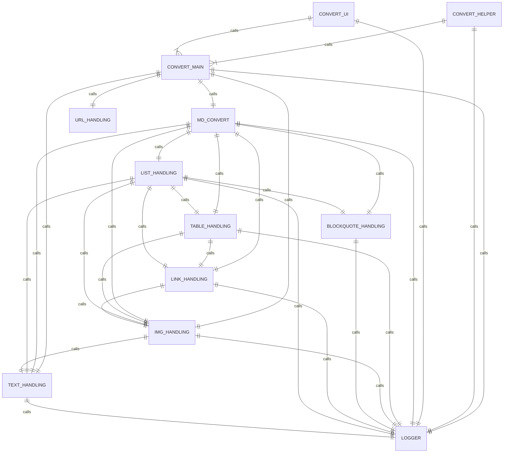
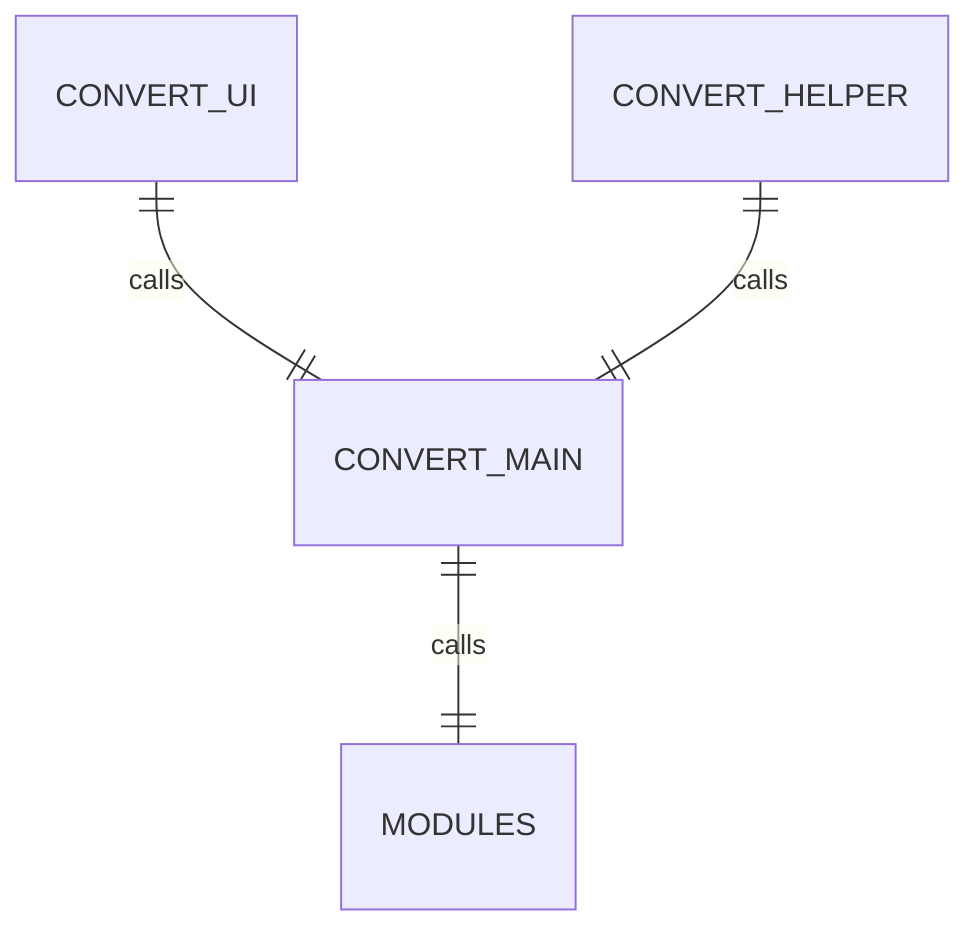
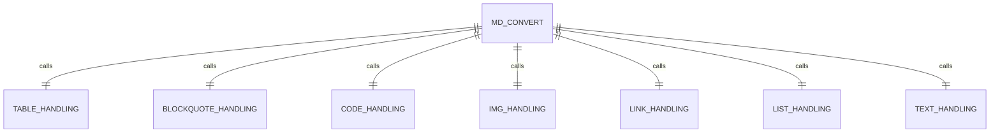

# Architecture

Im Folgenden wird die Architektur der Anwendung beschrieben. Dazu folgt eine Gesamtübersicht der Anwendung:

## Interfaces

Um mit dem Code zu interagieren, gibt es 3 Wege. Die Funktionsweise ist in [folgendem Abschnitt](/docs/Wikipedia2Markdown/Executing/Usage) besprochen. Die Call-Hierarchie der 3 Interfaces ist wie folgt aufgebaut:

Die CONVERT_MAIN wird in jedem anwendungsfall genutzt. Sie startet den jeweiligen Konvertierungsprozess einer Website und ruft die anderen Modules auf. Das MAIN Script übernimmt dabei Aufgaben wie das Erhalten und Parsen des HTML Codes, das Setzen des Titels und des Namens der zu erstellenden Website, sowie das Herunterladen sämtlicher Bilder. Im Anschluss wird die geparste HTML-Struktur an die Module weitergegeben, in welchen die einzelnen Elemente verarbeitet werden.  

## Module

Die Module sind für das grundlegende Umwandeln der HTML-Elemente in Markdown Syntax zuständig. Sie übernehmen immer ein Element, um die verschiedenen Verarbeitungsschritte zu trennen. Dabei gilt folgende Hierarchie:

MD_CONVERT ist das Verwaltungsmodul, welches durch die HTML-Struktur geht und jedes Element das richtige Handling Modul zuordnet. Jedes Handling gibt einen String mit dem Konvertierten Markdown Syntax zurück. MD_CONVERT akzeptiert diese Strings und setzt sie zu einem großen Dokument zusammen. Sobald alle Elemente konvertiert wurden, wird die Markdown Datei gespeichert.

## Circular Imports und Logger

Es existieren Ausnahmen für diese Call-Struktur. Eines davon ist der Logger, welcher in Sämtlichen Script Dateien genutzt wird, um Aussagen bei einem Fehler zu treffen oder dem Nutzer den Fortschritt anzuzeigen. Zudem gibt es viele Circular Imports welche zur wirren Struktur der Gesamtarchitektur führen. Diese sind aufgrund der komplexen Verschichtung von HTML Code entstanden, da es keine einheitlichen Regeln gibt, welches Element auf ein anderes Folgen darf. So muss man beachten, das in einem Tabellen-element sowohl ein Code-Element, ein Image-Element und ein Listen-Element enthalten sein kann.