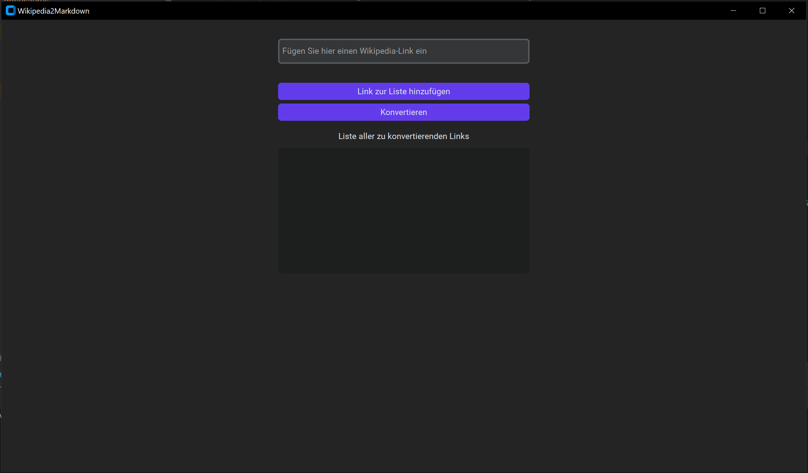
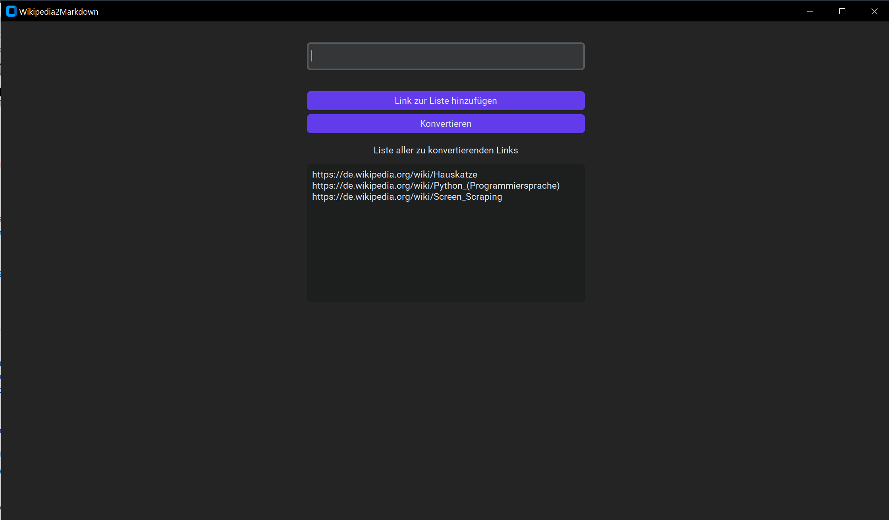
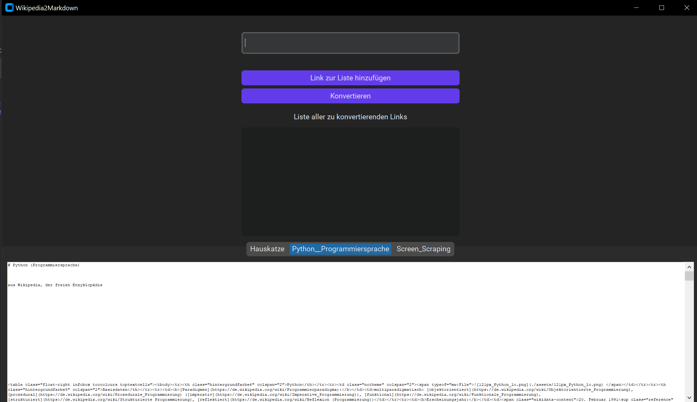

# Usage

## Python

Das Projekt kann über 3 verschiedene Wege genutzt werden. Dazu gehören eine UI, ein Commandline Script und ein Script für die IDE. Sowohl mit der UI, also auch mit dem IDE Script können mehrere Webseiten gleichzeitig konvertiert werden. Wir werden nun die einzelnen Schritte durchgehen.

### UI

Die UI wird durch die Datei ```convert_ui.py``` gestartet. Es sollte nun folgendes Window erscheinen:



Nun können die gewünschten Websites als Links in die Textbox eingefügt werden.

:::info Links Einfügen
Jeder Links muss einzeln eingefügt werden. Nach jedem Link muss der ```Add Link to List``` Button geklickt werden
:::



Wenn alle Websites eingetragen wurden kann der Knopf ```Convert``` gedrückt werden. Das Script wird nun die Liste an Websites abarbeiten. Dabei Freezed das Window. Nachdem die Konvertierung abgeschlossen ist, zeigt die UI eine Preview der Markdown Dateien an: 



### CLI

Das CLI Script kann ohne jegliches Interface im Terminal genutzt werden. Dazu braucht es bloß den Pfad zum Script sowie die notwendigen Flags. Folgende Flags sind möglich

```bash
usage: convert_main.py [-h] -u URL [-l LOG]

options:
  -h, --help     show this help message and exit
  -u, --url URL  The Wikipedia url of the page that should be converted
  -l, --log LOG  Setzt das Log-Level (DEBUG, INFO, WARNING, ERROR)
```

Zur Nutzung des Script muss die zu konvertierende Seite in Wikipedia angegeben werden. Dies wird beim Ausführen des Scripts mit der Flag -u angehängt.

Bsp:

```bash
  python /path/to/script/convert_main.py -u https://domain.com/Wikipedia_subpage
```

### IDE

Alternativ kann das Script ```convert_helper.py``` genutzt werden. Dieses Script nimmt ein Array an Links und arbeitet dieses ab. Da das Array hardcoded ist, dient es eher Testzwecken und ist daher nicht empfohlen. Das Array kann über einen Code-Editor verändert werden.

```bash
  python /path/to/convert_helper-py
```

### Results

Das Ergebnis der Konvertierung wird als Ordnerstruktur mit allen Assets unter ```landing/``` angelegt. Von dort aus kann der Ordner an den gewünschten Ort verschoben werden. Um das Ergebnis in der Docusaurus implementation zu sehen, muss der konvertierte Ordner in den ```docs``` Ordner verschoben werden. Beim Starten der Docusaurus Anwendung wird nun das Endergebnis mit verarbeitet.

## Docusaurus

Um die Implementierung in Docusaurus zu sehen, muss der Webserver gestartet werden. Dazu muss folgender Command und der Shell eingegeben werden:

```bash
npm start
```

Im Anschluss wird der Code Compiliert und der Webserver hochgefahren. Sind alle packages installiert öffnet sich automatisch ein Browserfenster auf [Port 3000](http://localhost:3000/). Wenn alle Markdown Dateien korrekt konvertiert/geschrieben wurden, können diese jetzt im Browser angezeigt werden