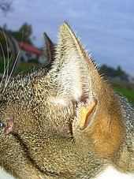
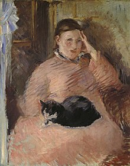
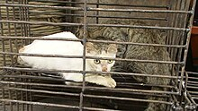
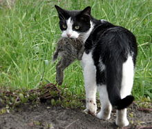

# Hauskatze

aus Wikipedia, der freien Enzyklopädie

 

Katze

 ist eine Weiterleitung auf diesen Artikel. Weitere Bedeutungen sind unter 
[Katze (Begriffsklärung)](https://de.wikipedia.org/wiki/Katze_(Begriffskl%C3%A4rung))
 aufgeführt.

Die 
Hauskatze

 (
Felis catus

) ist die 
[Haustierform](https://de.wikipedia.org/wiki/Haustierform)
 der 
[Falbkatze](https://de.wikipedia.org/wiki/Falbkatze)
. Sie zählt zu den beliebtesten 
[Heimtieren](https://de.wikipedia.org/wiki/Heimtier)
. In der 
[Rassekatzenzucht](https://de.wikipedia.org/wiki/Rassekatze)
 werden oft nur die Tiere als Hauskatze bezeichnet, die keiner anerkannten Katzenrasse angehören.

In Deutschland sind Hauskatzen die am häufigsten gehaltenen Haustiere.
[[1]](#cite_note-1)

[[2]](#cite_note-:2-2)

Aufgrund ihres Jagdverhaltens sind freilaufende Hauskatzen mancherorts eine Bedrohung der 
[Artenvielfalt](https://de.wikipedia.org/wiki/Artenvielfalt)
 und zählen zu den problematischsten 
[invasiven Arten](https://de.wikipedia.org/wiki/Invasive_Art)
 der Welt.

Körpermerkmale

Äußere Merkmale

Die Merkmale der Hauskatze schwanken je nach Verbreitungsgebiet. Bei den gezüchteten Formen sind sie von den 
[Rassestandards](https://de.wikipedia.org/wiki/Rassestandard)
 abhängig, bei den kulturfolgenden Hauskatzen unterliegen sie dem jeweiligen 
[Selektionsdruck](https://de.wikipedia.org/wiki/Selektionsdruck)
, der von den natürlichen Umweltbedingungen abhängt.

Hauskatzen sind im Durchschnitt etwa 50 Zentimeter lang (
[Kopf-Rumpf-Länge](https://de.wikipedia.org/wiki/Kopf-Rumpf-L%C3%A4nge)
) und 4 Kilogramm schwer mit einer großen Variationsbreite von ca. 2,5 kg bis ca. 8 kg. Männliche Tiere sind etwas größer als weibliche. Die Länge des Schwanzes beträgt etwa 25 bis 30 cm. Eine Ausnahme ist die schwanzlose 
[Manx-Katze](https://de.wikipedia.org/wiki/Manx_(Katze))
 von der 
[Insel Man](https://de.wikipedia.org/wiki/Isle_of_Man)
. Die Schulterhöhe beträgt 30 bis 35 cm.  In Verbreitungsgebieten mit kälterem Klima sind die Katzen allgemein schwerer und größer, in wärmeren Gebieten sind sie leichter.

Die 
[National Geographic Society](https://de.wikipedia.org/wiki/National_Geographic_Society)

 (1981) gibt die durchschnittliche Kopf-Rumpf-Länge mehrerer beliebter 
[Katzenrassen](https://de.wikipedia.org/wiki/Liste_von_Katzenrassen)
 mit 46 cm und die Schwanzlänge mit 30 cm an. Der bisher schwerste dokumentierte Hauskater war der stark 
[adipöse](https://de.wikipedia.org/wiki/Adipositas)
 „Himmy“ aus Australien mit 21,2 kg.
[[3]](#cite_note-3)

→ 

Hauptartikel

: 
[Fellfarben der Katze](https://de.wikipedia.org/wiki/Fellfarben_der_Katze)

 
Verschiedene Hauskatzen-Züchtungen

Die Hauskatze im 
[Wildtyp](https://de.wikipedia.org/wiki/Wildtyp)
 besitzt eine M-förmige Zeichnung auf der Stirn, von den Augen zur Seite gehende „Kajal“-Striche, einen dunklen 
[Aalstrich](https://de.wikipedia.org/wiki/Aalstrich)
 und dunkle Querstreifen (oder auch Tupfen) an den Körperseiten. Beine und Schwanz sind ebenfalls dunkel gebändert. Ihre Farbe variiert von grau-schwarz bis zu warmen Brauntönen. Die für die Hauskatze typischen Fellzeichnungen werden als 
[Tabby](https://de.wikipedia.org/wiki/Tabby)
 bezeichnet. Neben dem oben beschriebenen Wildtyp, mackerel (= 
[Englisch](https://de.wikipedia.org/wiki/Englische_Sprache)
 für 
[Makrele](https://de.wikipedia.org/wiki/Makrele)
) genannt, haben sich weitere Zeichnungen und eine Vielzahl an Fellfarben herausgebildet. In Europa, Nordamerika und Australien überwiegt die gestromte Zeichnung, die oft mit einer teilweisen Weißfärbung verbunden ist.

Die Ohren der Hauskatze stehen aufrecht, sind breit am Ansatz, dreieckförmig und an den Spitzen leicht gerundet. Sie können unabhängig voneinander in verschiedene Richtungen gedreht sowie gänzlich flach an den Hinter
[kopf](https://de.wikipedia.org/wiki/Kopf)
 angelegt werden. Die Augen sind nach vorne gerichtet und ermöglichen so räumliches Sehen.

Stütz- und Bewegungsapparat

 
Das Skelett

Das 
[Skelett](https://de.wikipedia.org/wiki/Skelett)
 der Hauskatze besteht aus über 230 
[Knochen](https://de.wikipedia.org/wiki/Knochen)
. Der 
[Schädel](https://de.wikipedia.org/wiki/Sch%C3%A4del)
 der Katze ist kurz und robust gebaut. Die 
[Augenhöhle](https://de.wikipedia.org/wiki/Orbita)
 ist nicht vollständig knöchern geschlossen, der hintere Teil wird durch ein 
[bindegewebiges](https://de.wikipedia.org/wiki/Bindegewebe)
 
[Band](https://de.wikipedia.org/wiki/Band_(Anatomie))
 verschlossen. Die 
[Wirbelsäule](https://de.wikipedia.org/wiki/Wirbels%C3%A4ule)
 besteht aus sieben 
[Hals-](https://de.wikipedia.org/wiki/Halswirbel)
, 13 
[Brust-](https://de.wikipedia.org/wiki/Brustwirbel)
, sieben 
[Lenden-](https://de.wikipedia.org/wiki/Lendenwirbel)
, drei zum 
[Kreuzbein](https://de.wikipedia.org/wiki/Kreuzbein)
 verwachsenen Kreuz- und 20 bis 23 
[Schwanzwirbeln](https://de.wikipedia.org/wiki/Schwanzwirbel)
. Das 
[Schlüsselbein](https://de.wikipedia.org/wiki/Schl%C3%BCsselbein)
 ist lediglich ein in den 
[Musculus brachiocephalicus](https://de.wikipedia.org/wiki/Musculus_brachiocephalicus)
 eingelagerter Knochen, der mit dem übrigen Skelett nicht in Verbindung steht. Am unteren Ende der 
[Schulterblattgräte](https://de.wikipedia.org/wiki/Schulterblatt)
 (
Spina scapulae

), dem sogenannten 
Acromion

, besitzen Katzen einen nach unten gerichteten 
Processus hamatus

 und einen für Katzen typischen nach hinten gerichteten 
Processus suprahamatus

. Der Oberarmknochen besitzt an seinem unteren Ende ein an der Innenseite gelegenes Loch (
Foramen supracondylare

) zum Durchtritt der 
[Arteria brachialis](https://de.wikipedia.org/wiki/Arteria_brachialis)
 und des 
[Nervus medianus](https://de.wikipedia.org/wiki/Nervus_medianus)
. Die kräftigen Hinterbeine sind eher auf Springen als auf schnelles Laufen spezialisiert. Die Katze kann dank ihrer kräftigen 
[Muskulatur](https://de.wikipedia.org/wiki/Muskulatur)
 sehr gut springen und sprinten. Als typischer 
[Lauerjäger](https://de.wikipedia.org/wiki/Lauerj%C3%A4ger)
 ist sie jedoch kein ausdauernder Läufer.

Die Hauskatze ist wie alle 
[Kleinkatzen](https://de.wikipedia.org/wiki/Kleinkatzen)
 ein 
[Zehengänger](https://de.wikipedia.org/wiki/Zeheng%C3%A4nger)
. An den Vorderbeinen hat sie fünf Zehen, wovon eine keinen Bodenkontakt hat, und an den Hinterbeinen vier. Die scharfen gebogenen 
[Krallen](https://de.wikipedia.org/wiki/Kralle)
 dienen unter anderem zum Fangen und Halten der Beute. Sie liegen in Ruheposition durch elastische Bänder zurückgezogen in einer Hauttasche. Sie können zum Beutefang, zum Klettern, zum Markieren des 
[Reviers](https://de.wikipedia.org/wiki/Revier_(Tier))
 durch Kratzmarken oder zur Verteidigung „ausgefahren“ werden.

*  Schädel einer Katze
*  Katzenkralle und ihre[Biomechanik](https://de.wikipedia.org/wiki/Biomechanik)
*  Katzenpfote mit Krallen
* Springende Katze in Zeitlupe

### Verdauungsapparat

 
Gebiss der Katze

Das bleibende Gebiss der Katzen hat 30 
[Zähne](https://de.wikipedia.org/wiki/Zahn)
. Es hat in jeder Kieferhälfte drei 
[Schneidezähne](https://de.wikipedia.org/wiki/Schneidezahn)
 (
Incisivi

, 
I

) und einen 
[Eck- oder Hakenzahn](https://de.wikipedia.org/wiki/Eckzahn)
 (
Caninus

, 
C

). Im 
[Oberkiefer](https://de.wikipedia.org/wiki/Oberkiefer)
 sind drei, im 
[Unterkiefer](https://de.wikipedia.org/wiki/Unterkiefer)
 nur zwei vordere Backenzähne (
[Prämolaren](https://de.wikipedia.org/wiki/Pr%C3%A4molar)

, 
P

) ausgebildet. In jeder Kieferhälfte ist nur ein hinterer Backenzahn (
[Molar](https://de.wikipedia.org/wiki/Molar_(Zahn))

, 
M

) vorhanden.

Es ergibt sich diese 
[Zahnformel](https://de.wikipedia.org/wiki/Zahnformel)
:

 
Schematische Anatomie der Hauskatze (männlich)

Das Milchgebiss der Katzen hat 26 Zähne. Mit etwa sechs Monaten findet der 
[Zahnwechsel](https://de.wikipedia.org/wiki/Zahnwechsel)
 statt. In dieser Zeit kann es zu „Doppelzähnen“ kommen, wenn die Milchzähne nicht ausfallen. Die hinteren Mahlzähne haben keine Milchzahnvorgänger und die Zahnformel lässt sich folgendermaßen darstellen:

Typisch für fleischfressende Raubtiere sind ihre kräftigen 
[Kiefermuskeln](https://de.wikipedia.org/wiki/Kiefer_(Anatomie))
 und die scharfen Zähne. Mit den stark ausgebildeten Reißzähnen, im Oberkiefer der letzte Prämolar, im Unterkiefer der erste Molar, also P3|M1, auch als 
[Brechschere](https://de.wikipedia.org/wiki/Brechschere)
 bezeichnet, (und deren an der Basis befindlichen Drucksensoren) können Fleisch und kleine Knochen zerkleinert werden. Die Eckzähne, besser als 
[Fangzähne](https://de.wikipedia.org/wiki/Fangzahn)
 bezeichnet, dienen vornehmlich dem Fangen, Festhalten und Tragen der Beute; sie werden auch bei Revierkämpfen und zur Fellpflege eingesetzt. Die fadenförmigen mechanischen 
[Zungenpapillen](https://de.wikipedia.org/wiki/Zungenpapille)
 sind stark verhornt und rachenwärts gerichtet, was bei der Aufnahme von Flüssigkeiten wie auch bei der Fellpflege hilft, da sich lose Haare in den Haken verfangen.

Der 
[Verdauungstrakt](https://de.wikipedia.org/wiki/Verdauungstrakt)
 ist säugertypisch. Der 
[Magen](https://de.wikipedia.org/wiki/Magen)
 ist einhöhlig-zusammengesetzt. Der 
[Blinddarm](https://de.wikipedia.org/wiki/Blinddarm)
 ist 2 bis 4 cm lang. Ein 
[Wurmfortsatz](https://de.wikipedia.org/wiki/Wurmfortsatz)
 ist hingegen nicht ausgebildet. Der 
[Grimmdarm](https://de.wikipedia.org/wiki/Colon)
 ist, wie beim Menschen, in Form eines einfachen, nach hinten offenen U gestaltet, hat hingegen keine 
[Bandstreifen](https://de.wikipedia.org/wiki/T%C3%A4nie_(Anatomie))
. Raubtiertypisch ist der gesamte Verdauungstrakt kurz.

### Stoffwechsel

Die Katze benötigt, wie die meisten Säugetiere (einschließlich Mensch), 
[Retinol](https://de.wikipedia.org/wiki/Retinol)
 (oder Vitamin A
1

), nimmt aber eine Sonderstellung ein, da sie im Gegensatz zu fast allen anderen Tieren nicht 
[β-Carotin](https://de.wikipedia.org/wiki/Carotine)
 in Retinol umwandeln kann. Sie ist daher natürlicherweise auf den ausreichenden Genuss von 
[Leber](https://de.wikipedia.org/wiki/Leber)
 angewiesen, um sich mit Vitamin A versorgen zu können.
[[4]](#cite_note-4)

 Weiterhin kann die Katze – im Gegensatz zu fast allen anderen Tieren – 
[Arachidonsäure](https://de.wikipedia.org/wiki/Arachidons%C3%A4ure)
 nicht aus der 
[Omega-6-Fettsäure](https://de.wikipedia.org/wiki/Omega-6-Fetts%C3%A4ure)
 
[Linolsäure](https://de.wikipedia.org/wiki/Linols%C3%A4ure)
 synthetisieren und muss diese daher über die Nahrung aufnehmen.
[[5]](#cite_note-5)

### Lebenserwartung

Im Haus lebende Katzen erreichen bei Pflege durch den Menschen in der Regel ein Alter von 15 bis 20 Jahren.
[[6]](#cite_note-6)

[[7]](#cite_note-geliebte-katze.de-7)

 Nach 
[Desmond Morris](https://de.wikipedia.org/wiki/Desmond_Morris)
 sind aber auch Lebensalter von mehr als 20 Jahren belegt. Als Ausnahme nennt er den Fall einer Tabbykatze namens „Puss“, die von 1903 bis 1939, also 36 Jahre, gelebt habe.
[[8]](#cite_note-8)

Die älteste bekannte Hauskatze war die Katze 
[Creme Puff](https://de.wikipedia.org/wiki/Creme_Puff)

 aus 
[Austin](https://de.wikipedia.org/wiki/Austin)
, 
[Texas](https://de.wikipedia.org/wiki/Texas)
. Sie wurde am 3. August 1967 geboren und verstarb im Alter von 38 Jahren und drei Tagen am 6. August 2005. Der Besitzer Jake Perry war bereits Halter des vorhergehenden Rekordhalters, eines Katers namens 
Grandpa Rex Allen

.
[[9]](#cite_note-9)

In freilaufenden Katzenpopulationen ohne menschliche Zuwendung und medizinische Betreuung liegt die Lebenserwartung einer Katze zwischen 1,4 und 3,2 Jahren (männliche Tiere) bzw. 3,3 und 4,2 Jahren (weibliche Tiere). Diese Zahlen gehen aus Untersuchungen hervor, die von Liberg (1980) in einem ländlichen Gebiet Schwedens und Legay und Pontier (1983) in der französischen Stadt 
[Lyon](https://de.wikipedia.org/wiki/Lyon)
 durchgeführt wurden.
[[10]](#cite_note-10)

## Verbreitung

 
Kind mit Hauskatze in Deutschland

Als Heim- oder Haustier kommt die Hauskatze weltweit in nahezu allen vom Menschen besiedelten Gebieten vor. Sie kann als wild oder verwildert lebendes Tier aber nur in klimatisch warmen oder gemäßigten Zonen unabhängig von 
[subsidiären](https://de.wikipedia.org/wiki/Subsidiarit%C3%A4t)
 menschlichen Einflüssen leben. Sie gilt als 
[Kulturfolger](https://de.wikipedia.org/wiki/Kulturfolger)
.

Auch in den 
[biogeographisch](https://de.wikipedia.org/wiki/Biogeographie)
 lange isolierten Lebensräumen Australiens und Neuseelands, in die sie durch den Menschen eingebracht wurde, konnte sie sich verhältnismäßig schnell anpassen, beeinflusst dort jedoch zusammen mit einer Vielzahl anderer 
[Neozoen](https://de.wikipedia.org/wiki/Neobiota)
 die vorhandenen einzigartigen 
[Ökosysteme](https://de.wikipedia.org/wiki/%C3%96kosystem)
.

Man ging 2023 von 15,7 Millionen Hauskatzen in Deutschland aus,
[[2]](#cite_note-:2-2)

 27,4 Millionen in ganz Mittel- und Westeuropa (2014)
[[11]](#cite_note-DIB-11)

 und weltweit von mehr als einer Milliarde Tieren (einschließlich verwilderter und halbwilder Populationen).
[[12]](#cite_note-12)

## Genetik

### Karyotyp und Genom

Die Hauskatze besitzt wie die Wildkatze 2n=38 
[Chromosomen](https://de.wikipedia.org/wiki/Chromosom)
.
[[13]](#cite_note-13)

 Im Chromosomensatz sind etwa 20.000 Gene verortet. Die erste, 2007 
[publizierte](https://de.wikipedia.org/wiki/Liste_von_sequenzierten_eukaryontischen_Genomen)
 Skizze des Katzengenoms war von einer 
[Abessinierkatze](https://de.wikipedia.org/wiki/Abessinierkatze)
 mit einer Länge von etwa 2.700.000.000 
[bp](https://de.wikipedia.org/wiki/Basenpaar)
.
[[14]](#cite_note-14)

 Von Hauskatzen kann ein 
[genetischer Fingerabdruck](https://de.wikipedia.org/wiki/Genetischer_Fingerabdruck)
 genommen werden, beispielsweise für die 
[Forensik](https://de.wikipedia.org/wiki/Forensik)
.
[[15]](#cite_note-15)

Im Unterschied zu nahe verwandten 
[Raubtieren](https://de.wikipedia.org/wiki/Raubtiere)
 (beispielsweise Hunden) kann die Hauskatze, so wie Geparden und Tiger, die Geschmacksrichtung süß nicht wahrnehmen. Der Grund ist eine Mutation im Tas1r2-Gen, genauer eine 247 bp lange 
[Deletion](https://de.wikipedia.org/wiki/Deletion)
.
[[16]](#cite_note-16)

### Genetik der Fellfarben

 
[Europäisch Kurzhaar](https://de.wikipedia.org/wiki/Europ%C3%A4isch_Kurzhaar)
 mit einem der häufigsten Fellschemata

Alle 
[Fellfarben der Katze](https://de.wikipedia.org/wiki/Fellfarben_der_Katze)
 beruhen auf zwei Farbstoffen: 
[Eumelanin](https://de.wikipedia.org/wiki/Eumelanin)
 (Schwarz) und 
[Phäomelanin](https://de.wikipedia.org/wiki/Ph%C3%A4omelanin)
 (Rot). In der Streifenzeichnung der wilden Vorfahren kamen beide Farbstoffe vor.

Das Fellmuster der Katzen wird durch das 
[Tabby](https://de.wikipedia.org/wiki/Tabby)
-Gen bestimmt. Jede Katze hat die Veranlagung zu einer der typischen Fellmusterungen: getigert, gestromt, getupft oder getickt. Auch die einfarbige Katze wie die blaue Kartäuser hat eine solche Veranlagung, die aber das Non-
[Agouti](https://de.wikipedia.org/wiki/Agouti)
-Gen (Abk. aa) maskiert.
[[17]](#cite_note-17)

Schwarze Katzen haben eine Mutation des Agouti-Locus, durch die das Phäomelanin vollständig durch Eumelanin verdrängt wird, so dass die Fellzeichnung nicht mehr sichtbar ist. Dagegen fehlt roten Katzen jegliches Eumelanin, da das Non-Agouti-Gen bewirkt, dass das Phäomelanin am ganzen Körper das Eumelanin unterdrückt. Das hat keine Auswirkung auf die Fellzeichnung roter Katzen: sie zeigen immer das Tabby-Muster.

Beide Farben können durch andere Gene aufgehellt werden. So wird die Farbe Schwarz (Black) durch eine Mutation des Braun-Locus zu Schokolade (Chocolate) oder zur Zimtfarbe (Cinnamon) aufgehellt. Durch das 
[Verdünnungsgen](https://de.wikipedia.org/wiki/Dilute-Gen)
 (maltese dilution, Abk. dd) verwandelt sich Schwarz in Blau (Blue, die Farbe der 
[Kartäuserkatze](https://de.wikipedia.org/wiki/Chartreux)
), Chocolate in Lilac (oder Lavendel oder Frost), Cinnamon zu Fawn und Rot (Orange) zu Creme (cream). 1974 wurde ein weiteres Verdünnungsgen entdeckt, der Verdünnungsmodifikator (Dilution modifier, Abk. Dm). Dieser verändert die Farben Blau, Lila und Fawn zu Caramel und Creme zu Apricot.

Weiße oder gescheckte Katzen entstehen dadurch, dass der Haut die pigmentbildenden Zellen (
[Melanozyten](https://de.wikipedia.org/wiki/Melanozyt)
) fehlen, sind also ganz oder teilweise 
[leuzistisch](https://de.wikipedia.org/wiki/Leuzismus)
. Vollständig weiße Katzen sind häufig taub, gescheckte Katzen nicht.

Eine 
[dreifarbige Katze](https://de.wikipedia.org/wiki/Schildpatt_(Katze))
 ist auf den ersten Blick als weibliche Katze zu erkennen, da sich das Gen für die Fellfarbe auf dem 
[X-Chromosom](https://de.wikipedia.org/wiki/X-Chromosom)
 befindet. Die Unterscheidung zwischen männlich und weiblich beruht wie bei allen Säugetieren auf dem 
[Karyotyp](https://de.wikipedia.org/wiki/Karyotyp)
 der 
[Geschlechtschromosomen](https://de.wikipedia.org/wiki/Gonosom)
, nach dem XX weiblich und XY männlich ist. Daher können manche weibliche Katzen auf einem X-Chromosom das Gen für die Fellfarbe schwarz und auf dem anderen das Gen für die Fellfarbe rot besitzen und deshalb ein dreifarbiges Fell ausbilden (
[kodominanter](https://de.wikipedia.org/wiki/Kodominanz)
 
[Erbgang](https://de.wikipedia.org/wiki/Erbgang_(Biologie))
). Der weiße Teil der Fellfarbe wird nicht vom X-Chromosom gesteuert, die zuständige 
[Allelserie](https://de.wikipedia.org/wiki/Allel)
 wird 
[autosomal](https://de.wikipedia.org/wiki/Autosom)
 vererbt.

## Sinnesleistungen

Man geht davon aus, dass der Sehsinn von Katzen vor allem auf die Wahrnehmung von Bewegungen spezialisiert ist und die Leistung in der Schärfe- und Detailwahrnehmung eher durchschnittlich ist. Bei der effizienten Jagd hilft das feine Gehör mit der Funktion des Richtungshörens beim Auffinden der 
[Beutetiere](https://de.wikipedia.org/wiki/Beutetier)
. Der Geruchssinn hingegen ist vergleichsweise weniger hochentwickelt, doch immer noch deutlich besser als der des Menschen.

### Sehsinn

 
Geöffnete Pupillen einer Hauskatze

Die großen Augen sind frontal ausgerichtet, wodurch sowohl räumliches Sehen als auch exaktes Einschätzen von Entfernungen möglich sind. Die Katze nimmt besonders gut rasche Bewegungen wahr, und bei Dunkelheit benötigt sie im Verhältnis zum Menschen lediglich ein Sechstel der Lichtmenge, um ein Bild zu empfangen. Dies wird durch die hohe Dichte an 
[Stäbchen](https://de.wikipedia.org/wiki/St%C3%A4bchen_(Auge))
 auf der Netzhaut und eine Reflexionsschicht im Augenhintergrund möglich. Das Stäbchen/Zapfen-Verhältnis der Netzhautrezeptoren liegt bei etwa 63:1 (beim Menschen 20:1), variiert jedoch sehr stark zwischen dem Zentrum der Netzhaut (10:1) und der Peripherie (200:1). Ein weiterer Grund ist das 
[Tapetum lucidum](https://de.wikipedia.org/wiki/Tapetum_lucidum)
, eine direkt hinter der 
[Netzhaut](https://de.wikipedia.org/wiki/Netzhaut)
 liegende Zellschicht, die das durch die Photopigmentmoleküle in den 
[Stäbchen](https://de.wikipedia.org/wiki/St%C3%A4bchen_(Auge))
 und 
[Zapfen](https://de.wikipedia.org/wiki/Zapfen_(Auge))
 nicht absorbierte 
[Licht](https://de.wikipedia.org/wiki/Licht)
 reflektiert und nochmals auf die Sinneszellen strahlt. Diese Schicht ist auch der Grund, warum Katzenaugen im Dunkeln zu leuchten scheinen, wenn man sie anleuchtet. Katzen sehen daher auch bei Dämmerung und in der Nacht noch sehr gut, solange Restlicht vorhanden ist. In einem komplett abgedunkelten Raum dagegen sind auch Katzen blind. Da die Katze ihre Augen nur wenig nach links oder rechts bewegen kann, muss sie, um in eine andere Richtung schauen zu können, ihren Kopf bewegen. Durch die nach vorne gerichteten Augen ergibt sich eine starke Überschneidung der Sehachsen, was ein gutes räumliches Sehvermögen bedeutet. Der Sichtwinkel der Katze beträgt 200° bis 220°. Um das Restlicht besser einfangen zu können, öffnen sich bei abnehmender Helligkeit die vertikal schlitzförmigen 
[Pupillen](https://de.wikipedia.org/wiki/Pupille)
 kreisrund, wodurch gleichzeitig die Sehschärfe abnimmt.
[[18]](#cite_note-Wasistwas-18)

Wegen der sich schlitzförmig verengenden Pupillen ist die Sehschärfe der Katzen bei Helligkeit für waagerechte und senkrechte Strukturen und Bewegungen unterschiedlich. Senkrechte Linien sehen sie schärfer als waagerechte und können daher horizontale Bewegungen besser wahrnehmen als vertikale, was mit ein Grund für die typische schräge Kopfhaltung von Katzen ist, sobald sie bestimmte Dinge fixieren. Abgesehen davon, dass Katzen unter gleichen Bedingungen waagerechte Linien unschärfer sehen als der Mensch, ist auch ihr Vermögen, 
[Farbdifferenzen](https://de.wikipedia.org/wiki/Farbe)
 wahrzunehmen, weniger gut ausgebildet. Grund dafür ist der Umstand, dass der Anteil farbempfindlicher 
[Zapfen](https://de.wikipedia.org/wiki/Zapfen_(Auge))
 in der Netzhaut der Katze viel geringer ist als beim Menschen und das Auge der Katze außerdem, wie das des Hundes, nur über zwei verschiedene Zapfentypen (
[Dichromat](https://de.wikipedia.org/wiki/Dichromat_(Auge))
) verfügt, die für Grün und Blau, nicht aber Rot empfindlich sind. Rot ist also eine Farbe, die weder Hunde noch Katzen sehen können (siehe auch: 
[Sehsinn des Hundes](https://de.wikipedia.org/wiki/Haushund#Sehsinn)
), und die vermutlich als ein Gelbton wahrgenommen wird.
[[19]](#cite_note-19)

Dafür können Katzen ihre Umgebung in Blau- und Grünschattierungen verschiedenster Intensität und Kombinationen wahrnehmen, wobei die bevorzugte Farbe von Katzen, für die ihre Augen auch am empfindlichsten sind, Blau ist. Dies wurde bei über 2000 Versuchen des Instituts für Zoologie der 
[Johannes Gutenberg-Universität Mainz](https://de.wikipedia.org/wiki/Johannes_Gutenberg-Universit%C3%A4t_Mainz)
 festgestellt. Unter verschiedenen Beleuchtungsverhältnissen hatten die Katzen die Wahl zwischen Gelb und Blau, um an ihr Futter zu kommen. 95 Prozent entschieden sich für die Farbe Blau.

Bei der Geburt haben alle Katzen eine hellblaue 
[Iris](https://de.wikipedia.org/wiki/Iris_(Auge))
, die 
[adulte](https://de.wikipedia.org/wiki/Adult)
 Augenfarbe dagegen entwickelt sich erst im Laufe der nachfolgenden drei Monate.

Gehör

 
Ohrmuschel einer Katze mit dem 
[Tragus](https://de.wikipedia.org/wiki/Tragus)
 und Antitragus (Tasche zum Richtungshören)

Das 
[Gehör](https://de.wikipedia.org/wiki/Auditive_Wahrnehmung)
 ist bei der Katze besonders gut ausgebildet und zählt zu den besten unter den 
[Säugetieren](https://de.wikipedia.org/wiki/S%C3%A4ugetiere)
. Die Wahrnehmungsschwelle liegt bei einem 
[Schalldruckpegel](https://de.wikipedia.org/wiki/Schalldruckpegel)
 von −10 
[dB SPL](https://de.wikipedia.org/wiki/Bel_(Einheit))
 und damit niedriger als beim Haushund (0 dB SPL). Der 
[Frequenzumfang](https://de.wikipedia.org/wiki/Frequenz)
 des Gehörs der Katze reicht von 55 Hz bis 79 kHz (beim Menschen 20 Hz bis 20 kHz).
[[20]](#cite_note-20)

 Die obere 
[Frequenzgrenze](https://de.wikipedia.org/wiki/Frequenzgrenze)
 liegt im Bereich der Geräusche, die 
[Mäuse](https://de.wikipedia.org/wiki/M%C3%A4use)
 als wichtigste Beutetiere von sich geben. Es ist zudem ein Frequenzbereich, in dem die Schallquellen wesentlich besser lokalisiert werden können. Die Katze verharrt dazu unbeweglich und richtet die meist großen, aufgerichteten und beweglichen 
[Ohren](https://de.wikipedia.org/wiki/Ohr)
 in die Richtung, aus der das Geräusch kommt. Beim Fressen auf Bodenniveau stellt die Katze ihre Ohren automatisch nach hinten, damit die Eigengeräusche nicht ins Gewicht fallen.

### Geruchs- und Geschmackssinn

Der Geruchssinn der Katze ist weniger ausgeprägt als ihr Gehör oder ihr Sehsinn. Er ist schwächer als der des Hundes, aber deutlich besser als der des Menschen. Wie bei allen Säugetieren dient er der sensorischen Prüfung von Nahrung und der Wahrnehmung und Erkennung von Artgenossen und anderen Lebewesen.

Katzen können salzig, sauer, bitter und 
[umami](https://de.wikipedia.org/wiki/Umami)
 (herzhaft/proteinreich) unterscheiden, aber süßen Geschmack nicht wahrnehmen.
[[21]](#cite_note-21)

 Sie verlieren den Appetit, wenn sie ihren Geruchssinn beispielsweise durch Erkältungen einbüßen.

Katzen erkennen einander am Körpergeruch, der etwas über Geschlecht, Gene, hormonellen Status und Revieransprüche aussagt. Sowohl Männchen als auch Weibchen markieren ihre Reviere immer an denselben, regelmäßig inspizierten Stellen durch Duftmarken, die aus Absonderungen aus Schweiß- und Talgdrüsen gebildet und durch Reiben oder Krallenwetzen oder durch Verspritzen von 
[Urin](https://de.wikipedia.org/wiki/Urin)
 gesetzt werden, der sich durch einen strengeren Geruch vom eigentlichen Urin unterscheidet. Verschiedene Ursachen für den Geruch sind möglich, so finden sich beim Harnmarkieren die Aminosäuren 
[Felinin](https://de.wikipedia.org/wiki/Felinin)
 und 
[Isovalthen](/w/index.php?title=Isovalthen&action=edit&redlink=1)
 in der Flüssigkeit – bei Katern zu einem wesentlich höheren Anteil als bei Katzen.
[[22]](#cite_note-22)

Die Schweißdrüsen sitzen vor allem an den Fußballen, im Umkreis des Mauls, am Kinn, um die Brustwarzen und um den 
[Anus](https://de.wikipedia.org/wiki/Anus)
. Die Talgdrüsen sind am Oberkiefer, an der Schwanzwurzel und beim Männchen unter der Vorhaut konzentriert. Kater haben zusätzlich eine Anhäufung von Duftdrüsen in einer Art mit einem Kanal versehenen Tasche neben dem Anus. Alle Schweiß- und Talgdrüsen dienen hauptsächlich der Kommunikation über den Geruch durch Reiben an Gegenständen, Artgenossen und Personen. Beim Aufnehmen von Düften hilft Katzen ein spezielles Organ, das zwischen Rachen- und Nasenhöhle sitzt und 
[Jacobsonsches Organ](https://de.wikipedia.org/wiki/Jacobson-Organ)
 genannt wird.

In Momenten starker Gefühlsregung kann es vorkommen, dass sich der anale Drüsenbeutel der Katze entleert und eine streng riechende braune Flüssigkeit freigibt. An einigen Düften können sich Katzen erregen und 
[flehmen](https://de.wikipedia.org/wiki/Flehmen)
 dann mit halb offenem Mund mit hochgezogener Oberlippe und gekräuselter Nase. Zu diesen Düften gehören Geruchsstoffe von Pflanzen, im Besonderen 
[Echte Katzenminze](https://de.wikipedia.org/wiki/Echte_Katzenminze)
 
Nepeta cataria

 (Nepetalacton, Actinidin), 
[Baldrian](https://de.wikipedia.org/wiki/Baldriane)
 
Valeriana

 (Valepotriate?, Isovaleriansäure?, Actinidin), 
Actinidia polygama

 (Matatabilacton, Actinidin) und Katzengamander 
Teucrium marum

 (Teucriumlacton C), aber auch dem Menschen eigene Gerüche. Zudem werden durch das Flehmen oft neue Gerüche aufgenommen und abgespeichert.

### Gleichgewichtssinn und Stellreflex

Video von Katzen bei normaler 
[Gravitation](https://de.wikipedia.org/wiki/Gravitation)
 und in der 
[Schwerelosigkeit](https://de.wikipedia.org/wiki/Schwerelosigkeit)
 eines 
[Parabelflugs](https://de.wikipedia.org/wiki/Parabelflug)

Die Katze hat einen fein ausgeprägten 
[Gleichgewichtssinn](https://de.wikipedia.org/wiki/Gleichgewichtssinn)
 und eine sehr gute 
[Bewegungskoordination](https://de.wikipedia.org/wiki/Bewegungskoordination)
. Katzen sind auch in großen Höhen 
[schwindelfrei](https://de.wikipedia.org/wiki/Schwindelfreiheit)
. Bei einem Fall aus zwei bis drei Metern Höhe können sie sich aus fast jeder Lage reflexhaft in die Bauchlage drehen und mit nach unten ausgestreckten Pfoten auf dem Boden landen (
[Stellreflex der Katze](https://de.wikipedia.org/wiki/Stellreflex_der_Katze)
). Dazu winkelt die Katze ihren gesamten Körper mittig an und rotiert dann Vorderteil und Hinterteil um deren jeweilige Längsachsen; der Vorgang ähnelt der Rotation eines 
[Kreuzgelenks](https://de.wikipedia.org/wiki/Kreuzgelenk)
. Anders als früher angenommen, spielt die Rotation des Schwanzes nur eine untergeordnete Rolle; dessen Masse ist viel zu gering, um dem restlichen Körper einen hinreichenden Drehimpuls zu verleihen.

Beim Fall aus sehr großen (nicht aber mittleren) Höhen entfalten die eingenommene Position mit extrem gespreizten Pfoten und das sich aufblähende lockere Fell am Übergang der Beine zum Bauch die Wirkung eines 
[Fallschirms](https://de.wikipedia.org/wiki/Fallschirm)
, womit die Aufprallgeschwindigkeit und damit die Verletzungsgefahr erheblich reduziert wird. Es sind Fälle dokumentiert, bei denen Katzen Stürze aus Höhen von über 18 
[Stockwerken](https://de.wikipedia.org/wiki/Geschoss_(Architektur))
 überlebt haben.
[[23]](#cite_note-23)

### Tastsinn

 
Katzenpfote

Katzen haben einen hochentwickelten Tastsinn. Sie besitzen über den ganzen Körper verteilt 
[Tastrezeptoren](https://de.wikipedia.org/wiki/Rezeptorzelle)
. Die hauptsächlich an Ober- und Unterlippe sowie über den Augen befindlichen langen Tast- bzw. Schnurrhaare (
[Vibrissen](https://de.wikipedia.org/wiki/Vibrisse)
), deren Wurzeln mit dem weitverzweigten Netz der 
[Nervenenden](https://de.wikipedia.org/wiki/Nerv)
 verbunden sind, signalisieren, wenn eine Öffnung zu eng oder ein Hindernis im Weg ist. Die bereits bei neugeborenen Katzen vorhandenen Schnurrhaare können beträchtliche Länge erreichen, sind beweglich und wachsen nach dem Ausfallen nach. Mit ihrer Hilfe erkennen sie Gegenstände und Tiere, die sie in der Dunkelheit nicht sehen können; das erlaubt ihnen selbst bei Erblindung ein annähernd normales Bewegen zumindest in bekannter Umgebung. Besonders empfindlich sind auch Rezeptoren an den Vorderpfoten, welche die durch Beutetiere ausgelösten Bodenerschütterungen wahrnehmen.
[[18]](#cite_note-Wasistwas-18)

### Orientierungssinn

Der Orientierungssinn von Hauskatzen ist durch mehrere Faktoren geprägt:
[[24]](#cite_note-24)

[[25]](#cite_note-25)

[[26]](#cite_note-26)

* Scharfes Gedächtnis und visuelle Erinnerung: Katzen haben ein ausgezeichnetes Gedächtnis und können sich an markante Landschaftsmerkmale, Gerüche und Geräusche erinnern. Sie nutzen diese Erinnerungen, um ihren Weg zu finden.
* Geruchssinn: Katzen haben einen sehr feinen Geruchssinn und können Gerüche über große Entfernungen wahrnehmen. Sie setzen Duftmarken mit[Pheromonen](https://de.wikipedia.org/wiki/Wirbeltierpheromone), um ihr Territorium zu markieren und sich zu orientieren.
* Hörsinn: Katzen haben ein außergewöhnliches Gehör und können hohe Frequenzen hören, die Menschen nicht wahrnehmen können. Sie nutzen Geräusche, um sich zu orientieren und ihre Umgebung zu erkunden.
* Tastsinn: Die[Vibrissen](https://de.wikipedia.org/wiki/Vibrisse)(Schnurrhaare) der Katzen sind sehr empfindlich und helfen ihnen, sich in engen Räumen zu orientieren und Hindernisse zu vermeiden.
* [Magnetsinn](https://de.wikipedia.org/wiki/Magnetsinn): Es gibt Hinweise darauf, dass Katzen, ähnlich wie einige andere Tiere, das Erdmagnetfeld wahrnehmen können. Dies könnte ihnen helfen, ihre Position zu bestimmen und sich zu orientieren, insbesondere wenn visuelle und olfaktorische Hinweise fehlen.[[27]](#cite_note-27)Es gibt jedoch noch nicht viele Studien, die dies bei Hauskatzen eindeutig belegen.

Katzen können oft erstaunlich präzise Orte wiederfinden, ohne den Weg dahin jemals gegangen zu sein. Dies könnte durch folgende Mechanismen erklärt werden:

* Innere Landkarten: Katzen scheinen mentale Karten ihrer Umgebung zu erstellen, die ihnen helfen, Entfernungen und Richtungen einzuschätzen.
* Erkundungsverhalten: Auch wenn eine Katze einen bestimmten Weg noch nie gegangen ist, kann sie durch vorherige Erkundungen der Umgebung wissen, wo sich bestimmte Orte befinden.
* Intuition und Instinkt: Katzen haben starke instinktive Fähigkeiten, die ihnen helfen, sich zu orientieren. Dies umfasst möglicherweise eine Art von „innerem Kompass“, der durch verschiedene sensorische Informationen gespeist wird.

In einem Experiment testete man die Fähigkeit von Katzen, sich in verschiedenen Entfernungen richtig nach Hause zu orientieren. Die Katzen wurden in Säcken getragen und in die Mitte eines Labyrinths gebracht, das zu sechs gleich verteilten Ausgängen führte. Die Mehrheit der Katzen wanderte nicht durch das Labyrinth, sondern wählte schnell einen Ausgang (obwohl sie die Sicherheit des Labyrinths nicht verlassen durften). Die Forscher fanden heraus, dass der Heimsuchsinn der Katzen direkt mit ihrer Entfernung von zu Hause zusammenhing. In Entfernungen von 5 km (3,1 Meilen) von zu Hause wählten 60 % der Katzen den Ausgang, der in Richtung ihres Zuhauses zeigte, und in größeren Entfernungen schienen sie die Richtung ihres Zuhauses nicht zu kennen.
[[28]](#cite_note-28)

## Verhalten

 
Entspannt und achtsam

Das Verhalten von Hauskatzen wird hauptsächlich dadurch bestimmt, dass sie 
[Raubtiere](https://de.wikipedia.org/wiki/Raubtiere)
 sind.

Die alte Meinung, Hauskatzen seien per se Einzelgänger, ist widerlegt. Es gibt zwar – wie bei allen sozialen Tierarten – auch unter den Hauskatzen Einzelgänger, von Natur aus sind sie jedoch soziale Tiere. Beobachtet man größere Katzenpopulationen, beispielsweise auf vielen Bauernhöfen oder in manchen Großstädten wie auf dem 
[Largo di Torre Argentina](https://de.wikipedia.org/wiki/Largo_di_Torre_Argentina)
 in 
[Rom](https://de.wikipedia.org/wiki/Rom)
, sind vielfältige soziale Interaktionen zwischen den Tieren augenfällig. Da die allermeisten anderen Katzenarten Einzelgänger sind, bildet die Hauskatze zusammen mit den Löwen eine Ausnahme der Regel. Im Gegensatz zu den Löwen, die als echte Rudeltiere zusammen auf die Jagd gehen, geht die Hauskatze allerdings alleine auf die Jagd. Sie ist aufgrund der Größe ihrer Beutetiere nicht auf andere Katzen angewiesen und dadurch jederzeit alleine dauerhaft überlebensfähig. Das Zusammenleben in einer Gruppe ist bei den Hauskatzen also fakultativ. Die Tatsache, dass Hauskatzen soziale Tiere sind, war überhaupt erst die Grundlage für ihre Domestikation und ermöglicht die Interaktion mit dem Menschen. Im Gegensatz dazu sind Einzelgänger wie die 
[Europäische Wildkatze](https://de.wikipedia.org/wiki/Europ%C3%A4ische_Wildkatze)
 nicht domestizierbar.

### Jagdverhalten

Das vielleicht bekannteste Verhalten der Hauskatze, das sogar sprichwörtlich ist, ist das Spielen mit gefangener Beute, welches auch von Besitzern meist als Grausamkeit falsch interpretiert wird. Es handelt sich vielmehr um ein instinktives Bedürfnis, sicherzustellen, dass die Beute schwach genug ist, um gefahrlos getötet werden zu können.
[[29]](#cite_note-29)

 Anderen wissenschaftlichen Deutungen gemäß handelt es sich bei diesem Verhalten um Übung der Jagd oder um eine Folge der Entwicklung eines Lustgewinns aus der Jagd.
[[30]](#cite_note-30)

[[31]](#cite_note-31)

Bei größeren Beutetieren wie Ratten oder Kaninchen bohrt die Katze die 
[Eckzähne](https://de.wikipedia.org/wiki/Eckzahn)
 wie Keile zwischen die Halswirbel, um das 
[Halsmark](https://de.wikipedia.org/wiki/Halsmark)
 zu durchtrennen. Diese bei kleinen Katzen häufigste Art zu töten wirkt sofort, auch wenn das Beutetier sich oft noch bewegt.
[[32]](#cite_note-32)

 Wiesel und 
[Iltisse](https://de.wikipedia.org/wiki/Iltisse)
 werden normalerweise nur von großen und starken Katern überwältigt. Auch Schlangen oder Blindschleichen werden von Hauskatzen erbeutet. Fische (z. B. in Gartenteichen) sind allerdings nur für manche Katzen interessant, andere meiden das nasse Element.
[[33]](#cite_note-33)

### Sozialverhalten

Auf dem Land, wenn Katzen zwar zu einem Haus gehören, aber dort außerhalb der direkten Kontrolle durch den Menschen leben, schließen sie sich häufig zu kleinen Gruppen aus verwandten Weibchen, deren Jungen, halbwüchsigen Jungen und einem oder zwei Katern zusammen. Die vielen Katzen in den verschiedenen Farben stammen gewöhnlich alle von einer einzigen Katze ab, welche die Begründerin dieser Gemeinschaft war.

Während sich die Männchen beim Erreichen der Geschlechtsreife meist zerstreuen und neue Reviere aufsuchen, bleiben die Weibchen im Revier der Mutter und vergrößern so die Gruppe. Sie ziehen die Jungen auf und verjagen fremde Eindringlinge, zeigen sich aber gegenüber ausgewachsenen Katern toleranter, da jene größer und aggressiver sind. Auch wenn sie das vom Menschen bereitgestellte Futter teilen, bleiben sie auf der Jagd jedoch Einzelgänger. Anders als Löwen jagen Hauskatzen nicht gemeinschaftlich. Bei Einbruch der Nacht schleichen sie allein durch die Wiesen und 
[Wälder](https://de.wikipedia.org/wiki/Wald)
 und suchen nach Beute. Ihre Jagdmethode, die sie als Schleich- oder 
[Lauerjäger](https://de.wikipedia.org/wiki/Lauerj%C3%A4ger)
 charakterisiert, ähnelt der ihrer wild lebenden Verwandten: Anschleichen an die Beute und Ansprung aus kürzester Entfernung. Besonders jüngere Katzen reagieren auf bewegte Gegenstände fast wie auf lebendige Beute, wodurch sie ihre Jagdfähigkeiten trainieren („
[Spieltrieb](https://de.wikipedia.org/wiki/Spielverhalten_der_Tiere)
“).

In großen Städten, in denen sich die Ämter nicht verstärkt um die Unterbringung herumstreunender Tiere in 
[Tierheimen](https://de.wikipedia.org/wiki/Tierheim)
 kümmern und ein entsprechend reichliches Nahrungsangebot vorhanden ist, halten sich oft zahlreiche Katzen in bestimmten Bereichen auf. In städtischen Gärten, auf 
[Friedhöfen](https://de.wikipedia.org/wiki/Friedhof)
, an Ausgrabungsstätten und auch in 
[Industriegebieten](https://de.wikipedia.org/wiki/Industrie)
 können sich große Kolonien bilden. Innerhalb der Kolonien besteht eine Rangordnung von kleineren durch weibliche Tiere dominierte Gruppen.

### Kommunikation

→ 

Hauptartikel

: 
[Kommunikation der Hauskatze](https://de.wikipedia.org/wiki/Kommunikation_der_Hauskatze)

Katzen kommunizieren durch Körpersprache, Laute und Gerüche. Duftsignale werden sowohl zur Kommunikation in der direkten Begegnung als auch auf weite Entfernungen eingesetzt. Talg- und Schweißdrüsen produzieren die dafür notwendigen Duftstoffe, die durch Reiben, Kratzen und Urin an Gegenständen, Pflanzen und Personen verteilt werden.

Körpersprache

 
Gähnende Hauskatze

Kommen Katzen in näheren Kontakt, signalisieren sie ihren emotionalen Zustand durch die Haltung und die Bewegungen des ganzen Körpers und des 
[Schwanzes](https://de.wikipedia.org/wiki/Schwanz)
. Auch die Stellung der 
[Ohren](https://de.wikipedia.org/wiki/Ohr)
 und die Erweiterung oder Verengung der 
[Pupillen](https://de.wikipedia.org/wiki/Pupille)
 spielen eine Rolle.

Ist die Spitze des aufrechten Schwanzes stark durchgebogen, kann das eine freundliche Begrüßung oder auch Vorfreude bedeuten auf das, was sie vom Menschen erwarten, besonders wenn die Schwanzspitze leicht zittert. Ein hocherhobener Schwanz mit leicht gebogener Spitze kann Freude, Vergnügen, Erwartung oder Spannung bedeuten. Hat die Katze ihren Schwanz erhoben, so fühlt sie sich normalerweise wohl und sicher. In entspannter Haltung wird der Schwanz häufig horizontal mit leichter Biegung nach unten getragen. Ist der Schwanz stark nach unten gebogen und aufgeplustert, so ist das oft ein Zeichen der Drohung und Aggression. Schwanzzucken oder schnelles Hin- und Herpeitschen des Schwanzes bedeutet, dass die Katze möglicherweise aggressiv oder irritiert ist.

Wichtige Signale gehen auch von der Gesichtsmuskulatur aus. Fixiert die Katze ihr Gegenüber mit den 
[Augen](https://de.wikipedia.org/wiki/Auge)
, so ist sie aufmerksam bei zunächst neutraler Stimmung. Verengen sich dabei die Pupillen zu Schlitzen und richten sich die Schnurrhaare deutlich nach vorne, wird der Hals eingezogen und die Ohren zur Seite gefaltet, droht oder warnt die Katze. Sind die Pupillen erweitert, wird normalerweise Angst und Unterwerfung signalisiert. Fühlt sich die Katze wohl und ist sie entspannt, werden die Augen oft halb geschlossen gehalten, so dass die 
[Nickhaut](https://de.wikipedia.org/wiki/Nickhaut)
 sichtbar wird. Sind die Ohren zur Seite gefaltet, kann die Katze aggressiv sein. Liegen sie flach nach hinten eng am Kopf an, signalisieren sie häufig Furcht. Nach vorn gerichtete Ohren können Neugier und Aufmerksamkeit bedeuten.

Ein weiteres Element der Körpersprache von Katzen ist der 
[Milchtritt](https://de.wikipedia.org/wiki/Milchtritt)
. Junge Katzen treten dabei mit den Vorderpfoten gegen die Zitzen der Mutter, um die Freigabe der Milch anzuregen. Diese Verhaltensweise bleibt auch erwachsenen Katzen erhalten und zeigt sich zum Beispiel, wenn sie sich sehr wohlfühlen, aber auch wenn sie ihren Schlafplatz vorbereiten.

Das Anschauen mit halb geschlossenen Augen ist ein Zeichen von Freundlichkeit oder Zuneigung und kann mit dem Lächeln des Menschen verglichen werden. Auch das Blinzeln mit einem Auge ist ähnlich zu deuten. Beides ist vom Menschen leicht zu imitieren und wird von der Katze oft erwidert. Ebenso reagiert eine Katze auf längeres Anschauen sogar mit Gähnen und Abwenden des Kopfes. Es ist dann kein Zeichen von Müdigkeit, sondern eine Antiaggressionsgeste.

Vor einem Angriff macht sie sich in der Regel größer und bedrohlicher, indem sie einen Buckel macht und sich quer stellt. Sie streckt die Beine ganz durch, stellt das 
[Fell](https://de.wikipedia.org/wiki/Fell)
 auf und geht langsam auf den Gegner zu. Entblößt sie ihr 
[Gebiss](https://de.wikipedia.org/wiki/Gebiss)
, kann das eine Drohgeste sein. Eine unsichere Katze macht sich jedoch häufig klein, sammelt die Beine unter dem Körper und legt den Schwanz eng an. Dabei kauert sie sich oft auf den Boden, um sich notfalls sofort auf den Rücken fallen zu lassen und den Gegner mit 
[Krallen](https://de.wikipedia.org/wiki/Kralle)
 und 
[Zähnen](https://de.wikipedia.org/wiki/Zahn)
 abwehren zu können.

Auf der Körpersprache gründet sich auch die weit verbreitete Abneigung von Katzen gegen 
[Hunde](https://de.wikipedia.org/wiki/Haushund)
 und umgekehrt, die irrigerweise oft als 
[Erbfeindschaft](https://de.wikipedia.org/wiki/Feindschaft)
 gesehen wird. Die deutlich unterschiedliche Körpersprache mit Signalen häufig gegensätzlicher Bedeutung kann zu Auseinandersetzungen führen. Wenn beispielsweise ein Hund bellend auf eine Katze zuläuft, möchte er die Katze unter Umständen nur begrüßen, sie interpretiert das jedoch als Angriffsverhalten. Die darauf folgende Flucht der Katze weckt wiederum im Hund den Jagdinstinkt.

Schwanzwedeln und Pfötchengeben bedeutet beim Hund freudige Erwartung oder freundliche Begrüßung. Im Gegensatz dazu signalisiert ein wedelnder, peitschender Schwanz der Katze Unmut oder latente Aggressivität, das Heben der Pfote sagt: 
Bis hierher und nicht weiter!

 Oft legt sich die Katze daraufhin auf die Seite, um sich mit ihren Krallen verteidigen zu können, was vom Hund als Unterwerfung oder Spielaufforderung verstanden wird. Wenn dagegen sich die Katze (ausnahmsweise) einem Hund mit freundlich erhobenem Schwanz nähert, interpretiert dieser das – wie er es bei der Begegnung mit anderen Hunden gewohnt ist – als „Komm mir ja nicht zu nahe!“ und reagiert eher aggressiv und mit Gebell.

Wenn Hund und Katze von klein auf aneinander gewöhnt sind, treten meist keine Schwierigkeiten auf.

#### Lautsprache

Sind Katzen sich bereits näher gekommen, werden akustische Signale eingesetzt, um die Aussagen der Körpersprache zu verstärken. Fauchen und Knurren sind Signale für Aggressivität oder auch Angst. Durch taubenartiges Gurren ruft ein Muttertier seine Jungen zu sich. Das jammernde Geschrei der Kater in der Nacht dient der Behauptung gegenüber Rivalen und der Werbung um ein Weibchen.

Miauen einer Katze

Das Miauen ist der charakteristischste Laut, den die Katze hervorbringt. Er kann unterschiedliche Bedeutungen haben und wird in verschiedenen Situationen angewandt. Durch die 
[Domestizierung](https://de.wikipedia.org/wiki/Domestizierung)
 wurde die Neigung zu miauen verstärkt, um wie Jungtiere Zuwendung und Leckerbissen zu bekommen. Einige Katzen miauen, wenn sie Angst haben. Nicht domestizierte Katzen vermeiden das Miauen weitgehend, um andere Raubtiere (etwa 
[Greifvögel](https://de.wikipedia.org/wiki/Greifv%C3%B6gel)
) nicht unnötig auf sich aufmerksam zu machen.

Schnurren

Ein anderer katzentypischer Laut ist das 
[Schnurren](https://de.wikipedia.org/wiki/Schnurren)
, eine Lautäußerung, deren Entstehung noch nicht geklärt ist. Bereits einige Tage nach der Geburt drücken Kätzchen durch beständiges Schnurren Wohlbefinden aus. Dieser Laut überträgt beim Körperkontakt zwischen Muttertier oder Mensch und Katze 
[Vibrationen](https://de.wikipedia.org/wiki/Vibration)
. Scheue und unsichere Tiere versuchen, die Gunst des Gefährten zu erobern oder zu bewahren, indem sie ohne Unterbrechung und aus einer gewissen Entfernung hörbar schnurren. Zudem schnurren Katzen auch, wenn sie Schmerzen haben oder krank sind, um ihre Unterlegenheit zu demonstrieren und sich davor zu schützen, dass sich ihre Situation noch verschlechtert. Es dient zudem der eigenen Beruhigung. Die Katze sendet durch ihr Schnurren, die Reibung am Körper und den hoch aufgerichteten Schwanz in der Regel friedfertige, besänftigende Signale aus, die Aggressionen abbauen sollen. Wie jüngere US-Untersuchungen ergeben haben, erzeugen Katzen beim Schnurren Vibrationen in einem Frequenzbereich zwischen 27 und 44 Hz.

Im Gegensatz zu den 
[Großkatzen](https://de.wikipedia.org/wiki/Gro%C3%9Fkatzen)
 ist bei allen anderen Katzenarten das 
[Zungenbein](https://de.wikipedia.org/wiki/Zungenbein)
 vollständig verknöchert. Aufgrund der besonderen Form ihrer Stimmritze sind allein Großkatzen in der Lage zu brüllen.

Bemerkenswerterweise nutzen Hauskatzen differenzierte Lautäußerungen zur Kommunikation mit dem Menschen, die erwachsene Katzen untereinander nicht benutzen.

### Schlafverhalten

 
Wohnungskatzen beim gemeinsamen Schlaf

Hauskatzen sind 
[dämmerungsaktiv](https://de.wikipedia.org/wiki/D%C3%A4mmerungsaktiv)
. Das bedeutet, dass sie am Morgen und am Abend besonders aktiv sind, aber tagsüber und nachts schlafen oder dösen. Aufgrund des engen Zusammenlebens mit Menschen passen sich Hauskatzen jedoch auch oft dem menschlichen 
[Schlaf-Wach-Rhythmus](https://de.wikipedia.org/wiki/Schlaf-Wach-Rhythmus)
 an.
[[34]](#cite_note-34)

Katzen schlafen meistens mehrmals während des Tages und verbringen so durchschnittlich etwa 16 Stunden am Tag schlafend. Der Schlaf verläuft in den Phasen des flachen Schlafs und des Tiefschlafs. Zudem ruht sich die Katze aus, indem sie sich, ohne zu schlafen, mit geschlossenen 
[Augen](https://de.wikipedia.org/wiki/Auge)
 hinlegt.

Seit 1955 wurden zur Erforschung dieses Verhaltens zahlreiche 
[Experimente](https://de.wikipedia.org/wiki/Experiment)
 angestellt. In der Phase des flachen Schlafs wacht die Katze beim geringsten Geräusch auf. Darauf folgt der Tiefschlaf mit einer Phase, die man paradoxen Schlaf nennt und die der 
[Traumphase](https://de.wikipedia.org/wiki/Traum)
 entspricht. Die Muskeln sind dabei entspannter und die Aufwachschwelle ist deutlich höher. Nach 
[EEG](https://de.wikipedia.org/wiki/Elektroenzephalografie)
-Messungen herrscht in dieser Phase eine 
[Hirnaktivität](https://de.wikipedia.org/wiki/Gehirn)
, die mit jener der Wachphasen vergleichbar ist. Ein weiteres Anzeichen für die Traumphase sind die schnellen Augenbewegungen (Rapid Eye Movement = 
[REM](https://de.wikipedia.org/wiki/REM-Schlaf)
) unter dem geschlossenen Lid. Manchmal zucken Beine, Schwanz, Haut und Schnurrhaare. Nach sechs oder sieben Minuten Tiefschlaf folgt eine etwa 20 bis 30 Minuten lange Phase flachen Schlafs. Schlafphasen folgen auf Traumphasen. Dann gähnt die Katze, steht auf, wechselt ihre Position und schläft wieder ein.

Nimmt die Katze während des Schlafens ein ungewohntes Geräusch wahr, öffnet sie ein Auge. Kann sie das Geräusch immer noch nicht identifizieren, ist sie rasch wach und aufmerksam. Wenn sie aber von allein aufwacht, gähnt sie zunächst ausgiebig und beginnt dann, sich zu strecken. Dabei wird durch präzise und sorgfältige Bewegung jeder Muskel gedehnt.

Eine in die menschliche Familie integrierte freilaufende Katze hat üblicherweise kein Problem damit, die Nacht im Haus überwiegend schlafend zu verbringen. Genauso aber kann sie umgekehrt die Nacht im Freien verbringen und den größten Teil des Tages im Hause schlafen. Hier sind individuelle Verhaltensmuster weit gestreut und wechseln auch nach Wetter und Jahreszeit.

### Fortpflanzung

Zwei Hauskatzen bei der Paarung (1 Minute 58 Sekunden, 3,8 MB)

Weibliche Katzen, Kätzinnen genannt, werden zwischen dem vierten und zwölften Lebensmonat geschlechtsreif und damit zum ersten Mal 
[rollig](https://de.wikipedia.org/wiki/Rolligkeit)
. Der Eintritt in die Geschlechtsreife wird von verschiedenen Faktoren wie Jahreszeit, Tageslichtdauer, Körperkondition und Rasse beeinflusst. Langhaarkatzen werden häufig erst mit 11 bis 21 Monaten geschlechtsreif. Während der Rolligkeit ist die Kätzin etwa fünf bis sechs Tage lang empfänglich, der 
[Follikelsprung](https://de.wikipedia.org/wiki/Follikelsprung)
 vollzieht sich zumeist nur, wenn die Kätzin gedeckt wird, manchmal reichen aber bereits visuelle oder Geruchsreize (
[Pheromone](https://de.wikipedia.org/wiki/Wirbeltierpheromone)
) zu dessen Auslösung aus. Eine rollige Kätzin reibt sich ständig an Gegenständen, rollt sich oft auf dem Boden und hält ihr Hinterteil auffordernd in die Höhe. Wurde sie nicht von einem Kater gedeckt, wird sie normalerweise nach neun Tagen erneut rollig. Es kann aber auch zu einer Dauerrolligkeit kommen. Kommt es zum Follikelsprung, aber nicht zu einer Trächtigkeit, so erfolgt die neue Rolligkeit nach fünf bis sechs Wochen.
[[35]](#cite_note-35)

Mittels Duftstoffen im 
[Urin](https://de.wikipedia.org/wiki/Urin)
, welche die Paarungsbereitschaft signalisieren, und durch eindringliche Rufe locken freilebende Kätzinnen oft mehrere Bewerber herbei. Kommen die Kater heran, werden sie in der ersten Phase von der Kätzin durch Fauchen und Pfotenhiebe auf Distanz gehalten (erfahrene Kater verstehen dem auszuweichen). Die Kätzin zieht sich auf eine sichere Entfernung zurück, während die Männchen untereinander unter warnendem Knurren, drohenden Blicken und lautstarkem Geschrei Hiebe austauschen. Sie mustern sich gegenseitig und schleichen langsam umeinander herum. Zieht sich in dieser Phase keiner der Bewerber zurück, kann aus diesen Begegnungen ein erbitterter Kampf werden, aus dem die Kater mit Kratz- und Bisswunden hervorgehen. Unkastrierte Kater haben eine höhere Sterblichkeit als kastrierte Artgenossen. Sie überwinden auf der Suche nach einem rolligen Weibchen oder einem noch unbesetzten Revier sehr große Distanzen (oft mehrere Kilometer) und erleiden aufgrund der beschriebenen Kämpfe mit Rivalen häufig Verletzungen, fallen öfter dem Straßenverkehr zum Opfer oder ziehen sich durch Bisse übertragbare Viruserkrankungen zu.

 
Katereichel mit Stacheln

 
[Gebärmutter](https://de.wikipedia.org/wiki/Geb%C3%A4rmutter)
 einer trächtigen Kätzin

 
Katzenmutter mit Jungen

Letztlich trifft aber das Weibchen die Entscheidung, wer sein Paarungspartner wird. Erst wenn das Weibchen seine Bereitschaft signalisiert und die am Boden kauernde Haltung mit gestrecktem Hinterteil und zur Seite gebogenem Schwanz einnimmt, kann die 
[Paarung](https://de.wikipedia.org/wiki/Begattung)
 stattfinden. Der Akt dauert nur wenige Sekunden und wird von einem charakteristischen Deckschrei des Weibchens begleitet. Er endet abrupt, indem das Weibchen das Männchen gewaltsam abschüttelt und meist auch Hiebe austeilt. Am Penis des Katers befinden sich Widerhaken (
[Penisstacheln](https://de.wikipedia.org/wiki/Penis_der_S%C3%A4ugetiere#Anatomie)
), weshalb der Geschlechtsakt für die Kätzin schmerzhaft ist. Nach erfolgreichem Deckakt rollt sich das Weibchen mehrmals in gestreckter Haltung auf dem Boden. Auf dieses charakteristische Rollen geht der Ausdruck „Rolligkeit“ für die Brunst der Katze zurück. Eine rollige Kätzin kann sich mit mehreren Männchen paaren. Entsprechend können die Geschwister eines Wurfes verschiedene Väter haben.

Trächtigkeit

Nach vollzogener Paarung (Deckung) kommt es nach ca. 24 Stunden zur 
[Ovulation](https://de.wikipedia.org/wiki/Follikelsprung)
 (Eisprung). Das Ei ist, anders als beim Hund, zu diesem Zeitpunkt bereits befruchtungsfähig. Die Befruchtung durch die Spermien erfolgt im 
[Eileiter](https://de.wikipedia.org/wiki/Eileiter)
. Nach einer knapp zweiwöchigen Wanderung und mehrmaligen Zellteilungen im Eileiter und in der 
[Gebärmutter](https://de.wikipedia.org/wiki/Geb%C3%A4rmutter)
 entsteht eine 
[Blastocyste](https://de.wikipedia.org/wiki/Blastocyste)
, ein Mehrzellstadium des befruchteten Eies, die sich in die Gebärmutterwand einnistet. Es bildet sich rasch eine gürtelartige 
[Plazenta](https://de.wikipedia.org/wiki/Plazenta)
 um den 
[Fötus](https://de.wikipedia.org/wiki/F%C3%B6tus)
, die den „Stoffaustausch“ mit der Mutter gewährleistet.

Die Rolligkeit ist nach vollzogener Paarung bei der Katze nicht sofort beendet, vielmehr setzt diese nach einigen Stunden erneut ein und hält, wenn auch unter zunehmender Abschwächung, zuweilen noch mehrere Tage lang an.

Kommt die Katze während der ersten drei Wochen der durchschnittlich 63 bis 65 Tage andauernden Trächtigkeit (Gravidität, Tragzeit) abermals mit einem Kater zusammen, so ist durch nochmalige Deckung eine weitere Befruchtung möglich. Die in solchen Fällen geborenen 
[Jungen](https://de.wikipedia.org/wiki/Katzenjunges)
 sind oft ungleich entwickelt. Ungleiche Nachkommen innerhalb eines Wurfs sind auch dann zu erwarten, wenn das Zusammensein mit einem Kater länger als eine Woche ausgedehnt oder nach mehrtägiger Pause fortgesetzt wurde.

Nach dem Abklingen der Rolligkeit wird die Katze zusehends träger und neigt nicht selten während der zweiten und dritten Woche zu Erbrechen. In dieser frühen Phase sind äußerlich noch kaum Veränderungen zu bemerken. Nach etwa drei Wochen beginnt sich jedoch zunächst das untere (hintere) ihrer vier Zitzenpaare rosa zu färben und es liegen bereits etwa einen Zentimeter lange Embryonen in den Fruchtkammern der Gebärmutter.

Mit zunehmendem Wachstum verflachen die anfänglichen Einschnürungen zwischen den durchsichtigen, mit klarer Flüssigkeit gefüllten Fruchtblasen, die etwa so groß wie Hühnereier sind. Sie können sich gegen Ende der Trächtigkeit allmählich gegenseitig berühren.

Etwa ab der sechsten Woche sind die Bewegungen der Föten deutlich durch die Bauchdecke der Katze spürbar und zeitweise auch mit bloßem Auge erkennbar.

Erst in den letzten drei Wochen der Tragzeit sind die Kätzchen groß genug, um den veränderten Körperumfang der Katze sichtbar zu machen. In dieser Zeit schwellen auch die Milchdrüsen an und die Katze neigt sich beim Schlafen zur Seite. In den letzten Tagen der Tragezeit ist die Katze nervös und sucht ständig nach einem sicheren Ort als „Nest“ für die Geburt. Sie leckt nun auch öfter die 
[Zitzen](https://de.wikipedia.org/wiki/Zitze)
 und die Analregion. Hauskatzen bevorzugen das Zimmer der Person im Haus, zu der sie die engste Beziehung haben. Das Nest kann ein halb geöffneter 
[Schrank](https://de.wikipedia.org/wiki/Schrank)
, eine Schachtel oder auch das 
[Bett](https://de.wikipedia.org/wiki/Bett)
 sein. Züchter stellen ihren Katzen für ihr Nest zweckmäßige 
[Wurfkisten](https://de.wikipedia.org/wiki/Wurfkiste)
 zur Verfügung, die allerdings nicht immer von der Katze angenommen werden. Die Geburt kann bis zu einigen Stunden dauern, wobei die Abstände, in denen die einzelnen Kätzchen geboren werden, sehr unterschiedlich lang sein können.

Eine Katze, die zum ersten Mal wirft, gebiert meistens zwei bis drei Junge. Bei späteren Geburten erhöht sich die Zahl der Jungtiere häufig auf bis sieben Kätzchen. In seltenen Fällen sind aber auch zehn oder sogar mehr möglich, jedoch überleben in diesem Fall ohne menschliche Hilfe oft nicht alle Kätzchen. Manche Katzen wollen auch einige Tage nach der Geburt nicht gestört werden, andere suchen die Gesellschaft der Menschen und fühlen sich wohler mit ihnen. Wird das Wurflager vom Menschen nicht peinlich gereinigt, so zieht die Mutterkatze mit ihrem Wurf in ein anderes Lager um, denn der Geruch könnte Raubtiere anziehen. Auch wenn die Katze glaubt, ihre Jungen seien aus irgendeinem Grund in Gefahr, hebt sie jedes Kätzchen an der Nackenfalte hoch und trägt es an einen anderen Ort. Durch diesen Biss löst die Mutter beim 
[Katzenjungen](https://de.wikipedia.org/wiki/Katzenjunges)
 eine sogenannte 
[Tragestarre](https://de.wikipedia.org/wiki/Tragestarre)
 aus, die verhindern soll, dass sie sich zu stark bewegen.

### Wachstum

→ 

Hauptartikel

: 
[Katzenjunges](https://de.wikipedia.org/wiki/Katzenjunges)

### Geschlechtsreife

 
Geschlechtsreifer Kater markiert sein Revier

Männchen und Weibchen erreichen die 
[Geschlechtsreife](https://de.wikipedia.org/wiki/Geschlechtsreife)
 im Schnitt im sechsten bis achten Lebensmonat, aber die körperliche Entwicklung ist erst einige Monate später abgeschlossen. Bei vielen 
[Rassekatzen](https://de.wikipedia.org/wiki/Rassekatze)
 dauert dieser Lebensabschnitt noch einige Monate länger. Mit der Geschlechtsreife werden die körperlichen Unterschiede zwischen Weibchen und Männchen deutlich. Die sekundären Geschlechtsmerkmale bilden sich aus. Bei Katern dauert diese Reifezeit bis zum 3. Lebensjahr. Kater sind größer und kräftiger als Katzen und haben einen kräftigeren Hals. Durch die sogenannten 
[Katerbacken](https://de.wikipedia.org/wiki/Katerbacken)
, dort verteilte Fettpölsterchen, erscheint ihr Kopf größer und runder. Die Weibchen sind normalerweise schlanker und haben einen schmalen, dreieckigen Kopf.

Im Verhalten zeigen sich noch deutlichere Unterschiede zwischen Männchen und Weibchen. Kater sind 
[territorialer](https://de.wikipedia.org/wiki/Revier_(Tier))
 und markieren ihr Revier durch Verspritzen von 
[Urin](https://de.wikipedia.org/wiki/Urin)
 und Reiben an vielbesuchten Stellen. Auf Eindringlinge reagieren sie mit Drohgebärden. Im Gegensatz zu den Weibchen neigen sie mehr zum Streunen und bleiben manchmal auf der Jagd oder bei der Suche nach einem paarungsbereiten Weibchen mehrere Tage dem Haus fern. Wenn sie dann ab und an zurückkommen, suchen sie Trost, Nahrung oder einen ruhigen Schlafplatz.

Nach ein paar Monaten werden aus den Kampfspielen richtige Kämpfe, da die Männchen nun unter Beweis stellen, dass sie fähig sind, sich mit anderen Männchen zu messen. Zwischen dem 10. und dem 14. Lebensmonat verlassen die jungen Kater die Gruppe. Nur kastrierte Männchen bleiben bei den Schwestern und ordnen sich in die Gruppe ein.

Das Revier eines ausgewachsenen Katers ist etwa dreimal so groß wie das einer Katze. Für sie hängt die Reviergröße vom Nahrungsangebot für sich und den Nachwuchs ab, doch für ihn ist entscheidend, dass hinreichend viele Partnerinnen für eine Paarung zur Verfügung stehen. Mit fortschreitender Reife vergrößert sich das Revier. Das Weibchen eignet sich deshalb ihrem Wesen nach besser als das Männchen zum 
[Haustier](https://de.wikipedia.org/wiki/Haustier)
, da es das Revier der Mutter auch in der Geschlechtsreife nicht verlässt und weniger Raum braucht. Allerdings toleriert die Katze Ortsveränderungen in der Regel schlechter als der Kater und reist häufig auch nicht gerne. Dafür ist sie beim Spielen oft nicht so aggressiv wie das Männchen.

Mit eineinhalb Jahren sind die meisten Katzen weniger verspielt und weniger aktiv, wobei es hier erhebliche individuelle und rassebedingte Unterschiede gibt. Ausgewachsene in der Wohnung gehaltene Kater sind oft anschmiegsamer und ruhiger als Katzen, die unabhängiger und Fremden gegenüber reservierter sind. Das ausgeglichenere Gemüt der Kater hat zum Begriff des „Schmusekaters“ geführt. Verantwortlich für diesen geschlechtsspezifischen Unterschied werden die Hormonschwankungen aufgrund des 
[Östrus](https://de.wikipedia.org/wiki/%C3%96strus)
 bei unkastrierten Katzen gemacht, bei Katern ist der Hormonstatus demgegenüber gleichbleibend. Dieser Unterschied nivelliert sich bei kastrierten Weibchen, wodurch ein Zusammenleben für Mensch und Tier wesentlich angenehmer wird.

### Instinkt und Lernverhalten

Katzen verfügen über ein großes Lern- und Erinnerungsvermögen. Sie merken sich, mit welchen Lauten sie Menschen dazu bewegen können, auf ihre unterschiedlichen Bedürfnisse einzugehen.
[[36]](#cite_note-36)

 Freiläufer erinnern sich an den Verlauf ihres Reviers, an bekannte Katzen im Territorium und an gefährliche Hunde. Das assoziative Gedächtnis erlaubt Katzen, eine Problemstellung mit bereits Erlebtem zu vergleichen. So können sie mühelos Beziehungen zwischen mehreren Elementen herstellen und für sich nutzbar machen.

Obwohl Katzen bei der Geburt bestimmte Fertigkeiten besitzen, müssen sie sich einige Verhaltensweisen mit Geduld aneignen. Dazu zählen zum Beispiel das Jagen oder das Benutzen des Katzenklos. Um ihre Jungen an das Jagen zu gewöhnen, versorgen Katzenmütter mit einem Zugang nach draußen sie ab der dritten Woche mit Beute. Zunächst verspeist sie tote Tiere vor ihren Augen, später bringt sie lebende Beute heran, die sie tötet und ihnen zu fressen gibt. Schließlich überlässt sie die lebende Beute ihren Jungen. Da Katzen zwar einen Jagdinstinkt besitzen, aber das erfolgreiche Jagen erst lernen müssen, gelingt es Kätzchen ohne Mutter oder mit nichtjagender Mutter in der Regel nie, Beute zu fangen. Um sich darin zu üben, benötigen sie Stoffmäuse, Garnspulen oder zerknülltes Papier, die belauert, beschlichen und schließlich erlegt werden. Das Vergraben von Ausscheidungen (Urin, Kot) ist auch in freien Rudeln üblich, nur das ranghöchste Tier macht das nicht und „markiert“ sozusagen damit das Terrain. Da bei Hauskatzen im Allgemeinen der Besitzer als Anführer gilt, willigen Katzen relativ bereitwillig ins Vergraben (und damit in die Verwendung eines Katzenklos) ein.

Katzen, die Türen öffnen können, haben Bedeutung und Funktionsweise der Türklinke erkannt. Eine neuere Studie (Osthaus) weist jedoch darauf hin, dass Katzen nur bedingt in der Lage sind, Ursache und Wirkung klar miteinander zu verbinden.
[[37]](#cite_note-37)

 Der mit der Entwicklung dieser Fähigkeiten verbundene Lernprozess ist kaum erforscht. Katzen sind 
[Lauerjäger](https://de.wikipedia.org/wiki/Lauerj%C3%A4ger)
; sie beobachten ein Problem sehr genau und können es auf das Wesentliche reduzieren. Sie besitzen die Fähigkeit zur 
[Abstraktion](https://de.wikipedia.org/wiki/Abstraktion)
 und wägen Nutzen und Aufwand einer Aufgabe gegeneinander ab.
[[38]](#cite_note-38)

Katzen sind so wie alle Tiere auf Verhaltensweisen konditionierbar. Sie sind fähig, auf ihren Namen zu hören. Um eine Katze mit ihrem Namen vertraut zu machen, ist es von Vorteil, ihn möglichst nur in für die Katze positiven Situationen wie Füttern und Streicheln zu benutzen. Er sollte nicht benutzt werden, um die Katze zu maßregeln.
[[39]](#cite_note-39)

Es ist auch möglich, sie auf bestimmte Signale zu trainieren, die Verhaltensweisen unterbrechen. So können ihnen bestimmte Verhaltensweisen abgewöhnt werden, die vom Menschen als Unarten empfunden werden. Katzen lassen sich mit Hilfe des 
[Klickers](https://de.wikipedia.org/wiki/Klickertraining)
 ähnlich trainieren wie Hunde. Tierpsychologen empfehlen diese Trainingsform als geistig fordernde Beschäftigung für Hauskatzen.
[[40]](#cite_note-40)

### Wiederauffinden verlorener Katzen

Eine signifikante Anzahl verloren gegangener Katzen wurde innerhalb eines bestimmten Zeitraums und in verschiedenen Entfernungen wiedergefunden. 61 % verlorener erfasster Katzen wurden innerhalb von 12 Monaten lebend wiedergefunden, wobei 34 % dieser Katzen bereits innerhalb von sieben Tagen gefunden wurden.
[[41]](#cite_note-41)

 Die Entfernung, über die Katzen gefunden wurden, variiert stark. Die meisten Katzen (75 %) wurden innerhalb eines Radius von 500 Metern von ihrem Ausgangspunkt wiedergefunden. Einige außergewöhnliche Fälle zeigten jedoch, dass Katzen sehr viel größere Distanzen zurücklegten. So können Katzen Strecken von mehr als 80 Kilometern zurücklegen, um zu ihrem Zuhause zu gelangen. Diese Entfernungen wurden in verschiedenen Zeiträumen, von einigen Tagen bis hin zu mehreren Jahren, dokumentiert.
[[42]](#cite_note-42)

 Berichte im Internet, wonach Katzen aus Entfernungen von mehr als 2000 km nach Hause zurückfanden, können wissenschaftlich nicht bestätigt werden, da die betreffenden Katzen zwar implantierte Identifikations-Chips, jedoch kein 
[GPS-Ortungsgerät](https://de.wikipedia.org/wiki/Empf%C3%A4nger_(GNSS))
 am Körper trugen und somit die vom Tier selbst ohne Hilfsmittel zurückgelegte Strecke nicht belegt ist. Es kann aber nicht ausgeschlossen werden, dass Katzen solche Distanzen zurücklegen können, um wieder nach Hause zu finden.

Eine weitere Studie zeigte, dass regelmäßige physische Suchaktionen die Chancen, eine vermisste Katze wiederzufinden, erheblich erhöhen. Die Durchführung solcher Suchen, kombiniert mit der Verteilung von Flyern und der Nutzung von sozialen Medien, steigert die Wahrscheinlichkeit, dass entlaufene Katzen wieder nach Hause kommen.
[[43]](#cite_note-43)

Die Berichte verdeutlichen, dass verlorene Katzen nicht nur überleben können, sondern auch erhebliche Entfernungen zurücklegen, um nach Hause zu finden. Die wissenschaftliche Literatur unterstützt die Ansicht, dass Katzen einen starken 
homing

-Instinkt besitzen, der ihnen hilft, ihren Weg zurückzufinden, selbst über große Entfernungen und Zeiträume hinweg.

## Geschichte der Domestizierung

Video: Wie kam die Katze zum Menschen?

### Abstammung

 
[Falbkatze](https://de.wikipedia.org/wiki/Falbkatze)
 (
Felis lybica lybica

), nach genetischen Untersuchungen die Vorfahrin aller Hauskatzen

Die ersten Vorfahren der 
[Echten Katzen](https://de.wikipedia.org/wiki/Echte_Katzen)
 der 
[Alten Welt](https://de.wikipedia.org/wiki/Alte_Welt)
, zu denen auch die 
[Wildkatze](https://de.wikipedia.org/wiki/Wildkatze)
 (
Felis silvestris

) gehört, erschienen vor etwa neun Millionen Jahren.
[[18]](#cite_note-Wasistwas-18)

 Sie sind wahrscheinlich 
[asiatischen](https://de.wikipedia.org/wiki/Asien)
 Ursprungs und traten erstmals im Oberen 
[Miozän](https://de.wikipedia.org/wiki/Mioz%C3%A4n)
 mit 
[Felis attica](/w/index.php?title=Felis_attica&action=edit&redlink=1)

 und 
[Felis lunensis](/w/index.php?title=Felis_lunensis&action=edit&redlink=1)

 in Erscheinung. Anschließend breiteten sich verschiedene Formen in der gesamten Alten Welt aus.

Unter den verschiedenen Formen der Echten Katzen ist der Urahn der domestizierten Hauskatze die auch als 
[Falbkatze](https://de.wikipedia.org/wiki/Falbkatze)
 bezeichnete afrikanische Wildkatze 
Felis lybica lybica

.
[[44]](#cite_note-44)

 Dieser Vertreter der Wildkatzen ist die am wenigsten aggressive und damit am besten für das Zusammenleben mit den Menschen geeignet, so dass sie im 
[Alten Ägypten](https://de.wikipedia.org/wiki/Altes_%C3%84gypten)
 als 
[Heimtier](https://de.wikipedia.org/wiki/Heimtier)
 gehalten wurde.

Ein Team der 
[University of Oxford](https://de.wikipedia.org/wiki/University_of_Oxford)
 um den Genetiker Carlos Driscoll, das die Gene von fast 1000 Hauskatzen von fünf Kontinenten untersuchte, wies nach, dass alle fünf aufgefundenen genetischen Hauptlinien allein von 
Felis lybica lybica

 abstammen und dass die Domestikation wahrscheinlich fünffach unabhängig voneinander im sogenannten 
[Fruchtbaren Halbmond](https://de.wikipedia.org/wiki/Fruchtbarer_Halbmond)
 erfolgte.
[[45]](#cite_note-Driscoll-45)

 Von dort gelangte sie bereits im 8. Jahrtausend v. Chr. nach 
[Zypern](https://de.wikipedia.org/wiki/Zypern)
.
[[46]](#cite_note-46)

Dieser Artikel oder nachfolgende Abschnitt ist nicht hinreichend mit 
[Belegen](https://de.wikipedia.org/wiki/Wikipedia:Belege)
 (beispielsweise 
[Einzelnachweisen](https://de.wikipedia.org/wiki/Hilfe:Einzelnachweise)
) ausgestattet. Angaben ohne ausreichenden Beleg könnten demnächst entfernt werden. Bitte hilf Wikipedia, indem du die Angaben recherchierst und 
gute Belege einfügst.

 
Zumindest sind die folgenden Sätze nicht leicht nachzuvollziehen.

Tatsächlich dauerte es aufgrund der 
[morphologischen](https://de.wikipedia.org/wiki/Morphologie_(Biologie))
 Ähnlichkeit und der nahen genetischen Verwandtschaft lange, bis der Ursprung der Hauskatze gänzlich geklärt werden konnte. Erste Ansätze, wie eine Abstammung von der 
[Manul](https://de.wikipedia.org/wiki/Manul)
 (
Otocolobus manul

) oder der 
[Rohrkatze](https://de.wikipedia.org/wiki/Rohrkatze)
 (
Felis chaus

) wurden von der Wissenschaft verneint. Auch die Meinung, die Hauskatze sei eine Kreuzung aus Rohr- und Wildkatze, wurde obsolet, wenn es auch vereinzelt zu Paarungen der beiden Arten gekommen sein mag, zumal diese in der 
[F1-Generation](https://de.wikipedia.org/wiki/Mendelsche_Regeln)
 fruchtbar sind. Die Domestikationsforschung ging davon aus, dass die Hauskatze lediglich von einer Wildart abstammt, nämlich der 
[Wildkatze](https://de.wikipedia.org/wiki/Wildkatze)
 (
Felis silvestris

), deren Lebensraum sich von 
[Schottland](https://de.wikipedia.org/wiki/Schottland)
 über 
[Afrika](https://de.wikipedia.org/wiki/Afrika)
 bis nach 
[Asien](https://de.wikipedia.org/wiki/Asien)
 erstreckt.

So galt es als wahrscheinlich, dass Vertreter von drei Hauptgruppen der Echten Katzen (
[Europäische Wildkatze](https://de.wikipedia.org/wiki/Europ%C3%A4ische_Wildkatze)
, 
[Falbkatze](https://de.wikipedia.org/wiki/Falbkatze)
, 
[Steppenkatze](https://de.wikipedia.org/wiki/Asiatische_Wildkatze)
) am Domestikationsprozess beteiligt waren. Hierbei hat die Wildkatze (
Felis silvestris

) ihren natürlichen Lebensraum in 
[Europa](https://de.wikipedia.org/wiki/Europa)
 und 
[Kleinasien](https://de.wikipedia.org/wiki/Kleinasien)
. Sie ist relativ kräftig, hat kurze Ohren und einen buschigen, dicken Schwanz. Die Falbkatze (
Felis lybica lybica

) lebt in den Buschlandschaften und 
[Steppen](https://de.wikipedia.org/wiki/Steppe)
 
[Afrikas](https://de.wikipedia.org/wiki/Afrika)
 und 
[Arabiens](https://de.wikipedia.org/wiki/Arabische_Halbinsel)
. Sie hat große Ohren, ist schlank und hochbeinig. Die 
[Steppenkatze](https://de.wikipedia.org/wiki/Asiatische_Wildkatze)
 (
Felis lybica ornata

) kommt in 
[Vorder-](https://de.wikipedia.org/wiki/Vorderasien)
 und 
[Zentralasien](https://de.wikipedia.org/wiki/Zentralasien)
 vor. Sie ist kräftiger gebaut und untersetzter als die Falbkatze. Die genetischen Merkmale der Wildkatzen sind gegenüber denen der Hauskatze dominant. Als Hauptstammform betrachtete man die Falbkatze, der zweitstärkste Einfluss wurde der Steppenkatze zugesprochen. Die Wildkatze ist ein ausgesprochener Kulturflüchter und kam als Vorfahre am wenigsten in Frage.

Frühzeit

Mit beginnender Sesshaftigkeit der Menschen schloss die Katze sich ihnen – zunächst als Abfallvertilger am Rand von Siedlungen lebend – an. Vermutlich kam es infolge der sich daraus ergebenden beiderseitigen Vorteile allmählich zur Selbstdomestikation der Tiere. Knochen kleinerer Katzen wurden zusammen mit menschlichen Knochen aus einer Zeit von vor 9000 Jahren in 
[Mesopotamien](https://de.wikipedia.org/wiki/Mesopotamien)
, Südost-
[Kleinasien](https://de.wikipedia.org/wiki/Kleinasien)
 und 
[Jordanien](https://de.wikipedia.org/wiki/Jordanien)
 gefunden, Domestizierung lässt sich für diese Zeit in Zypern zeigen.
[[47]](#cite_note-Tagesspiegel_11.04.2004-47)

 In 
[Jericho](https://de.wikipedia.org/wiki/Jericho)
 wurden bei Ausgrabungen Katzenskelette entdeckt, die auf das 6. Jahrtausend v. Chr. datiert wurden. Dort betrachtete man die Katze vermutlich eher als Beute- denn als Haustier.

Wildkatzen kennen nur Fauch- und Knurrlaute. Die klassischen „Miau“-Laute sind nach Auffassung einiger Forscher eine Art 
[Sprache](https://de.wikipedia.org/wiki/Sprache)
 der Hauskatzen, um mit dem Menschen verbal kommunizieren zu können – andere sind wiederum der Ansicht, hierbei handele es sich lediglich um eine Fortführung der 
[Babysprache](https://de.wikipedia.org/wiki/Babysprache)
, die ansonsten nur Katzenjunge gegenüber ihren Müttern verwenden.

Ägypten

 
Göttin 
[Bastet](https://de.wikipedia.org/wiki/Bastet)

Die Domestizierung der Katze begann nicht, wie bisher angenommen, in 
[Ägypten](https://de.wikipedia.org/wiki/Altes_%C3%84gypten)
, sondern im 
[Fruchtbaren Halbmond](https://de.wikipedia.org/wiki/Fruchtbarer_Halbmond)
.
[[45]](#cite_note-Driscoll-45)

 Ab dem 3. Jahrtausend v. Chr. finden sich in 
[Bildern](https://de.wikipedia.org/wiki/Alt%C3%A4gyptische_Kunst)
 und 
[Zeichnungen](https://de.wikipedia.org/wiki/Zeichnung_(Kunst))
 Beweise für ein friedliches Zusammenleben von Mensch und Tier. Die Darstellung einer Katze mit Halsband in einem 
[Grabmal](https://de.wikipedia.org/wiki/Grabmal)
 der 
[fünften Dynastie](https://de.wikipedia.org/wiki/5._Dynastie)
 (etwa 2600 v. Chr.) ist ein Hinweis auf eine Domestizierung der wilden Art. Domestizierte Katzen dienten ihren Besitzern sowohl zur 
[Mäusejagd](https://de.wikipedia.org/wiki/M%C3%A4use)
 als auch – nachweisbar seit dem 
[Mittleren Reich](https://de.wikipedia.org/wiki/Mittleres_Reich)
 – zur Jagd auf Wasservögel im Papyrusdickicht.
[[48]](#cite_note-48)

Die landwirtschaftlich geprägte altägyptische Kultur maß der Katze eine hohe Bedeutung zu, die sich schon früh zu einer kultischen Verehrung der Tiere entwickelte. Ausdruck hierfür ist die Katzengöttin 
[Bastet](https://de.wikipedia.org/wiki/Bastet)
, der man Einfluss auf Fröhlichkeit und Liebe, Schönheit, Weiblichkeit, Anmut und Fruchtbarkeit zusprach. Sie wurde oft als kleine Katze mit Löwenkopf oder weibliche Gestalt mit Katzenkopf dargestellt. In der Spätzeit nahm der Katzenkult die größten Ausmaße an; in 
[Bubastis](https://de.wikipedia.org/wiki/Bubastis)
 (zeitweise auch die 
[Hauptstadt](https://de.wikipedia.org/wiki/Hauptstadt)
 des oft geteilten Reiches) strömten viele Pilger in das Kultzentrum und opferten tausende 
[mumifizierte](https://de.wikipedia.org/wiki/Mumie)
 Katzen.

> „Wenn die weibliche Katze Junge hat, meidet sie den Kater; der verlangt also vergebens nach dem Weibchen. Daher ist er auf den Ausweg verfallen, die Jungen ihren Müttern mit Gewalt und List zu rauben und sie zu töten, ohne daß er sie aber frißt. Die ihrer Jungen beraubte Katze möchte dann von neuem Junge haben und läuft wieder zum Kater. Dies Tier liebt es nämlich, Junge zu haben. […] Wenn in einem Hause eine Katze stirbt, scheren sich alle Hausbewohner die Augenbrauen ab […]. Die toten Katzen werden nach der Stadt Bubastis gebracht, einbalsamiert und in heiligen Grabkammern beigesetzt.“

– 
[Herodot](https://de.wikipedia.org/wiki/Herodot)

: 
[Historien](https://de.wikipedia.org/wiki/Historien_des_Herodot)

 II,66–67.

[[49]](#cite_note-49)

Wie Untersuchungen gezeigt haben, waren die meisten der mumifizierten Katzen sehr jung. Sie wurden wahrscheinlich speziell für die Mumifizierung gezüchtet. Meist wurde zur Tötung der Hals umgedreht.
[[50]](#cite_note-50)

Zu dieser Zeit betrachteten Griechen und Römer die Katze als merkwürdiges Haustier und überließen es lieber den 
[Frettchen](https://de.wikipedia.org/wiki/Frettchen)
, ihre Häuser von 
[Mäusen](https://de.wikipedia.org/wiki/M%C3%A4use)
 frei zu halten. Später verband man die weiblichen Götterfiguren 
[Artemis](https://de.wikipedia.org/wiki/Artemis)
 in Griechenland und 
[Diana](https://de.wikipedia.org/wiki/Diana)
 im Alten Rom sowie 
[Freya](https://de.wikipedia.org/wiki/Freya)
 in Skandinavien auf irgendeine Weise mit der Katzengestalt. Sie wurde mit dem Mutterkult, der in vielen Kulturen für Fruchtbarkeit, 
[Mondphasen](https://de.wikipedia.org/wiki/Mond)
, Überfluss und Geburt steht, in Verbindung gebracht, da die gebärfreudige Katzenmutter ihre Kinder liebevoll umsorgt und beschützt. Zudem galt sie als tolerant und unabhängig. Die Fähigkeit ihrer Pupillen, sich zu Schlitzen zu verengen oder zu vergrößern, wurde an die Mondphasen angelehnt.

Die Ausfuhr von Katzen aus Ägypten war untersagt. 
[Phönizier](https://de.wikipedia.org/wiki/Ph%C3%B6nizier)
 sollen Katzen nach 
[Italien](https://de.wikipedia.org/wiki/Italien)
, 
[Gallien](https://de.wikipedia.org/wiki/Gallien)
 und 
[Britannien](https://de.wikipedia.org/wiki/Britannien)
 geschmuggelt haben. Archäologen fanden in Siedlungen in der Nähe von 
[Amsterdam](https://de.wikipedia.org/wiki/Amsterdam)
 (ca. 2000 v. Chr.) und in Tofting an der Eidermündung (ca. 100 n. Chr.) Katzenknochen.

Griechenland und Römisches Reich

Eindeutige Darstellungen von Hauskatzen finden sich auf griechischen Vasen aus der Zeit um 480 und 440 v. Chr.
[[51]](#cite_note-vonkatzenundmenschen-51)

 Wenngleich Bezüge zu Göttinnen zu finden sind, galt die Katze mehr als Haustier, die Verehrung durch die Ägypter erschien den Griechen als befremdlich. Die Furcht vor schwarzen Katzen übernahmen die Griechen von den Babyloniern.
[[52]](#cite_note-antike-52)

 Die ältesten literarischen Erwähnungen stammen von 
[Aristophanes](https://de.wikipedia.org/wiki/Aristophanes)
 und kurz später 
[Herodot](https://de.wikipedia.org/wiki/Herodot)
, auch der Philosoph 
[Aristoteles](https://de.wikipedia.org/wiki/Aristoteles)
 erwähnt die 
[Waldkatze](https://de.wikipedia.org/wiki/Europ%C3%A4ische_Wildkatze)
.
[[52]](#cite_note-antike-52)

 Der Dichter 
[Kallimachos](https://de.wikipedia.org/wiki/Kallimachos)
 erwähnt im 2. Jahrhundert erstmals einen Zusammenhang von Katze und Maus.

Das 
[attische](https://de.wikipedia.org/wiki/Attisches_Griechisch)
 Wort 
αἰέλουρος, αἴλουρος

 
aiélouros, aílouros

 für Waldkatze bezeichnet im Griechischen jedoch nur die Gattung, nicht speziell die Hauskatze, so dass die Quellen nur durch den Kontext die Zuweisung zur Hauskatze erlauben. Die Römer bezeichneten die Waldkatze als 
fēlēs

 und führten im 1. Jahrhundert n. Chr. das 
[Lehnwort](https://de.wikipedia.org/wiki/Lehnwort)
 
catta

 (
[Martial](https://de.wikipedia.org/wiki/Martial)
, um 75 n. Chr.) ein, welches erstmals ausschließlich die Hauskatze bezeichnet. Es ist möglich, dass 
catta

 einer nordafrikanischen Sprache entlehnt (vgl. 
[nubisch](https://de.wikipedia.org/wiki/Nubische_Sprachen)
 
kadīs

, 
[berberisch](https://de.wikipedia.org/wiki/Berbersprachen)
 
kaddîska

) und durch die Kelten vermittelt wurde.
[[53]](#cite_note-53)

 Möglich ist auch eine Entlehnung aus dem spät
[ägyptischen](https://de.wikipedia.org/wiki/%C3%84gyptische_Sprache)
 
čaute

, 
čaus

 
‚
[Falbkatze](https://de.wikipedia.org/wiki/Falbkatze)
‘

.

Im 1. bis 3. Jahrhundert verbreitete sich die Hauskatze im Römischen Reich und erreichte Hildesheim-Bavenstedt nach Funden im 3. bis 5. Jahrhundert n. Chr. und Wiesbaden-Biebrich im 6. Jahrhundert.
[[51]](#cite_note-vonkatzenundmenschen-51)

### Indien und China

 
Katze mit drei Jungtieren in einem Garten

 (China, 12. Jh.)

 
Romanisches Katzenrelief, um 1150, an der 
[Stephanskirche Albsheim, Rheinland-Pfalz](https://de.wikipedia.org/wiki/Protestantische_Kirche_(Albsheim_an_der_Eis))

In 
[Indien](https://de.wikipedia.org/wiki/Indien)
 war die Hauskatze häufig ein wichtiger Bestandteil religiöser 
[Zeremonien](https://de.wikipedia.org/wiki/Zeremonie)
. Von dort gelangte sie erst nach China und später nach 
[Japan](https://de.wikipedia.org/wiki/Japan)
, wo sie ähnliche Aufgaben übernahm. In 
[China](https://de.wikipedia.org/wiki/Kaiserreich_China)
 um 1500 v. Chr. beschützten die Katzen die 
[Kokons](https://de.wikipedia.org/wiki/Kokon)
 der 
[Seidenraupen](https://de.wikipedia.org/wiki/Seidenraupe)
 und in den 
[Tempeln](https://de.wikipedia.org/wiki/Tempel)
 die alten Handschriften vor den 
[Ratten](https://de.wikipedia.org/wiki/Ratten)
 und Mäusen. Dies belegen zahlreiche Zeichnungen. Die Chinesen der damaligen Zeit glaubten, dass nur der Mensch und die Katze eine 
[Seele](https://de.wikipedia.org/wiki/Seele)
 besäßen. Die Katze stand für Glück und ein langes Leben. Sie war ein 
[Statussymbol](https://de.wikipedia.org/wiki/Statussymbol)
 der glücklichen Reichen. Aus der 
[Tang-Zeit](https://de.wikipedia.org/wiki/Tang-Dynastie)
 gibt es die ersten Hinweise einer liebevollen Bindung zwischen Mensch und Katze: Eine Suchanzeige lautete: „Aus dem Hause Yü Ta-Po ist ein Kätzchen entlaufen. Seine Farbe ist weiß. Sein Rufname: Schneemädchen.“ Hsü Hsüan, ein weiterer Zeitgenosse, beschrieb die Liebe eines Mannes zu seiner Katze, der das Tier so sehr liebte, dass er es nicht über sein Herz brachte, seine Samtpfote nach ihrem Tod zu begraben. Tagelang saß er neben dem toten Tier, bis der Körper der Katze in Verwesung überging.

Europäisches Mittelalter

Die Bedeutung der Katze war im frühen 
[Mittelalter](https://de.wikipedia.org/wiki/Mittelalter)
 gering. Mit der zunehmenden Ausbreitung der – ebenfalls über Seehandelswege eingeschleppten – Vorratsschädlinge 
[Wanderratte](https://de.wikipedia.org/wiki/Wanderratte)
, 
[Hausratte](https://de.wikipedia.org/wiki/Hausratte)
 und 
[Hausmaus](https://de.wikipedia.org/wiki/Hausmaus)
 ergab sich die Notwendigkeit ihrer Bekämpfung, was im Spätmittelalter zu einer starken Zunahme der Hauskatzen führte. Aufgrund ihrer hervorragenden Eignung als Beutejäger wurden sie auch als 
Maushunde

 bezeichnet.
[[54]](#cite_note-54)

Video: Schwarze Katzen und Aberglaube

Trotz ihrer unbestreitbaren Nutzwirkung wurde sie vom mittelalterlichen 
[Aberglauben](https://de.wikipedia.org/wiki/Aberglaube)
 zum 
[dämonischen](https://de.wikipedia.org/wiki/D%C3%A4mon)
 und unglückbringenden Wesen 
[stigmatisiert](https://de.wikipedia.org/wiki/Stigmatisation)
, galt als Begleiterin von 
[Hexen](https://de.wikipedia.org/wiki/Hexe)
 und Schülerin des 
[Teufels](https://de.wikipedia.org/wiki/Teufel)
. Im Volksglauben ritten Hexen auf dem Rücken riesiger Katzen zum Hexensabbat. Besonders die schwarzen Katzen wurden gnadenlos verfolgt, nicht selten sogar in Körbe gesperrt und auf dem Scheiterhaufen verbrannt. Eine freundschaftliche Beziehung zu einem Tier, besonders zu diesem, galt als Gotteslästerung. Dennoch finden sich sowohl in den ärmeren sozialen Schichten als auch bei 
[Adel](https://de.wikipedia.org/wiki/Adel)
 und 
[Klerus](https://de.wikipedia.org/wiki/Klerus)
 Katzenliebhaber. Mit den ihr zugesprochenen magischen Eigenschaften bekam die Katze in der Volksmedizin einen hohen Stellenwert, indem fast alles von ihr zu Heilzwecken verwendet wurde.

Im 10. Jahrhundert lebten die Katzen in England als vornehme Gespielinnen von adligen Damen am Hof. Katzen waren rar und daher sehr wertvoll. Nach dem Gesetz des Prinzen von Südwales anno 940 n. Chr. konnte sich eine Ansiedlung nur Dorf oder Hamlet nennen, wenn diese Siedlung neun Gebäude, einen Pflug, einen Brennofen, ein 
[Butterfass](https://de.wikipedia.org/wiki/Butterfass)
, einen Hahn, einen Stier, einen Hirten und eine Katze aufweisen konnte. Die Preise für eine Katze schwankten. Im 
[Sachsenspiegel](https://de.wikipedia.org/wiki/Sachsenspiegel)
, dem 1220–1230 verfassten Gesetzbuch, wurde drei Pfennige Schadensersatz für eine Katze festgelegt. Dies war nicht wenig, denn für ein 
[Lamm](https://de.wikipedia.org/wiki/Lamm)
 oder für eine 
[Kuh](https://de.wikipedia.org/wiki/Hausrind)
 standen damals vier Pfennige zu Buche.

Einige Fundstücke aus dem 11. Jahrhundert zeigen, dass 
[Katzenfell](https://de.wikipedia.org/wiki/Katzenfell)
 von den 
[Wikingern](https://de.wikipedia.org/wiki/Wikinger)
 getragen und im Mittelalter in 
[Europa](https://de.wikipedia.org/wiki/Europa)
 bevorzugt gehandelt wurde. Zu dieser Zeit und noch vor etwa 100 Jahren wurde insbesondere in Frankreich und England Katzen
[leder](https://de.wikipedia.org/wiki/Leder)
 als besonders geschmeidiges Material zu Handschuhen verarbeitet.

Zu Mitte des 15. Jahrhunderts schrieb Girolamo Visconti über Hexen, die angeblich nachts in Katzengestalt in die Häuser eindrangen, in denen Kinder schliefen. Damals gehörte es zum 
[französischen](https://de.wikipedia.org/wiki/Frankreich)
 Brauchtum, eine Katze in das Fundament einer Kirche einzubauen. Das Gotteshaus begrub dabei sozusagen den 
[Satan](https://de.wikipedia.org/wiki/Satan)
 und seine bösen Mächte unter seiner großen Masse. Dies sollte den Sieg des Guten über das Böse symbolisieren. An diese dunklen Zeiten erinnern noch Sprichwörter, Redensarten und abergläubische 
[Rituale](https://de.wikipedia.org/wiki/Ritual)
, so dass die Katze noch heute zwiespältig besetzt wird.

Während man im 
[Orient](https://de.wikipedia.org/wiki/Orient)
 den Katzen gegenüber im Allgemeinen freundlicher eingestellt war, wurden sie im 
[Japan](https://de.wikipedia.org/wiki/Japan)
 des 13. Jahrhunderts mit einem 
[Dämon](https://de.wikipedia.org/wiki/D%C3%A4mon)
, wie beispielsweise mit der Menschen fressenden Hexe Neko-Baké, die in Gestalt einer Katze in die Häuser eindringt und dort ungehorsame Kinder frisst, in Verbindung gebracht.

Im 10. Jahrhundert war die Katze auf dem gesamten europäischen Kontinent und in fast ganz 
[Asien](https://de.wikipedia.org/wiki/Asien)
 verbreitet. Vom 15. bis zum 18. Jahrhundert gelangte sie auf den Schiffen europäischer Entdecker nach 
[Nordamerika](https://de.wikipedia.org/wiki/Nordamerika)
, 
[Australien](https://de.wikipedia.org/wiki/Australien)
 und 
[Neuseeland](https://de.wikipedia.org/wiki/Neuseeland)
.

### 16. Jahrhundert bis heute

 
Japan (19. Jh.)

Als im 16. und 17. Jahrhundert die Städte immer größer wurden und dadurch auch die Zahl der Hauskatzen zunahm, verlor das Katzenfell an Wert. Dennoch blieben die gefleckten 
[Wildkatzenfelle](https://de.wikipedia.org/wiki/Wildkatzenfell)
 weiterhin begehrte und kostbare Ware, wodurch die wilden Verwandten der Hauskatze auf allen 
[Kontinenten](https://de.wikipedia.org/wiki/Kontinent)
 rücksichtslos gejagt wurden.

Erst mit der beginnenden industriellen Revolution stiegen Katzen von reinen 
[Nutztieren](https://de.wikipedia.org/wiki/Nutztier)
 allmählich zu ihrer heutigen Position als „Heimtier“ auf. Damit verbunden war der Beginn der 
[Katzenzucht](https://de.wikipedia.org/wiki/Tierzucht)
. Heute sind mehr als 30 Katzenrassen bekannt, die über internationale Zuchtverbände standardisiert werden. Im 20. Jahrhundert wurde die Katze zu einem der 
[medizinisch](https://de.wikipedia.org/wiki/Medizin)
, 
[genetisch](https://de.wikipedia.org/wiki/Genetik)
 und 
[physiologisch](https://de.wikipedia.org/wiki/Physiologie)
 am intensivsten untersuchten Haustiere. In den 1960er-Jahren erforschten die ersten Studienprogramme das Verhalten von 
[Wild-](https://de.wikipedia.org/wiki/Wildkatze)
 und Hauskatzen. In den 1990er Jahren war die Katze schließlich das am weitesten verbreitete wirtschaftlich nicht genutzte Haustier der Welt und lief zum ersten Mal in ihrer Geschichte dem 
[Hund](https://de.wikipedia.org/wiki/Haushund)
 den Rang ab. Weil aber Katzen in der westlichen Welt auch mit den Eigenschaften Falschheit und Verschlagenheit charakterisiert werden, hat sich eine zwiespältige Einstellung erhalten. Es heißt öfters, Katzen wären falsch – weil sie sich etwa erst kraulen lassen und dann scheinbar plötzlich zuhauen; doch die Katze signalisiert wohl, wenn sie genervt ist, nur erkennen viele Menschen die Signale nicht.
[[55]](#cite_note-55)

Einer Umfrage im Jahre 2005 zufolge glaubte ein Viertel der Befragten, dass es sich um ein schlechtes Vorzeichen handle, wenn eine schwarze Katze den Weg von links nach rechts kreuze.
[[56]](#cite_note-56)

In der heutigen Zeit genießt die Katze in 
[Japan](https://de.wikipedia.org/wiki/Japan)
 eine hohe Wertschätzung. Ganz den Katzen gewidmet ist der 
[Tempel](https://de.wikipedia.org/wiki/Tempel)
 
[Gōtoku-ji](https://de.wikipedia.org/wiki/G%C5%8Dtoku-ji)
 in 
[Tokio](https://de.wikipedia.org/wiki/Tokio)
, erbaut zu Ehren der Katze 
[Maneki-neko](https://de.wikipedia.org/wiki/Maneki-neko)

, die zur Begrüßung des Besuchers das rechte Vorderbein erhebt, was Glück und Reichtum bringen soll. In seinem Inneren, das ein Katzen
[grabmal](https://de.wikipedia.org/wiki/Grabmal)
 darstellt, gibt es zahlreiche 
[Malereien](https://de.wikipedia.org/wiki/Malerei)
 und 
[Skulpturen](https://de.wikipedia.org/wiki/Skulptur)
 mit Katzendarstellungen. Auch in 
[China](https://de.wikipedia.org/wiki/Volksrepublik_China)
 und 
[Thailand](https://de.wikipedia.org/wiki/Thailand)
 werden Katzen bis heute als Gottheiten verehrt.

Die lange Domestikationsgeschichte hat heute unter anderem sogar zur Etablierung von Einrichtungen wie 
[Katzencafés](https://de.wikipedia.org/wiki/Katzencaf%C3%A9)
 geführt. Gleichwohl haben sich Hauskatzen ein hohes Maß an Selbständigkeit bewahrt und sind nicht zwingend an Menschen gebunden. In vielen Gegenden außerhalb Europas, vor allem in 
[Australien](https://de.wikipedia.org/wiki/Australien_(Kontinent))
, 
[Neuseeland](https://de.wikipedia.org/wiki/Neuseeland)
 und auf vielen Inseln, sind Katzen so sehr verwildert, dass sie in keiner Beziehung zum Menschen mehr stehen. Verwilderte australische Hauskatzen zeigen eine erhebliche Anpassung an ihre neue Umwelt. Sie sind größer und muskulöser geworden und entwickeln Fellfärbungen, die im jeweiligen 
[Habitat](https://de.wikipedia.org/wiki/Habitat)
 am günstigsten zur Tarnung sind. Diese Katzen leben in erster Linie von den in Australien eingeführten 
[Kaninchen](https://de.wikipedia.org/wiki/Kaninchen)
, aber auch von einheimischen Tieren.

Siehe auch

: 
[Katzenausrottungsprogramm auf der Marioninsel](https://de.wikipedia.org/wiki/Prinz-Edward-Inseln#Naturschutzgebiet)

## Haltung

Ernährung

 
Eine Katze frisst eine erbeutete Maus

Katzen, auch Haus- und Rassekatzen, sind strikte 
[Fleischfresser](https://de.wikipedia.org/wiki/Fleischfresser)
. In ihrem natürlichen Lebensraum ernähren sie sich ausschließlich von kleinen Säugetieren, Vögeln und, je nach natürlichem Beuteangebot, auch in geringerem Maße von Insekten, Fischen, Amphibien und Reptilien. Eine rein vegetarische Ernährung für Katzen wird teilweise, insbesondere wegen der Gefahr von mangelhafter Nährstoffversorgung, abgelehnt.
[[57]](#cite_note-57)

[[58]](#cite_note-zeo2-58)

 Wissenschaftliche Untersuchungen zur vegetarischen bzw. veganen Katzenernährung sind bislang kaum vorhanden. Eine Studie aus dem Jahre 1999 kam zu dem Ergebnis, dass eine vegetarische Ernährung mit Supplementen bedarfsdeckend sein könnte, jedoch in der Praxis keine der untersuchten acht Katzen tatsächlich bedarfsdeckend ernährt wurde.
[[59]](#cite_note-59)

 Die Forscherin und niedergelassene Tierärztin bestätigte diese Einschätzung 2014 nochmals.
[[58]](#cite_note-zeo2-58)

 In einer Studie aus 2021 wurden 25 vegetarische/vegane Katzendiäten chemisch analysiert. Dabei fand man, dass die Anzahl der Zutaten und die vegetarische/vegane Zubereitung keine ernährungsphysiologische Angemessenheit der Ernährung garantierten. Auch das Vorhandensein von Nahrungsergänzungsmitteln gewährleistete keine ausgewogene Ernährung.
[[60]](#cite_note-60)

 In einer Fallstudie wurden zwei Katzen mit Essstörungen, Lethargie, Muskelschwund und Gewichtsverlust nach Ernährungsumstellung auf eine pflanzenbasierte Nahrung vorgestellt. Eine Folsäure-Ergänzung und die anschließende Wiedereinführung tierischer Inhaltsstoffe in die Ernährung stellte in beiden Fällen den Appetit, das Gewicht und eine normale Mentalität wieder her.
[[61]](#cite_note-61)

Studien haben nachgewiesen, dass die Katze zur Deckung ihres Nährstoffbedarfes keine pflanzlichen Nährstoffe, insbesondere keine Kohlenhydrate und keinen Zucker benötigt. Allerdings gibt es auch keinen wissenschaftlichen Nachweis dafür, dass Kohlenhydrate und Zucker in geringer Menge in der Katzennahrung schädlich wären. Die oft geäußerte Vermutung, Kohlenhydrate und Zucker im kommerziellen Katzenfutter wären ursächlich für Adipositas, felinen Diabetes und Zahnerkrankungen, wird von bisherigen Studien widerlegt.
[[62]](#cite_note-62)

 Trotzdem ist ein hoher Kohlenhydratgehalt im Katzenfutter abzulehnen, weil bei derartiger Futterzusammensetzung der Anteil lebenswichtiger Aminosäuren tierischer Herkunft nicht aus dem Fleischanteil im Futter gedeckt werden kann und dann künstlich zugesetzt werden muss.

Seit Mitte der 2000er Jahre findet darüber hinaus die Annahme zunehmende Verbreitung, Katzen würden generell kein 
[Getreide](https://de.wikipedia.org/wiki/Getreide)
 vertragen, da sie dieses aufgrund ihres auf Fleisch ausgelegten Verdauungstraktes nicht verwerten könnten.
[[63]](#cite_note-63)

[[64]](#cite_note-64)

 Wissenschaftliche Belege für diese These sowie für die angeblich aus einer getreidehaltigen Fütterung resultierenden gesundheitlichen Probleme (u. a. 
[Haarausfall](https://de.wikipedia.org/wiki/Haarausfall)
 und diverse Verdauungsbeschwerden) existieren bislang nicht. Studien zu langfristigen Auswirkungen einer reinen Fleischfütterung, die vielfach als für Katzen ideal angepriesen wird, liegen allerdings bisher ebenso wenig vor. Dennoch lässt sich für getreidefreie Futtermittel eine hohe Nachfrage verzeichnen.
[[65]](#cite_note-65)

 Hinsichtlich der sich in jüngster Vergangenheit deutlich nach oben entwickelnden Lebenserwartung von Hauskatzen sowie dem Umstand, dass ein Großteil davon mit handelsüblichem getreidehaltigem Fertigfutter ernährt wird und sich dennoch bei guter Gesundheit befindet, darf jedoch bezweifelt werden, dass sich die These einer allgemeinen Getreideunverträglichkeit bei Hauskatzen in künftigen Studien so pauschal wird bestätigen lassen. Schließlich umfasst Getreide hunderte verschiedener Sorten mit verschiedensten Eigenschaften, über die sich kaum allgemeinverbindliche Aussagen zur Verträglichkeit treffen lassen. Dies darf allerdings nicht darüber hinwegtäuschen, dass einzelne Katzen durchaus an Allergien und Unverträglichkeiten bestimmter Getreidesorten und anderer Futtermittel leiden können.

Die zunehmend verbreitete Fütterung von Fertigprodukten hat in den letzten Jahren maßgeblich zur Erhöhung der durchschnittlichen Lebenserwartung der Tiere beigetragen, da bestimmte 
[essentielle Nahrungsbestandteile](https://de.wikipedia.org/wiki/Essentieller_Stoff)
 (
[Taurin](https://de.wikipedia.org/wiki/Taurin)
, 
[Arginin](https://de.wikipedia.org/wiki/Arginin)
, 
[Lysin](https://de.wikipedia.org/wiki/Lysin)
, 
[Methionin](https://de.wikipedia.org/wiki/Methionin)
, 
[Cystein](https://de.wikipedia.org/wiki/Cystein)
, 
[Nicotinsäure](https://de.wikipedia.org/wiki/Nicotins%C3%A4ure)
), die bei der Verfütterung von menschlichen Speiseresten normalerweise nur unzureichend zugeführt werden, dem Fertigfutter künstlich zugesetzt werden.
[[66]](#cite_note-66)

 Mangelkrankheiten wie 
[DCM](https://de.wikipedia.org/wiki/Dilatative_Kardiomyopathie_(Veterin%C3%A4rmedizin))
, eine Herzkrankheit, sind heute selten. Dennoch birgt die Fütterung ausschließlich mit Fertigprodukten auch Risiken. Studien belegen, dass mit kommerziellem Fertigfutter gefütterte Katzen ein 2,5- bis 5-fach erhöhtes Risiko haben, an einer 
[Schilddrüsenüberfunktion](https://de.wikipedia.org/wiki/Feline_Hyperthyreose)
 zu erkranken, was auf bestimmte Zusatzstoffe 
[Sojaisoflavone](https://de.wikipedia.org/wiki/Flavone)
 oder 
[Phthalate](https://de.wikipedia.org/wiki/Phthals%C3%A4ureester)
 zurückgeführt wird.
[[67]](#cite_note-67)

Darüber hinaus gewinnt das sogenannte 
[Barf](https://de.wikipedia.org/wiki/Barf)
 („biologisches artgerechtes rohes Futter“), d. h. die Ernährung mit rohem Fleisch (Rind, Geflügel), zunehmend wieder an Bedeutung. Im Gegensatz zum Fertigfutter erfüllt diese Ernährungsweise auch psychische Bedürfnisse der Katze und ermöglicht den artgerechten Gebrauch des Katzengebisses. Bei dieser weitestgehend artgerechten Ernährungsweise ist allerdings ebenfalls auf ein ausgewogenes Nährstoffverhältnis zu achten. Dieses Grundwissen sowie der Mehraufwand für die Futterbeschaffung und -zubereitung machen diese Art der Fütterung allerdings nicht für jeden Katzenhalter praktikabel. Ein alltagstauglicher Kompromiss für die Mehrheit der Katzenhalter ist es, die Fütterung mit Fertigfutter durch einzelne Rohfleischmahlzeiten zu ergänzen, die dann auch aus nur einer Sorte Fleisch bestehen dürfen und keine Zusatzstoffe benötigen.

Entsprechend ihrer Abstammung von der afrikanischen 
[Falbkatze](https://de.wikipedia.org/wiki/Falbkatze)
 als Steppen- und Savannenbewohner ist auch die Hauskatze bei natürlichem Nahrungsangebot in der Lage, ihren Wasserbedarf weitgehend aus den Beutetieren zu decken. Daher ist ihr Trinkbedürfnis gering. Aus diesem Grunde sollte der Feuchtigkeitsgehalt im Futter dem der natürlichen Beute entsprechen, was bei der Mehrzahl der kommerziellen Feuchtfutter der Fall ist. Trotzdem sollte sauberes Trinkwasser immer bereitstehen. Bei Verfütterung von Trockenfutter nehmen Katzen von sich aus mehr Wasser auf, allerdings oftmals nicht genug, um auf die physiologisch notwendige Menge zu kommen. Nieren- und Harnwegsprobleme können die Folge sein.
[[68]](#cite_note-68)

 Von reiner Trockenfutterernährung ist daher abzuraten.

Wild lebende Katzen trinken nicht dort, wo sie fressen, weil es in freier Wildbahn unwahrscheinlich ist, dass sich direkt neben der geschlagenen Beute eine Wasserstelle befindet. Hauskatzen haben dieses Verhalten beibehalten und trinken nur aus einem neben dem Futternapf stehenden Wassernapf, wenn keine andere Möglichkeit besteht. Aus diesem Grund sollte dieser getrennt vom Futternapf aufgestellt werden.

Erwachsene Katzen vertragen meist keine Kuhmilch. Sie können die in der Kuhmilch enthaltene 
[Lactose](https://de.wikipedia.org/wiki/Lactose)
 (Milchzucker) nicht abbauen, da mit dem Ende der Säugeperiode die Produktion des nun nicht mehr benötigten 
[Enzyms](https://de.wikipedia.org/wiki/Enzym)
 
[Lactase](https://de.wikipedia.org/wiki/Lactase)
 zurückgeht. Es kommt zu Verdauungsstörungen und Durchfall. Wird über die Säugeperiode hinaus ohne Unterbrechung Milch zugefüttert, so wird die Enzymproduktion oft aufrechterhalten. Dies ist der Grund, warum Bauernhofkatzen, bei denen Milchfütterung üblich ist, Milch im Allgemeinen besser vertragen als nicht regelmäßig mit Milch gefütterte Katzen.

### Katzen ohne Freigang

Eine Wohnungskatze, die alleine gehalten wird, kann insbesondere bei ungenügenden menschlichen Kontakten nach einiger Zeit unter Langeweile leiden, was in der Folge zu unerwünschten Verhaltensweisen führen kann. Hat sie einen Artgenossen, so kann sie mit ihm spielen und sonstige artgerechte Verhaltensweisen ausleben. Im Gegensatz zur Katze mit Auslauf hat die Wohnungskatze meist kein abwechslungsreiches Umfeld. Lebende Tiere zum Fangen, Bäume zum Klettern und Entdeckungsmöglichkeiten fehlen oft völlig. Bei reiner Wohnungshaltung sollten insbesondere dann mindestens zwei Tiere gehalten werden, wenn der Halter wenig Gesellschaft und Beschäftigung bietet, zum Beispiel, wenn er voll berufstätig außer Haus ist.
[[69]](#cite_note-69)

 Eine Katze, die vorher Auslauf hatte und sich beispielsweise durch einen Umzug nur noch in der Wohnung oder dem Haus aufhalten muss, wird sich so gut wie nie an die beengten Lebensverhältnisse gewöhnen und auch unter Gefahren die Freiheit suchen.

 
Wohnungskatze mit einem Gehege auf dem Balkon, von dem aus sie die Umgebung und potenzielle Beutetiere beobachten kann.

Vorteile der Wohnungshaltung sind, dass Katzen nicht überfahren, durch landwirtschaftliche 
[Pestizide](https://de.wikipedia.org/wiki/Pestizid)
 vergiftet, von Jägern erschossen oder von anderen Tieren (Artgenossen, 
[Hunden](https://de.wikipedia.org/wiki/Hunde)
, 
[Steinmardern](https://de.wikipedia.org/wiki/Steinmarder)
) verletzt werden können. Die Gefahr einer Ansteckung mit einer der oft tödlichen Katzenkrankheiten ist geringer. Das Risiko des Befalls mit Parasiten ist bei Wohnungshaltung ebenfalls weitaus geringer. Eine reine Wohnungskatze hat aus diesen Gründen eine durchschnittlich höhere Lebenserwartung als eine Katze, die ins Freie gelassen wird.

Eine Wohnungskatze verschluckt bei der Fellpflege mehr Haare als ein Freigänger, da sie sie weniger an Büschen und Sträuchern abstreifen kann. Deshalb ist eine Wohnungskatze auf die Bereitstellung von 
[Katzengras](https://de.wikipedia.org/wiki/Katzengras)
 angewiesen, damit sie die verschluckten Haare wieder auswürgen kann (Auslösung des Brechreizes). Eine Alternative zur oralen Ausscheidung von Haarballen und deren für den Katzenbesitzer meist unangenehmen Entsorgung ist die Verfütterung von malzhaltigen Nahrungsergänzungsmitteln, die eine Verklumpung der Haare im Verdauungssystem und somit deren rektalen Abgang ermöglichen.

Mehrere 
[Katzenklos](https://de.wikipedia.org/wiki/Katzenklo)
, eines pro Katze, sind sinnvoll. Wenn ein Katzenklo nicht regelmäßig gesäubert wird, besteht die Gefahr, dass die Katze es nicht benutzt. Besondere Aufmerksamkeit ist bei Veränderung des Stuhls gefordert, zum Beispiel bei Durchfall oder der Entdeckung von Blut.

Ein stabiler 
[Kratzbaum](https://de.wikipedia.org/wiki/Kratzbaum)
, am besten vom Boden bis zur Decke, ist wichtig, wenn man die Katze davon abhalten will, die Krallen an Polstern, Tapeten und Möbeln zu wetzen. Hinzu kommt, dass Katzen hohe Plätze lieben, weil sie sich dort sicher fühlen und gerne klettern. Verschiedene Spielmöglichkeiten wie Bälle und ab und zu eine Kartonschachtel für Verstecke bieten den Wohnungskatzen Abwechslung und die Möglichkeit, ihren Spiel- und Jagdtrieb auszuleben.

Veraltete Literatur spricht von der Gefahr, es könne bei reinen Wohnungskatzen infolge der geringen Sonneneinstrahlung zu einem Vitamin-D-Mangel kommen. Das wurde jedoch widerlegt, da Katzen nicht zur Vitamin-D-Synthese in der Haut fähig sind und deshalb ihren Bedarf vollständig über die Ernährung abdecken müssen.
[[70]](#cite_note-70)

Ein Kompromiss zwischen Freigang und reiner Wohnungshaltung ist ein gesicherter Garten.

Gefahren für Katzen

Viele Substanzen, deren Einnahme für Menschen relativ unbedenklich ist, sind für Katzen, je nach Menge, giftig oder zumindest unverträglich. Dazu zählen beispielsweise Säuren (
[Essig](https://de.wikipedia.org/wiki/Essig)
, 
[Citronensäure](https://de.wikipedia.org/wiki/Citronens%C3%A4ure)
), 
[Schokolade](https://de.wikipedia.org/wiki/Schokolade)
,
[[71]](#cite_note-71)

 
[Kaffee](https://de.wikipedia.org/wiki/Kaffee)
, 
[Zwiebeln](https://de.wikipedia.org/wiki/Zwiebel)
, 
[Trauben](https://de.wikipedia.org/wiki/Traube)
, 
[Äpfel](https://de.wikipedia.org/wiki/%C3%84pfel)
, 
[Aprikosen](https://de.wikipedia.org/wiki/Aprikose)
 oder 
[Paracetamol](https://de.wikipedia.org/wiki/Paracetamol)
.
[[72]](#cite_note-72)

 Da Katzen auch Pflanzenteile aufnehmen, um sich der beim Putzen verschluckten Haare zu entledigen, viele gängige 
[Pflanzen](https://de.wikipedia.org/wiki/Pflanze)
 für die Katze aber hochgradig giftig sind, dürfen sich solche Pflanzen nicht in der Wohnung befinden. Dazu gehören die 
[Dieffenbachie](https://de.wikipedia.org/wiki/Dieffenbachie)
, der 
[Efeu](https://de.wikipedia.org/wiki/Gemeiner_Efeu)
, der 
[Christusdorn](https://de.wikipedia.org/wiki/Christusdorn_(Paliurus))
, der 
[Weihnachtsstern](https://de.wikipedia.org/wiki/Weihnachtsstern_(Pflanze))
, die 
[Amaryllis](https://de.wikipedia.org/wiki/Amaryllis_(Gattung))
, das 
[Alpenveilchen](https://de.wikipedia.org/wiki/Alpenveilchen)
, die 
[Begonie](https://de.wikipedia.org/wiki/Begonien)
 und verschiedene 
[Kakteengewächse](https://de.wikipedia.org/wiki/Kakteengew%C3%A4chse)
, aber auch der 
[Buchsbaum](https://de.wikipedia.org/wiki/Gew%C3%B6hnlicher_Buchsbaum)
 oder der 
[Oleander](https://de.wikipedia.org/wiki/Oleander)
.
[[73]](#cite_note-73)

 Auch das Angebot von Schalen mit Katzengras oder 
[Zypergräsern](https://de.wikipedia.org/wiki/Zypergr%C3%A4ser)
 kann die naturgemäß neugierige Katze oft nicht davon abhalten, auch von anderen Pflanzen in der Wohnung zu naschen.

Unsicher aufgestellte Glasbehälter können zu einer besonderen Gefahr werden, da eine Katze eventuell das Gefäß zu Boden stürzen lässt und sich später ernste Schnittwunden zuziehen kann. Außerdem stellen 
[Plastiktüten](https://de.wikipedia.org/wiki/Plastikt%C3%BCte)
 ein großes Risiko dar, da die Katze hineinkriecht und manchmal nicht mehr herausfindet; sie erstickt.
[[74]](#cite_note-74)

 Schließlich ist auch die Gefahr durch offen stehende Toilettendeckel, insbesondere bei jungen Katzen, nicht zu unterschätzen. Wenn sie hineinfallen, können sie sich aus dieser Falle oft nicht selbst befreien und können darin ertrinken.

Bei dem Versuch, durch den Spalt eines angekippten Fensters zu schlüpfen, bleiben Katzen oft stecken. Durch Befreiungsversuche rutschen sie immer weiter nach unten. Die Folge sind bei einem längeren Festhängen schwere 
[neurologische](https://de.wikipedia.org/wiki/Neurologie)
 Schäden im Bereich der Hintergliedmaßen. Als Spätfolge kann es zur Ausbildung von 
[Embolien](https://de.wikipedia.org/wiki/Embolie)
 kommen. Werden die Tiere nicht befreit, sterben sie nach stundenlangen Versuchen der Selbstbefreiung qualvoll.

Siehe auch

: 
[Kippfenster-Syndrom](https://de.wikipedia.org/wiki/Kippfenster-Syndrom)

Im Freien umfassen Gefahren für Katzen unter anderem Verkehr, Angriffe durch andere Tiere wie Hunde, Füchse oder andere Katzen, Krankheiten sowie Fallen.
[[75]](#cite_note-75)

### Katzenspielzeug

Jede Katze besitzt angeborene 
[Jagdinstinkte](https://de.wikipedia.org/wiki/Instinkt)
. Das in der freien Natur lebensnotwendige effiziente Jagdverhalten ist allerdings nur teilweise instinktiv vorhanden, teilweise muss es erlernt werden. Dazu dient bei jungen Hauskatzen der Spieltrieb. Das Spielen mit verschiedenen Gegenständen in der Heimtierhaltung fördert das Erlernen und Trainieren von Jagdfähigkeiten. Das Spielen kann aber auch den Abbau von „Jagdstress“ und die Befriedigung des Jagdinstinktes unterstützen. Besonders junge Katzen sind bekannt für ihr Spielen mit Wollknäueln, manche können einem Stück Faden oder Seil nicht widerstehen.

### Kastration und Sterilisation

 
Kastration einer weiblichen Katze

1 Gebärmutterhorn

2 Ligamentum ovarii proprium

3 Eierstock

4 Eileiter

5 Mesosalpinx

6 Ligamentum suspensorium ovarii

7 Bauchfett

8 Operationswunde

Im Allgemeinen werden, außer bei Zuchtkatzen, sowohl Männchen als auch Weibchen 
[kastriert](https://de.wikipedia.org/wiki/Kastration)
. Bei der Kastration werden die Hoden oder Eierstöcke entfernt. Nach verbreiteter Ansicht stellt die Kastration der frei lebenden Katzen eine wichtige Grundlage für den 
[Tierschutz](https://de.wikipedia.org/wiki/Tierschutz)
, also den sogenannten „Katzenschutz“, dar, weil nur so unnötiges Leid durch eine große Anzahl unversorgter Katzen verhindert werden könne. Zudem wird durch die Kastration bei Katern der Markierungsdrang in etwa 90 % der Fälle unterbunden.
[[76]](#cite_note-76)

 Bei den Weibchen wird verhindert, dass sie rollig werden. Gelegentlich kann eine weibliche Katze auch nach der Kastration rollig werden. Wenn sie sich weiterhin von Katern besteigen lässt, dann ist 
[ektopes](https://de.wikipedia.org/wiki/Ektopie)
 Eierstockgewebe in der Bauchhöhle verblieben (
[Ovarian-Remnant-Syndrom](https://de.wikipedia.org/wiki/Ovarian-Remnant-Syndrom)
); lässt die Katze den Kater nicht zu, dann hat die Rolligkeit keine hormonelle Basis.
[[77]](#cite_note-77)

Als vielversprechende, nicht-chirurgische Methode zur 
[Sterilisation](https://de.wikipedia.org/wiki/Sterilisation_(Unfruchtbarmachung))
 von Männchen wird die intratestikuläre Calciumchlorid-Injektion erforscht
[[78]](#cite_note-78)

, welche auch bei anderen Tierspezies wie Hunden
[[79]](#cite_note-79)

[[80]](#cite_note-80)

 Erfolge zeigt.

Eine – jedoch selten praktizierte – Alternative zur Kastration stellt die Sterilisation dar, bei der nur die Samen- oder Eileiter durchtrennt werden. Dieser Eingriff hat keinen Einfluss auf das Wesen des Tieres, verhindert aber die ungewollte Fortpflanzung und wäre aus verhaltensbiologischer Sicht eigentlich wünschenswert. Eine nur sterilisierte Katze erfordert jedoch ein Höchstmaß an artgerechter Haltung, die mit einer reinen Innenkatze kaum noch erfüllt werden kann. Dazu gehören der Auslauf, tolerante Nachbarn, wenig Autoverkehr auf mehrere Kilometer in der Umgebung und zumindest ein sterilisierter Partner in der Nähe, um gefährliche Revierkämpfe in der Ferne zu vermeiden. Zudem sind die mit der geschlechtlichen Aktivität verbundenen Verhaltensweisen nach wie vor präsent und erschweren das harmonische Zusammenleben mit dem Menschen. Für weibliche Katzen ohne Freigang ist die Sterilisation keine Alternative zur Kastration. Da durch den fehlenden Deckakt der Eisprung ausbleibt, kommt es zu Dauerrolligkeit und zu 
[Zystenbildung an den Eierstöcken](https://de.wikipedia.org/wiki/Ovarialzyste)
.

### Fortpflanzungskontrolle mit Hormonen

An Katzen können parenteral oder oral 
[Gestagene](https://de.wikipedia.org/wiki/Gestagene)
 verabreicht werden.
[[81]](#cite_note-books-QtmqvzwveM0C-318-81)

 Sie sollen zugleich unerwünschte Verhaltensweisen wie zum Beispiel das Markieren mit Urin verhindern. Bei der oralen Verabreichung steht die Behandlung mit 
[Medroxyprogesteronacetat](https://de.wikipedia.org/wiki/Medroxyprogesteron)
 im Vordergrund, daneben 
[Megestrolacetat](https://de.wikipedia.org/wiki/Megestrol)
. Die Wiederherstellung der Fertilität ist auch nach einer Verabreichung über mehrere Jahre möglich.
[[82]](#cite_note-82)

### Erkrankungen

 
Um Katzen die Angst vor Tierarztbesuchen und den damit verbundenen Transporten im Katzenkorb zu nehmen, wird es empfohlen, dass man diesen im Spielzimmer frei zugänglich stehen lässt, damit er den Geruch der Katze annimmt.

Siehe auch

: 
[Kategorie:Katzenkrankheit](https://de.wikipedia.org/wiki/Kategorie:Katzenkrankheit)

Die normale Körpertemperatur von Katzen beträgt 38 °C bis 39 °C. Ab 39,3 °C spricht man von erhöhter Temperatur. Der Puls einer ruhenden Katze beträgt 110 bis 140 Schläge pro Minute, die Atemfrequenz beträgt 20–30 Atemzüge pro Minute.

Häufige virale 
[Infektionskrankheiten](https://de.wikipedia.org/wiki/Infektionskrankheit)
 sind 
[Katzenschnupfen](https://de.wikipedia.org/wiki/Katzenschnupfen)
, 
[Katzenseuche](https://de.wikipedia.org/wiki/Panleukopenie)
, 
[Katzenleukämie](https://de.wikipedia.org/wiki/FeLV-Infektion)
 und 
[Feline infektiöse Peritonitis](https://de.wikipedia.org/wiki/Feline_infekti%C3%B6se_Peritonitis)
 (FIP), seltener ist das 
[Immundefizienzsyndrom der Katzen](https://de.wikipedia.org/wiki/Immundefizienzsyndrom_der_Katzen)
. Ihre Rolle als Überträger der 
[Tollwut](https://de.wikipedia.org/wiki/Tollwut)
 hat die Katze durch Impfungen zum großen Teil verloren.

Hauskatzen beherbergen häufig 
[Parasiten](https://de.wikipedia.org/wiki/Parasitismus)
. Hier werden am häufigsten Infektionen mit Endoparasiten wie 
[Spul-](https://de.wikipedia.org/wiki/Spulwurmbefall_der_Katze)
 und 
[Bandwürmern](https://de.wikipedia.org/wiki/Bandw%C3%BCrmer)
 (→ 
[Wurminfektionen der Katze](https://de.wikipedia.org/wiki/Wurminfektionen_der_Katze)
), 
[Kokzidien](https://de.wikipedia.org/wiki/Kokzidiose_der_Katzen)
 sowie Ektoparasiten wie 
[Flöhe](https://de.wikipedia.org/wiki/Katzenfloh)
, 
[Milben](https://de.wikipedia.org/wiki/Milben)
 und 
[Haarlinge](https://de.wikipedia.org/wiki/Katzenhaarling)
 beobachtet. Ektoparasiten spielen auch als 
[Überträger bestimmter Krankheiten](https://de.wikipedia.org/wiki/FVBD)
 eine Rolle.

Die 
[Chronische Nierenerkrankung](https://de.wikipedia.org/wiki/Chronische_Nierenerkrankung_der_Katze)
 (CNE) ist ein irreversibles Versagen der Nierenfunktion. Die meisten Katzen, die an einer CNE erkranken, bekommen diese Krankheit aufgrund des Alterungsprozesses (etwa 30 % aller Katzen über 15 Jahre erkranken an CNE). Die CNE kommt jedoch auch bei jüngeren Katzen vor, wobei diese meist aus genetischen Gründen von dieser Krankheit betroffen sind. Auch Infektionen wie chronische 
[Zahnentzündungen](https://de.wikipedia.org/wiki/Odontogene_Infektion)
 können zu einer CNE führen. Die häufigsten endokrinen Erkrankungen sind die 
[Schilddrüsenüberfunktion](https://de.wikipedia.org/wiki/Feline_Hyperthyreose)
 und die 
[Zuckerkrankheit](https://de.wikipedia.org/wiki/Feliner_Diabetes_mellitus)
.

Die häufigste 
[Tumorerkrankung](https://de.wikipedia.org/wiki/Tumor)
 ist das 
[maligne Lymphom](https://de.wikipedia.org/wiki/Malignes_Lymphom_der_Katze)
. Weiterhin treten 
[feline Fibrosarkome](https://de.wikipedia.org/wiki/Felines_Fibrosarkom)
 vor allem als 
[Impfreaktion](https://de.wikipedia.org/wiki/Impfreaktion)
 häufig auf.

Ausgesprochen häufige Katzenkrankheiten neben den bereits erwähnten sind 
[FORL](https://de.wikipedia.org/wiki/FORL)
 („neck lesions“), 
[FLUTD](https://de.wikipedia.org/wiki/Feline_Lower_Urinary_Tract_Disease)
 (feline lower urinary tract disease), 
[hypertrophe/restriktive/dilatative Kardiomyopathie](https://de.wikipedia.org/wiki/Kardiomyopathie)
, 
[Asthma](https://de.wikipedia.org/wiki/Felines_Asthma)
 und das 
[eosinophile Granulom](/w/index.php?title=Eosinophiler-Granulom-Komplex&action=edit&redlink=1)
. Aktuelle Studien zeigen, dass Katzen auch sehr häufig an chronischen Gelenkerkrankungen (
[Osteoarthrosen](https://de.wikipedia.org/wiki/Arthrose)
) leiden, vor allem 
[Hüftgelenksarthrosen](https://de.wikipedia.org/wiki/H%C3%BCftgelenksarthrose)
, dies aber häufig kaum zeigen.
[[83]](#cite_note-83)

Die durchschnittliche Lebenserwartung von Katzen steigt dank besserer medizinischer Versorgung und Futterqualität. Bei steigender Lebenserwartung wird auch bei Hauskatzen immer häufiger eine 
[Altersdemenz](https://de.wikipedia.org/wiki/Demenz)
 diagnostiziert.
[[7]](#cite_note-geliebte-katze.de-7)

### Impfungen

Impfungen gegen eine Reihe von Krankheiten sind verfügbar, wobei die Impfempfehlungen nicht nur in Hinblick auf Haltungsart und Haltungsort, sondern auch hinsichtlich der Häufigkeit von Impfungen uneinheitlich sind. Allgemein anerkannt ist inzwischen das bei Katzen relativ hohe Risiko von Impfschäden, insbes. dem 
[felinen Fibrosarkom](https://de.wikipedia.org/wiki/Felines_Fibrosarkom)
, einer häufig tödlich verlaufenden Erkrankung, deren Risiko zwischen 1:1000 bis 1:10.000 geschätzt wird.
[[84]](#cite_note-LMU-Impfsarkom-84)

Nach den Impfempfehlungen der Ständigen Impfkommission Vet. für Katzen
[[85]](#cite_note-85)

 wird eine Grundimmunisierung von Welpen gegen 
[Katzenschnupfen](https://de.wikipedia.org/wiki/Katzenschnupfen)
 und 
[Katzenseuche](https://de.wikipedia.org/wiki/Panleukopenie)
, sowie bei Freigängern auch gegen 
[Tollwut](https://de.wikipedia.org/wiki/Tollwut)
 empfohlen und zwar in der 8. (ohne Tollwut), 12. und 16. Lebenswoche sowie im 15. Lebensmonat. Auffrischungsimpfungen werden bei Tollwut gem. Herstellerangaben empfohlen, bei Katzenseuche nach drei Jahren, bei Katzenschnupfen nach einem Jahr (Freigänger) bzw. 2 Jahren (Wohnungskatzen). Andere Impfungen werden nur nach Lebensumständen und Seuchenlage empfohlen. Die Impfempfehlungen decken sich hinsichtlich der Grundimmunisierung mit den Empfehlungen der Medizinischen Kleintierklinik der LMU München
[[86]](#cite_note-Impfempfehlunge_LMU-86)

, wobei dort Auffrischungsimpfungen mit Ausnahme von Tollwutimpfungen generell erst nach drei Jahren für nötig gehalten werden. Weiterhin empfiehlt die LMU bei Freigängern auch eine Impfung gegen 
[Katzenleukämie](https://de.wikipedia.org/wiki/FeLV-Infektion)
 bei noch nicht infizierten Tieren mit einer Grundimmunisierung in der 16. und 20. Lebenswoche sowie einer weiteren Impfung nach 15 Monaten. Für die Wiederholungsimpfung werden Intervalle von drei Jahren als ausreichend angesehen. Die Empfehlungen der Hersteller sehen in der Regel Wiederholungsimpfungen nach abgeschlossener Grundimmunisierung in Jahresintervallen vor.

In Deutschland sind keine Impfungen gesetzlich vorgeschrieben. Bei einem Grenzübertritt innerhalb der EU ist (mindestens) ein bestehender Impfschutz im Sinne von 
[§ 1](https://www.gesetze-im-internet.de/tollwv_1991/__1.html)

 Nr. 3 Tollwutverordnung und Anhang III der EU-Verordnung 576/2013
[[87]](#cite_note-87)

 gegen Tollwut verpflichtend, der korrekt in einem 
[EU-Heimtierausweis](https://de.wikipedia.org/wiki/EU-Heimtierausweis)
 dokumentiert sein muss.
[[88]](#cite_note-88)

 Zur eindeutigen Zuordnung des Tieres ist dieses mit einem 
[implantierten Transponder](https://de.wikipedia.org/wiki/Tierkennzeichnung#Kennzeichnung_durch_implantierte_Transponder)
 bzw. in Altfällen mit einer vor dem 3. Juli 2011 vorgenommenen Tätowierung zu kennzeichnen.
[[89]](#cite_note-89)

 Die Schweiz hat die Regelungen der Europäischen Union hinsichtlich des Tollwutschutzes übernommen.
[[90]](#cite_note-90)

Katzen als Krankheitsüberträger

Wie alle Haustiere können Katzen eine Reihe von Krankheiten auf den Menschen übertragen (
[Zoonosen](https://de.wikipedia.org/wiki/Zoonose)
). Noch häufiger als Hundebisse führen Katzenbisse zu 
[Infektionen](https://de.wikipedia.org/wiki/Infektion)
.
[[91]](#cite_note-91)

 Zu den seltenen Erregern einer Infektion durch Katzenbiss gehört 
[Pasteurella multocida](https://de.wikipedia.org/wiki/Pasteurella_multocida)

.
[[92]](#cite_note-92)

 Die gefährlichsten Krankheiten sind die 
[Toxoplasmose](https://de.wikipedia.org/wiki/Toxoplasmose)
 und die 
[Tollwut](https://de.wikipedia.org/wiki/Tollwut)
. Letztere spielt in Deutschland aktuell keine Rolle.

Neben anderen Infektionswegen kann sich der Mensch mit der Toxoplasmose durch Katzenkot infizieren, wenn der den Erreger 
[Toxoplasma gondii](https://de.wikipedia.org/wiki/Toxoplasma_gondii)

 enthält. Schwangere Frauen sind besonders gefährdet; wenn die Erstinfektion im zweiten Drittel einer 
[Schwangerschaft](https://de.wikipedia.org/wiki/Schwangerschaft)
 erfolgt, kann der 
[Embryo](https://de.wikipedia.org/wiki/Embryo)
 im Mutterleib geschädigt werden oder sterben. Ebenfalls steht dieser Erreger im Verdacht, als Auslöser für 
[Schizophrenie](https://de.wikipedia.org/wiki/Schizophrenie)
 beim Menschen zumindest mitverantwortlich zu sein. Nach einer Infektion besteht lebenslange Immunität; daher ist nur eine erstmals auftretende Infektion während der Schwangerschaft gefährlich. Ein Bluttest kann feststellen, ob Antikörper gegen Toxoplasmen im Blut vorhanden sind.

Die 
[Tollwut](https://de.wikipedia.org/wiki/Tollwut)
 wird durch Bisse, Kratzer oder durch Kontakt mit den unverletzten 
[Schleimhäuten](https://de.wikipedia.org/wiki/Schleimhaut)
 auf den Menschen übertragen. Übertragungen durch Bisse und Kratzer geschehen besonders leicht, da an Tollwut erkrankte Tiere oft ein sehr 
[aggressives](https://de.wikipedia.org/wiki/Aggression)
 Verhalten zeigen. Die Tollwut verläuft beim 
[ungeimpften](https://de.wikipedia.org/wiki/Impfung)
 Menschen tödlich und stellt eine ernste Gefahr für Katzenhalter und ihre Umgebung dar. Deutschland gilt inzwischen als tollwutfrei, daher wird die Schutzimpfung für Katzen nicht mehr behördlich empfohlen, solange diese nicht ins Ausland reisen. Bei reinen Hauskatzen wird schon länger von der Tollwutimpfung abgeraten, da keine Ansteckung des Tieres möglich ist und die Impfung in seltenen Fällen zu einer Tumorbildung führen kann (sog. 
vakzineinduziertes Fibrosarkom

).

Durch Katzenbisse und 
[Schmierinfektionen](https://de.wikipedia.org/wiki/Schmierinfektion)
 aus offenen Hautwunden infizierter Tiere besteht auch die Möglichkeit der Übertragung von sogenannten „Katzenpockenviren“ auf den Menschen. Es handelt sich dabei allerdings um 
[Kuhpockenviren](https://de.wikipedia.org/wiki/Kuhpocken)
, die nur für Menschen mit geschwächtem 
[Immunsystem](https://de.wikipedia.org/wiki/Immunsystem)
 gefährlich sind. Durch Kratzer kann außerdem die zumeist harmlos verlaufende 
[Katzenkratzkrankheit](https://de.wikipedia.org/wiki/Katzenkratzkrankheit)
 übertragen werden.

Es können auch einige 
[Hautkrankheiten](https://de.wikipedia.org/wiki/Hautkrankheit)
 (pilzbedingte Zoonosen) von Katzen auf den Menschen übertragen werden. Menschen stecken sich durch den direkten Kontakt mit einem befallenen Tier oder dessen Schuppen an. Die Scherpilzflechte (
[Tinea capitis](https://de.wikipedia.org/wiki/Tinea_capitis)
) befällt Haare, Haut und Nägel.

Wie bei allen Haustieren besteht auch die Gefahr der Übertragung von 
[Parasiten](https://de.wikipedia.org/wiki/Parasitismus)
, wie zum Beispiel von 
[Hakenwürmern](https://de.wikipedia.org/wiki/Hakenw%C3%BCrmer)
, 
[Spulwürmern](https://de.wikipedia.org/wiki/Spulwurm)
 oder 
[Bandwürmern](https://de.wikipedia.org/wiki/Bandw%C3%BCrmer)
. Normalerweise werden sie durch direkten oder indirekten Kontakt mit infiziertem Kot übertragen.

Katzen sind (wie Füchse und Hunde) Endwirt für den 
[Fuchsbandwurm](https://de.wikipedia.org/wiki/Fuchsbandwurm)
, einen auch für den Menschen gefährlichen Parasiten. In Gebieten, wo der Fuchsbandwurm verbreitet ist, sind oft Katzen, die Mäuse als Zwischenwirt fressen, ebenfalls mit dem Fuchsbandwurm infiziert und können diesen dann mit ihrem Kot verbreiten. Nicht nur aus diesem Grund ist eine regelmäßige Entwurmung von Hauskatzen ratsam.

### Rechtliches

Hauskatzen gehören zu den weltweit verbreitetsten Heimtieren, damit sind sie auch Gegenstand der Rechtsprechung. Viele Aspekte, die die Hauskatze betreffen, wie etwa die Katzenhaltung, -zucht oder die Stellung der Katze in der Natur, sind Gegenstand von Gesetzestexten.

Das 
[Tierschutzrecht](https://de.wikipedia.org/wiki/Tierschutzrecht)
 regelt in Deutschland, Österreich und der Schweiz seit längerem den generellen Schutz der Tiere und somit auch der Hauskatze, während das 
[Bundesjagdgesetz](https://de.wikipedia.org/wiki/Bundesjagdgesetz)
 den Umgang mit streunenden und wildernden Katzen regelt.

Ebenso wie für Hunde und Frettchen kann man für Hauskatzen einen 
[Heimtierausweis](https://de.wikipedia.org/wiki/EU-Heimtierausweis)
 der Europäischen Union mit tierärztlicher Dokumentation über Impfungen zur Erleichterung bei Auslandsreisen mit dem Tier erhalten. Katzen können mit einem unter die Haut eingepflanzten „
[Chip](https://de.wikipedia.org/wiki/Tierkennzeichnung)
“ unverwechselbar und identifizierbar gemacht werden.

In einigen Städten 
[Saudi-Arabiens](https://de.wikipedia.org/wiki/Saudi-Arabien)
 wie 
[Dschidda](https://de.wikipedia.org/wiki/Dschidda)
, 
[Mekka](https://de.wikipedia.org/wiki/Mekka)
 und der Hauptstadt 
[Riad](https://de.wikipedia.org/wiki/Riad)
 ist der Verkauf und das Ausführen von Katzen und Hunden verboten, da dies laut 
[Islamischer Religionspolizei](https://de.wikipedia.org/wiki/Islamische_Religionspolizei)
 häufig die Kontaktaufnahme zwischen Männern und Frauen begünstige. Das Tier kann bei Zuwiderhandlung beschlagnahmt werden.
[[93]](#cite_note-93)

Die Stadt 
[Paderborn](https://de.wikipedia.org/wiki/Paderborn)
 hat als erste Gemeinde in Deutschland eine 
[Kastrationspflicht](https://de.wikipedia.org/wiki/Kastration)
 für Freigänger ab dem 5. Lebensmonat und für durch Menschen gefütterte Streuner erlassen. Ziel sei die Reduktion der Anzahl streunender, herrenloser Katzen. Dieses sogenannte „Paderborner Modell“ wird durch den 
[Deutschen Tierschutzbund](https://de.wikipedia.org/wiki/Deutscher_Tierschutzbund)
 befürwortet. Mittlerweile besteht in 1346 Kommunen Deutschlands (Stand 2024) eine Kastrationspflicht für Freigänger.
[[94]](#cite_note-Zohni-94)

 Eine Übersicht über deutsche Gemeinden, in denen bereits eine Kastrationspflicht für Freigänger gilt, ist bei TASSO zu finden.
[[95]](#cite_note-95)

 Der Rat der Stadt 
[Düsseldorf](https://de.wikipedia.org/wiki/D%C3%BCsseldorf)
 hat die Einführung einer Kastrationspflicht für Katzen abgelehnt. Das Ordnungsamt erklärte, dass keine Belege dafür vorlägen, dass ohne Kastrationsgebot eine Gefahr entstünde, und dass die Kontrolle einer solchen Regelung nahezu unmöglich wäre. In der im Rahmen der Abklärung durchgeführten Umfrage unter deutschen Städten mit mehr als 500.000 Einwohnern hatte keine davon eine Kastrationspflicht beschlossen, obwohl sich die meisten dieser Städte mit Initiativen zum Thema befasst hatten.
[[96]](#cite_note-RP-online-96)

 Eine Kampagne der 
Interessensgemeinschaft Pro Katzenschutzverordnung

, welche ebenfalls die Kastrationspflicht in den Mittelpunkt ihrer Arbeit stellte, wurde im Jahre 2011 ergebnislos eingestellt. Der 
IG Pro Katzenschutzverordnung

 gehörten nach eigener Angabe ca. 60.000 Einzelmitglieder und 3.000 Vereine an.
[[97]](#cite_note-97)

 Da die Kastrationspflicht sich lediglich auf Katzen mit Besitzern anwenden lässt, setzen sich Tierschutz-Organisationen dafür ein, auch streunende, herrenlose Katzen zu kastrieren. Das Einfangen, Kastrieren und Freilassen (Trap-Neuter-Release) gilt als Mittel der Wahl zur Eindämmung der verwilderten Hauskatzenpopulation. Der Deutsche Tierschutzbund fordert mittlerweile eine Kennzeichnungs-, Kastrations„“ und Registrierungspflicht für Katzen mit Freigang. Dies würde nicht nur zur Reduktion der verwilderten Hauskatzenpopulation und der mit ihr verbundenen gesundheitlichen Probleme und negativen ökologischen Auswirkungen führen (siehe Abschnitt 
[Ökologie](#Ökologie)
), sondern auch die angespannte Situation in vielen Tierheimen abmildern.
[[94]](#cite_note-Zohni-94)

#### Artenschutz

In 
[Húsavík](https://de.wikipedia.org/wiki/H%C3%BAsav%C3%ADk)
 ist der Freigang von Katzen verboten und kann bei wiederholtem Verstoß zu einer Strafe von bis zu 10.000 Kronen führen.
[[98]](#cite_note-:3-98)

 Im Dorf Omaui, 
[Invercargill](https://de.wikipedia.org/wiki/Invercargill)
, versuchten die Behörden eine katzenfreie Zone zu etablieren.
[[99]](#cite_note-99)

 Um die 
[Haubenlerche](https://de.wikipedia.org/wiki/Haubenlerche)
 zu schützen, wurde in der Stadt 
[Walldorf](https://de.wikipedia.org/wiki/Walldorf)
 eine Ausgangssperre für Hauskatzen von 1. April bis 31. August verhängt.
[[100]](#cite_note-100)

 Seit Januar 2025 sind Freilaufkatzen in 
[Akureyri](https://de.wikipedia.org/wiki/Akureyri)
 verboten.
[[98]](#cite_note-:3-98)

## Zucht

Bis ins 19. Jahrhundert hinein schrieben „westliche“ Naturbeobachter der Hauskatze nur negative Eigenschaften wie diebisch, lieblos und hinterlistig zu. Edelkatzen hingegen wurden wegen ihrer Sanftmütigkeit gelobt. Der Naturforscher 
[Georges-Louis Leclerc de Buffon](https://de.wikipedia.org/wiki/Georges-Louis_Leclerc_de_Buffon)
 fand beispielsweise wenig Gutes an der normalen Hauskatze, gab aber Tipps für die Zucht von 
[Kartäuser](https://de.wikipedia.org/wiki/Chartreux)
- und 
[Angorakatzen](https://de.wikipedia.org/wiki/Angorakatze)
. Daher gelten auch heute noch 
[Rassekatzen](https://de.wikipedia.org/wiki/Rassekatze)
 als anhänglicher, häuslicher, ruhiger und intelligenter als Hauskatzen, was sich aber bei näherer Betrachtung als unzutreffend erweist. Hauskatzen kommen in allen Farbkombinationen, Augenfarben und in allen Felllängen vor. Rassekatzen sind Generationen lang auf ein bestimmtes Aussehen, Fellmuster und Verhalten hin 
[selektiert](https://de.wikipedia.org/wiki/Selektion_(Evolution))
 worden.

Züchtung

Die Katzenzucht erfordert Geduld und gute Tierkenntnisse wie auch solides Wissen über die Vererbungslehre, wobei die Eigenwilligkeit und das Einzelgängertum von Katzen systematischen Zuchtversuchen entgegenstehen. Um gesunde und dem Zuchtideal entsprechende Tiere zu erhalten, dürfen ihre Eltern keine vererbbaren Gesundheits- oder 
[Schönheitsfehler](https://de.wikipedia.org/wiki/Sch%C3%B6nheitsfehler)
 haben. Die meisten Vereine oder Verbände lassen nur „standardgemäße“ Katzen zur Zucht zu, die auf einer Ausstellung in der offenen Klasse mindestens einmal die Formnote „vorzüglich“ erhalten haben. Nur Katzen mit einem Abstammungsnachweis eines anerkannten Zuchtvereines sind 
[Rassekatzen](https://de.wikipedia.org/wiki/Rassekatze)
.

Die Rassestandards werden durch internationalen Dachverbände wie 
[Fédération Internationale Féline](https://de.wikipedia.org/wiki/F%C3%A9d%C3%A9ration_Internationale_F%C3%A9line)
, 
[World Cat Federation](https://de.wikipedia.org/wiki/World_Cat_Federation)
, 
[Governing Council of the Cat Fancy](https://de.wikipedia.org/wiki/Governing_Council_of_the_Cat_Fancy)
, 
[Cat Fanciers’ Association](https://de.wikipedia.org/wiki/Cat_Fanciers%E2%80%99_Association)
, 
[The International Cat Association](https://de.wikipedia.org/wiki/The_International_Cat_Association)
, denen nationale Zuchtvereine angeschlossen sind, verbindlich festgelegt, können sich aber je nach Dachverband geringfügig unterscheiden.

Die Katzenzucht hat und bringt immer wieder eine ganze Reihe von 
[Katzenrassen](https://de.wikipedia.org/wiki/Liste_von_Katzenrassen)
 hervor. Diese neuen Rassen sind dann bei den unterschiedlichen Dachverbänden zugelassen – oder auch nicht. Vorreiter bei der „Neuzulassung“ sind meist die amerikanischen Verbände wie TICA und die CFF, weniger die konservativeren Europäer.

Die Zucht mit Katzen, die erhebliche gesundheitliche Defekte vererben, stellt in Deutschland einen Verstoß gegen 
[§ 11b](https://www.gesetze-im-internet.de/tierschg/__11b.html)

 
[Tierschutzgesetz](https://de.wikipedia.org/wiki/Tierschutzgesetz_(Deutschland))
 dar (Qualzucht). Beispiele für 
[Qualzucht](https://de.wikipedia.org/wiki/Qualzucht)
 sind bestimmte, als rassetypisch geltende Merkmale, die zu stark ausgeprägt sind: Manche 
[Perserkatzen](https://de.wikipedia.org/wiki/Perserkatze)
 mit deformierter Nasen- und Mundpartie haben oft Atemprobleme, schnarchen und haben Mühe, ihre Nahrung aufzunehmen. Außerdem sind durch die platte Nase die Tränenkanäle abgedrückt, so dass ihre Augen ständig tränen. Daneben stellt die 
[erbliche zystische Nierenerkrankung](https://de.wikipedia.org/wiki/Polyzystische_Nierenerkrankung_der_Katze)
 (
polycystic kidney disease

, 
PKD

) bei dieser Rasse ein ernstes Problem dar. Bei der 
[Maine-Coon-Katze](https://de.wikipedia.org/wiki/Maine-Coon-Katze)
 tritt in den sogenannten Showlinien häufig 
[Hüftdysplasie](https://de.wikipedia.org/wiki/H%C3%BCftdysplasie)
 auf.
[[101]](#cite_note-pawpeds-PawPeds-101)

Siehe auch

: 
[Liste von Katzenrassen](https://de.wikipedia.org/wiki/Liste_von_Katzenrassen)

### Ausstellungen

 
Norwegische Waldkatze

Im 18. Jahrhundert stieg die gesellschaftliche Anerkennung der Katze, so dass die Zahl der Katzenbesitzer aus 
[Adel](https://de.wikipedia.org/wiki/Adel)
 und 
[Bürgertum](https://de.wikipedia.org/wiki/B%C3%BCrgertum)
 nun einen starken Anstieg verzeichnen konnte. Die Zucht und 
[Selektion](https://de.wikipedia.org/wiki/Selektion_(Evolution))
 besonderer Rassen erlebte ihre erste Blütezeit. Zu Beginn des 19. Jahrhunderts gab es genug Katzenliebhaber, um öffentliche Treffen zu organisieren und die schönsten Tiere von professionellen Züchtern und Amateuren prämieren zu lassen. 
[Harrison Weir](https://de.wikipedia.org/wiki/Harrison_Weir)
, der Schriftsteller, Dichter, leidenschaftlicher Katzenfreund und Mitglied der 
Horticultural Society

 war, veranstaltete die erste öffentliche 
[Katzenausstellung](https://de.wikipedia.org/wiki/Katzenausstellung)
 am 13. Juli 1871 im 
[Londoner](https://de.wikipedia.org/wiki/London)
 
[Crystal Palace](https://de.wikipedia.org/wiki/Crystal_Palace_(Geb%C3%A4ude))
. Mit dieser großen Katzenschau begann die offizielle Geschichte regelmäßiger Ausstellungen. Im 
[Viktorianischen Zeitalter](https://de.wikipedia.org/wiki/Viktorianisches_Zeitalter)
 wurden diese Zusammenkünfte Anlass zu gesellschaftlichen Treffen der englischen Oberschicht.

Mit der Zeit begannen die Züchter diese Ausstellungen zu nutzen, um ihre neuen Rassen vorzustellen und an deren Verbreitung zu arbeiten. 1887 wurde der 
National Cat Club

 (NCC) als erster Katzenzüchterverband, der die Stammbäume der Rassen erfasste und katalogisierte, gegründet. Der Verband wurde 1910 durch den 
Governing Council of the Cat Fancy

 (GCCF) ersetzt. 1938 wurde die 
Cat Association of Great Britain

 (CAGB) als alternative Organisation gegründet.

Inzwischen verbreitete sich das Interesse für Rassekatzen auch rasch in 
[Europa](https://de.wikipedia.org/wiki/Europa)
 und den 
[USA](https://de.wikipedia.org/wiki/Vereinigte_Staaten)
. Im März 1881 wurde im Bunnel-Museum in 
[Boston](https://de.wikipedia.org/wiki/Boston)
 die erste Katzenausstellung in den USA organisiert. Doch vor allem die große, nach englischem Vorbild von James T. Hyde im 
[Madison Square Garden](https://de.wikipedia.org/wiki/Madison_Square_Garden)
 in 
[New York](https://de.wikipedia.org/wiki/New_York_City)
 am 5. Mai 1895 veranstaltete Katzenschau erhöhte die Beliebtheit von Rassekatzen. Im Laufe der Zeit bildeten sich in diesem weitläufigen Land mehrere Organisationen heraus, unter denen die 
Cat Fanciers Association

 (CFA) die größte war. In den einzelnen Ländern Europas wurden nationale Verbände und manchmal auch mehrere alternative Organisationen gegründet, die normalerweise in der 
Féderation Internationale Féline

 (FIFe) als Dachverband zusammengefasst wurden.

### Auszeichnungen

Katzen werden nach Rasse, Farbe, Geschlecht und bisherigen Erfolgen bei Ausstellungen in Klassen eingeteilt und von den Juroren entsprechend den für jede Rasse festgelegten Standards nach einem bestimmten Punktesystem bewertet. Die Gesamtzahl der Punkte bestimmt, ob das Tier die Bewertung „gut“, „sehr gut“ oder „vorzüglich“ erhält. Als „vorzüglich“ bewertete Katzen sind ohne Einschränkungen zur Zucht geeignet und dürfen sich um den Titel 
Certificat d’Aptitude au Championnat

 (CAC), die Anwartschaft auf den Champion, bewerben. Erlangen sie den CAC auf drei Ausstellungen, gelten sie als 
Champion

.

Zum Aufstieg vom Champion zum 
internationalen Champion

 muss die Katze bei drei weiteren Ausstellungen den Titel 
Certificat d’Aptitude au Championnat International de Beauté

 (CACIB) erringen. Als Champion wird sie nun von internationalen Richtern beurteilt. In der Regel wird sie an Ausstellungen im Ausland teilnehmen müssen. Hat sie dann als internationaler Champion dreimal den Titel 
Certificat d’Aptitude au Grand Championnat International de Beauté

 (CAGCIB bzw. CAGCI) erhalten, so gilt sie als 
internationaler Grand-Champion

.

Der internationale Grand-Champion kann noch weiter aufsteigen. Als Nächstes steht die Anwartschaft auf den Titel 
Certificat d’Aptitude au Championnat d’Europe

 (CACE) an. Wird sie zum 
europäischen Champion

, kann sie durch den Titel 
Certificat d’Aptitude au Grand Championnat d’Europe

 (CAGCE) zum 
europäischen Grand-Champion

 werden.

Bewertungsrichtlinien für Hauskatzen

Hauskatzen stehen ihren Artgenossen mit Stammbaum in den Schönheitswettbewerben in nichts nach. Einige der großen Dachorganisationen vergeben für sie Extrapreise und Titel. Der amerikanische Dachverband 
TICA

 ehrt Jahr für Jahr am Ende jeder Showsaison neben den schönsten Rassekatzen auch seine besten Hauskatzen (
HHP

). Die 
GCCF

 hat für Hauskatzen einen zusätzlichen Standard herausgegeben, und für Richter der 
ACFA

 und 
CFA

 existiert eine Richtlinie, wie eine Hauskatze zu bewerten ist. Europäische Verbände und Vereine vergeben für Hauskatzen sogar Titel.

Punkteskala GCCF-Standard: Hauskatze (Household Pet, HHP)

## Katzen in Kunst und Kultur

 
Da Vinci: 
Studienblatt mit Katzen, Drachen und anderen Tieren

 (1513/15)

 
[Édouard Manet](https://de.wikipedia.org/wiki/%C3%89douard_Manet)
: 
Frau mit der Katze auf dem Schoß

 (um 1880)

### Bildende Kunst

Katzen wurden schon früh als Motiv in der Kunst verwendet. Besonders im 
[Alten Ägypten](https://de.wikipedia.org/wiki/Altes_%C3%84gypten)
 hat die Katze in der Darstellung eine entscheidende Rolle gespielt. So finden sich in ägyptischen Denkmälern und Grabkammern viele Abbildungen und Statuen von Katzen. Zudem sind sie auf griechischen 
[Münzen](https://de.wikipedia.org/wiki/M%C3%BCnze)
 des 5. Jahrhunderts v. Chr. abgebildet. Später bildeten sie Motive römischer 
[Mosaike](https://de.wikipedia.org/wiki/Mosaik)
 und Gemälde und waren auf Münzen, 
[Schilden](https://de.wikipedia.org/wiki/Schild_(Schutzwaffe))
 sowie auf Töpferwaren abgebildet. Das 
[Book of Kells](https://de.wikipedia.org/wiki/Book_of_Kells)
 aus dem 8. Jahrhundert zeigt ebenfalls Miniaturen von Katzen.
[[102]](#cite_note-102)

 In der 
[Renaissance](https://de.wikipedia.org/wiki/Renaissance)
 wurde die Katze in der europäischen Kunst wiederentdeckt. 
[Leonardo da Vinci](https://de.wikipedia.org/wiki/Leonardo_da_Vinci)
 schuf das erste Katzenbild. 
[Albrecht Dürer](https://de.wikipedia.org/wiki/Albrecht_D%C3%BCrer)
 zeichnete eine Katze, 
[Adam und Eva](https://de.wikipedia.org/wiki/Adam_und_Eva)
 zu Füßen liegend, in seiner Grafik vom Sündenfall. 
[Jan Brueghel der Ältere](https://de.wikipedia.org/wiki/Jan_Brueghel_der_%C3%84ltere)
 malte das 
Katzenkonzert

.
[[103]](#cite_note-103)

 Auch etliche Werke des italienischen Malers 
[Jacopo Tintoretto](https://de.wikipedia.org/wiki/Jacopo_Tintoretto)
 zeigen Katzen.

Der französische 
[Impressionist](https://de.wikipedia.org/wiki/Impressionismus_(Malerei))
 
[Édouard Manet](https://de.wikipedia.org/wiki/%C3%89douard_Manet)
, der die 
Frau mit der Katze auf dem Schoß

 malte, war ein ausgesprochener Katzenfreund. 
[Pierre-Auguste Renoirs](https://de.wikipedia.org/wiki/Pierre-Auguste_Renoir)
 romantische Beziehung zur Katze zeigt sich in den Bildern 
Frau mit Katze

 und 
Junges Mädchen mit Katze

. Auch in einigen Werken des Künstlers 
[Henri de Toulouse-Lautrec](https://de.wikipedia.org/wiki/Henri_de_Toulouse-Lautrec)
 sind Katzen zu sehen.

Im 19. Jahrhundert wurden besonders der Schweizer 
[Gottfried Mind](https://de.wikipedia.org/wiki/Gottfried_Mind)
 (genannt „Katzen-Raffael“) und der Sachse 
[Fedor Flinzer](https://de.wikipedia.org/wiki/Fedor_Flinzer)
 für ihre Katzenbilder bekannt. Zu Beginn des 20. Jahrhunderts blieb die Katze ein beliebtes Motiv. 
[Franz Marc](https://de.wikipedia.org/wiki/Franz_Marc)
, dessen Vorliebe den Tieren galt, malte 
Die weiße Katze

 (siehe Abb.). In den Werken der Maler 
[Raoul Dufy](https://de.wikipedia.org/wiki/Raoul_Dufy)
, 
[Paul Klee](https://de.wikipedia.org/wiki/Paul_Klee)
, 
[Max Beckmann](https://de.wikipedia.org/wiki/Max_Beckmann)
 und 
[Balthus](https://de.wikipedia.org/wiki/Balthus)
 lassen sich auch Katzendarstellungen finden. Seit Ende des 20. Jahrhunderts sind stilisierte Katzenbilder von 
[Rosina Wachtmeister](https://de.wikipedia.org/wiki/Rosina_Wachtmeister)
 und auf ihrer Grundlage hergestellte Porzellanfiguren beliebte Sammelobjekte.

### Mythologie

Seit ungefähr 3050 v. Chr. wurde 
[Bastet](https://de.wikipedia.org/wiki/Bastet)
 im 
[Alten Ägypten](https://de.wikipedia.org/wiki/Altes_%C3%84gypten)
 verehrt. Sie gilt als die Gemahlin des Sonnengottes 
[Re](https://de.wikipedia.org/wiki/Re_(%C3%A4gyptische_Mythologie))
, Mutter des 
[Löwengottes](https://de.wikipedia.org/wiki/L%C3%B6we)
 
[Mahes](https://de.wikipedia.org/wiki/Mahes)
 und in gesonderten Überlieferungen auch als Mutter von 
[Nefertem](https://de.wikipedia.org/wiki/Nefertem)
 und 
[Anubis](https://de.wikipedia.org/wiki/Anubis)
. Man bezeichnet sie als Göttin der Liebe, der Zeugungskraft, der Stärke und des Guten. Als Mondkatze bewachte sie unter anderem bei Nacht die Sonne und bekämpfte die Schlange der Finsternis, die Todfeindin der Sonne.
[[18]](#cite_note-Wasistwas-18)

 Am Anfang wurde sie oft mit einem Löwenkopf dargestellt und mit der Göttin 
[Sachmet](https://de.wikipedia.org/wiki/Sachmet)
 gleichgestellt. Sachmet ist blutrünstig und stellt die zerstörerische Kraft der Sonne dar, während man Bastet als die wohltuende Kraft der Sonne ansieht. Doch erst im 
[Mittleren Reich](https://de.wikipedia.org/wiki/Mittleres_Reich)
 Ägyptens wurde die Katze zum heiligen Tier der Bastet erklärt, und später wurde sie nicht mehr mit einem Löwenkopf, sondern mit einem Katzenkopf dargestellt. Sie bekam zudem weichere und freundlichere Gesichtszüge. Ihr zu Ehren führten Frauen Musik und Tanz auf und fanden Schiffsprozessionen und orgiastische Zeremonien statt.

Bastet wird als Frau mit Tierkopf oder aber als ganzes Tier dargestellt. Bei der katzenköpfigen Darstellung hält sie meistens das 
[Sistrum](https://de.wikipedia.org/wiki/Sistrum)
 (ein kultisches Instrument, das die Finsternis vertreiben soll und eine Verbindung mit den Göttern 
[Isis](https://de.wikipedia.org/wiki/Isis)
 und 
[Hathor](https://de.wikipedia.org/wiki/Hathor)
 bezeugt), eine Schachtel, Ketten, ein junges Kätzchen als Zeichen der Muttergöttin oder einen Papyrusstab als Zepter. Die Papyruspflanze ist das Symbol für „Gedeihen“ und die Wappenpflanze 
[Unterägyptens](https://de.wikipedia.org/wiki/Unter%C3%A4gypten)
, wo 
[Bubastis](https://de.wikipedia.org/wiki/Bubastis)
 lag. In Bubastis, der Hauptkultstadt Bastets, befand sich auch ein riesiger Katzenfriedhof.

Die ägyptische Katzenverehrung war so stark, dass für sie innerhalb des 
[Islam](https://de.wikipedia.org/wiki/Islam)
 eine Berechtigung hergeleitet werden musste. Im 
[Koran](https://de.wikipedia.org/wiki/Koran)
 ist daher in Erinnerung an den alten Volksglauben eine Geschichte von 
[Mohammeds](https://de.wikipedia.org/wiki/Mohammed)
 Lieblingskatze enthalten.
[[104]](#cite_note-104)

 In islamischen Wundererzählungen ist häufig von Katzen die Rede. Es gab 
[Sufi](https://de.wikipedia.org/wiki/Sufismus)
-Orden, die in ihren Klöstern Katzen als Wächter hielten.
[[105]](#cite_note-105)

 Der im Koran mehrfach erwähnte Begriff 
[sakīna](https://de.wikipedia.org/wiki/Sak%C4%ABna)

 steht für einen Seelenzustand, in welchem der Gläubige die göttliche Gegenwart erfährt. 
Sakina

 konnte nach dem Volksglauben als Katze oder als Mischwesen mit einem Katzenkopf sichtbar werden. Die frühislamischen Kämpfer sollen in der Schlacht eine Lade (Tragsessel, auch 
[tābūt](https://de.wikipedia.org/wiki/Qubba#Kultischer_Ursprung_der_Überdachung)

) mitgeführt haben, die, falls aus ihr Katzengeschrei hervordrang, auf magische Weise zum Sieg verhalf.
[[106]](#cite_note-106)

 Die Katze gilt im Islam als reines Tier, im marokkanischen Volksislam ist sie darüber hinaus noch mit etwa 
[Baraka](https://de.wikipedia.org/wiki/Baraka_(Segenskraft))
 (Segenskraft) behaftet. Wovon die Katze zuvor gefressen hat, das soll auch für den Menschen bekömmlich sein, weshalb an manchen Schreinen Katzen gefüttert werden.
[[107]](#cite_note-107)

In der Mythologie des persischen 
[Zoroastrismus](https://de.wikipedia.org/wiki/Zoroastrismus)
 war die Katze (
[mittelpersisch](https://de.wikipedia.org/wiki/Mittelpersische_Sprache)
 
gurbag

) ein Werk des Teufels. Ein zoroastrischer Priester des 9. Jahrhunderts n. Chr. erklärte, die Katze sei aus der Verbindung von 
[Dschamschids](https://de.wikipedia.org/wiki/Dschamschid)
 Schwester Dschamak mit einem Dämonen hervorgegangen.
[[108]](#cite_note-108)

In anderen Kulturen spielt die Katze in der Mythologie ebenfalls eine wichtige Rolle. So wird beispielsweise 
[Shashthi](https://de.wikipedia.org/wiki/Shashthi)
, die 
[Hindu](https://de.wikipedia.org/wiki/Hinduismus)
-Göttin der Geburt, auf einer Katze reitend dargestellt. 
[Freya](https://de.wikipedia.org/wiki/Freya)
, die nordische Göttin der Liebe und Fruchtbarkeit, fährt in einem von zwei Katzen gezogenen Wagen. Als Symbol für den 
[Mond](https://de.wikipedia.org/wiki/Mond)
 verkörpert die Katze sein Geheimnis.

Im Volksglauben in 
[Osttimor](https://de.wikipedia.org/wiki/Osttimor)
 gelten Katzen als heilig. Wenn man eine Katze tötet, soll man selbst und seine Nachkommen bis in die siebente Generation verflucht sein. Bei Beerdigungen werden Katzen vom Leichnam ferngehalten, weil nach dem 
[Aberglauben](https://de.wikipedia.org/wiki/Aberglaube)
 der Tote, beherrscht von bösen Geistern, wieder zum Leben erwacht, wenn eine Katze über ihn springt.

Katzen werden teilweise auch im 
[japanischen](https://de.wikipedia.org/wiki/Japan)
 
[Shintō](https://de.wikipedia.org/wiki/Shint%C5%8D)
 als 
[Nekogami](https://de.wikipedia.org/wiki/Nekogami)
 verehrt. Darüber hinaus gelten 
[Maneki-neko](https://de.wikipedia.org/wiki/Maneki-neko)
-Figuren („Winkekatzen“) als Glücksbringer, 
[Bakeneko](https://de.wikipedia.org/wiki/Bakeneko)
 und 
[Nekomata](https://de.wikipedia.org/wiki/Nekomata)
 sind katzenförmige Dämonen.

Erzählungen

 
Titelblatt eines französischen Buchs mit der Geschichte vom gestiefelten Kater

 
Der Wagen der Göttin Freya wurde von zwei Katzen gezogen.

Eine Sage aus dem morgenländischen Märchenschatz erzählt von einer Mäuse- und Rattenplage während der großen 
[Sintflut](https://de.wikipedia.org/wiki/Sintflut)
. Es drohte eine Hungersnot, da die Vorräte schon arg angenagt waren. Aus Verzweiflung suchte 
[Noah](https://de.wikipedia.org/wiki/Noach)
 Rat beim Löwen, der mit seiner Löwin gerade seinen Mittagsschlaf halten wollte. Der König der Tiere hörte Noah an, blinzelte seiner Löwin zu, sagte aber nichts. Noah wandte sich enttäuscht ab, strich zuvor der Löwin gedankenverloren über den Kopf. In diesem Moment nieste die Löwin einmal kräftig. Aus ihrer Nase entsprangen zwei mähnenlose Minilöwen – das erste Katzenpaar. Rasch hatten die beiden Minilöwen die Plage im Griff. Mensch und Tier waren begeistert – mit Ausnahme der Mäuse und Ratten.

Im weltweit bekannten Märchen vom 
[gestiefelten Kater](https://de.wikipedia.org/wiki/Der_gestiefelte_Kater)
, das die 
[Brüder Grimm](https://de.wikipedia.org/wiki/Br%C3%BCder_Grimm)
 in ihre Sammlung aufnahmen und 
[Ludwig Tieck](https://de.wikipedia.org/wiki/Ludwig_Tieck)
 als 
[Komödie](https://de.wikipedia.org/wiki/Der_gestiefelte_Kater_(Tieck))
 für das Theater bearbeitete, aber auch in anderen Märchen spielt die Katze eine Hauptrolle, etwa 
Der arme Müllerbursch und das Kätzchen

.

Nach einer 
[ungarischen](https://de.wikipedia.org/wiki/Ungarn)
 Sage soll Eva aus dem Schwanz einer Katze entstanden sein. Als Gott Adams Rippe herausnahm, um daraus die Frau zu formen, soll diese von der Katze geschnappt worden sein. Sie rannte davon, aber Gott erwischte ihren Schwanz und formte Eva daraus. In 
[Rumänien](https://de.wikipedia.org/wiki/Rum%C3%A4nien)
 wiederum erzählt man sich, dass die Katze aus der Frau entstanden sei. Deren Name war Kata, und deshalb wurde das neu entstandene Lebewesen so benannt.

Auch von 
[Muezza](https://de.wikipedia.org/wiki/Muezza)
, der Katze des islamischen Propheten 
[Mohammed](https://de.wikipedia.org/wiki/Mohammed)
, werden einige Legenden überliefert. Um das in seinem Arm schlafende Tier nicht zu wecken, soll dieser ohne Zögern den Ärmel seines Gewandes abgeschnitten haben, als er zum Gebet gerufen wurde. Ebenso heißt es, dass alle Katzen mit vier Pfoten auf den Boden fallen, weil Mohammed den Rücken seiner Lieblingskatze nach der Rückkehr von diesem Gebet dreimal streichelte und ihr diese Gabe verlieh, oder nach einer anderen Version, weil er sie immer zärtlich streichelte. Nach den Legenden hat eine Katze sogar ihre Jungen in dem weiten Ärmel seines Gewandes geboren. Im islamischen Volksglauben gilt die Katze als einziges Tier, das so rein ist, dass Wasser, aus dem sie getrunken hat, noch zur Waschung vor dem Gebet geeignet ist.
[[109]](#cite_note-109)

Der islamische Gelehrte Ibn Babshad saß mit Freunden auf dem Dach einer Moschee in Kairo beim Essen, als eine Katze vorbeikam. Sie gaben ihr ein paar Bissen, und sie trug sie weg, um kurz später wiederzukommen und erneut ein paar Brocken davonzutragen. Neugierig folgte er der Katze und sah, dass sie mit den Brocken eine andere, blinde Katze fütterte. Allahs Fürsorge für die blinde Katze rührte ihn so sehr, dass er all seinen Besitz aufgab und bis zu seinem Tod im Jahr 1067 in Armut und Gottvertrauen lebte.

Auch von den 
[Germanen](https://de.wikipedia.org/wiki/Germanen)
 wurde die Katze verehrt. Zwei Katzen ziehen den Wagen der Göttin 
[Freya](https://de.wikipedia.org/wiki/Freya)
. Katzenliebhaber und Katzenhalter standen unter ihrem Schutz.

Eine 
[chinesische](https://de.wikipedia.org/wiki/China)
 Legende handelt davon, dass der 
[Jadekaiser](https://de.wikipedia.org/wiki/Yu_Di)
 alle Tiere zu sich rief, um mit ihnen die Sternzeichen zu besprechen. Die Tiere sollten alle an einem bestimmten Datum an einem bestimmten Ort erscheinen. Es war die Aufgabe der Ratte, der Katze zu sagen, wann dieses Treffen stattfinden sollte. Da die Ratte aber hinterlistig war, sagte sie der Katze ein falsches Datum. Die Katze erschien einen Tag zu spät und wurde somit nicht in die Tierkreiszeichen aufgenommen (in den chinesischen Tierkreiszeichen ist zwar der Tiger vertreten, er ist bei den Asiaten jedoch nicht mit der gewöhnlichen Hauskatze vergleichbar). Der Verrat der Ratte soll der Grund sein, warum alle Katzen gerne Ratten und Mäuse jagen.

Im 
[Zen](https://de.wikipedia.org/wiki/Zen)
-Buddhismus handelt eine Geschichte von einem Meister, der jeden Abend von der Klosterkatze bei der Meditation gestört wurde. Damit sie nicht länger herumstreunen konnte, ließ er sie nun immer während der Abendmeditation anbinden. Noch lange nach dem Tode des Zen-Meisters wurde die Katze stets während der Abendmeditation angebunden. Und als die Katze schließlich starb, wurde eine andere besorgt, um sie ordnungsgemäß während der Abendmeditation anzubinden. Jahrhunderte später schrieben die Schüler des Zen-Meisters Abhandlungen über das Anbinden der Katze während der Abendmeditation.

In der 
[japanischen](https://de.wikipedia.org/wiki/Japan)
 Kultur gibt es die Legenden von der glücksbringenden 
[Maneki-neko](https://de.wikipedia.org/wiki/Maneki-neko)
, sowie den „Dämonen“ (
[Yōkai](https://de.wikipedia.org/wiki/Y%C5%8Dkai)
) 
[Bakeneko](https://de.wikipedia.org/wiki/Bakeneko)
, 
[Nekomata](https://de.wikipedia.org/wiki/Nekomata)
 und 
[Kasha](https://de.wikipedia.org/wiki/Kasha_(Mythologie))
.

In 
[Europa](https://de.wikipedia.org/wiki/Europa)
 ist die Legende von der Teufelsbrücke weit verbreitet. Es ergab sich die Notwendigkeit, dass die Bewohner die Hilfe des Teufels beim Bau einer Brücke in Anspruch nehmen mussten. Als Preis für seine Leistung fordert dieser die Seele des ersten Lebewesens, das die Brücke überquert. Am Tag der Eröffnung überlistet der Priester den Teufel, indem er eine schwarze Katze dazu bringt, die Brücke zu überqueren.

Der 
[Grieche](https://de.wikipedia.org/wiki/Griechenland)
 
[Äsop](https://de.wikipedia.org/wiki/%C3%84sop)
 erzählt in einer seiner Fabeln von einer Katze, die sich in einen Jüngling verliebt hatte. Da ihr Begehren so stark war, erhörte die Göttin 
[Venus](https://de.wikipedia.org/wiki/Venus_(Mythologie))
 ihr Gebet und verwandelte sie in eine verführerische junge Frau. Trotz ihres menschlichen Körpers jedoch jagte sie jeder 
[Maus](https://de.wikipedia.org/wiki/M%C3%A4use)
 nach, die sie erblickte, worauf die erzürnte Göttin sie wieder in eine Katze zurückverwandelte.

In dem 
[finnischen](https://de.wikipedia.org/wiki/Finnland)
 Nationalepos 
[Kalevala](https://de.wikipedia.org/wiki/Kalevala)
 dringt die Hexe 
[Louhi](https://de.wikipedia.org/wiki/Louhi)
 in Häuser ein und zaubert alle Bewohner auf einen von einer riesengroßen Katze gezogenen Schlitten, der die Gefangenen an die Grenze von 
[Pohjola](https://de.wikipedia.org/wiki/Pohjola)
, des Reiches der Nacht und der bösen Geister bringt.

Nach einer alten 
[polnischen](https://de.wikipedia.org/wiki/Polen)
 Legende klagte eine Katze darüber, dass ihr grausamer Herr ihre Jungen in den Fluss geworfen habe. Vor Rührung und aus Mitgefühl neigten die 
[Weiden](https://de.wikipedia.org/wiki/Weiden_(Gattung))
 am Fluss ihre Äste ins Wasser, damit sich die Kätzchen daran festhalten und herausklettern konnten. Seitdem haben die Blüten der Weide ein weiches Fell und werden „Kätzchen“ genannt.

### Philatelistisches

Mit dem 
[Ersttag](https://de.wikipedia.org/wiki/Ersttag)
 2. Februar 2023 gab die 
[Deutsche Post AG](https://de.wikipedia.org/wiki/Deutsche_Post_AG)
 in der neuen Serie 
Beliebte Haustiere

 mit dem Motiv einer Hauskatze ein Postwertzeichen im 
[Nennwert](https://de.wikipedia.org/wiki/Nennwert)
 von 100 Eurocent heraus. Der Entwurf stammt vom Grafiker Thomas Steinacker aus Bonn.

### Literatur

→ 

Hauptartikel

: 
[Katzen in der Literatur](https://de.wikipedia.org/wiki/Katzen_in_der_Literatur)

### Heraldik

→ 

Hauptartikel

: 
[Katzen im Wappenwesen](https://de.wikipedia.org/wiki/Katze_(Wappentier))

### Comics und Zeichentrickfilme

In vielen zeitgenössischen 
[Zeichentrickfilmen](https://de.wikipedia.org/wiki/Zeichentrickfilm)
 sind Katzen die Hauptfiguren. Beispielsweise im Katzenkrimi 
[Felidae](https://de.wikipedia.org/wiki/Felidae_(Film))

 (1993), 
[Walt Disneys](https://de.wikipedia.org/wiki/The_Walt_Disney_Company)
 Familienfilm 
[Aristocats](https://de.wikipedia.org/wiki/Aristocats)

 (1970) und in 
[Das Königreich der Katzen](https://de.wikipedia.org/wiki/Das_K%C3%B6nigreich_der_Katzen)

 (2002) von 
[Studio Ghibli](https://de.wikipedia.org/wiki/Studio_Ghibli)
. Aber es gibt auch keineswegs jugendfreie Figuren, wie 
[Fritz the Cat](https://de.wikipedia.org/wiki/Fritz_the_Cat)

 (1972) von 
[Robert Crumb](https://de.wikipedia.org/wiki/Robert_Crumb)
, im gleichnamigen Zeichentrickfilm.

In der Disney-Zeichentrickserie 
[Chip und Chap – Die Ritter des Rechts](https://de.wikipedia.org/wiki/Chip_und_Chap_%E2%80%93_Die_Ritter_des_Rechts)

 ist der verbrecherische Kater Al Katzone (Anspielung auf 
[Al Capone](https://de.wikipedia.org/wiki/Al_Capone)
) einer der Hauptgegenspieler der aus Nagetieren bestehenden Rettungstruppe. Auch mit Kater Karlo, dem ewigen Gegenspieler von Micky Maus und Goofy, spielt eine Katze in einer Disney-Verfilmung eine eher negative Rolle.

Pat Sullivan schuf 1917 die 
[Comic](https://de.wikipedia.org/wiki/Comic)
-Figur 
[Felix the Cat](https://de.wikipedia.org/wiki/Felix_the_Cat)

, in der eine schwarze Katze als sympathischer Komiker dargestellt wird. Die Zeichentrickserie 
[Tom und Jerry](https://de.wikipedia.org/wiki/Tom_und_Jerry)

 schildert den ewigen Kampf des Hauskaters Tom mit der gewitzten Maus Jerry, in der Zeichentrickserie 
[Sylvester und Tweety](https://de.wikipedia.org/wiki/Sylvester_und_Tweety_(Zeichentrickfiguren))

 spielt sich Ähnliches zwischen Hauskater Sylvester und Kanarienvogel Tweety ab. Der gleiche Sylvester ist auch der Antagonist zu 
[Speedy Gonzales](https://de.wikipedia.org/wiki/Speedy_Gonzales)
, der schnellsten Maus von Mexiko.

Die Titelfigur des 
[Comics](https://de.wikipedia.org/wiki/Comic)
 
[Garfield](https://de.wikipedia.org/wiki/Garfield_(Comic))

, ein dicker, fauler, roter Kater, diente als Vorlage für eine Trickfilmserie und zwei Realverfilmungen, bei denen der Kater 3D-computeranimiert ist.

In der Zeichentrickserie 
[Die Simpsons](https://de.wikipedia.org/wiki/Die_Simpsons)

 existiert eine eigene Kinderserie namens 
[Itchy & Scratchy](https://de.wikipedia.org/wiki/Itchy_%26_Scratchy)

, in der die Maus Itchy den Kater Scratchy jeweils auf brutalste Weise umbringt. Dies stellt eine Parodie auf 
Tom & Jerry

 dar. Eine Folge der Serie dauert ca. 30 Sekunden. Außerdem haben die Simpsons eine Hauskatze namens Snowball II.

In japanischen 
[Manga](https://de.wikipedia.org/wiki/Manga)
 und 
[Anime](https://de.wikipedia.org/wiki/Anime)
 kommen zumeist in 
[Fantasy](https://de.wikipedia.org/wiki/Fantasy)
- und 
[Science-Fiction](https://de.wikipedia.org/wiki/Science-Fiction)
-Geschichten Menschen mit Katzenmerkmalen, wie Katzenohren (
[Nekomimi](https://de.wikipedia.org/wiki/Nekomimi)

), Katzenschwanz, Pfoten und/oder Schnurrhaaren vor. Vor allem die weibliche Form der 
[Catgirls](https://de.wikipedia.org/wiki/Catgirl)
 ist sehr beliebt. Bekannte Charaktere sind Merle aus 
[The Vision of Escaflowne](https://de.wikipedia.org/wiki/The_Vision_of_Escaflowne)

, Nuku Nuku aus 
[Bannō Bunka Nekomusume](https://de.wikipedia.org/wiki/Bann%C5%8D_Bunka_Nekomusume)

 oder Elis aus 
[Asobi ni Iku yo!](https://de.wikipedia.org/wiki/Asobi_ni_Iku_yo!)

. Es gibt auch erotische Zeichnungen, die mal süße, mal wilde Figuren zeigen.

Die Manga 
What’s Michael

 von 
[Makoto Kobayashi](https://de.wikipedia.org/wiki/Makoto_Kobayashi_(Mangaka))
 und 
[Kleine Katze Chi](https://de.wikipedia.org/wiki/Kleine_Katze_Chi)

 von 
[Konami Kanata](https://de.wikipedia.org/wiki/Konami_Kanata)
 erzählen lustige Geschichten rund um die charakterlichen Besonderheiten und Eigenarten von Katzen. Auch in der beliebten Manga- und Animeserie 
[Ranma ½](https://de.wikipedia.org/wiki/Ranma_%C2%BD)

 spielen Katzen eine wichtige Rolle. Die Hauptfigur Ranma hat panische Angst vor Katzen; die Figur Shampoo verwandelt sich beim Kontakt mit kaltem Wasser in eine Katze und mit heißem Wasser zurück in ein Mädchen. Bei 
[Sailor Moon](https://de.wikipedia.org/wiki/Sailor_Moon)

 sind die Katzen Luna und Artemis wichtige Berater der „Sailor-Kriegerinnen“.

Das Märchenmotiv des gestiefelten Katers wird in den Animationsfilmen 
[Shrek 2](https://de.wikipedia.org/wiki/Shrek_2_%E2%80%93_Der_tollk%C3%BChne_Held_kehrt_zur%C3%BCck)
 und 3, sowie dem 
[Ableger](https://de.wikipedia.org/wiki/Ableger_(Medien))
 
[Der gestiefelte Kater (2011)](https://de.wikipedia.org/wiki/Der_gestiefelte_Kater_(2011))
 aufgegriffen.

### Film

[Catwoman](https://de.wikipedia.org/wiki/Catwoman)
, ursprünglich eine Comicfigur, stellt das weibliche Gegenstück zu 
[Batman](https://de.wikipedia.org/wiki/Batman)
 dar, eine Superheldin und Batmans Gegenspielerin mit katzenhaften Zügen, in Filmen gespielt von 
[Michelle Pfeiffer](https://de.wikipedia.org/wiki/Michelle_Pfeiffer)
 (
[Batmans Rückkehr](https://de.wikipedia.org/wiki/Batmans_R%C3%BCckkehr)

), 
[Halle Berry](https://de.wikipedia.org/wiki/Halle_Berry)
 (
[Catwoman](https://de.wikipedia.org/wiki/Catwoman_(Film))

) und 
[Anne Hathaway](https://de.wikipedia.org/wiki/Anne_Hathaway)
 (
[The Dark Knight Rises](https://de.wikipedia.org/wiki/The_Dark_Knight_Rises)

).

[Die Katze aus dem Weltraum](https://de.wikipedia.org/wiki/Die_Katze_aus_dem_Weltraum)

 ist ein außerirdischer Kater mit entsprechenden Fähigkeiten in einer 
[Science-Fiction](https://de.wikipedia.org/wiki/Science-Fiction)
-Parodie von 1977.

Akira Kurosawa zeigte in seinem letzten Film 
[Madadayo](https://de.wikipedia.org/wiki/Madadayo)

 (1993) den 
[Sensei](https://de.wikipedia.org/wiki/Sensei)
 und Literaten Hyakken Uchida wegen einer entlaufenen Katze zutiefst niedergeschlagen und dem Selbstmord nahe; als endlich eine neue eintrifft, freut sich der Zuschauer mit ihm. Unvergessen auch die dramaturgisch ähnliche Katze in 
[Frühstück bei Tiffany](https://de.wikipedia.org/wiki/Fr%C3%BChst%C3%BCck_bei_Tiffany_(Film))

.

Die 
[Katze mit Hut](https://de.wikipedia.org/wiki/Katze_mit_Hut_(Film))

 (nach dem 
[gleichnamigen Kinderbuch](https://de.wikipedia.org/wiki/Katze_mit_Hut)
 des Autoren-Ehepaars 
[Simon](https://de.wikipedia.org/wiki/Simon_Ruge)
 und 
[Desi Ruge](https://de.wikipedia.org/wiki/Desi_Ruge)
) ist ein Klassiker der 
[Augsburger Puppenkiste](https://de.wikipedia.org/wiki/Augsburger_Puppenkiste)
, die sich auch dem 
[Kater Mikesch](https://de.wikipedia.org/wiki/Kater_Mikesch)
 gewidmet hat.

In der Komödie 
[Cats & Dogs – Wie Hund und Katz](https://de.wikipedia.org/wiki/Cats_%26_Dogs_%E2%80%93_Wie_Hund_und_Katz)

 versuchen Katzen, die Weltherrschaft an sich zu reißen.

[Bob, der Streuner](https://de.wikipedia.org/wiki/Bob,_der_Streuner)

 (2016), basierend auf einer wahren Geschichte, handelt von einer Freundschaft zwischen einer streunenden Katze und einem Straßenmusiker, der mit Drogen und Obdachlosigkeit zu kämpfen hat.

Verwertung des Körpers

### Katzenfleisch

→ 

Hauptartikel

: 
[Katzenfleisch](https://de.wikipedia.org/wiki/Katzenfleisch)

 
Katzen vor der Schlachtung auf einem ostasiatischen Markt

Hauskatzen werden in verschiedenen Ländern als Fleischlieferanten genutzt und verzehrt, unter anderem in China. 
[Katzenfleisch](https://de.wikipedia.org/wiki/Katzenfleisch)
 wird in einigen Gegenden 
[Chinas](https://de.wikipedia.org/wiki/China)
 und 
[Koreas](https://de.wikipedia.org/wiki/Korea)
 zur Zubereitung regionaler Speisen eingesetzt.
[[110]](#cite_note-SPON-597347-110)

 In 
[Guangzhou](https://de.wikipedia.org/wiki/Guangzhou)
 wird Katzen- und 
[Schlangenfleisch](https://de.wikipedia.org/wiki/Schlangen)
 regelmäßig in einer Speise namens „Der Drache und der Tiger“ serviert.
[[111]](#cite_note-SPON-568910-111)

In vielen Ländern fällt Katzenfleisch unter ein 
[Nahrungstabu](https://de.wikipedia.org/wiki/Nahrungstabu)
. Per 
[Gesetz](https://de.wikipedia.org/wiki/Gesetzgebung)
 darf es in 
[Deutschland](https://de.wikipedia.org/wiki/Deutschland)
 nicht als 
[Lebensmittel](https://de.wikipedia.org/wiki/Lebensmittel)
 und in vielen anderen Ländern nicht als Nahrungsmittel gewonnen, verwendet, gehandelt oder 
[in den Verkehr gebracht](https://de.wikipedia.org/wiki/Inverkehrbringen)
 werden.

### Katzenfell

→ 

Hauptartikel

: 
[Katzenfell](https://de.wikipedia.org/wiki/Katzenfell)

Das Gewinnen und Verwenden von Katzenfell etwa für Pelzkleidung hat eine lange Tradition. Die Einfuhr und das Inverkehrbringen ist in der EU inzwischen verboten.
[[112]](#cite_note-112)

Ökologie

 
Schädelansichten von oben: oben links Wildkatze, oben rechts Hauskatze, unten Hybrid aus Wild- und Hauskatze. Dieser Vergleich belegt vor allem, dass es sich um dieselbe Spezies handelt.

Gegenüber Wildtieren haben Hauskatzen durch die Obhut des Menschen enorme Überlebensvorteile. Ihre Zahl ist dementsprechend weitaus höher als die wild lebender 
[Beutegreifer](https://de.wikipedia.org/wiki/Pr%C3%A4dator)
. In der Schweiz etwa gibt es zehnmal so viele Hauskatzen wie Füchse.
[[113]](#cite_note-113)

Da ein Großteil der Katzen zeitweilige Freiheit genießt und aufgrund der halbwilden 
[Populationen](https://de.wikipedia.org/wiki/Population_(Biologie))
 hat diese Tierform Einfluss auf das natürliche Ökosystem. In Deutschland schätzt man bis zu zwei Millionen verwilderte Tiere – diese Zahl ist jedoch nicht verifiziert.
[[114]](#cite_note-zeit.de-114)

 Grundsätzlich muss man davon ausgehen, dass die Verbreitung verwilderter Hauskatzen zu einer Verdrängung, Bestandsgefährdung und vermutlich auch zum 
[Aussterben](https://de.wikipedia.org/wiki/Aussterben)
 einiger 
[endemischer](https://de.wikipedia.org/wiki/Endemit)
 Tierarten überseeischer Ökosysteme geführt hat. Überdies kann es zur 
[Hybridisierung](https://de.wikipedia.org/wiki/Hybride)
 mit europäischen Wildkatzen und in Afrika mit Falbkatzen kommen.

### Hauskatzen und Wildkatzen

In Gebieten, in denen die 
[europäische Wildkatze](https://de.wikipedia.org/wiki/Europ%C3%A4ische_Wildkatze)
 vorkommt, besteht die Möglichkeit der genetischen Vermischung (
[Hybridisierung](https://de.wikipedia.org/wiki/Hybride)
) mit Hauskatzen, wie einige Studien nachweisen konnten. Aus naturschutzfachlicher Sicht wird eine solche Hybridisierung kritisch gesehen, da das Fortbestehen einer endemischen Art beeinflusst oder gefährdet wird.
[[115]](#cite_note-115)

 In den betroffenen Gebieten wird daher über das Verbot zur Haltung von Hauskatzen, über die Sterilisierung oder Bejagung diskutiert. Allerdings sind aus populationsgenetischer Sicht bisher keinerlei Veränderungen bei Katzenhybriden bekannt, die nachteilige Auswirkungen hätten.
[[11]](#cite_note-DIB-11)

Von verwilderten Hauskatzen kann durch Übertragung von Haustierkrankheiten und Hybridisierung eine erhebliche Gefahr für 
[Wildkatzenpopulationen](https://de.wikipedia.org/wiki/Wildkatze)
 ausgehen.
[[116]](#cite_note-116)

### Wirkung auf Beutetiere

 
Katzen sind die häufigste nicht natürliche Todesursache bei Vögeln in den USA

 
Hauskatze mit erbeutetem Vogel

 
Hauskatze mit erbeutetem 
[Feldhasen](https://de.wikipedia.org/wiki/Feldhase)

 
Hauskatze mit erbeuteter 
[Stockente](https://de.wikipedia.org/wiki/Stockente)

Die massive 
[Prädation](https://de.wikipedia.org/wiki/Pr%C3%A4dator)
 von kleineren 
[Vögeln](https://de.wikipedia.org/wiki/V%C3%B6gel)
, kleineren 
[Säugetiere](https://de.wikipedia.org/wiki/S%C3%A4ugetiere)
, 
[Amphibien](https://de.wikipedia.org/wiki/Amphibien)
 und 
[Reptilien](https://de.wikipedia.org/wiki/Reptilien)
 ist weltweit dokumentiert.
[[117]](#cite_note-117)

 Ein bekannter Extremfall ist das Aussterben des 
[Stephenschlüpfers](https://de.wikipedia.org/wiki/Stephenschl%C3%BCpfer)
 
Traversia lyalli

, einer Vogelart auf der 
[Stephens Island (Neuseeland)](https://de.wikipedia.org/wiki/Stephens_Island_(Neuseeland))
, verursacht entweder durch eine einzelne Hauskatze oder mehrere verwilderte Katzen auf der Insel 1895.
[[118]](#cite_note-118)

 Kritiker halten Ornithologen oftmals vor, dass auf dem Festland keine Vogelart nachweislich durch Katzen ausgerottet wurde. Dabei wird aber missachtet, dass zumindest auf lokaler Ebene Vogelpopulationen vorübergehend ausgelöscht werden können. In den meisten Studien stellen Vögel nach Kleinsäugern (z. B. Mäusen) den zweitgrößten Anteil an erbeuteten Tierarten dar. Selbst konservative Schätzungen bezüglich der von Hauskatzen getöteten Vögel in Nordamerika werten die Prädation durch Hauskatzen als einen der wichtigsten, anthropogen verursachten Einflüsse auf die Sterberate von Kleintieren. Besonders in Gebieten mit hohem Prädationsdruck, beispielsweise Städten, können sich bestimmte Vogelarten nur aufgrund der Zuwanderung von Vögeln erhalten.
[[119]](#cite_note-:0-119)

[[120]](#cite_note-:1-120)

 Dennoch konnte bisher kein wissenschaftlicher Beweis erbracht werden, dass Vogelarten über das Ausmaß einer lokalen Population hinaus durch Hauskatzen gefährdet sein könnten. Allerdings ist damit nicht gesagt, dass Katzen gar keinen Einfluss auf die Bestandszahlen hätten. Solch eine Schlussfolgerung, die von manchen Naturschützern gern getroffen wird, würde die Hochrechnungen vieler Studien zu diesem Thema völlig ignorieren.
[[11]](#cite_note-DIB-11)

[[121]](#cite_note-ISSG-121)

 Allerdings ist die Verschlechterung der Lebensräume das mit Abstand größte Problem für die Vogelwelt und nicht die Katze.
[[122]](#cite_note-NABU-122)

Eine Studie US-amerikanischer Forscher zum Fressverhalten streunender Katzen aus 50 Jahren und von vier Kontinenten ergab, dass kleine Säuger ungefähr 70 % und Vögel ungefähr 20 % der Beute ausmachen.
[[123]](#cite_note-123)

 Loss 
et al.

 schätzen, dass freilaufende Katzen in den Vereinigten Staaten jährlich 1,3–4,0 Milliarden Vögel und 6,3–22,3 Milliarden Säugetiere töten. Die Mehrzahl dieser Tiere fiele Katzen zum Opfer, die niemandem gehörten.
[[124]](#cite_note-124)

Die Autoren der Studie 
Bestandsaufnahme und Bewertung von Neozoen in Deutschland

 der Universität Rostock kamen 2002 im Auftrag des 
[Umweltbundesamtes](https://de.wikipedia.org/wiki/Umweltbundesamt_(Deutschland))
 zu dem Schluss, dass die Hauskatze zu den „wichtigsten schadensverursachenden Neozoen in Deutschland“ gehöre und ihr Gefahrenpotenzial als sehr hoch einzuschätzen sei.
[[125]](#cite_note-125)

Eine Fotostudie im 
[Schweizer Jura](https://de.wikipedia.org/wiki/Jura_(Gebirge))
, die eigentlich die Verbreitung des Baummarders feststellen sollte, dokumentierte als Nebeneffekt nächtliche Streifzüge von streunenden Hauskatzen. Viele von ihnen wurden auch einige hundert Meter von den nächsten Häusern entfernt fotografiert. Dies sei darauf zurückzuführen, dass Katzen besonders nachts und in ländlichen Gebieten ihr Streifgebiet um einiges vergrößern, als in städtischen Gebieten tagsüber. Da viele Katzen ein Halsband besaßen und daher vermutlich regelmäßig gefüttert wurden, wurde angenommen, dass sie nicht wegen der notwendigen Nahrungsaufnahme, sondern wegen ihres Jagdtriebs im Wald unterwegs waren. Einige Aufnahmen zeigten Katzen mit Mäusen, jedoch belegten andere Studien auch das Jagen von kleineren Säugetieren bis Junghasen, Vögeln, Reptilien, Amphibien und Insekten.
[[119]](#cite_note-:0-119)

[[120]](#cite_note-:1-120)

#### Wirkung auf Beutetiere auf Inseln und in Australien

In isolierten Inselökosysteme sowie auf Landmassen wie dem australischen Kontinent stellen Hauskatzen eine besondere Bedrohung dar, da es dort ursprünglich keine mit der Hauskatze vergleichbaren, heimischen Raubtiere gab und es den Beutetieren somit an evolutionären Anpassungen fehlt.
[[11]](#cite_note-DIB-11)

[[122]](#cite_note-NABU-122)

 Zahlreiche Studien belegen, dass Hauskatzen dort die Populationen vieler, teils endemischer, Arten geschwächt oder ausgerottet haben.
[[126]](#cite_note-126)

 Aufgrund der relativen Isolation ist dieser Nachweis bei Inseln leichter zu erbringen als auf dem Festland. In Neuseeland wurden beispielsweise viele der flugunfähigen Vögel von eingeschleppten Ratten und verwilderten Hauskatzen ausgerottet. Darunter im Jahr 1895 der erst ein Jahr zuvor beschriebene 
[Stephenschlüpfer](https://de.wikipedia.org/wiki/Stephenschl%C3%BCpfer)
 auf 
[Stephens Island](https://de.wikipedia.org/wiki/Stephens_Island_(Neuseeland))
, nachdem ein dort tätiger Leuchtturmwärter 1894 erstmals eine trächtige Katze auf die Insel gebracht hatte.
[[127]](#cite_note-All_About_Birds_2017_01_11-127)

 Stark in seiner Existenz bedroht ist auch der 
[Kiwi](https://de.wikipedia.org/wiki/Kiwis)
, ebenfalls ein flugunfähiger Vogel.
[[128]](#cite_note-128)

 Sicher belegt ist ebenfalls die erhebliche Reduzierung der Populationen des 
[Rotschwanz-Rabenkakadus](https://de.wikipedia.org/wiki/Rotschwanz-Rabenkakadu)
, des 
[Goldenen Kurznasenbeutlers](https://de.wikipedia.org/wiki/Goldener_Kurznasenbeutler)
 und des 
[Lesueur-Bürstenkängurus](https://de.wikipedia.org/wiki/Lesueur-B%C3%BCrstenk%C3%A4nguru)
 und die Vereitelung von Wiederansiedlungsmaßnahmen dieser Tierarten durch verwilderte Hauskatzen in Westaustralien.
[[129]](#cite_note-ISSG-Felis_catus-129)

In diesem Zusammenhang ist die Hauskatze allerdings ihrerseits zur Beute geworden: Einige australische 
[Aborigines](https://de.wikipedia.org/wiki/Aborigines)
, die zum Teil noch von der 
[Jagd- und Sammelwirtschaft](https://de.wikipedia.org/wiki/J%C3%A4ger_und_Sammler)
 leben, essen Katzen. Damit ist ein 
[Korrektiv](https://de.wikipedia.org/wiki/Korrektur)
 im Ökosystem entstanden, das die Schadwirkungen der Katzen auf die 
[Artenvielfalt](https://de.wikipedia.org/wiki/Artenvielfalt)
 wieder reduziert hat.
[[130]](#cite_note-Walsh-130)

Auch für Neuseeland, Polynesien oder verschiedene Inseln in der Karibik liegen Untersuchungen vor, die alle in der Datenbank der Welt-Naturschutzorganisation 
[IUCN](https://de.wikipedia.org/wiki/IUCN)
 aufgeführt sind. Die Invasive Species Specialist Group der IUCN hat die Hauskatze aufgrund der vorliegenden Studien unter die „
[100 weltweit gravierendsten invasiven Arten](https://de.wikipedia.org/wiki/100_of_the_World%E2%80%99s_Worst_Invasive_Alien_Species)
“ eingestuft.
[[121]](#cite_note-ISSG-121)

[[129]](#cite_note-ISSG-Felis_catus-129)

Auf 
[Madagaskar](https://de.wikipedia.org/wiki/Madagaskar)
, wo es vor der 
[Besiedelung durch den Menschen](https://de.wikipedia.org/wiki/Geschichte_Madagaskars#Frühgeschichte)
 keine Katzen gab, kommen sogenannte „Waldkatzen“ vor, die von den Einheimischen „Ampaha“, „Fitoaty“ oder „Kary“ genannt werden. Sie sind größer als Hauskatzen und besitzen eine relativ einheitliche Fellzeichnung im 
[Tabbymuster](https://de.wikipedia.org/wiki/Tabby)
. Der 
[Vergleich von DNA-Proben](https://de.wikipedia.org/wiki/DNA-Analyse)
 aus verschiedenen Regionen der Insel mit Erbgutinformationen von Hauskatzen weltweit ergab, dass die Vorfahren der madagassischen Katzen aus dem arabischen Raum, genauer aus dem Bereich des 
[Persischen Golfs](https://de.wikipedia.org/wiki/Persischer_Golf)
, sowie aus Indien stammen.
[[131]](#cite_note-131)

 Sie wurden wahrscheinlich von arabischen Seefahrern vor hunderten, vielleicht vor über tausend Jahren eingeführt und sind dann verwildert. Wie sich ihre Anwesenheit auf die einheimische Tierwelt auswirkt, kann nach Michelle Sauther noch nicht (Stand 2020) abschließend beurteilt werden.
[[132]](#cite_note-132)

Abhilfemaßnahmen

Laut einer Studie führt bei Hauskatzen die Fütterung mit überwiegend fleischhaltigem Katzenfutter ohne Getreide (
grain free

) und tägliches Spielen mit Menschen zu einer Verringerung der mit nach Hause gebrachten Beutetiere (Futter: 36 %, Spielen 25 %); daraus wurde auf eine entsprechende Verringerung der erlegten Beutetiere geschlossen.
[[133]](#cite_note-133)

Um den Jagderfolg der Katzen zu senken, wurden Halsketten mit Glöckchen beworben (sog. Katzenglöckchen), welche Beutetiere frühzeitig akustisch warnen sollen. Diese zeigten sich jedoch bei Vögeln nicht effektiv, während sich viele Katzen durch die Glöckchen gestört fühlten.

Untersuchungen haben gezeigt, dass bunte Halstücher, speziell in roten und Regenbogen-Farben, den Jagderfolg bei Vögeln effektiv senken. Gleichzeitig fühlten sich die Katzen mehrheitlich nicht gestört. Weniger effektiv zeigten sich die Halstücher bezüglich Säugetieren, da diese sich weniger optisch orientieren.
[[134]](#cite_note-134)

### Bejagung

#### Deutschland

In Deutschland können in den meisten Bundesländern wildernde Katzen im Rahmen des 
[Jagdschutzes](https://de.wikipedia.org/wiki/Jagdschutz_(Jagd))
 gemäß 
[§ 23](https://www.gesetze-im-internet.de/bjagdg/__23.html)

 des Bundesjagdgesetzes, entsprechend der genaueren Bestimmungen der Jagdgesetze der Bundesländer durch Jagdschutzberechtigte
[[135]](#cite_note-135)

, also den jeweiligen 
[Jagdausübungsberechtigten](https://de.wikipedia.org/wiki/Jagdaus%C3%BCbungsberechtigter)
 oder bestätigten 
[Jagdaufseher](https://de.wikipedia.org/wiki/Jagdaufseher)
 getötet werden. Im Land Nordrhein-Westfalen wurden in der Saison 2014/15 gemäß amtlicher Statistik 8607 wildernde Katzen in der 
[Jagdstrecke](https://de.wikipedia.org/wiki/Jagdstrecke)
 gezählt, davon 1263 Tiere als 
[Fallwild](https://de.wikipedia.org/wiki/Fallwild)
,
[[136]](#cite_note-136)

 In der Jagdsaison 2014/15 wurden in Hessen 421 getötete Katzen gemeldet.
[[137]](#cite_note-137)

Mitte 2015 wurde mit einer Reform des Landesjagdrechts das Töten von Katzen in Nordrhein-Westfalen verboten.
[[138]](#cite_note-138)

 Nach Ansicht des zuständigen Ministeriums seien Abschüsse von Hauskatzen nur noch in Ausnahmefällen möglich, nämlich wenn die zuständigen Kreise bzw. kreisfreien Städte dies z. B. zur dauerhaften Sicherung der biologischen Vielfalt oder für die Abwehr einer akuten Seuchengefahr für erforderlich halten.
[[139]](#cite_note-139)

 Das Abschussverbot von Katzen führt in Nordrhein-Westfalen zu einer starken Belastung von Fundbüros und Tierheimen. So verweigerte die Gemeinde Ascheberg die Annahme einer durch einen Jäger überbrachten Katze mit der Begründung, sie könne die Tiere nicht tierschutzgerecht unterbringen. Das Oberverwaltungsgericht Münster entschied daraufhin am 4. August 2016, dass kommunale Fundbüros, trotz Problemen bei der Unterbringung, von Jägern gefundene Katzen annehmen müssen.
[[140]](#cite_note-140)

 Die Gemeinden seien grundsätzlich verpflichtet, für eine tierschutzgerechte Unterbringung und Versorgung eines Tieres zu sorgen.
[[141]](#cite_note-141)

 Abschussverbote gemäß Landesrecht wurden auch im Saarland und in Baden-Württemberg umgesetzt.
[[142]](#cite_note-142)

 In Verbreitungsgebieten der geschützten 
[Wildkatze](https://de.wikipedia.org/wiki/Europ%C3%A4ische_Wildkatze)
 empfehlen die zuständigen Ministerien in der Regel, auf den Abschuss von wildfarbenen Katzen generell zu verzichten.
[[143]](#cite_note-143)

Österreich

In Österreich müssen Katzen mit regelmäßigen Freigängen kastriert sein.
[[144]](#cite_note-144)

#### Schweiz

In der Schweiz dürfen verwilderte Hauskatzen ganzjährig gejagt werden.
[[145]](#cite_note-145)

Trivia und Populärkultur

* Zahlreiche Orte, Personen oder Gegenstände sind nach Katzen oder Körperteilen von Katzen benannt, zum Beispiel[Katzer](https://de.wikipedia.org/wiki/Katzer),[Katzenelnbogen](https://de.wikipedia.org/wiki/Katzenelnbogen),[Katzbach](https://de.wikipedia.org/wiki/Katzbach),[Katzenbuckel](https://de.wikipedia.org/wiki/Katzenbuckel),[Katzenkopf](https://de.wikipedia.org/wiki/Katzenkopf),[Kattenbach](https://de.wikipedia.org/wiki/Kattenbach).
* In der deutschsprachigen[Schweiz](https://de.wikipedia.org/wiki/Schweiz)werden Hauskatzen generell auchBüsi, die KaterRöllioderReuelgenannt; diese Bezeichnung wird oft auch im süddeutschen bzw. alemannischen Sprachraum verwendet.
* Ein Phänomen der[Netzkultur](https://de.wikipedia.org/wiki/Netzkultur)der 2000er Jahre sind Katzenbilder mit humoristischer Betitelung nach besonderen Regeln, die sogenannten[Lolcats](https://de.wikipedia.org/wiki/Lolcat).
* Im Volksmund wird Katzen wegen ihrer Zähigkeit nachgesagt, „sieben Leben“ zu besitzen. Im angelsächsischen Sprachraum sind es „neun“.
* Die Redewendung „Das ist für die Katz“ oder „Alles für die Katz“ ist ein Ausdruck dafür, dass etwas vergeblich war.[[146]](#cite_note-146)
* Der[Hoax](https://de.wikipedia.org/wiki/Hoax)[Bonsai Kitten](https://de.wikipedia.org/wiki/Bonsai_Kitten)besagt, dass Katzen in Flaschen großgezogen würden.
* Gelegentlich legen Katzen tote Mäuse vor die Haustür, angeblich um ihre Zuneigung dem Menschen gegenüber auszudrücken.
* Am 16. Oktober findet der „Tag der streunenden Katze“ statt.[[147]](#cite_note-147)
* Am 8. August findet alljährlich der „[Internationale Tag der Katze](https://de.wikipedia.org/wiki/Internationaler_Tag_der_Katze)“ statt.

## Literatur

* Ronald M. Nowak:[Walker’s Mammals of the World](https://de.wikipedia.org/wiki/Walker%E2%80%99s_Mammals_of_the_World). 6. Auflage. Johns Hopkins University Press, Baltimore 1999,[ISBN 0-8018-5789-9](https://de.wikipedia.org/wiki/Spezial:ISBN-Suche/0801857899)(englisch).
* Dagmar Thies:Rassekatzen züchten. Vererbung Partnerwahl Rassen der Welt. Kosmos, 1997,[ISBN 3-440-07281-9](https://de.wikipedia.org/wiki/Spezial:ISBN-Suche/3440072819),S.87–89.
* [Paul Leyhausen](https://de.wikipedia.org/wiki/Paul_Leyhausen):Katzen. Eine Verhaltenskunde.6. Auflage, Paul Parey Verlag, Berlin/Hamburg 1982,[ISBN 3-8263-2766-7](https://de.wikipedia.org/wiki/Spezial:ISBN-Suche/3826327667).
* [Federico Hindermann](https://de.wikipedia.org/wiki/Federico_Hindermann)(Hrsg.):Katzen Eine Auswahl von Texten aus der Weltliteratur, mit 10 farbigen und 27 schwarzweißen Bildern von[Gottfried Mind](https://de.wikipedia.org/wiki/Gottfried_Mind), Manesse Verlag, Zürich 1997,[ISBN 3-7175-1614-0](https://de.wikipedia.org/wiki/Spezial:ISBN-Suche/3717516140).
* [Desmond Morris](https://de.wikipedia.org/wiki/Desmond_Morris):Catwatching. Die Körpersprache der Katze.Heyne Verlag, München 2000,[ISBN 3-453-17259-0](https://de.wikipedia.org/wiki/Spezial:ISBN-Suche/3453172590).
* Bruce Fogle:Katzen. Die beliebtesten Rassen. Dorling Kindersley, Starnberg 2000,[ISBN 3-8310-0019-0](https://de.wikipedia.org/wiki/Spezial:ISBN-Suche/3831000190).
* Marian C. Horzinek, Vera Schmidt, Hans Lutz (Hrsg.):Krankheiten der Katze. 4., überarbeitete Auflage. Enke Verlag, Stuttgart 2005,[ISBN 3-8304-1049-2](https://de.wikipedia.org/wiki/Spezial:ISBN-Suche/3830410492).
* [Sergius Golowin](https://de.wikipedia.org/wiki/Sergius_Golowin):Göttin Katze. Das magische Tier an unserer Seite. Goldmann Verlag, München 1989.
* Ferdinand Brunner, Kurt Hlawacek:Wie sag ich's meiner Katze. Vom Umgang mit einem eigenwilligen Hausgenossen. Fischer Taschenbuch Verlag, Frankfurt am Main 1978,[ISBN 3-596-23009-8](https://de.wikipedia.org/wiki/Spezial:ISBN-Suche/3596230098).
* Nicola Lesley Jores:Zur Kulturgeschichte der Hauskatze unter besonderer Berücksichtigung ihrer Erkrankungen. Mensch & Buch, Berlin 2004,[ISBN 3-89820-764-1](https://de.wikipedia.org/wiki/Spezial:ISBN-Suche/3898207641)([fu-berlin.de](https://refubium.fu-berlin.de/handle/fub188/3863)).
* [Detlef Bluhm](https://de.wikipedia.org/wiki/Detlef_Bluhm):Das grosse Katzen Lexikon – Geschichte, Verhalten und Kultur von A–Z. Schöffling & Co. Verlagsbuchhandlung, Frankfurt/M. 2007,[ISBN 978-3-89561-949-6](https://de.wikipedia.org/wiki/Spezial:ISBN-Suche/9783895619496).

## Dokumentation

* Wie die Katze die Welt eroberte.Regie: Eric Gonzalez, Pierre-Aurélien Combre, ARTE F, Frankreich, 52 Min. 2020.
* [Geschichte der Tiere: Die Katze](https://www.zdf.de/dokumentation/terra-x/geschichte-der-tiere-teil-1-doku-ueber-die-kulturgeschichte-100.html)–[ZDF Mediathek](https://de.wikipedia.org/wiki/ZDF_Mediathek), 10. Juli 2016, abrufbar bis 9. August 2025 (44 Min.).

## Weblinks

 

[Commons: Hauskatze (Felis catus)](https://commons.wikimedia.org/wiki/Category:Felis_silvestris_catus?uselang=de)

 – Sammlung von Bildern, Videos und Audiodateien

 

[Wiktionary: Katze](https://de.wiktionary.org/wiki/Katze)

 – Bedeutungserklärungen, Wortherkunft, Synonyme, Übersetzungen

 

[Wikisource: Katzen](https://de.wikisource.org/wiki/Katzen)

 – Quellen und Volltexte

 

[Wikiquote: Katze](https://de.wikiquote.org/wiki/Katze)

 – Zitate 

* [Literatur von und über Hauskatze](https://portal.dnb.de/opac.htm?method=simpleSearch&query=4030046-8)im Katalog der[Deutschen Nationalbibliothek](https://de.wikipedia.org/wiki/Deutsche_Nationalbibliothek)
* [Katze halten: Die besten Ratschläge rund um die Katzenhaltung.](https://tierschutz.com/tierhaltung/heimtierhaltung/katzenhaltung/)In:[Schweizer Tierschutz](https://de.wikipedia.org/wiki/Schweizer_Tierschutz)(inkl. Merkblätter zur Artgerechten Haltung, Katzenernährung und weitere).

## Einzelnachweise

1. [↑](#cite_ref-1)[Anzahl der Haustiere nach Tierarten bis 2021.](https://de.statista.com/statistik/daten/studie/30157/umfrage/anzahl-der-haustiere-in-deutschen-haushalten-seit-2008/)Abgerufen am 16. Juli 2022.
2. ↑[a](#cite_ref-:2_2-0)[b](#cite_ref-:2_2-1)[Der Deutsche Heimtiermarkt 2023.](https://www.zzf.de/pressemeldung/der-deutsche-heimtiermarkt-2023)Abgerufen am 6. August 2024.
3. [↑](#cite_ref-3)[International Cat Day: A timeline of the world’s most fascinating feline record breakers.](https://www.guinnessworldrecords.com/news/2017/8/international-cat-day-a-timeline-of-the-worlds-most-fascinating-feline-record-b-485212)8. August 2017,abgerufen am 9. Februar 2023(britisches Englisch).
4. [↑](#cite_ref-4)James G. Morris:Idiosyncratic nutrient requirements of cats appear to be diet-induced evolutionary adaptations*. In:Nutrition Research Reviews.Band15,Nr.1, Juni 2002,[ISSN](https://de.wikipedia.org/wiki/Internationale_Standardnummer_f%C3%BCr_fortlaufende_Sammelwerke)[1475-2700](https://zdb-katalog.de/list.xhtml?t=iss%3D%221475-2700%22&key=cql),S.153–168,[doi](https://de.wikipedia.org/wiki/Digital_Object_Identifier):[10.1079/NRR200238](https://doi.org/10.1079/NRR200238)([cambridge.org](https://www.cambridge.org/core/journals/nutrition-research-reviews/article/idiosyncratic-nutrient-requirements-of-cats-appear-to-be-dietinduced-evolutionary-adaptations/C4D7CA40FEECA8292DFBB867FFAF77AD)[abgerufen am 9. Februar 2023]).
5. [↑](#cite_ref-5)Michael S. Hand (Hrsg.), Hans Joachim Oslage (Red.):Klinische Diätetik für Kleintiere.4. Auflage, Band 1, Schlütersche 2004,[ISBN 978-3-87706-893-9](https://de.wikipedia.org/wiki/Spezial:ISBN-Suche/9783877068939), S. 376.
6. [↑](#cite_ref-6)[Hauskatze – Wie alt wird eine Katze? | Lebenserwartung der Hauskatze](http://wissen.naanoo.de/tiere/wie-alt-wird-eine-katze), naanoo.de.
7. ↑[a](#cite_ref-geliebte-katze.de_7-0)[b](#cite_ref-geliebte-katze.de_7-1)[Geliebte Katze :: Altersdemenz bei Katzen.](https://web.archive.org/web/20100825173533/http://www.geliebte-katze.de/information/gesundheit-von-katzen/alte-katze/altersdemenz-bei-katzen.html)25. August 2010, archiviert vom[Original](https://redirecter.toolforge.org/?url=http%3A%2F%2Fwww.geliebte-katze.de%2Finformation%2Fgesundheit-von-katzen%2Falte-katze%2Faltersdemenz-bei-katzen.html)(nicht mehr online verfügbar) am25. August 2010;abgerufen am 9. Februar 2023.
8. [↑](#cite_ref-8)[Desmond Morris](https://de.wikipedia.org/wiki/Desmond_Morris):Warum machen Katzen einen Buckel?Heyne, München,[ISBN 3-453-05213-7](https://de.wikipedia.org/wiki/Spezial:ISBN-Suche/3453052137), S. 141.
9. [↑](#cite_ref-9)[Oldest cat ever.](http://www.guinnessworldrecords.com/world-records/1000/oldest-cat-ever)In:guinnessworldrecords.com.3. August 2004,abgerufen am 19. Februar 2015(englisch).
10. [↑](#cite_ref-10)[Lebenserwartung der Hauskatze.](https://www.welt-der-katzen.de/katzenhaltung/biologie/alter/)Abgerufen am 9. Februar 2023.
11. ↑[a](#cite_ref-DIB_11-0)[b](#cite_ref-DIB_11-1)[c](#cite_ref-DIB_11-2)[d](#cite_ref-DIB_11-3)[Einfluss von Hauskatzen auf die heimische Fauna und mögliche Managementmaßnahmen.](https://web.archive.org/web/20140531124213/http://www.dib.boku.ac.at/fileadmin/data/H03000/H83000/H83200/Publikationen/KH_Gutachten_Hauskatze_Feb2014.pdf)(PDF) 31. Mai 2014, archiviert vom[Original](https://redirecter.toolforge.org/?url=http%3A%2F%2Fwww.dib.boku.ac.at%2Ffileadmin%2Fdata%2FH03000%2FH83000%2FH83200%2FPublikationen%2FKH_Gutachten_Hauskatze_Feb2014.pdf)(nicht mehr online verfügbar) am31. Mai 2014;abgerufen am 9. Februar 2023.
12. [↑](#cite_ref-12)Luke Hunter, Priscilla Barret:Raubtiere der Welt. Ein Feldführer.1. Auflage, Haupt-Verlag, Wien u. a. 2012,[ISBN 978-3-258-07727-7](https://de.wikipedia.org/wiki/Spezial:ISBN-Suche/9783258077277), S. 7.
13. [↑](#cite_ref-13)Sajiro Makino:An atlas of the chromosome numbers in animals.Second edition: Iowa State College Press, Ames (Iowa) 1951. Seite 281 zitiert Originalarbeiten von 1911 bis 1949.
14. [↑](#cite_ref-14)J. U. Pontius, J. C. Mullikin, D. R. Smith, K. Lindblad-Toh, S. Gnerre, M. Clamp, J. Chang, R. Stephens, B. Neelam, N. Volfovsky, A. A. Schäffer, R. Agarwala, K. Narfström, W. J. Murphy, U. Giger, A. L. Roca, A. Antunes, M. Menotti-Raymond, N. Yuhki, J. Pecon-Slattery, W. E. Johnson, G. Bourque, G. Tesler, S. J. O'B:Initial sequence and comparative analysis of the cat genome.In:Genome Research.Band 17, Nummer 11, November 2007, S. 1675–1689,[ISSN](https://de.wikipedia.org/wiki/Internationale_Standardnummer_f%C3%BCr_fortlaufende_Sammelwerke)[1088-9051](https://zdb-katalog.de/list.xhtml?t=iss%3D%221088-9051%22&key=cql).[doi:10.1101/gr.6380007](//doi.org/10.1101/gr.6380007).[PMID 17975172](//www.ncbi.nlm.nih.gov/pubmed/17975172?dopt=Abstract).[PMC 2045150](https://www.ncbi.nlm.nih.gov/pmc/articles/PMC2045150/)(freier Volltext).
15. [↑](#cite_ref-15)M. Menotti-Raymond, V. A. David, J. C. Stephens, L. A. Lyons, S. J. O’Brien:Genetic individualization of domestic cats using feline STR loci for forensic applications.In:Journal of Forensic Sciences.Band 42, Nummer 6, November 1997, S. 1039–1051,[ISSN](https://de.wikipedia.org/wiki/Internationale_Standardnummer_f%C3%BCr_fortlaufende_Sammelwerke)[0022-1198](https://zdb-katalog.de/list.xhtml?t=iss%3D%220022-1198%22&key=cql).[PMID 9397545](//www.ncbi.nlm.nih.gov/pubmed/9397545?dopt=Abstract).
16. [↑](#cite_ref-16)X. Li, W. Li, H. Wang, J. Cao, K. Maehashi, L. Huang, A. A. Bachmanov, D. R. Reed, V. Legrand-Defretin, G. K. Beauchamp, J. G. Brand:Pseudogenization of a sweet-receptor gene accounts for cats' indifference toward sugar.In:PLoS geneticsBand 1, Nummer 1, Juli 2005, S. 27–35,[ISSN](https://de.wikipedia.org/wiki/Internationale_Standardnummer_f%C3%BCr_fortlaufende_Sammelwerke)[1553-7390](https://zdb-katalog.de/list.xhtml?t=iss%3D%221553-7390%22&key=cql).[doi:10.1371/journal.pgen.0010003](//doi.org/10.1371/journal.pgen.0010003).[PMID 16103917](//www.ncbi.nlm.nih.gov/pubmed/16103917?dopt=Abstract).[PMC 1183522](https://www.ncbi.nlm.nih.gov/pmc/articles/PMC1183522/)(freier Volltext).
17. [↑](#cite_ref-17)Carolyn M. Vella, Lorraine M. Shelton, John J. McGonagle, Terry W. Stanglein:Robinson's genetics for cat breeders and veterinarians.Fourth edition, reprinted 2003,[ISBN 0-7506-4069-3](https://de.wikipedia.org/wiki/Spezial:ISBN-Suche/0750640693), S. 134–154:Chapter 9: Color inheritance.
18. ↑[a](#cite_ref-Wasistwas_18-0)[b](#cite_ref-Wasistwas_18-1)[c](#cite_ref-Wasistwas_18-2)[d](#cite_ref-Wasistwas_18-3)Rainer Köthe:Katzen. Hrsg.: Was ist Was.Band59. Tessloff Verlag, Nürnberg 1991,[ISBN 3-7886-0299-6](https://de.wikipedia.org/wiki/Spezial:ISBN-Suche/3788602996),S.48.
19. [↑](#cite_ref-19)[Katzen-Auge.](https://web.archive.org/web/20090616102308/http://www.eurocatfancy.de/de/nav/about-cats/cat-anatomy/eye.asp)16. Juni 2009, archiviert vom[Original](https://redirecter.toolforge.org/?url=http%3A%2F%2Fwww.eurocatfancy.de%2Fde%2Fnav%2Fabout-cats%2Fcat-anatomy%2Feye.asp)(nicht mehr online verfügbar) am16. Juni 2009;abgerufen am 9. Februar 2023.
20. [↑](#cite_ref-20)Michael Leschnik, Katharina Breifuss:Erkrankungen des Mittel- und Innenohrs beim Kleintier.In:Kleintierpraxis.59 (2014), S. 85–99.
21. [↑](#cite_ref-21)X. Li u. a.:Pseudogenization of a sweet-receptor gene accounts for cats' indifference toward sugar.In:[PLoS Genet](https://de.wikipedia.org/wiki/PLoS_Genet). 2005 Jul;1(1):27–35.[PMID 16103917](//www.ncbi.nlm.nih.gov/pubmed/16103917?dopt=Abstract).
22. [↑](#cite_ref-22)[Refubium – Suche.](https://refubium.fu-berlin.de/discover?filtertype_0=mycoreId&filter_relational_operator_0=equals&filter_0=FUDISS_derivate_000000001763)Abgerufen am 9. Februar 2023.
23. [↑](#cite_ref-23)Who, What, Why: How do cats survive falls from great heights?In:BBC News. 25. März 2012 ([bbc.com](https://www.bbc.com/news/magazine-17492802)[abgerufen am 10. Dezember 2021]).
24. [↑](#cite_ref-24)Francis H. Herrick:Homing Powers of the Cat.In:The Scientific Monthly, Bd. 14, Nr. 6 (1922), S. 525–39.[JSTOR](http://www.jstor.org/stable/6677), abgerufen am 20. Mai 2024.
25. [↑](#cite_ref-25)R. A. Holland, I. Borissov und B. M. Siemers:Orientation and homing in displaced domestic cats: A GPS-based study.In:Animal Behaviour, 76(3) (2008), S. 1165–1173
26. [↑](#cite_ref-26)K. McComb und Kollegen:Cats' ability to find their way home: A detailed study of homing abilities in domestic cats.In:Journal of Ethology20(1) (2002), S. 15–22
27. [↑](#cite_ref-27)C. Walcott und W. G. Brown:Magnetic orientation in domestic cats.In:Journal of Experimental Biology, 141 (1989), S. 355–367.
28. [↑](#cite_ref-28)H. Precht und Elke Lindenlaub:Über das Heimfindevermögen von Säugetieren. I. Versuche an Katzen.In:Tierpsychologie(1954) 11 (3): S. 485–494.
29. [↑](#cite_ref-29)Karen London:[London Zoo: Why do cats play with their food?](https://azdailysun.com/lifestyles/pets/article_46a97775-232d-5e56-b0ea-dd1c8782b062.html)Arizona Daily Sun, 14. März 2011,abgerufen am 12. April 2015(englisch).
30. [↑](#cite_ref-30)[Warum fangen Katzen Mäuse? - WAS IST WAS.](https://web.archive.org/web/20150712012318/http://www.wasistwas.de/archiv-natur-tiere-details/warum-fangen-katzen-maeuse.html)12. Juli 2015, archiviert vom[Original](https://redirecter.toolforge.org/?url=http%3A%2F%2Fwww.wasistwas.de%2Farchiv-natur-tiere-details%2Fwarum-fangen-katzen-maeuse.html)(nicht mehr online verfügbar) am12. Juli 2015;abgerufen am 9. Februar 2023.
31. [↑](#cite_ref-31)ZDF:Alles klar?: Warum Asiaten kein Deo brauchen und 500 andere Rätsel des Alltags – Best of ZDFtext „Die Frage des Tages“. E-Books der Verlagsgruppe Random House GmbH, 2011,[ISBN 978-3-641-06223-1](https://de.wikipedia.org/wiki/Spezial:ISBN-Suche/9783641062231)([google.fi](https://books.google.fi/books?id=NSI8YA2PMtgC&pg=PT246&lpg=PT246&dq)[abgerufen am 9. Februar 2023]).
32. [↑](#cite_ref-32)Paul Leyhausen:Katzenseele – Wesen und Sozialverhalten, Stuttgart 2005,[ISBN 978-3-440-09864-6](https://de.wikipedia.org/wiki/Spezial:ISBN-Suche/9783440098646), S. 64.
33. [↑](#cite_ref-33)Paul Leyhausen:Katzenseele – Wesen und Sozialverhalten, Stuttgart 2005,[ISBN 978-3-440-09864-6](https://de.wikipedia.org/wiki/Spezial:ISBN-Suche/9783440098646), S. 90–91.
34. [↑](#cite_ref-34)[Katzen und ihr Schlafverhalten.](https://einfachtierisch.de/katzen/katzenhaltung/katzen-und-ihr-schlafverhalten-69352)In:einfachtierisch.de.Abgerufen am 29. Dezember 2019.
35. [↑](#cite_ref-35)Sandra Goericke-Pesch, Axel Wehrend:Zyklus, Rolligkeitsunterdrückung und Trächtigkeitsabbruch bei der Katze.In:Kleintierpraxis.53 (2008), S. 553–562.
36. [↑](#cite_ref-36)Thea Feldman:[Cats 101: What is a solicitation purr?](https://web.archive.org/web/20150415223124/https://www.examiner.com/article/cats-101-what-is-a-solicitation-purr)In:Examiner.com.The Anschutz Corporation, 12. September 2009, archiviert vom[Original](https://redirecter.toolforge.org/?url=https%3A%2F%2Fwww.examiner.com%2Farticle%2Fcats-101-what-is-a-solicitation-purr)(nicht mehr online verfügbar) am15. April 2015;abgerufen am 8. April 2013(englisch).
37. [↑](#cite_ref-37)Thea Feldman:[Study claims cats have limited intelligence.](https://web.archive.org/web/20150415112959/https://www.examiner.com/article/study-claims-cats-have-limited-intelligence)In:Examiner.com.The Anschutz Corporation, 15. September 2009, archiviert vom[Original](https://redirecter.toolforge.org/?url=https%3A%2F%2Fwww.examiner.com%2Farticle%2Fstudy-claims-cats-have-limited-intelligence)(nicht mehr online verfügbar) am15. April 2015;abgerufen am 8. April 2013(englisch).
38. [↑](#cite_ref-38)Mira Nagar:[Wer ist klüger: Hund oder Katze?](//www.shz.de/nachrichten/schleswig-holstein/panorama/artikeldetail/artikel/wer-ist-klueger-hund-oder-katze.html)In:shz.de.sh:z Schleswig-Holsteinischer Zeitungsverlag GmbH & Co. KG, 3. Dezember 2010,abgerufen am 8. April 2013.
39. [↑](#cite_ref-39)[Wie Sie Ihrer Katze ihren Namen beibringen können.](http://www.einfachtierisch.de/katzen/katzenerziehung/wie-sie-ihrer-katze-ihren-namen-beibringen-koennen-id33481/)In:einfachtierisch.de.Abgerufen am 1. März 2019.
40. [↑](#cite_ref-40)[Schritt 1: Einleitung und klassische Konditionierung.](https://katzentraining.wordpress.com/2011/08/20/schritt-1/)In:katzentraining.20. August 2011,abgerufen am 9. Februar 2023.
41. [↑](#cite_ref-41)Liyang Huangcet al. (2018) Search Methods Used to Locate Missing Cats and Locations Where Missing Cats Are Found. Animals (Basel). 2018 Jan; 8(1)
42. [↑](#cite_ref-42)[https://lostpetresearch.com/2016/12/cat-homing-behavior-survey-results/](https://lostpetresearch.com/2016/12/cat-homing-behavior-survey-results/)
43. [↑](#cite_ref-43)[https://www.petsradar.com/advice/can-cats-find-their-way-home](https://www.petsradar.com/advice/can-cats-find-their-way-home)
44. [↑](#cite_ref-44)Carlos A. Driscoll, Stephen J. O’Brien,[Juliet Clutton-Brock](https://de.wikipedia.org/wiki/Juliet_Clutton-Brock), Andrew C. Kitchener:Die wahre Herkunft der Hauskatze. In:Spektrum der Wissenschaft.Nr.04, 2010,[ISSN](https://de.wikipedia.org/wiki/Internationale_Standardnummer_f%C3%BCr_fortlaufende_Sammelwerke)[0170-2971](https://zdb-katalog.de/list.xhtml?t=iss%3D%220170-2971%22&key=cql),S.34–41(Ist scheinbar die Übersetzung vonThe near eastern origin of cat domestication.).
45. ↑[a](#cite_ref-Driscoll_45-0)[b](#cite_ref-Driscoll_45-1)Carlos A. Driscoll, Marilyn Menotti-Raymond, Alfred L. Roca, Karsten Hupe, Warren E. Johnson, Eli Geffen, Eric H. Harley, Miguel Delibes, Dominique Pontier, Andrew C. Kitchener, Nobuyuki Yamaguchi, Stephen J. O'Brien, David W. Macdonald:The Near Eastern Origin of Cat Domestication. In:Science.Band317,Nr.5837, 27. Juli 2007,[ISSN](https://de.wikipedia.org/wiki/Internationale_Standardnummer_f%C3%BCr_fortlaufende_Sammelwerke)[0036-8075](https://zdb-katalog.de/list.xhtml?t=iss%3D%220036-8075%22&key=cql),S.519–523,[doi](https://de.wikipedia.org/wiki/Digital_Object_Identifier):[10.1126/science.1139518](https://doi.org/10.1126/science.1139518),[PMID 17600185](//www.ncbi.nlm.nih.gov/pubmed/17600185?dopt=Abstract),[PMC 5612713](https://www.ncbi.nlm.nih.gov/pmc/articles/PMC5612713/)(freier Volltext) – ([science.org](https://www.science.org/doi/10.1126/science.1139518)[abgerufen am 3. November 2024]).
46. [↑](#cite_ref-46)[Des chats et des hommes. Histoire du chat domestique (Felis catus) en Valais, racontée par l'archéozoologie.](https://www.researchgate.net/publication/334050080_Des_chats_et_des_hommes_Histoire_du_chat_domestique_Felis_catus_en_Valais_racontee_par_l'archeozoologie)Abgerufen am 9. Februar 2023.
47. [↑](#cite_ref-Tagesspiegel_11.04.2004_47-0)Panorama: Katze und Mensch – innig seit je Forscher: Schon vor 9500 Jahren. In:Der Tagesspiegel Online.[ISSN](https://de.wikipedia.org/wiki/Internationale_Standardnummer_f%C3%BCr_fortlaufende_Sammelwerke)[1865-2263](https://zdb-katalog.de/list.xhtml?t=iss%3D%221865-2263%22&key=cql)([tagesspiegel.de](https://www.tagesspiegel.de/gesellschaft/panorama/katze-und-mensch--innig-seit-je-forscher-schon-vor-9500-jahren-1109797.html)[abgerufen am 9. Februar 2023]).
48. [↑](#cite_ref-48)Lothar Störk, in:Lexikon der Ägyptologie III.StichwortKatze.Otto Harrassowitz Verlag Wiesbaden 1980, S. 367–368.
49. [↑](#cite_ref-49)Herodot:Historien.Deutsche Gesamtausgabe, übersetzt von[August Horneffer](https://de.wikipedia.org/wiki/August_Horneffer), hrsg. von[Hans Wilhelm Haussig](https://de.wikipedia.org/wiki/Hans_Wilhelm_Haussig). 4. Auflage, Alfred Kröner, Stuttgart 1971,[ISBN 3-520-22404-6](https://de.wikipedia.org/wiki/Spezial:ISBN-Suche/3520224046), S. 128 f.
50. [↑](#cite_ref-50)Jaromir Malek:The Cat in Ancient Egypt.London 1993,[ISBN 0-7141-0969-X](https://de.wikipedia.org/wiki/Spezial:ISBN-Suche/071410969X), S. 133.
51. ↑[a](#cite_ref-vonkatzenundmenschen_51-0)[b](#cite_ref-vonkatzenundmenschen_51-1)[Die Katze in der Frühen Neuzeit.](https://web.archive.org/web/20220621185217/https://kops.uni-konstanz.de/bitstream/handle/123456789/6463/vonkatzenundmenschen.pdf?sequence=1)(PDF) 21. Juni 2022, archiviert vom[Original](https://redirecter.toolforge.org/?url=https%3A%2F%2Fkops.uni-konstanz.de%2Fbitstream%2Fhandle%2F123456789%2F6463%2Fvonkatzenundmenschen.pdf%3Fsequence%3D1)(nicht mehr online verfügbar) am21. Juni 2022;abgerufen am 9. Februar 2023.
52. ↑[a](#cite_ref-antike_52-0)[b](#cite_ref-antike_52-1)Christa Pöppelmann:Ich glaub' mein Schwein pfeift!Compact Verlag, 2008,[ISBN 978-3-8174-6604-7](https://de.wikipedia.org/wiki/Spezial:ISBN-Suche/9783817466047), S. 79 ([eingeschränkte Vorschau](https://books.google.de/books?id=FcIFWjHjHPsC&pg=PA79#v=onepage)in der Google-Buchsuche).
53. [↑](#cite_ref-53)Wolfgang Pfeifer:Etymologisches Wörterbuch des Deutschen.Stichwort: Katze. Deutscher Taschenbuch Verlag, München 2005.
54. [↑](#cite_ref-54)[Wie die Schildbürger einen Maushund und mit demselben ihr Verderben kaufen](https://www.projekt-gutenberg.org/anonymus/schildbu/chap045.html)im[Projekt Gutenberg-DE](https://de.wikipedia.org/wiki/Projekt_Gutenberg-DE)
55. [↑](#cite_ref-55)[Die häufigsten Missverständnisse zwischen Katze und Mensch.](https://www.stern.de/panorama/die-haeufigsten-missverstaendnisse-zwischen-katze-und-mensch-8490122.html)13. Dezember 2018,abgerufen am 28. September 2023.
56. [↑](#cite_ref-56)Institut für Demoskopie Allensbach:[Gute und ungute Vorzeichen.](https://web.archive.org/web/20120510153128/https://www.ifd-allensbach.de/uploads/tx_reportsndocs/prd_0507.pdf)(PDF) Aberglaube existiert weiter. 2005, archiviert vom[Original](https://redirecter.toolforge.org/?url=https%3A%2F%2Fwww.ifd-allensbach.de%2Fuploads%2Ftx_reportsndocs%2Fprd_0507.pdf)(nicht mehr online verfügbar);abgerufen am 9. Februar 2023.
57. [↑](#cite_ref-57)[Der Deutsche Tierschutzbund über eine vegetarische Ernährung von Katzen](https://web.archive.org/web/20160330063009/http://www.tierschutzbund.de/ihre-fragen-unsere-antworten/heimtiere/katzen-vegetarisch-ernaehren.html)([Memento](https://de.wikipedia.org/wiki/Web-Archivierung#Begrifflichkeiten)vom 30. März 2016 im[Internet Archive](https://de.wikipedia.org/wiki/Internet_Archive)), aufgerufen am 30. März 2015.
58. ↑[a](#cite_ref-zeo2_58-0)[b](#cite_ref-zeo2_58-1)Veganes Futter: Ein ungenehmigter Tierversuch. In:Die Tageszeitung: taz. 18. November 2014,[ISSN](https://de.wikipedia.org/wiki/Internationale_Standardnummer_f%C3%BCr_fortlaufende_Sammelwerke)[0931-9085](https://zdb-katalog.de/list.xhtml?t=iss%3D%220931-9085%22&key=cql)([taz.de](https://taz.de/!149699/)[abgerufen am 9. Februar 2023]).
59. [↑](#cite_ref-59)Radka Engelhard:Feldstudie zur vegetarischen Ernährung von Hunden und Katzen, München, Univ., Diss., 1999[Abstract](https://web.archive.org/web/20151229225154/http://www.vetmed.uni-muenchen.de/downloads/promotion/ws_98_99/engelhard.txt)([Memento](https://de.wikipedia.org/wiki/Web-Archivierung#Begrifflichkeiten)vom 29. Dezember 2015 im[Internet Archive](https://de.wikipedia.org/wiki/Internet_Archive)) bei www.vetmed.uni-muenchen.de
60. [↑](#cite_ref-60)Pedrinelli V, Zafalon RVA, Rodrigues RBA, Perini MP, Conti RMC, de Carvalho Balieiro JC, Brunetto MA. Influence of number of ingredients, use of supplement and vegetarian or vegan preparation on the composition of homemade diets for dogs and cats.[BMC Vet. Res.](https://de.wikipedia.org/wiki/BMC_Veterinary_Research)2021 Nov 20;17(1):358.[doi:10.1186/s12917-021-03068-5](//doi.org/10.1186/s12917-021-03068-5).[PMID 34798889](//www.ncbi.nlm.nih.gov/pubmed/34798889?dopt=Abstract); PMCID:[PMC 8605502](https://www.ncbi.nlm.nih.gov/pmc/articles/PMC8605502/)(freier Volltext).
61. [↑](#cite_ref-61)Marco Fantinati, Romane Dufayet, Petra Rouch‐Buck, Nathalie Priymenko:Relationship between a plant‐based ‘vegan’ pet food and clinical manifestation of multiple nutrient deficiencies in two cats. In:Journal of Animal Physiology and Animal Nutrition.Band105,Nr.6, November 2021,[ISSN](https://de.wikipedia.org/wiki/Internationale_Standardnummer_f%C3%BCr_fortlaufende_Sammelwerke)[0931-2439](https://zdb-katalog.de/list.xhtml?t=iss%3D%220931-2439%22&key=cql),S.1179–1191,[doi](https://de.wikipedia.org/wiki/Digital_Object_Identifier):[10.1111/jpn.13510](https://doi.org/10.1111/jpn.13510)([wiley.com](https://onlinelibrary.wiley.com/doi/10.1111/jpn.13510)[abgerufen am 9. Februar 2023]).
62. [↑](#cite_ref-62)Tim Watson:Zucker in Katzennahrung.
63. [↑](#cite_ref-63)[Getreidefreies Katzenfutter im Test.](https://www.katzenfutter-tests.net/getreidefrei)In:Katzenfutter Test.Abgerufen am 12. Januar 2022.
64. [↑](#cite_ref-64)Sherry Lynn Sanderson:Pros and Cons of Commercial Pet Foods (Including Grain/Grain Free) for Dogs and Cats. In:Veterinary Clinics: Small Animal Practice.Band51,Nr.3, 1. Mai 2021,[ISSN](https://de.wikipedia.org/wiki/Internationale_Standardnummer_f%C3%BCr_fortlaufende_Sammelwerke)[0195-5616](https://zdb-katalog.de/list.xhtml?t=iss%3D%220195-5616%22&key=cql),S.529–550,[doi](https://de.wikipedia.org/wiki/Digital_Object_Identifier):[10.1016/j.cvsm.2021.01.009](https://doi.org/10.1016/j.cvsm.2021.01.009),[PMID 33773644](//www.ncbi.nlm.nih.gov/pubmed/33773644?dopt=Abstract)([theclinics.com](https://www.vetsmall.theclinics.com/article/S0195-5616%2821%2900019-X/abstract)[abgerufen am 12. Januar 2022]).
65. [↑](#cite_ref-65)[Wichtige Kaufkriterien bei Tiernahrung 2020.](https://de.statista.com/statistik/daten/studie/1167166/umfrage/wichtigste-kaufkriterien-bei-tiernahrung/)Abgerufen am 12. Januar 2022.
66. [↑](#cite_ref-66)Stiftung Warentest:[Katzentrockenfutter im Test: Trockenfutter für Katzen – von sehr gut bis mangelhaft.](https://www.test.de/Katzenfutter-Trockenfutter-Test-1708060-0/)Abgerufen am 9. Februar 2023.
67. [↑](#cite_ref-67)Thomas Graves:Aktuelle Aspekte der Hyperthyreose bei der Katze.In:Vet. Focus.19.3 (2009), S. 2–5.
68. [↑](#cite_ref-68)Frauke Siewert:Entwicklung der Ernährungsforschung bei der Katze (bis 1975). 2003 ([tiho-hannover.de](https://elib.tiho-hannover.de/dissertations/siewertf_ws03)[abgerufen am 9. Februar 2023]).
69. [↑](#cite_ref-69)[Dürfen Katzen in der Wohnung alleine gehalten werden?](https://www.tierimrecht.org/documents/1495/KatzenMagazin_2012-03_Drfen-Katzen-in-der-Wohnung-allein-gehalten-werden.pdf)(PDF)Abgerufen am 9. Februar 2023.
70. [↑](#cite_ref-70)[Wissenschaftliche Bewertung des Einsatzes von Vitaminen und ausgewählten Antioxidanzien in der Ernährung von Katzen, Hunden und Pferden.](http://edoc.ub.uni-muenchen.de/2347/1/Senger_Valerie.pdf)(PDF)Abgerufen am 9. Februar 2023.
71. [↑](#cite_ref-71)[Tiere: Hund und Katze nicht von Schokolade…](http://rhein-zeitung.de/on/08/12/09/service/tiere/t/rzo508990.html)In:rhein-zeitung.de.24. Juni 2009,abgerufen am 19. Februar 2015.
72. [↑](#cite_ref-72)[Schädliche Lebensmittel | Gefahr für Katzen.](https://www.welt-der-katzen.de/katzenhaltung/medizin/lebensmittel/lebensmittel.html)Abgerufen am 9. Februar 2023.
73. [↑](#cite_ref-73)[Marcus Skupin:Welt der Katzen – Giftpflanzen](http://www.welt-der-katzen.de/katzenhaltung/medizin/giftpflanzen/index.html). 2018. Zuletzt abgerufen am 28. Juli 2018.
74. [↑](#cite_ref-74)[Alle Katzenrassen auf einen Blick.](https://www.fressnapf.de/magazin/katze/rassen/)Abgerufen am 9. Februar 2023.
75. [↑](#cite_ref-75)[Facts on Cats and Wildlife.](https://web.archive.org/web/20120113030436/http://www.icwdm.org/Publications/pdf/House_Cats/UME_habitat_feralcats.pdf)(PDF) 13. Januar 2012, archiviert vom[Original](https://redirecter.toolforge.org/?url=http%3A%2F%2Fwww.icwdm.org%2FPublications%2Fpdf%2FHouse_Cats%2FUME_habitat_feralcats.pdf)(nicht mehr online verfügbar) am13. Januar 2012;abgerufen am 9. Februar 2023.
76. [↑](#cite_ref-76)[Dennis C. Turner](https://de.wikipedia.org/wiki/Dennis_C._Turner), Petra Mertens:Verhalten, störendes Verhalten und Verhaltensstörungen.In: Marian C. Horzinek u. a. (Hrsg.):Krankheiten der Katze.4. Auflage. Enke, 2005,[ISBN 3-8304-1049-2](https://de.wikipedia.org/wiki/Spezial:ISBN-Suche/3830410492), S. 1–24.
77. [↑](#cite_ref-77)Susi Arnold u. a.:Krankheiten der Geschlechtsorgane, Geburtshilfe, Neonatologie.In: Marian C. Horzinek u. a. (Hrsg.):Krankheiten der Katze.4. Auflage. Enke, 2005,[ISBN 3-8304-1049-2](https://de.wikipedia.org/wiki/Spezial:ISBN-Suche/3830410492), S. 427–445.
78. [↑](#cite_ref-78)Kuladip Jana, Prabhat K Samanta:Clinical Evaluation of Non-surgical Sterilization of Male Cats with Single Intra-testicular Injection of Calcium Chloride. In:BMC Veterinary Research.Band7, 21. Juli 2011,[ISSN](https://de.wikipedia.org/wiki/Internationale_Standardnummer_f%C3%BCr_fortlaufende_Sammelwerke)[1746-6148](https://zdb-katalog.de/list.xhtml?t=iss%3D%221746-6148%22&key=cql),S.39,[doi](https://de.wikipedia.org/wiki/Digital_Object_Identifier):[10.1186/1746-6148-7-39](https://doi.org/10.1186/1746-6148-7-39),[PMID 21774835](//www.ncbi.nlm.nih.gov/pubmed/21774835?dopt=Abstract),[PMC 3152893](https://www.ncbi.nlm.nih.gov/pmc/articles/PMC3152893/)(freier Volltext).
79. [↑](#cite_ref-79)Raffaella Leoci, Giulio Aiudi, Fabio Silvestre, Elaine A. Lissner, Giovanni M. Lacalandra:Alcohol diluent provides the optimal formulation for calcium chloride non-surgical sterilization in dogs. In:Acta Veterinaria Scandinavica.Band56, 14. Oktober 2014,[ISSN](https://de.wikipedia.org/wiki/Internationale_Standardnummer_f%C3%BCr_fortlaufende_Sammelwerke)[0044-605X](https://zdb-katalog.de/list.xhtml?t=iss%3D%220044-605X%22&key=cql),S.62,[doi](https://de.wikipedia.org/wiki/Digital_Object_Identifier):[10.1186/s13028-014-0062-2](https://doi.org/10.1186/s13028-014-0062-2),[PMC 4195956](https://www.ncbi.nlm.nih.gov/pmc/articles/PMC4195956/)(freier Volltext).
80. [↑](#cite_ref-80)Raffaella Leoci, Giulio Aiudi, Fabio Silvestre, Elaine A Lissner, Fabio Marino:A dose-finding, long-term study on the use of calcium chloride in saline solution as a method of nonsurgical sterilization in dogs: evaluation of the most effective concentration with the lowest risk. In:Acta Veterinaria Scandinavica.Band56,Nr.1, 14. Oktober 2014,[ISSN](https://de.wikipedia.org/wiki/Internationale_Standardnummer_f%C3%BCr_fortlaufende_Sammelwerke)[0044-605X](https://zdb-katalog.de/list.xhtml?t=iss%3D%220044-605X%22&key=cql),[doi](https://de.wikipedia.org/wiki/Digital_Object_Identifier):[10.1186/s13028-014-0063-1](https://doi.org/10.1186/s13028-014-0063-1),[PMID 25317740](//www.ncbi.nlm.nih.gov/pubmed/25317740?dopt=Abstract),[PMC 4196017](https://www.ncbi.nlm.nih.gov/pmc/articles/PMC4196017/)(freier Volltext).
81. [↑](#cite_ref-books-QtmqvzwveM0C-318_81-0)Robert Moraillon:Therapielexikon der Kleintierpraxis.Elsevier, Urban&FischerVerlag, 2009,[ISBN 978-3-437-58460-2](https://de.wikipedia.org/wiki/Spezial:ISBN-Suche/9783437584602), S. 318 ([eingeschränkte Vorschau](https://books.google.de/books?id=QtmqvzwveM0C&pg=PA318#v=onepage)in der Google-Buchsuche).
82. [↑](#cite_ref-82)W. Jöchle:[Fortpflanzungsmanipulation mit Hormonen bei der Katze](https://web.archive.org/web/20140706120949/http://ig-bkh.de/katzen/sexualverhalten/fortpflanzungsmanipulation-mit-hormonen-bei-der-katze/)([Memento](https://de.wikipedia.org/wiki/Web-Archivierung#Begrifflichkeiten)vom 6. Juli 2014 im[Internet Archive](https://de.wikipedia.org/wiki/Internet_Archive))
83. [↑](#cite_ref-83)Angelika Drensler:Prävalenz feliner degenerativer Gelenkerkrankungen im Röntgen.In:Kleintierpraxis58 (2013), S. 289–298.
84. [↑](#cite_ref-LMU-Impfsarkom_84-0)Medizinischen Tierklinik der LMU München:[Allgemeine Hinweise zu Impfsarkomen](http://www.med.vetmed.uni-muenchen.de/forschung/stud_onko/fel_fibrosark/informationen/index.html)
85. [↑](#cite_ref-85)[Impfempfehlung der Ständigen Impfkommission Vet. für Katzen (PDF)](https://web.archive.org/web/20160331083449/https://www.tieraerzteverband.de/media-smile/docs/smile-a-z/impfempfehlungen/StIKo_Vet.-Impfempfehlung_Katze_07-13.pdf)([Memento](https://de.wikipedia.org/wiki/Web-Archivierung#Begrifflichkeiten)vom 31. März 2016 im[Internet Archive](https://de.wikipedia.org/wiki/Internet_Archive))
86. [↑](#cite_ref-Impfempfehlunge_LMU_86-0)Medizinische Kleintierklinik an der LMU München:[Impfmanagement bei der Katze](https://web.archive.org/web/20150412160249/http://www.med.vetmed.uni-muenchen.de/einrichtungen/gesundheitsvorsorge/leistungen/impfberatung/management_katze.pdf)([Memento](https://de.wikipedia.org/wiki/Web-Archivierung#Begrifflichkeiten)vom 12. April 2015 im[Internet Archive](https://de.wikipedia.org/wiki/Internet_Archive))
87. [↑](#cite_ref-87)[Verordnung (EU) Nr. 576/2013](https://eur-lex.europa.eu/legal-content/DE/TXT/?uri=CELEX:32013R0576).
88. [↑](#cite_ref-88)[Verordnung (EU) Nr. 576/2013](https://eur-lex.europa.eu/legal-content/DE/TXT/?uri=CELEX:32013R0576), Art. 6.
89. [↑](#cite_ref-89)[Verordnung (EU) Nr. 576/2013](https://eur-lex.europa.eu/legal-content/DE/TXT/?uri=CELEX:32013R0576), Art. 17.
90. [↑](#cite_ref-90)Bundesamt für Lebensmittelsicherheit und Veterinärwesen BLV:[Hunde, Katzen, Frettchen aus der EU (Heimtiere)](https://web.archive.org/web/20160420075224/http://www.blv.admin.ch/themen/04670/05325/05326/05327/index.html?lang=de)([Memento](https://de.wikipedia.org/wiki/Web-Archivierung#Begrifflichkeiten)vom 20. April 2016 im[Internet Archive](https://de.wikipedia.org/wiki/Internet_Archive))
91. [↑](#cite_ref-91)[Marianne Abele-Horn](https://de.wikipedia.org/wiki/Marianne_Abele-Horn):Antimikrobielle Therapie. Entscheidungshilfen zur Behandlung und Prophylaxe von Infektionskrankheiten.Unter Mitarbeit von Werner Heinz, Hartwig Klinker, Johann Schurz und August Stich, 2., überarbeitete und erweiterte Auflage. Peter Wiehl, Marburg 2009,[ISBN 978-3-927219-14-4](https://de.wikipedia.org/wiki/Spezial:ISBN-Suche/9783927219144), S. 319 (Bissverletzungen).
92. [↑](#cite_ref-92)Marianne Abele-Horn:Antimikrobielle Therapie. Entscheidungshilfen zur Behandlung und Prophylaxe von Infektionskrankheiten.Unter Mitarbeit von Werner Heinz, Hartwig Klinker, Johann Schurz und August Stich, 2., überarbeitete und erweiterte Auflage. Peter Wiehl, Marburg 2009,[ISBN 978-3-927219-14-4](https://de.wikipedia.org/wiki/Spezial:ISBN-Suche/9783927219144), S. 159.
93. [↑](#cite_ref-93)[Flirtgefahr: Saudi-Arabien verbietet Hunde.](https://www.welt.de/vermischtes/article160308691/Saudi-Arabien-verbietet-Hunde.html)WELT,abgerufen am 28. Februar 2025.
94. ↑[a](#cite_ref-Zohni_94-0)[b](#cite_ref-Zohni_94-1)Dahlia Zohni et al.:Freilebende Katzen – ein wenig beachtetes Tierschutzproblem.In:[Dt. TÄBl.](https://de.wikipedia.org/wiki/Deutsches_Tier%C3%A4rzteblatt)Band 72, Nummer 8, 2024, S. 978–984.
95. [↑](#cite_ref-95)[Städte & Gemeinden.](https://www.tasso.net/Tierschutz/Tierschutz-Inland/Kastration-von-Katzen/Katzenschutzverordnungen/Staedte-und-Gemeinden)Abgerufen am 27. November 2019.
96. [↑](#cite_ref-RP-online_96-0)[RF Online vom 11. Juni 2010](https://rp-online.de/nrw/staedte/duesseldorf/stadt-stoppt-kastration-von-katzen_aid-12650425)
97. [↑](#cite_ref-97)[Katzenschutzverordnung](https://web.archive.org/web/20110828093952/http://www.katzenschutzverordnung.katzenhilfe-westerwald.de/)([Memento](https://de.wikipedia.org/wiki/Web-Archivierung#Begrifflichkeiten)vom 28. August 2011 im[Internet Archive](https://de.wikipedia.org/wiki/Internet_Archive))bei katzenhilfe-westerwald.de.
98. ↑[a](#cite_ref-:3_98-0)[b](#cite_ref-:3_98-1)Dagmar Trodler:[Akureyri verbietet Freilaufkatzen ab 2025.](https://www.icelandreview.com/de/gesellschaft-de/akureyri-verbietet-freilaufkatzen-ab-2025/)In:Iceland Review.3. November 2021,abgerufen am 28. Februar 2025.
99. [↑](#cite_ref-99)[Neuseeland - Katzen verboten!](https://www.sueddeutsche.de/panorama/neuseeland-warum-ein-dorf-ein-neuseeland-katzen-verbieten-will-1.4111100)30. August 2018,abgerufen am 28. Februar 2025.
100. [↑](#cite_ref-100)LISA LAMM:[Hausarrest für Katzen: Ausgehverbot für den Vogelschutz.](https://www.nationalgeographic.de/tiere/2022/05/hausarrest-fuer-katzen-ausgehverbot-fuer-den-vogelschutz)NatGeoDeutschland, 23. Mai 2022,abgerufen am 28. Februar 2025.
101. [↑](#cite_ref-pawpeds-PawPeds_101-0)pawpeds.com[Hüftdysplasie bei Katzen (HD).](https://web.archive.org/web/20130128190005/http://www.pawpeds.com/healthprogrammes/hd_de.html)In:pawpeds.com.Archiviert vom[Original](https://redirecter.toolforge.org/?url=http%3A%2F%2Fpawpeds.com%2Fhealthprogrammes%2Fhd_de.html)(nicht mehr online verfügbar) am28. Januar 2013;abgerufen am 19. Februar 2015.
102. [↑](#cite_ref-102)[Book of Kells.](https://web.archive.org/web/20140113124614/http://www.ottodoenneweg.de/downloads/book_of_kells.pdf)(PDF) 13. Januar 2014, archiviert vom[Original](https://redirecter.toolforge.org/?url=http%3A%2F%2Fwww.ottodoenneweg.de%2Fdownloads%2Fbook_of_kells.pdf)(nicht mehr online verfügbar) am13. Januar 2014;abgerufen am 9. Februar 2023.
103. [↑](#cite_ref-103)[Concert of Cats, after the painting in the collection of the Duc de Choiseul.](http://www.metmuseum.org/collections/search-the-collections/415757)Abgerufen am 9. Februar 2023.
104. [↑](#cite_ref-104)[Alfred Wiedemann](https://de.wikipedia.org/wiki/Alfred_Wiedemann_(%C3%84gyptologe)):Der Tierkult der alten Ägypter.In: Vorderasiatische Gesellschaft (Hrsg.):Der Alte Orient. Gemeinverständliche Darstellungen.14. Jahrgang, Heft 1. J.C. Hinrichs'sche Buchhandlung, Leipzig 1912, S. 21.
105. [↑](#cite_ref-105)[Annemarie Schimmel](https://de.wikipedia.org/wiki/Annemarie_Schimmel):Mystische Dimensionen des Islam. Die Geschichte des Sufismus.Insel, Frankfurt am Main, S. 297.
106. [↑](#cite_ref-106)[Ignaz Goldziher](https://de.wikipedia.org/wiki/Ignaz_Goldziher):Abhandlungen zur arabischen Philologie.Leiden 1896–1899. (Nachdruck: Georg Olms, Hildesheim / New York 1982, S. 202f.)
107. [↑](#cite_ref-107)[Edward Westermarck](https://de.wikipedia.org/wiki/Edward_Westermarck):Ritual and Belief in Morocco.Band 1, Macmillan and Co., London 1926, S. 103.
108. [↑](#cite_ref-108)[CAT I. In Mythology and Folklore.](http://www.iranicaonline.org/articles/cat-in-mythology-and-folklore-khot)In:[Encyclopædia Iranica](https://de.wikipedia.org/wiki/Encyclop%C3%A6dia_Iranica)
109. [↑](#cite_ref-109)Annemarie Schimmel:Die orientalische Katze. Mystik und Poesie des Orients.Herder, Freiburg 1991.
110. [↑](#cite_ref-SPON-597347_110-0)[Proteste in China: „Stoppt das Schlachten von Katzen!“](http://www.spiegel.de/panorama/gesellschaft/proteste-in-china-stoppt-das-schlachten-von-katzen-a-597347.html)In:[Spiegel Online](https://de.wikipedia.org/wiki/Spiegel_Online).18. Dezember 2008,abgerufen am 19. Februar 2015.
111. [↑](#cite_ref-SPON-568910_111-0)Françoise Hauser:[Chinesisch für Anfänger: Was macht der Tiger auf dem Teller?](http://www.spiegel.de/reise/fernweh/chinesisch-fuer-anfaenger-was-macht-der-tiger-auf-dem-teller-a-568910.html)In:[Spiegel Online](https://de.wikipedia.org/wiki/Spiegel_Online).16. August 2008,abgerufen am 19. Februar 2015.
112. [↑](#cite_ref-112)Verordnung (EG) Nr. 1523/2007 des Europäischen Parlaments und des Rates vom 11. Dezember 2007; Durchführung in Deutschland durch das Tiererzeugnisse-Handels-Verbotsgesetz
113. [↑](#cite_ref-113)[Wenn «Maudi» zum Killer wird.](https://www.nzz.ch/wissenschaft/bildung/wenn-maudi-zum-killer-wird-ld.908924?reduced=true)Abgerufen am 9. Februar 2023.
114. [↑](#cite_ref-zeit.de_114-0)Christoph Drösser:[Stimmt's?: Töten deutsche Hauskatzen jährlich über 200 Millionen Vögel?](http://www.zeit.de/2013/12/Stimmts-Katzen-Voegel)In:[zeit.de](https://de.wikipedia.org/wiki/Die_Zeit#Zeit_Online).24. März 2013,abgerufen am 19. Februar 2015.
115. [↑](#cite_ref-115)Daniels, M. J., Beamont, M. A., Johnson, P. J., Balharry, D., MacDonald, D. W. & Barratt, E. 2001.Ecology and genetics of wild-living cats in the north-east of Scotland and the implication for the conservation of the wildcatin[Journal of Applied Ecology](https://de.wikipedia.org/wiki/Journal_of_Applied_Ecology)38 (1): 146–161.
116. [↑](#cite_ref-116)[Wolfgang Fremuth](https://de.wikipedia.org/wiki/Wolfgang_Fremuth), Volker Wachendörfer:Rückkehr auf leisen Pfoten: Wildkatzen in Deutschland.In:ZGF Gorilla, Mitteilungen der Zoologischen Gesellschaft Frankfurt von 1858.Heft 4/2009, Frankfurt am Main 2009,[ISSN](https://de.wikipedia.org/wiki/Internationale_Standardnummer_f%C3%BCr_fortlaufende_Sammelwerke)[1863-1789](https://zdb-katalog.de/list.xhtml?t=iss%3D%221863-1789%22&key=cql).
117. [↑](#cite_ref-117)Peter P. Marra, Chris Santella:Cat Wars: The Devastating Consequences of a Cuddly KillerPrinceton University Press, Princeton 2016,[ISBN 978-0-691-16741-1](https://de.wikipedia.org/wiki/Spezial:ISBN-Suche/9780691167411).
118. [↑](#cite_ref-118)Peter P. Marra, Chris Santella:[The Obituary of the Stephens Island Wren.](https://www.allaboutbirds.org/the-obituary-of-the-stephens-island-wren/)In:Winter 2017 issue Living Bird magazine.11. Januar 2017,abgerufen am 26. Dezember 2021(englisch).
119. ↑[a](#cite_ref-:0_119-0)[b](#cite_ref-:0_119-1)Konrad Müller (BirdLife Aargau):[Hauskatzen im Wald: ein Problem?](https://www.waldwissen.net/wald/tiere/saeuger/wsl_hauskatzen_wald/index_DE)In:waldwissen.net.12. Juni 2012,abgerufen am 29. Februar 2020.
120. ↑[a](#cite_ref-:1_120-0)[b](#cite_ref-:1_120-1)Dominik Thiel:[Hauskatzen in der Natur: ein Problem?](https://www.ag.ch/umwelt-aargau/pdf/UAG_52_35.pdf)(PDF) In:Kanton Aargau.Kanton Aargau, Mai 2011,abgerufen am 29. Februar 2020.
121. ↑[a](#cite_ref-ISSG_121-0)[b](#cite_ref-ISSG_121-1)[View 100 of the World's Worst Invasive Alien Species.](https://web.archive.org/web/20181229082528/http://www.issg.org/worst100_species.html)([Memento](https://de.wikipedia.org/wiki/Web-Archivierung#Begrifflichkeiten)vom 29. Dezember 2018 im[Internet Archive](https://de.wikipedia.org/wiki/Internet_Archive)) In: „Invasive Species Specialist Group“ der IUCN, abgerufen am 30. Mai 2014.
122. ↑[a](#cite_ref-NABU_122-0)[b](#cite_ref-NABU_122-1)deutschlandfunk.de:[NABU: In Deutschland stirbt keine Vogelart wegen Katzen aus.](https://www.deutschlandfunk.de/nabu-in-deutschland-stirbt-keine-vogelart-wegen-katzen-aus-100.html)Abgerufen am 9. Februar 2023.
123. [↑](#cite_ref-123)[Cats & Wildlife – A Conservation Dilemma.](https://web.archive.org/web/20110613035233/http://web.extension.illinois.edu/wildlife/files/cats_and_wildlife.pdf)(PDF) 13. Juni 2011, archiviert vom[Original](https://redirecter.toolforge.org/?url=http%3A%2F%2Fweb.extension.illinois.edu%2Fwildlife%2Ffiles%2Fcats_and_wildlife.pdf)(nicht mehr online verfügbar) am13. Juni 2011;abgerufen am 9. Februar 2023.
124. [↑](#cite_ref-124)Scott R. Loss, Tom Will, Peter P. Marra:The impact of free-ranging domestic cats on wildlife of the United States. In:Nature Communications.Band4,Nr.1, 29. Januar 2013,[ISSN](https://de.wikipedia.org/wiki/Internationale_Standardnummer_f%C3%BCr_fortlaufende_Sammelwerke)[2041-1723](https://zdb-katalog.de/list.xhtml?t=iss%3D%222041-1723%22&key=cql),S.1396,[doi](https://de.wikipedia.org/wiki/Digital_Object_Identifier):[10.1038/ncomms2380](https://doi.org/10.1038/ncomms2380)([nature.com](https://www.nature.com/articles/ncomms2380)[abgerufen am 9. Februar 2023]).
125. [↑](#cite_ref-125)[Bestandsaufnahme und Bewertung von Neozoen in Deutschland.](http://www.umweltbundesamt.de/sites/default/files/medien/publikation/long/2141.pdf)(PDF)Abgerufen am 9. Februar 2023.
126. [↑](#cite_ref-126)Sarah Legge, John C. Z. Woinarski, John C. Z. Woinarski, Chris R. Dickman, Brett P. Murphy, Leigh-Ann Woolley, Mike C. Calver:We need to worry about Bella and Charlie: the impacts of pet cats on Australian wildlife. Wildlife Research, 2020, 47, 523–539,[doi:10.1071/WR19174](//doi.org/10.1071/WR19174)
127. [↑](#cite_ref-All_About_Birds_2017_01_11_127-0)[The Obituary of the Stephens Island Wren.](https://www.allaboutbirds.org/the-obituary-of-the-stephens-island-wren/)All About Birds, 11. Januar 2017,abgerufen am 16. Mai 2019(englisch).
128. [↑](#cite_ref-128)H. Gebhardt, R. Kinzelbach, S. Schmidt-Fischer (Hrsg.):Gebietsfremde Tierarten. Auswirkungen auf einheimische Arten, Lebensgemeinschaften und Biotope.Situationsanalyse. ecomed Verlagsgesellschaft, Landsberg 1996,[ISBN 3-609-69420-3](https://de.wikipedia.org/wiki/Spezial:ISBN-Suche/3609694203).
129. ↑[a](#cite_ref-ISSG-Felis_catus_129-0)[b](#cite_ref-ISSG-Felis_catus_129-1)[issg Database: Impact Information for Felis catus.](https://web.archive.org/web/20220121172354/http://issg.org/database/species/impact_info.asp?si=24&fr=1&sts=&lang=EN)21. Januar 2022, archiviert vom[Original](https://redirecter.toolforge.org/?url=http%3A%2F%2Fissg.org%2Fdatabase%2Fspecies%2Fimpact_info.asp%3Fsi%3D24%26fr%3D1%26sts%3D%26lang%3DEN)(nicht mehr online verfügbar) am21. Januar 2022;abgerufen am 9. Februar 2023.
130. [↑](#cite_ref-Walsh_130-0)[To hunt and to hold: Martu Aboriginal people’s uses and knowledge of their country.](http://www.nintione.com.au/resource/To-hunt-and-to-hold_Martu-Aboriginal-peoples-uses-and-knowledge-of-their-country.pdf)(PDF)Abgerufen am 9. Februar 2023.
131. [↑](#cite_ref-131)M. L. Sauther, F. Bertolini, L. J. Dollar, J. Pomerantz, P. C. Alves, B. Gandolfi, J. D. Kurushima, F. Mattucci, E. Randi, M. F. Rothschild, F. P. Cuozzo, R. S. Larsen, A. Moresco, L. A. Lyons, I. A. Youssouf Jacky:Taxonomic identification of Madagascar’s free-ranging “forest cats”. In:Conservation Genetics.Band21,Nr.3, Juni 2020,[ISSN](https://de.wikipedia.org/wiki/Internationale_Standardnummer_f%C3%BCr_fortlaufende_Sammelwerke)[1566-0621](https://zdb-katalog.de/list.xhtml?t=iss%3D%221566-0621%22&key=cql),S.443–451,[doi](https://de.wikipedia.org/wiki/Digital_Object_Identifier):[10.1007/s10592-020-01261-x](https://doi.org/10.1007/s10592-020-01261-x)([springer.com](http://link.springer.com/10.1007/s10592-020-01261-x)[abgerufen am 9. Februar 2023]).
132. [↑](#cite_ref-132)[Unraveling the puzzle of Madagascar's forest cats.](https://www.sciencedaily.com/releases/2020/03/200316141444.htm)Abgerufen am 9. Februar 2023(englisch).
133. [↑](#cite_ref-133)Martina Cecchetti, Sarah L. Crowley, Cecily E. D. Goodwin, Robbie A. McDonald:Provision of High Meat Content Food and Object Play Reduce Predation of Wild Animals by Domestic Cats Felis catus. In:[Current Biology](https://de.wikipedia.org/wiki/Current_Biology). 11. Februar 2021,[doi](https://de.wikipedia.org/wiki/Digital_Object_Identifier):[10.1016/j.cub.2020.12.044](https://doi.org/10.1016/j.cub.2020.12.044),[PMID 33577746](//www.ncbi.nlm.nih.gov/pubmed/33577746?dopt=Abstract).
134. [↑](#cite_ref-134)[Vogelschutz: Buntes Halsband macht Katzen harmloser.](https://www.spektrum.de/news/buntes-halsband-macht-katzen-harmloser/1388845)Abgerufen am 19. Oktober 2019.
135. [↑](#cite_ref-135)[§ 25 BJagdG – Einzelnorm.](http://www.gesetze-im-internet.de/bjagdg/__25.html)Abgerufen am 9. Februar 2023.
136. [↑](#cite_ref-136)Ministerium für Klimaschutz, Umwelt, Landwirtschaft, Natur- und Verbraucherschutz des Landes Nordrhein-Westfalen:[Umweltministerium legt Jahres-Zahlen zum Katzenabschuss in NRW vor – 7344 wildernde Katzen wurden im Jagdjahr 2014/2015 in NRW geschossen](https://web.archive.org/web/20160519133104/https://www.umwelt.nrw.de/pressebereich/detail/news/2015-10-25-aktuelle-jahreszahlen-zum-abschuss-von-katzen-in-nrw/)([Memento](https://de.wikipedia.org/wiki/Web-Archivierung#Begrifflichkeiten)vom 19. Mai 2016 im[Internet Archive](https://de.wikipedia.org/wiki/Internet_Archive))
137. [↑](#cite_ref-137)Hessischer Rundfunk – Hessenschau[421 Katzen und 11 Hunde in Hessen legal erschossen](https://web.archive.org/web/20160520062301/http://hessenschau.de/politik/hessische-jagdsaison-421-katzen-und-11-hunde-legal-getoetet,jagdgesetz-haustierabschuss-100.html)([Memento](https://de.wikipedia.org/wiki/Web-Archivierung#Begrifflichkeiten)vom 20. Mai 2016 im[Internet Archive](https://de.wikipedia.org/wiki/Internet_Archive))
138. [↑](#cite_ref-138)[SGV Inhalt : Bekanntmachung der Neufassung des Landesjagdgesetzes Nordrhein-Westfalen (LJG-NRW) | RECHT.NRW.DE.](https://recht.nrw.de/lmi/owa/br_bes_text?anw_nr=2&gld_nr=7&ugl_nr=792&bes_id=3848&aufgehoben=N&menu=1&sg=0#det338783)Abgerufen am 9. Februar 2023.
139. [↑](#cite_ref-139)[Wie will die Landesregierung mit der rechtlichen Grauzone verwilderter Hauskatzen umgehen?](https://www.landtag.nrw.de/portal/WWW/dokumentenarchiv/Dokument/MMD16-9395.pdf)(PDF)Abgerufen am 9. Februar 2023.
140. [↑](#cite_ref-140)[Nächster juristischer Rückschlag für Remmels Jagdgesetz.](http://www.outfox-world.de/news/nachster-juristischer-ruckschlag-fur-remmels-jagdgesetz.html)In:Outfox-World.4. August 2016,abgerufen am 8. August 2016.
141. [↑](#cite_ref-141)[Erneut Urteil: Annahmepflicht für Katzen.](https://web.archive.org/web/20160808104304/http://www.wochenblatt.com/landwirtschaft/nachrichten/erneut-urteil-fundbueros-muessen-katzen-annehmen-11477.html)In:[Wochenblatt für Landwirtschaft & Landleben](https://de.wikipedia.org/wiki/Wochenblatt_f%C3%BCr_Landwirtschaft_%26_Landleben).4. August 2016, archiviert vom[Original](https://redirecter.toolforge.org/?url=http%3A%2F%2Fwww.wochenblatt.com%2Flandwirtschaft%2Fnachrichten%2Ferneut-urteil-fundbueros-muessen-katzen-annehmen-11477.html)(nicht mehr online verfügbar) am8. August 2016;abgerufen am 8. August 2016.
142. [↑](#cite_ref-142)[Katzen: Katzenabschuss – Katzen – Haustiere – Natur – Planet Wissen.](https://web.archive.org/web/20160519133110/http://www.planet-wissen.de/natur/haustiere/katzen/katzen-katzenabschuss-100.html)19. Mai 2016, archiviert vom[Original](https://redirecter.toolforge.org/?url=http%3A%2F%2Fwww.planet-wissen.de%2Fnatur%2Fhaustiere%2Fkatzen%2Fkatzen-katzenabschuss-100.html)(nicht mehr online verfügbar) am19. Mai 2016;abgerufen am 9. Februar 2023.
143. [↑](#cite_ref-143)[Rechtlicher Status der Wildkatze in Bayern.](https://web.archive.org/web/20160520062303/http://www.stmelf.bayern.de/mam/cms01/wald/jagd/dateien/rechtlicher-status-wildkatze.pdf)(PDF) 20. Mai 2016, archiviert vom[Original](https://redirecter.toolforge.org/?url=http%3A%2F%2Fwww.stmelf.bayern.de%2Fmam%2Fcms01%2Fwald%2Fjagd%2Fdateien%2Frechtlicher-status-wildkatze.pdf)(nicht mehr online verfügbar) am20. Mai 2016;abgerufen am 9. Februar 2023.
144. [↑](#cite_ref-144)[Allgemeines zur Haltung von Katzen.](https://www.oesterreich.gv.at/themen/reisen_und_freizeit/haustiere/2/Seite.740291.html)oesterreich.gv.at,[Bundeskanzleramt (Österreich)](https://de.wikipedia.org/wiki/Bundeskanzleramt_(%C3%96sterreich)),abgerufen am 9. Februar 2025.
145. [↑](#cite_ref-145)[Bundesgesetz über die Jagd und den Schutz wildlebender Säugetiere und Vögel](https://www.admin.ch/opc/de/classified-compilation/19860156/), Artikel 5.
146. [↑](#cite_ref-146)[Alles für die Katz.](http://www.geo.de/GEOlino/mensch/redewendungen/deutsch/54697.html)In:[GEOlino.de](https://de.wikipedia.org/wiki/Geo_(Zeitschrift)).[Gruner und Jahr](https://de.wikipedia.org/wiki/Gruner_und_Jahr),abgerufen am 20. Juni 2012.
147. [↑](#cite_ref-147)[Martin Droschke](https://de.wikipedia.org/wiki/Martin_Droschke):Ihre Sprunghaftigkeit hat schon so manchen Autofahrer in die Eisen steigen lassen.In:Franken 2024. Franken-Wissen für das ganze Jahr.Emons Verlag, Köln 2023,[ISBN 978-3-7408-1797-8](https://de.wikipedia.org/wiki/Spezial:ISBN-Suche/9783740817978), Blatt16. Oktober.

 

Dieser Artikel ist als Audioversion verfügbar:

[Mehr Informationen zur gesprochenen Wikipedia](https://de.wikipedia.org/wiki/Portal:Gesprochene_Wikipedia)

Normdaten (Sachbegriff): 
[GND](https://de.wikipedia.org/wiki/Gemeinsame_Normdatei)
: 
[4030046-8](https://d-nb.info/gnd/4030046-8)

 
(
[lobid](https://lobid.org/gnd/4030046-8)
, 
[OGND](https://swb.bsz-bw.de/DB=2.104/SET=1/TTL=1/CMD?retrace=0&trm_old=&ACT=SRCHA&IKT=2999&SRT=RLV&TRM=4030046-8)
, 
[AKS](https://prometheus.lmu.de/gnd/4030046-8)

)

  | 
[LCCN](https://de.wikipedia.org/wiki/Library_of_Congress_Control_Number)
: 
[sh85021262](https://id.loc.gov/authorities/names/sh85021262.html)

 | 
[NDL](https://de.wikipedia.org/wiki/Web_NDL_Authorities)
: 
[00568069](https://id.ndl.go.jp/auth/ndlsh/00568069)

 

esi <esi:include src="/esitest-fa8a495983347898/content" /> 

Abgerufen von „
[https://de.wikipedia.org/w/index.php?title=Hauskatze&oldid=253767316](https://de.wikipedia.org/w/index.php?title=Hauskatze&oldid=253767316)
“

[Kategorien](https://de.wikipedia.org/wiki/Wikipedia:Kategorien)
: 
* [Wikipedia:Gesprochener Artikel](https://de.wikipedia.org/wiki/Kategorie:Wikipedia:Gesprochener_Artikel)
* [Katzen](https://de.wikipedia.org/wiki/Kategorie:Katzen)
* [Hauskatze](https://de.wikipedia.org/wiki/Kategorie:Hauskatze)
* [Haustier](https://de.wikipedia.org/wiki/Kategorie:Haustier)
* [Organismus mit sequenziertem Genom](https://de.wikipedia.org/wiki/Kategorie:Organismus_mit_sequenziertem_Genom)

Versteckte Kategorien: 
* [Wikipedia:Belege fehlen](https://de.wikipedia.org/wiki/Kategorie:Wikipedia:Belege_fehlen)
* [Wikipedia:Artikel mit Video](https://de.wikipedia.org/wiki/Kategorie:Wikipedia:Artikel_mit_Video)

