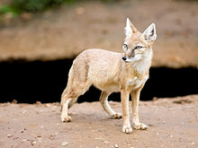
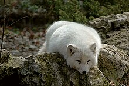
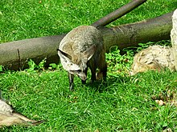
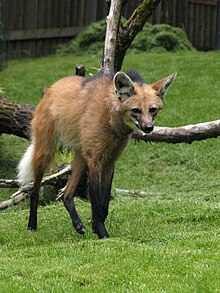
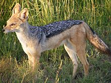
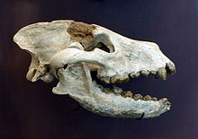
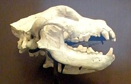
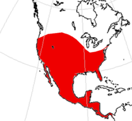
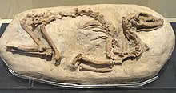

# Hunde

aus Wikipedia, der freien Enzyklopädie

 

Der Titel dieses Artikels ist mehrdeutig. Weitere Bedeutungen sind unter 
[Hunde (Begriffsklärung)](https://de.wikipedia.org/wiki/Hunde_(Begriffskl%C3%A4rung))
 aufgeführt.

Die 
Hunde

 (Canidae) sind eine 
[Familie](https://de.wikipedia.org/wiki/Familie_(Biologie))
 innerhalb der Überfamilie der 
[Hundeartigen](https://de.wikipedia.org/wiki/Hundeartige)
 (Canoidea). Zu dieser Familie gehören verschiedene als „
[Fuchs](https://de.wikipedia.org/wiki/Fuchs_(Raubtier))
“ und „
[Schakal](https://de.wikipedia.org/wiki/Schakal)
“ bezeichnete Arten, 
[Kojoten](https://de.wikipedia.org/wiki/Kojote)
 sowie die 
[Wölfe](https://de.wikipedia.org/wiki/Wolf)
, deren domestizierte Unterart (der 
[Haushund](https://de.wikipedia.org/wiki/Haushund)
) als Namensgeber der Gruppe dient.

Namensherkunft (Etymologie)

Canidae, der wissenschaftliche Name der Familie, ist vom lateinischen Wort 
Canis

 („Hund“) abgeleitet, das zugleich auch der wissenschaftliche Name der 
[Typusgattung](https://de.wikipedia.org/wiki/Typus_(Nomenklatur)#Zoologie)
 dieser Familie ist. Eingedeutscht spricht man auch von „Caniden“, um zu betonen, dass nicht die Haushunde, sondern die gesamte Verwandtschaftsgruppe der Haushunde, Wölfe und Füchse gemeint ist. Das lateinische Wort für Wolf ist 
Lupus

. Als Vertreter der Gattung 
Canis

 heißt der Wolf wissenschaftlich 
Canis lupus

. Haushunde stammen vom Wolf ab und sind diesem genetisch noch so ähnlich, dass sie zur Spezies 
Canis lupus

 gezählt werden. Alle Haushunde werden als Unterart 
Canis lupus familiaris

 zusammengefasst. Dieser Artikel beschäftigt sich jedoch mit den Caniden als Ganzes.

## Merkmale

Die Canidae verfügen über vier vollständige 
[Zehen](https://de.wikipedia.org/wiki/Zehe_(Fu%C3%9F))
 an den Hinterfüßen sowie vier (
Lycaon

) oder fünf (
Canis

, 
Cyon

, 
Otocyon

, 
Speothos

) an den Vorderfüßen, wobei der erste Zeh der Vorderfüße nicht funktional (gewichtstragend) ist. Alle Caniden sind 
[Zehengänger](https://de.wikipedia.org/wiki/Zeheng%C3%A4nger)
, das heißt, sie setzen beim Laufen nur die anatomischen Zehen, nicht den gesamten anatomischen Fuß auf.

Das 
[Gebiss](https://de.wikipedia.org/wiki/Gebiss)
 der Caniden weist zumeist 42 
[Zähne](https://de.wikipedia.org/wiki/Zahn)
 auf. Auf jeder Seite sind oben und unten jeweils drei Incisiven (Schneidezähne), ein Caninus (Fangzahn) und vier 
[Prämolaren](https://de.wikipedia.org/wiki/Pr%C3%A4molar)
 (Vorbackenzähne) vorhanden sowie zwei 
[Molaren](https://de.wikipedia.org/wiki/Molar_(Zahn))
 (Backenzähne) oben und drei Molaren unten. Die 
[Zahnformel](https://de.wikipedia.org/wiki/Zahnformel)
 für das vollständige Gebiss lautet demnach:

<table border="1" cellpadding="0"><tbody><tr><td>  3 · 1 · 4 · 2  </td></tr><tr><td>  3 · 1 · 4 · 3  </td></tr></tbody></table>

Die Formel für die erste Zahngeneration („Milchgebiss“) lautet: 3 · 1 · 3 · 0, das heißt, Caniden haben im Jugendstadium keine Molaren und in jedem Viertel des Gebisses nur drei Prämolaren.
[[1]](#cite_note-1)

## Verbreitung

Canidae sind auf allen 
[Kontinenten](https://de.wikipedia.org/wiki/Kontinent)
 vertreten. Ursprünglich fehlten sie in 
[Australien](https://de.wikipedia.org/wiki/Australien)
, 
[Neuguinea](https://de.wikipedia.org/wiki/Neuguinea)
, 
[Neuseeland](https://de.wikipedia.org/wiki/Neuseeland)
, 
[Madagaskar](https://de.wikipedia.org/wiki/Madagaskar)
 und 
[Antarktika](https://de.wikipedia.org/wiki/Antarktika)
, doch in vielen dieser Regionen sind sie, meist in Form des 
[Haushundes](https://de.wikipedia.org/wiki/Haushund)
, durch den Menschen eingeführt geworden. In Australien existiert mit dem 
[Dingo](https://de.wikipedia.org/wiki/Dingo)
 sogar eine sekundär verwilderte Form des Haushundes.

## Verhalten

Allgemeingültige Aussagen über das Verhalten von Caniden lassen sich kaum treffen, da sich die einzelnen Gattungen und Arten zu sehr unterscheiden. Beispielsweise sind zwar alle Caniden per Definition 
[Carnivoren](https://de.wikipedia.org/wiki/Raubtiere)
 und weisen daher alle 
[Jagd-](/w/index.php?title=Jagdverhalten&action=edit&redlink=1)
 und 
[Tötungsverhalten](/w/index.php?title=T%C3%B6tungsverhalten&action=edit&redlink=1)
 auf, jedoch unterscheidet sich dieses bereits zwischen 
[Wölfen](https://de.wikipedia.org/wiki/Wolf)
 und 
[Haushunden](https://de.wikipedia.org/wiki/Haushund)
 erheblich.
[[2]](#cite_note-2)

Die unterschiedlichen Verhaltensweisen prägen sich beispielsweise bei Wölfen und Füchsen bereits zwischen der vierten und fünften Lebenswoche aus. 
[Erik Zimen](https://de.wikipedia.org/wiki/Erik_Zimen)
 beobachtete bei Welpen, dass Füchse bei der Fütterung die Futterbrocken zunächst auflesen, in der Umgebung vergraben und erst dann mit dem Verzehr beginnen; junge Wölfe verschlingen dagegen so viel Nahrung wie möglich und beginnen erst danach, Futterreste zu vergraben.
[[3]](#cite_note-3)

Als generell ähnliche Verhaltensmuster bei allen Caniden beschreibt 
[Michael W. Fox](/w/index.php?title=Michael_W._Fox&action=edit&redlink=1)
 die Einleitung sozialer Begegnungen durch gegenseitige Untersuchung von Genital- und Analzone sowie teilweise auch von Ohren, Maul und Analdrüse. Das Beriechen der Schwanzdrüsen-Region wurde vor allem bei Rot-, Polar- und Graufüchsen beobachtet, seltener jedoch bei Präriewölfen und praktisch überhaupt nicht beim Haushund, da bei diesem die Schwanzdrüse nur selten vorhanden ist.
[[4]](#cite_note-4)

Teilweise werden Verhaltensmuster auch zwischenartlich erkannt. Fox beschreibt beispielsweise eine erfolgreiche Spielaufforderung an einen 
[Chihuahua](https://de.wikipedia.org/wiki/Chihuahua_(Hunderasse))
 durch einen 
[Präriewolf](https://de.wikipedia.org/wiki/Pr%C3%A4riewolf)
, gegenseitige Unterwürfigkeit zwischen jungen Kojoten und Wölfen sowie Spielsequenzen zwischen einem erwachsenen Wolf und einem 
[Rotfuchs](https://de.wikipedia.org/wiki/Rotfuchs)
.
[[5]](#cite_note-5)

## Entwicklung

Nach Matthew, Colbert und anderen
[[6]](#cite_note-6)

 lassen sich die 
Canidae

 auf 
[Miacis](https://de.wikipedia.org/wiki/Miacis)

 zurückführen, ein „kleines, schleichkatzenähnliches fleischfressendes Säugetier“, das zwischen 
[Eozän](https://de.wikipedia.org/wiki/Eoz%C3%A4n)
 und 
[Oligozän](https://de.wikipedia.org/wiki/Oligoz%C3%A4n)
 (vor ca. 40 Mio. Jahren) lebte. Aus 
Miacis

 entstanden in 
[Nordamerika](https://de.wikipedia.org/wiki/Nordamerika)
 zwei Grundformen, 
[Daphaenus](/w/index.php?title=Daphaenus&action=edit&redlink=1)

 (auch: 
Daphoenus

) und 
[Cynodictis](/w/index.php?title=Cynodictis&action=edit&redlink=1)

 (auch: 
Hesperocyon

). Aus ersteren entwickelten sich die 
[Bären](https://de.wikipedia.org/wiki/B%C3%A4ren)
 (Ursidae), aus letzteren die „Urahnen“ der heutigen Hunde.

Aus dem 
Hesperocyon

 bzw. 
Cynodictis

 spalteten sich 
[Temnocyon](/w/index.php?title=Temnocyon&action=edit&redlink=1)

, ein Vorfahr der afrikanischen Hyänenhunde sowie der asiatischen Rothunde, und 
[Cynodesmus](/w/index.php?title=Cynodesmus&action=edit&redlink=1)

 ab; dieser ist wiederum ein Vorfahr von 
[Tomarctus](/w/index.php?title=Tomarctus&action=edit&redlink=1)

, welcher als direkter Urahn von Wolf (
Canis lupus

), Füchsen (
Vulpes

) und einigen anderen wie 
[Borophagus](https://de.wikipedia.org/wiki/Borophagus)

, 
[Aelurodon](/w/index.php?title=Aelurodon&action=edit&redlink=1)

 und vermutlich auch 
[Otocyon](https://de.wikipedia.org/wiki/Otocyon)

 gilt.

## Systematik

### Heutige Arten der Hunde

#### Klassische Taxonomie

Die auf 
[phänotypischen](https://de.wikipedia.org/wiki/Ph%C3%A4notyp)
 (
[morphologischen](https://de.wikipedia.org/wiki/Morphologie_(Biologie))
) Unterschieden basierende 
[traditionelle Systematik](https://de.wikipedia.org/wiki/Systematik_(Biologie)#Taxonomie-Konzepte)
 teilt die 
[rezenten](https://de.wikipedia.org/wiki/Rezent)
 Hunde in zwei 
[Tribus](https://de.wikipedia.org/wiki/Tribus_(Biologie))
, die der 
[Echten Füchse](https://de.wikipedia.org/wiki/Echte_F%C3%BCchse)
 (Vulpini) und die der 
[Echten Hunde](https://de.wikipedia.org/wiki/Echte_Hunde)
 (Canini). Allerdings gibt es innerhalb der Echten Hunde auch viele Arten, die 
[fuchsartig](https://de.wikipedia.org/wiki/Fuchs_(Raubtier))
 aussehen.

 
[Steppenfuchs](https://de.wikipedia.org/wiki/Steppenfuchs)
 (
Vulpes corsac

)

 
[Polarfuchs](https://de.wikipedia.org/wiki/Polarfuchs)
 (
Vulpes lagopus

)

 
[Löffelhund](https://de.wikipedia.org/wiki/L%C3%B6ffelhund)
 (
Otocyon megalotis

)

 
[Mähnenwolf](https://de.wikipedia.org/wiki/M%C3%A4hnenwolf)
 (
Chrysocyon brachyurus

)

 
[Schabrackenschakal](https://de.wikipedia.org/wiki/Schabrackenschakal)
 (
Lupulella mesomelas

)

* Tribus[Vulpini](https://de.wikipedia.org/wiki/Vulpini)
  * Gattung[Vulpes](https://de.wikipedia.org/wiki/Vulpes)
    * [Bengalfuchs](https://de.wikipedia.org/wiki/Bengalfuchs)(Vulpes bengalensis)
    * [Afghanfuchs](https://de.wikipedia.org/wiki/Afghanfuchs)(Vulpes cana)
    * [Kapfuchs](https://de.wikipedia.org/wiki/Kapfuchs)(Vulpes chama)
    * [Steppenfuchs](https://de.wikipedia.org/wiki/Steppenfuchs)(Vulpes corsac)
    * [Tibetfuchs](https://de.wikipedia.org/wiki/Tibetfuchs)(Vulpes ferrilata)
    * [Polarfuchs](https://de.wikipedia.org/wiki/Polarfuchs)(Vulpes lagopus)
    * [Kitfuchs](https://de.wikipedia.org/wiki/Kitfuchs)(Vulpes macrotis)
    * [Blassfuchs](https://de.wikipedia.org/wiki/Blassfuchs)(Vulpes pallida)
    * [Rüppellfuchs](https://de.wikipedia.org/wiki/R%C3%BCppellfuchs)(Vulpes rueppelli)
    * [Swiftfuchs](https://de.wikipedia.org/wiki/Swiftfuchs)(Vulpes velox)
    * [Rotfuchs](https://de.wikipedia.org/wiki/Rotfuchs)(Vulpes vulpes)
    * [Fennek](https://de.wikipedia.org/wiki/Fennek)(Vulpes zerda)

  * Gattung[Urocyon](https://de.wikipedia.org/wiki/Urocyon)
    * [Graufuchs](https://de.wikipedia.org/wiki/Graufuchs)(Urocyon argenteus)
    * [Insel-Graufuchs](https://de.wikipedia.org/wiki/Insel-Graufuchs)(Urocyon littoralis)

  * GattungOtocyon
    * [Löffelhund](https://de.wikipedia.org/wiki/L%C3%B6ffelhund)(Otocyon megalotis)

* Tribus[Canini](https://de.wikipedia.org/wiki/Canini)
  * GattungDusicyon[†](https://de.wikipedia.org/wiki/Aussterben)
    * [Falklandfuchs](https://de.wikipedia.org/wiki/Falklandfuchs)(Dusicyon australis)
    * [Burmeister-Fuchs](https://de.wikipedia.org/wiki/Burmeister-Fuchs)(Dusicyon avus)

  * Gattung[Lycalopex](https://de.wikipedia.org/wiki/Lycalopex)
    * [Andenschakal](https://de.wikipedia.org/wiki/Andenschakal)(Lycalopex culpaeus)
    * [Darwin-Fuchs](https://de.wikipedia.org/wiki/Darwin-Fuchs)(Lycalopex fulvipes)
    * [Argentinischer Kampfuchs](https://de.wikipedia.org/wiki/Argentinischer_Kampfuchs)(Lycalopex griseus)
    * [Pampasfuchs](https://de.wikipedia.org/wiki/Pampasfuchs)(Lycalopex gymnocercus)
    * [Sechurafuchs](https://de.wikipedia.org/wiki/Sechurafuchs)(Lycalopex sechurae)
    * [Brasilianischer Kampfuchs](https://de.wikipedia.org/wiki/Brasilianischer_Kampfuchs)(Lycalopex vetulus)

  * GattungAtelocynus
    * [Kurzohrfuchs](https://de.wikipedia.org/wiki/Kurzohrfuchs)(Atelocyon microtis)

  * GattungCerdocyon
    * [Maikong](https://de.wikipedia.org/wiki/Maikong)(Cerdocyon thous)

  * GattungSpeothos
    * [Waldhund](https://de.wikipedia.org/wiki/Waldhund)(Speothos venaticus)

  * GattungChrysocyon
    * [Mähnenwolf](https://de.wikipedia.org/wiki/M%C3%A4hnenwolf)(Chrysocyon brachyurus)

  * GattungNyctereutes
    * [Marderhund](https://de.wikipedia.org/wiki/Marderhund)(Nyctereutes procyonoides)

  * Gattung[Lupulella](https://de.wikipedia.org/wiki/Lupulella)
    * [Streifenschakal](https://de.wikipedia.org/wiki/Streifenschakal)(Lupulella adustus)
    * [Schabrackenschakal](https://de.wikipedia.org/wiki/Schabrackenschakal)(Lupulella mesomelas)

  * GattungCuon
    * [Rothund](https://de.wikipedia.org/wiki/Rothund)(Cuon alpinus)

  * GattungLycaon
    * [Afrikanischer Wildhund](https://de.wikipedia.org/wiki/Afrikanischer_Wildhund)(Lycaon pictus)

  * Gattung[Canis](https://de.wikipedia.org/wiki/Wolfs-_und_Schakalartige)
    * [Afrikanischer Goldwolf](https://de.wikipedia.org/wiki/Afrikanischer_Goldwolf)(Canis lupaster)
    * [Goldschakal](https://de.wikipedia.org/wiki/Goldschakal)(Canis aureus)
    * [Kojote](https://de.wikipedia.org/wiki/Kojote)(Canis latrans)
    * [Wolf](https://de.wikipedia.org/wiki/Wolf)(Canis lupus), einschließlich[Haushund](https://de.wikipedia.org/wiki/Haushund)und[Dingo](https://de.wikipedia.org/wiki/Dingo)
    * [Rotwolf](https://de.wikipedia.org/wiki/Rotwolf)(Canis rufus)
    * [Äthiopischer Wolf](https://de.wikipedia.org/wiki/%C3%84thiopischer_Wolf)(Canis simensis)

#### Taxonomie auf molekulargenetischer Basis

Moderne Methoden zur Ermittlung der Verwandtschaft und der gegenseitigen evolutionären Beziehungen der Organismen fußen neben objektiveren Methoden der Merkmalsanalyse (vgl. → 
[Kladistik](https://de.wikipedia.org/wiki/Kladistik)
) auch auf dem Vergleich von 
[Genen](https://de.wikipedia.org/wiki/Gen)
 oder 
[DNA-Sequenzen](https://de.wikipedia.org/wiki/DNA-Sequenz)
 auf molekularer Ebene. 2005 stellten Lindblad-Toh et al. (2005) eine Verwandtschaftshypothese der Caniden vor, die mit den Methoden der Kladistik auf Grundlage solcher 
[molekulargenetischer](https://de.wikipedia.org/wiki/Molekulargenetik)
 Daten erstellt wurde.
[[7]](#cite_note-Lindblad-Toh-7)

 Dabei wurden ca. 15 
[Kilobasen](https://de.wikipedia.org/wiki/Kilobase)
 an 
[Exon](https://de.wikipedia.org/wiki/Exon)
- und 
[Intron](https://de.wikipedia.org/wiki/Intron)
-
[Sequenzen](https://de.wikipedia.org/wiki/Nukleotidsequenz)
 miteinander verglichen.

Diese Hypothese hatte einige grundlegende Konsequenzen in Bezug auf die klassische Systematik:

* Der auffälligste Unterschied ist, dass sich bei den Caniden nicht zwei, sondern drei oder vier Haupt-Entwicklungslinien (repräsentiert durch die Tribus bzw. Subtribus, im[Kladogramm](https://de.wikipedia.org/wiki/Kladogramm)durch entsprechende Haupt-[Kladen](https://de.wikipedia.org/wiki/Klade)) erkennen lassen, die überdies eine ganz andere Evolutionsgeschichte aufzeigen: Die klassische Tribus Vulpini ist aufgeteilt in die Klade der Graufüchse und die Klade der Rotfuchsartigen, wobei die Klade der Rotfuchsartigen näher mit den beiden anderen Kladen (klassische Tribus Canini) verwandt ist als mit den Graufüchsen. Die Tribus Canini ist aufgeteilt in eine Südamerika-Klade und die Klade der Wolfsartigen, die ein[Schwestergruppenverhältnis](https://de.wikipedia.org/wiki/Schwestergruppe)miteinander haben. Das bedeutet, dass die Graufuchslinie sich nicht, wie es die klassische Systematik spiegelt, direkt von der Rotfuchslinie getrennt hat, sondern viel früher, noch vor der Trennung der Linien von Rotfuchs und Wolf.
* Der[Marderhund](https://de.wikipedia.org/wiki/Nyctereutes_procyonoides)(Nyctereutes procyonoides), bislang zu den Canini gestellt, steht nun bei den „Vulpini“ bzw. in der Klade der Rotfuchsartigen.
* Die GattungCanislässt sich so, wie sie die Mehrheit der klassischen Systematiker bislang gesehen hat, nicht mehr aufrechterhalten. Grauwolf, Kojote, Goldschakal und Äthiopischer Wolf (alle Gattung[Canis](https://de.wikipedia.org/wiki/Wolfs-_und_Schakalartige)) sind näher mit dem Rothund (Gattung[Cuon](https://de.wikipedia.org/wiki/Cuon_alpinus)) und dem Afrikanischen Wildhund (Gattung[Lycaon](https://de.wikipedia.org/wiki/Lycaon_pictus)) verwandt als mit dem Streifen- und dem Schabrackenschakal (beide bislang ebenfalls GattungCanis). Falls sich dies in kommenden Analysen bestätigt, müssten daher
  * Rot- und Wildhund in die GattungCanisaufgenommen werden oder
  * für Streifen- und Schabrackenschakal entweder, wie dies einige Systematiker aufgrund morphologischer Merkmale schon seit ca. 100 Jahren praktizieren,[[8]](#cite_note-8)die GattungThos[Oken](https://de.wikipedia.org/wiki/Lorenz_Oken), 1816 reaktiviert werden oder aber, Zrzavý und Řičánková (2004) folgend, die monotypischen GattungenSchaeffia[Hilzheimer](https://de.wikipedia.org/wiki/Max_Hilzheimer), 1906 undLupullellaHilzheimer, 1906  (mit den SpeziesSchaeffia adustabeziehungsweiseLupulella mesomelas) „wiederbelebt“ werden.[[9]](#cite_note-Zrzavý_&_Řičánková-9)

Bei einer detaillierten „Supertree“-/„Supermatrix“-Analyse der Verwandtschaftsbeziehungen aller Raubtiere, in die neben den Kladogrammstrukturen vormaliger Analysen auch rund 45.000 
[Basenpaare](https://de.wikipedia.org/wiki/Basenpaar)
 aus der Datenbank 
[GenBank](https://de.wikipedia.org/wiki/GenBank)
 einflossen, erzielen Nyakatura und Bininda-Emonds (2012) für die Caniden etwas andere Ergebnisse. Bei ihnen steht der Afrikanische Wildhund (
Lycaon pictus

) nicht in der Wolfs-Klade, sondern ist die Schwesterart des südamerikanischen Waldhundes (
Speothos venaticus

) und beide bilden die Schwestergruppe der gemeinsamen Klade aus Wolfs-Klade und Südamerika-Klade.
[[10]](#cite_note-Nyakatura_et_al_2012-10)

 Demnach gäbe es innerhalb der klassischen Canini drei verschiedene Hauptlinien. In einer separat durchgeführten „Supermatrix“-Analyse, die nur auf den DNA-Daten basierte, wichen die Ergebnisse noch stärker ab, u. a. indem die Gattung 
Vulpes

 als paraphyletische Gruppierung an der Basis einer gemeinsamen Klade aus 
Canis

 und einigen südamerikanischen Vertretern erscheint.
[[10]](#cite_note-Nyakatura_et_al_2012-10)

 Allerdings sind „Supertree“- und „Supermatrix“-Methode umstritten, da sie auf inkohärenten Datensätzen beruhen.

### Fossile Hunde

Man kennt heute neben den 34 noch lebenden Arten der Hunde insgesamt etwa 180 fossile Hundearten. Durch neue Funde steigt diese Zahl immer weiter an. In der Wirbeltierpaläontologie wird die Familie Canidae in drei Unterfamilien gegliedert: die 
Caninae

, zu denen alle heutigen (
[rezenten](https://de.wikipedia.org/wiki/Rezent)
) Hundearten zählen (demnach, zzgl. fossiler Vertreter, im Inhalt identisch mit der Familie Canidae im rezent-zoologischen Sinn, siehe 
[oben](#Heutige_Arten_der_Hunde)
), sowie die ausgestorbenen Unterfamilien 
[Borophaginae](/w/index.php?title=Borophaginae&action=edit&redlink=1)
 und 
[Hesperocyoninae](/w/index.php?title=Hesperocyoninae&action=edit&redlink=1)
.
[[11]](#cite_note-Wang2008-11)

 Die Caninae stellen auch die 
[erdgeschichtlich](https://de.wikipedia.org/wiki/Erdgeschichte)
 jüngsten fossilen Hunde, die erst vor rund 10.000 Jahren, am Ende des Pleistozän verschwanden, so etwa die amerikanischen Formen 
[Aenocyon dirus](https://de.wikipedia.org/wiki/Aenocyon_dirus)

 und 
[Protocyon](https://de.wikipedia.org/wiki/Protocyon)

.

Die Klassifikation der Hesperocyoninae folgt Wang (1994),
[[12]](#cite_note-Wang1994-12)

 die der Borophaginae Wang et al. (1999)
[[13]](#cite_note-Wang1999-13)

 (
[Mya](https://de.wikipedia.org/wiki/Mya_(Zeitskala))
 = Millionen Jahre vor heute).

 
Aelurodon taxoides

 
Borophagus cyonoides

 
Verbreitungsgebiet der Borophaginae

* Unterfam. Borophaginae[†](https://de.wikipedia.org/wiki/Aussterben)[[13]](#cite_note-Wang1999-13)
  * Gattung[Aelurodon](/w/index.php?title=Aelurodon&action=edit&redlink=1)(16–12 Mya)
  * Gattung[Archaeocyon](/w/index.php?title=Archaeocyon&action=edit&redlink=1)(32 Mya)
  * Gattung[Borophagus](https://de.wikipedia.org/wiki/Borophagus)(12–5 Mya)
  * Gattung[Cynarctoides](/w/index.php?title=Cynarctoides&action=edit&redlink=1)(30–18 Mya)
  * Gattung[Cynarctus](/w/index.php?title=Cynarctus&action=edit&redlink=1)(16–12 Mya)
  * Gattung[Desmocyon](/w/index.php?title=Desmocyon&action=edit&redlink=1)(24–19 Mya)
  * Gattung[Epicyon](/w/index.php?title=Epicyon&action=edit&redlink=1)(12–10 Mya)
  * Gattung[Eulopocyon](/w/index.php?title=Eulopocyon&action=edit&redlink=1)(18–16 Mya)
  * Gattung[Metatomarctus](/w/index.php?title=Metatomarctus&action=edit&redlink=1)(19–16 Mya)
  * Gattung[Microtomarctus](/w/index.php?title=Microtomarctus&action=edit&redlink=1)(18 Mya)
  * Gattung[Osteoborus](/w/index.php?title=Osteoborus&action=edit&redlink=1)(8 Mya)
  * Gattung[Otarocyon](/w/index.php?title=Otarocyon&action=edit&redlink=1)(34–30 Mya)
  * Gattung[Oxetocyon](/w/index.php?title=Oxetocyon&action=edit&redlink=1)(32 Mya)
  * Gattung[Paracynarctus](/w/index.php?title=Paracynarctus&action=edit&redlink=1)(19–16 Mya)
  * Gattung[Phlaocyon](/w/index.php?title=Phlaocyon&action=edit&redlink=1)(30–19 Mya)
  * Gattung[Protepicyon](/w/index.php?title=Protepicyon&action=edit&redlink=1)(16 Mya)
  * Gattung[Psalidocyon](/w/index.php?title=Psalidocyon&action=edit&redlink=1)(16 Mya)
  * Gattung[Rhizocyon](/w/index.php?title=Rhizocyon&action=edit&redlink=1)(30 Mya)
  * Gattung[Tephrocyon](/w/index.php?title=Tephrocyon&action=edit&redlink=1)(16 Mya)
  * Gattung[Paratomarctus](/w/index.php?title=Paratomarctus&action=edit&redlink=1)(16–13 Mya)
  * Gattung[Protomarctus](/w/index.php?title=Protomarctus&action=edit&redlink=1)(18 Mya)
  * Gattung[Tomarctus](/w/index.php?title=Tomarctus&action=edit&redlink=1)(16 Mya)

* Unterfam. Hesperocyoninae[†](https://de.wikipedia.org/wiki/Aussterben)[[12]](#cite_note-Wang1994-12) Fossil vonHesperocyon gregarius
  * Gattung[Cynodesmus](/w/index.php?title=Cynodesmus&action=edit&redlink=1)(32–29 Mya)
  * Gattung[Caedocyon](/w/index.php?title=Caedocyon&action=edit&redlink=1)?
  * Gattung[Ectopocynus](/w/index.php?title=Ectopocynus&action=edit&redlink=1)(32–19 Mya)
  * Gattung[Enhydrocyon](/w/index.php?title=Enhydrocyon&action=edit&redlink=1)(29–25 Mya)
  * Gattung[Hesperocyon](/w/index.php?title=Hesperocyon&action=edit&redlink=1)(37–34 Mya)
  * Gattung[Mesocyon](/w/index.php?title=Mesocyon&action=edit&redlink=1)(34–29 Mya)
  * Gattung[Osbornodon](/w/index.php?title=Osbornodon&action=edit&redlink=1)(32–18 Mya)
  * Gattung[Paraenhydrodon](/w/index.php?title=Paraenhydrodon&action=edit&redlink=1)(30–25 Mya)
  * Gattung[Philotrox](/w/index.php?title=Philotrox&action=edit&redlink=1)(29 Mya)
  * Gattung[Prohespercyon](/w/index.php?title=Prohespercyon&action=edit&redlink=1)(36 Mya)
  * Gattung[Sunkahetanka](/w/index.php?title=Sunkahetanka&action=edit&redlink=1)(29 Mya)

* Unterfam. Caninae
  * Basale Caninae[†](https://de.wikipedia.org/wiki/Aussterben)
    * Gattung[Leptocyon](https://de.wikipedia.org/wiki/Leptocyon)(34–7 Mya)

  * Tribus[Canini](https://de.wikipedia.org/wiki/Canini)
    * Gattung[Canis](https://de.wikipedia.org/wiki/Wolfs-_und_Schakalartige)
    * Gattung[Cerdocyon](https://de.wikipedia.org/wiki/Cerdocyon)
    * Gattung[Dusicyon](https://de.wikipedia.org/wiki/Dusicyon)[†](https://de.wikipedia.org/wiki/Aussterben)
    * Gattung[Eucyon](/w/index.php?title=Eucyon&action=edit&redlink=1)[†](https://de.wikipedia.org/wiki/Aussterben)(8 Mya)
    * Gattung[Nurocyon](/w/index.php?title=Nurocyon&action=edit&redlink=1)[†](https://de.wikipedia.org/wiki/Aussterben)
    * Gattung[Protocyon](https://de.wikipedia.org/wiki/Protocyon)[†](https://de.wikipedia.org/wiki/Aussterben)
    * Gattung[Theriodictis](/w/index.php?title=Theriodictis&action=edit&redlink=1)[†](https://de.wikipedia.org/wiki/Aussterben)

  * Tribus[Vulpini](https://de.wikipedia.org/wiki/Vulpini)
    * Gattung[Nyctereutes](https://de.wikipedia.org/wiki/Nyctereutes)(7,1 Mya bis heute)
    * Gattung[Vulpes](https://de.wikipedia.org/wiki/Vulpes)(7 Mya bis heute)

## Einzelnachweise

1. [↑](#cite_ref-1)Vgl. St. G. Mivart:Monograph of the canidae. London: R. H. Porter and Dulan, 1890, zit. in: Fox 1975
2. [↑](#cite_ref-2)Vgl. hierzu bspw. Zimen 2003: S. 47–49 (Abschn.Unterschiede zwischen Wolf und Hund).
3. [↑](#cite_ref-3)Zimen 2003: S. 40–42 (Abschn.Unterschiede bei Wolf und Fuchs).
4. [↑](#cite_ref-4)Fox 1975: S. 66 f.
5. [↑](#cite_ref-5)Fox 1975: S. 148 ff. (Abschn.Zwischenartliche Verbindungen bei Caniden)
6. [↑](#cite_ref-6)W. D. Matthew: "The phylogeny of dogs", in:[Journal of Mammlogy](/w/index.php?title=Journal_of_Mammlogy&action=edit&redlink=1)11/1930, S. 117–138; E. H. Colbert: "Origin of the Dog", in:Natural History, 43/1939, S. 90–101
7. ↑[a](#cite_ref-Lindblad-Toh_7-0)[b](#cite_ref-Lindblad-Toh_7-1)Kerstin Lindblad-Toh et al.:[„Resolving canid phylogeny.“](https://www.nature.com/articles/nature04338#Resolving-canid-phylogeny)Abschnitt in: Kerstin Lindblad-Toh et al.:[Genome sequence, comparative analysis and haplotype structure of the domestic dog.Nature 438, Dezember 2005; S. 803–819.](https://www.nature.com/articles/nature04338)
8. [↑](#cite_ref-8)[Eberhard Trumler](https://de.wikipedia.org/wiki/Eberhard_Trumler):Meine wilden Freunde. Die Wildhundarten der Welt.München, Piper Verlag, 1981.[ISBN 3-492-02483-1](https://de.wikipedia.org/wiki/Spezial:ISBN-Suche/3492024831). S. 68 f. — Für einen Überblick über dieThos/Canis-Debate siehe: Holger Homann:[Thosvs.Canis.](https://web.archive.org/web/20141113052531/http://www.holgerhomann.us/Thos_vs%20%20Canis.htm)([Memento](https://de.wikipedia.org/wiki/Web-Archivierung#Begrifflichkeiten)vom 13. November 2014 im[Internet Archive](https://de.wikipedia.org/wiki/Internet_Archive))Holger Homann’s Home Page(holgerhomann.us, private kynologische Website), 2004 (englisch).
9. [↑](#cite_ref-Zrzavý_&_Řičánková_9-0)Jan Zrzavý, Věra Řičánková:Phylogeny of Recent Canidae (Mammalia, Carnivora): Relative Reliability and Utility of Morphological and Molecular Datasets, in:Zoologica ScriptaBand 33, Nr. 4, Juli 2004, S. 311–333,[doi:10.1111/j.0300-3256.2004.00152.x](//doi.org/10.1111/j.0300-3256.2004.00152.x).
10. ↑[a](#cite_ref-Nyakatura_et_al_2012_10-0)[b](#cite_ref-Nyakatura_et_al_2012_10-1)[c](#cite_ref-Nyakatura_et_al_2012_10-2)Katrin Nyakatura, Olaf RP Bininda-Emonds:Updating the evolutionary history of Carnivora (Mammalia): a new species-level supertree complete with divergence time estimates.BMC Biology 10, 2012.[doi: 10.1186/1741-7007-10-12](//doi.org/10.1186/1741-7007-10-12)
11. [↑](#cite_ref-Wang2008_11-0)Xiaoming Wang, Richard H. Tedford, Mauricio Antón:Dogs, their fossil relatives & evolutionary history.Columbia University Press, New York, 2008.[ISBN 978-0-231-13528-3](https://de.wikipedia.org/wiki/Spezial:ISBN-Suche/9780231135283), Appendix 1 (S. 169 ff.), Appendix 2 (S. 177 f.)
12. ↑[a](#cite_ref-Wang1994_12-0)[b](#cite_ref-Wang1994_12-1)Xiaming Wang:Phylogenetic Systematics of the Hesperocyoninae (Carnivora: Canidae).Bulletin of the American Museum of Natural History No. 221, Sept. 15, 1994 (New York).[ISSN](https://de.wikipedia.org/wiki/Internationale_Standardnummer_f%C3%BCr_fortlaufende_Sammelwerke)[0003-0090](https://zdb-katalog.de/list.xhtml?t=iss%3D%220003-0090%22&key=cql)– Phylogenetische Analyse der Hesperocyoninae-Funde aus derFrick Collectionaus dem American Museum of Natural History, New York.
13. ↑[a](#cite_ref-Wang1999_13-0)[b](#cite_ref-Wang1999_13-1)Xiamind Wang, R. H. Tedford, B. E. Taylor:Phylogenetic systematics of the Borophaginae (Carnivora: Canidae).Bulletin of the American Museum of Natural History No. 243, 1999, S. 1–391.

## Literatur

* Michael W. Fox:Vom Wolf zum Hund. Entwicklung, Verhalten und soziale Organisation. München: BLV 1975.[ISBN 3-405-11365-2](https://de.wikipedia.org/wiki/Spezial:ISBN-Suche/3405113652)– Standardwerk zu Hundeartigen/Caniden; engl. Originalausgabe:Behaviour of Wolfes, Dogs and Related Canids.
* Jean-Olivier Gransard-Desmond:Ètude sur les Canidae des temps pré-pharaoniques en Ègypte et au Soudan. BAR International Series 1260. Oxford:[Archaeopress](https://www.archaeopress.com/)2004.[ISBN 1-84171-618-9](https://de.wikipedia.org/wiki/Spezial:ISBN-Suche/1841716189)– Archäologische Studie zu den Ursprüngen der Hunde in Altägypten und im Sudan, mit Beschreibungen zahlreicher prähistorischer Funde und Katalog wichtiger Ausgrabungsstätten.
* [Erik Zimen](https://de.wikipedia.org/wiki/Erik_Zimen):Der Wolf. Stuttgart: Kosmos 2003.[ISBN 3-440-09742-0](https://de.wikipedia.org/wiki/Spezial:ISBN-Suche/3440097420).

## Weblinks

 

[Commons: Hunde](https://commons.wikimedia.org/wiki/Category:Canidae?uselang=de)

 – Sammlung von Bildern, Videos und Audiodateien

* [Hunde (Canidae): Säugetiere](https://web.archive.org/web/20120324074744/http://www.infochembio.ethz.ch/links/zool_saeuget_hunde.html)([Memento](https://de.wikipedia.org/wiki/Web-Archivierung#Begrifflichkeiten)vom 24. März 2012 im[Internet Archive](https://de.wikipedia.org/wiki/Internet_Archive)) (Informationszentrum Chemie Biologie Pharmazieder ETH Zürich) – ausführliche Linksammlung
* [Canid Specialist Group](https://www.canids.org/)der[International Union for the Conservation of Nature](https://de.wikipedia.org/wiki/IUCN)(IUCN) (englisch)
* [Canids: Foxes, Wolves, Jackals and Dogs - 2004 Status Survey and Conservation Action Plan](https://web.archive.org/web/20131208120730/http://canids.org/cap/index.htm)([Memento](https://de.wikipedia.org/wiki/Web-Archivierung#Begrifflichkeiten)vom 8. Dezember 2013 im[Internet Archive](https://de.wikipedia.org/wiki/Internet_Archive))Canid Specialist Groupder IUCN

Normdaten (Sachbegriff): 
[GND](https://de.wikipedia.org/wiki/Gemeinsame_Normdatei)
: 
[4398917-2](https://d-nb.info/gnd/4398917-2)

 
(
[lobid](https://lobid.org/gnd/4398917-2)
, 
[OGND](https://swb.bsz-bw.de/DB=2.104/SET=1/TTL=1/CMD?retrace=0&trm_old=&ACT=SRCHA&IKT=2999&SRT=RLV&TRM=4398917-2)
, 
[AKS](https://prometheus.lmu.de/gnd/4398917-2)

)

 

esi <esi:include src="/esitest-fa8a495983347898/content" /> 

Abgerufen von „
[https://de.wikipedia.org/w/index.php?title=Hunde&oldid=249325168](https://de.wikipedia.org/w/index.php?title=Hunde&oldid=249325168)
“

[Kategorie](https://de.wikipedia.org/wiki/Wikipedia:Kategorien)
: 
* [Hunde](https://de.wikipedia.org/wiki/Kategorie:Hunde)

