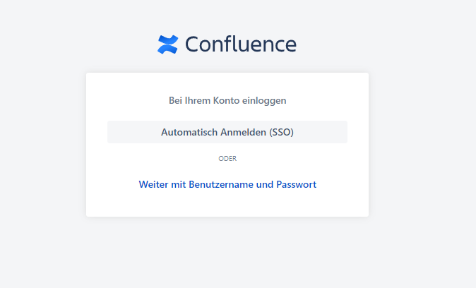
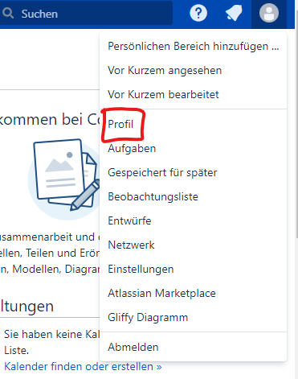
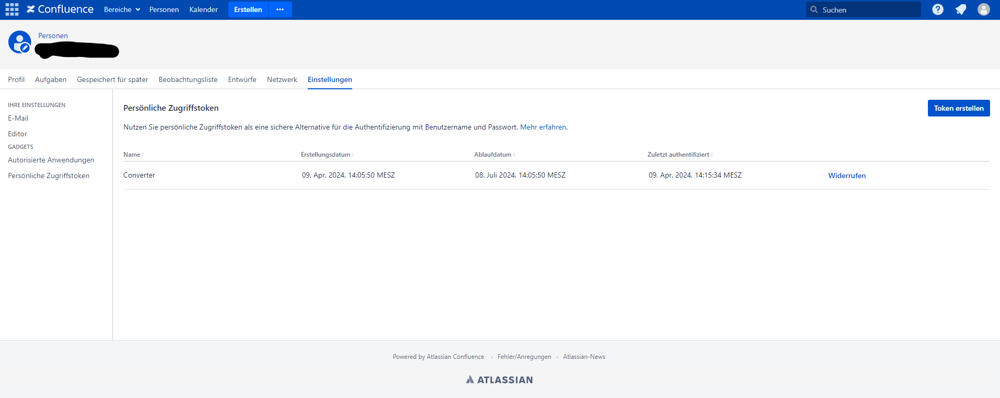
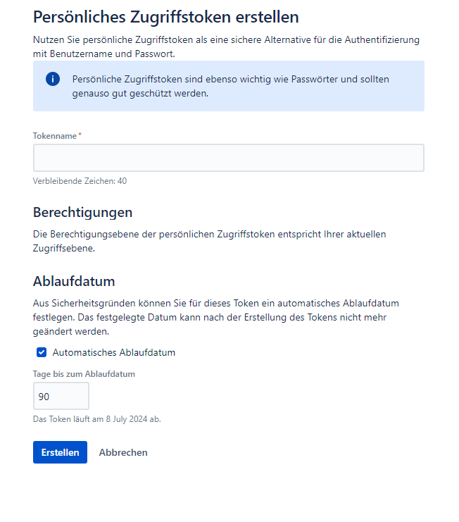

# URL CONVERTER Dokumentation

## Setup

### Dependencies

Um die benötigten python libraries zu installieren den folgenden Befehl in einen Terminal eingeben:

```Powershell
    pip install bs4 requests dotenv
```

Alternativ kann mit der ```requirements.txt``` eine virtuelle Python Umgebung (venv)[https://docs.python.org/3/library/venv.html] erstellt werden.

### Environmental Variables

Um sich bei Atlassian authentifizieren zu können wird ein Personal Access Token (PAT) benötigt. Diesen kann man auf Confluence erstellen. Dafür:

1. Auf Confluence anmelden



2. Das Profil aufrufen



3. Unter "Einstellungen" auf die Persönlichen Zugriffstoken



4. Auf "Token erstellen" drücken. Jetzt dem Token einen Namen geben und ein Ablaufdatum setzten.



5. Den Persönlichen Schlüssel kopieren und gut aufbewahren. Im Root Ordner des Projektes eine Datei Names ``.env`` anlegen. In dieser Datei den Token von gerade eben abspeichern. Die Datei sollte nun so aussehen:

```Powershell
    CONFLUENCE_TOKEN = "Your Token"
```

Das Python script kann nun ausgeführt werden.

#### Hinweis!

.env Dateien sind automatisch im gitignore und werden nicht mit gepusht. Sie liegen lokal auf dem eigenen Rechner und werden nicht commited. Die .env Datei wird hier verwendet um das Aufheben des Confluence Keys zu vereinfachen.

## Nutzung

Zur Nutzung des Script muss die zu Konvertierende Seite in Confluence angegeben werden. Dies wird beim ausfuehren des Scripts mit der Flag -u angehängt.
Bsp:
```
    python /path/to/convert_main.py -u https://domain.com/confluence_subpage
```

Nach dem einsetzen der gewünschten URL kann das Script ausgeführt werden. Das Ergebnis wird als Ordnerstruktur mit allen Assets außer Gliffy Diagrammen unter landing/ angelegt. Von dort aus kann der Ordner an den gewünschten Ort verschoben werden.

## Getestet aber nicht umsetzbar

* **Farbiger Text/Farbige Tabellen**
  * In der Confluence Seite werden für bestimmte Farben so wie spezifische Größen Style-elemente benutzt. Wenn diese einfach importiert werden schimpft docusaurus das wir jsx styling benutzen sollen. Wenn wir allerdings das styling händisch in jsx umwandeln, kriegen wir eine Fehlermeldung das ein Character namens "acorn" nicht verarbeitet werden kann. Somit ist unklar welches styling wirklich gebraucht wird und eine Formattierung nicht möglich
* **Previews von Docs**
  * In MD werden native keine Previews unterstützt, man müsste per hand ein komplexen HTML Frame um das Dokumtent und in MD implementieren. Hierbei ist das Problem, dass bevor das HTML verarbeitet wird erst in MD umgewandelt werden muss um es hier darzustellen. Dabei können weitere Fehler auftreten.
* **Embedded Links** (z.B. Jira-Issues)
  * Diese Arten von Links werden auf Confluence über Java embedded. So wird auch der derzeitige Status erhalten. Das Script fragt allerdings nur die pure HTML ab und dort sind keine Javascript generierten Elemente vorhanden. Daher ist dessen import nicht möglich.
* **Gliffy import**
  * Ähnlich zu den Jira-Tickets werden die Links zum Gliffy Editor mit javascript generiert. Man kann zwar ein Bild des Gliffys herunterladen und anzeigen, allerdings geht dadurch die Einsicht das es sich um ein Gliffy handelt und die bearbeitungsfähigkeit verloren.
* **Checkboxen/TODO**
  * Im normalen MD gibt es keine Checkboxen. In Versionen wo dies funktioniert wurde md um einige Funktionen erweitert (Beispiel git flavoured md). Um das Umzusetzten müsste man seine eigene MD Erweiterung schreiben
* **Status Flags**
  * Status Flags werden ähnlich zu Farben über css Elemente gestylt, somit ist es nicht möglich sie 1:1 zu übernehmen
* **interne Verlinkungen in der neuen Dokumentation**
  * Links auf andere Pages würden nur dann funktionieren, wenn man den gesamten Confluence Aufbau kennen würde und die Struktur sich nicht ändern würde. Somit braucht man einen website crawler welcher alle Confluence Pages durchläuft und eine Struktur erstellt, um dann die Links auf Docusaurus anzupassen. Da die Struktur der Dokumentation geändert wird, ist es nicht möglich die Links automatisiert zu verändern.
* **Formatierung**
  * Es ließen sich keine klaren Regeln für Formatierungen finden, weshalb manche Pages ein paar Umbrüche zu viel haben. Ursache davon ist die wirren Struktur von Confluence.

## Hall of Fame - Mein Höllenweg durch Confluence

- ``<br><br/></br>``
  - Ein beliebter Klassiker der Leute, die nicht verstehen was ein br eigentlich macht
- ``<span/></img>``
  - Nur weil es schön ist muss man es nicht anfassen #Kindergeld
- ``<h2><div>Alles ist ein Container wenn du doof genug bist</div></h2>``
  - ,,Reality is whatever i want it to be" ~ Karl Marx
- ``<td><code/></td>``
  - Weil einfach nur code-blöcke zu verwenden zu einfach für das Mastermind Atlassian ist --> Jeder Code eine Tabelle
- ``<table><table/></table>``
  - weil ein Tisch zu wenig ist
- **RIP** ``For table in soup.find_all('table')`` 
  - _"Für jeden Tisch in der Suppe, finde alle Tische" ~ Ali_
    - Wahrlich ein Philosoph unserer Zeit
  - Wir werden immer an dich denken während wir Suppe essen
- ``<p>Lorem</p> ipsum <span>dolor sit amet,<span> consetetur sadipscing</span> elitr,</span> sed <p>diam</p>``
  - Eine Weisheit die der Masse bekannt ist: _Viel hilft viel_
- Die Drei unheiligtümer des Todes
  - Normale URL -> https://ichbinnormalundtoll
  - URL mit sonderzeichen -> https://w0w+was+-+ein%cheiß
  - Philosophische URL-> Https://?


# Der Average Arbeitstag von Jonathan und Tim:


